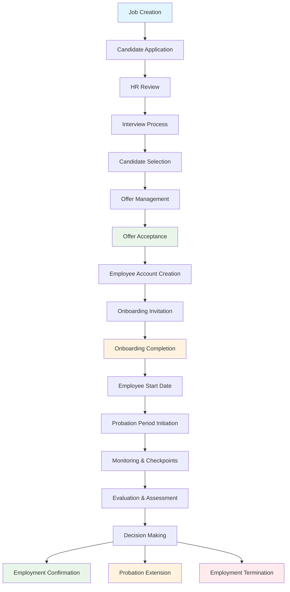
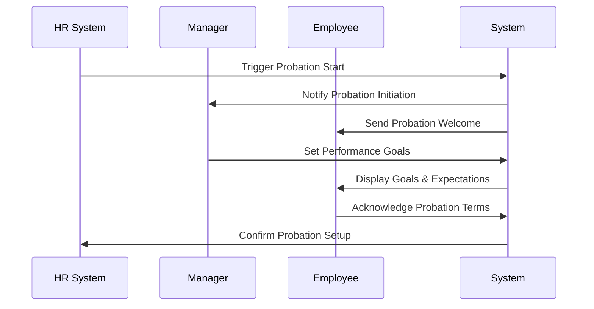
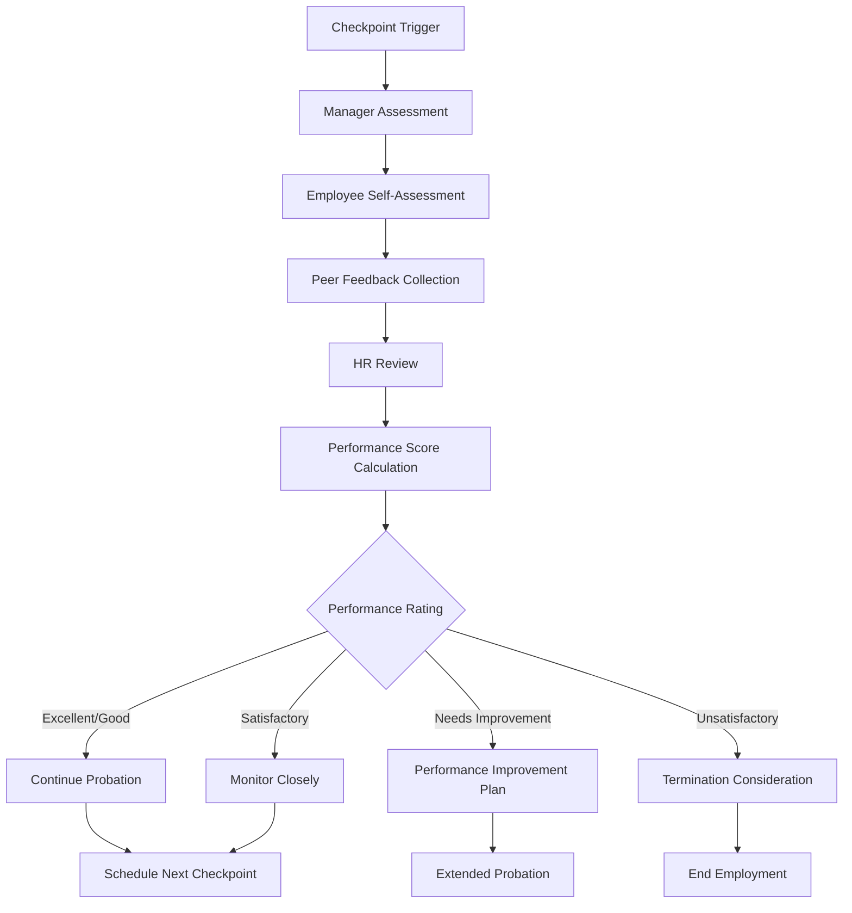
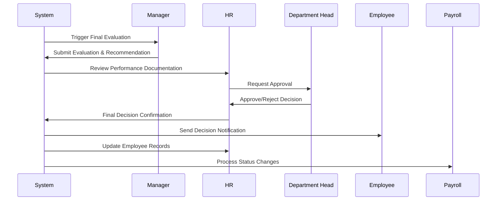
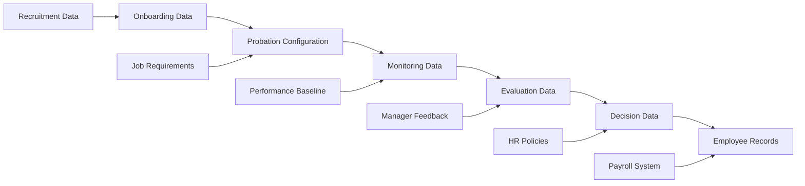

# BLIH Complete Employee Lifecycle: Recruitment to Probation Documentation

## Table of Contents

1. [Executive Summary](#executive-summary)
2. [Complete Employee Lifecycle Overview](#complete-employee-lifecycle-overview)
3. [Recruitment Phase Summary](#recruitment-phase-summary)
4. [Onboarding Phase Summary](#onboarding-phase-summary)
5. [Probation Phase Deep Dive](#probation-phase-deep-dive)
   - [Probation Period Configuration](#probation-period-configuration)
   - [Probation Monitoring & Checkpoints](#probation-monitoring--checkpoints)
   - [Probation Evaluation Framework](#probation-evaluation-framework)
   - [Probation Outcomes & Decisions](#probation-outcomes--decisions)
   - [Post-Probation Processes](#post-probation-processes)
6. [System Integration & Data Flow](#system-integration--data-flow)
7. [Technical Implementation Analysis](#technical-implementation-analysis)
8. [Gap Analysis & Recommendations](#gap-analysis--recommendations)
9. [Implementation Roadmap](#implementation-roadmap)

---

## Executive Summary

The BLIH system provides a comprehensive employee lifecycle management platform that spans from initial job requisition through employment confirmation. While recruitment and onboarding systems are well-established, the probation management functionality requires significant enhancement to support complete employee lifecycle tracking.

**Current Status**:

- Recruitment & Onboarding: 75% complete (with integration gaps)
- Probation Management: 25% complete (basic framework only)
- Overall Lifecycle Integration: 40% complete

**Critical Focus**: Probation management represents the crucial bridge between onboarding completion and permanent employment, requiring robust evaluation, monitoring, and decision-making capabilities.

---

## Complete Employee Lifecycle Overview

### Phase 1: Recruitment (Stages 1-7)

```
Job Creation → Candidate Application → HR Review → Interview Process →
Candidate Selection → Offer Management → Offer Acceptance
```

### Phase 2: Onboarding (Stages 8-10)

```
Employee Account Creation → Onboarding Invitation →
Onboarding Completion → Employee Start Date
```

### Phase 3: Probation Management (Stages 11-15)

```
Probation Period Initiation → Monitoring & Checkpoints →
Evaluation & Assessment → Decision Making → Employment Confirmation/Termination
```

### Lifecycle Flow Diagram



---

## Recruitment Phase Summary

### Current Implementation Status: ✅ **100% Complete**

#### Key Features Implemented

- **Job Requisition Management**: Multi-level approval workflows
- **Applicant Tracking**: Complete candidate pipeline management
- **Interview Management**: Multi-round interviews with feedback
- **Offer Management**: Draft, send, and track job offers
- **CV Screening**: AI-assisted screening with customizable criteria

#### Integration Points to Probation

- **Hiring Decision Data**: Performance expectations and role requirements
- **Candidate Assessment**: Initial evaluation scores and interview feedback
- **Offer Terms**: Probation period duration and conditions
- **Job Requirements**: Performance criteria for probation evaluation

---

## Onboarding Phase Summary

### Current Implementation Status: 🟡 **75% Complete**

#### Key Features Implemented

- **Checklist Management**: Role-based onboarding tasks
- **Asset Provisioning**: Equipment and permission management
- **Policy Acknowledgement**: Compliance tracking
- **Progress Tracking**: Task completion monitoring

#### Missing Components (Critical for Probation)

- **Employee Profile Completion**: Full employee data collection
- **Performance Baseline**: Initial competency assessment
- **Expectation Setting**: Clear performance objectives
- **Probation Preparation**: Goal setting and evaluation criteria

---

## Probation Phase Deep Dive

### Probation Period Configuration

#### Standard Probation Durations

```typescript
export enum ProbationDuration {
  THIRTY_DAYS = '30_DAYS',
  FORTY_FIVE_DAYS = '45_DAYS',
  TWO_MONTHS = '2_MONTHS',
  THREE_MONTHS = '3_MONTHS',
  SIX_MONTHS = '6_MONTHS',
  ONE_YEAR = '1_YEAR',
}

export interface ProbationConfiguration {
  duration: ProbationDuration;
  customDuration?: number; // For custom periods in days
  evaluationCheckpoints: EvaluationCheckpoint[];
  performanceCriteria: PerformanceCriteria[];
  reportingRequirements: ReportingRequirement[];
  extensionConditions: ExtensionCondition[];
}
```

#### Configuration by Role/Level

| Employee Level | Standard Duration | Evaluation Frequency | Extension Allowed   |
| -------------- | ----------------- | -------------------- | ------------------- |
| Entry Level    | 3 months          | Monthly              | Yes, up to 3 months |
| Junior         | 3 months          | Monthly              | Yes, up to 3 months |
| Mid Level      | 2 months          | Bi-weekly            | Yes, up to 2 months |
| Senior         | 45 days           | Weekly               | Yes, up to 1 month  |
| Lead/Principal | 30 days           | Weekly               | No                  |
| Management     | 6 months          | Monthly              | Yes, up to 6 months |

#### Probation Initiation Process



### Probation Monitoring & Checkpoints

#### Evaluation Checkpoint Framework

```typescript
export interface EvaluationCheckpoint {
  id: string;
  name: string;
  timing: CheckpointTiming;
  evaluator: EvaluatorRole;
  evaluationCriteria: EvaluationCriterion[];
  requiredActions: RequiredAction[];
  escalationRules: EscalationRule[];
}

export enum CheckpointTiming {
  WEEK_2 = 'WEEK_2',
  WEEK_4 = 'WEEK_4',
  MONTH_1 = 'MONTH_1',
  MONTH_2 = 'MONTH_2',
  MONTH_3 = 'MONTH_3',
  CUSTOM = 'CUSTOM',
}

export enum EvaluatorRole {
  DIRECT_MANAGER = 'DIRECT_MANAGER',
  DEPARTMENT_HEAD = 'DEPARTMENT_HEAD',
  HR_REPRESENTATIVE = 'HR_REPRESENTATIVE',
  PEER_REVIEWER = 'PEER_REVIEWER',
  SELF_ASSESSMENT = 'SELF_ASSESSMENT',
}
```

#### Standard Checkpoint Schedule

| Checkpoint       | Timing           | Evaluator                      | Focus Areas                      | Required Output               |
| ---------------- | ---------------- | ------------------------------ | -------------------------------- | ----------------------------- |
| Initial Check-in | Week 2           | Direct Manager                 | Adaptation, Basic Performance    | Initial feedback report       |
| First Review     | Week 4           | Direct Manager + HR            | Progress, Issues, Support needed | Formal evaluation             |
| Mid-Probation    | Month 1-2        | Department Head                | Performance vs expectations      | Comprehensive review          |
| Final Evaluation | End of Probation | Manager + HR + Department Head | Overall performance assessment   | Final decision recommendation |

#### Monitoring Dashboard Requirements

```typescript
export interface ProbationMonitoringDashboard {
  employeeInfo: EmployeeProbationInfo;
  progressOverview: ProgressOverview;
  upcomingCheckpoints: UpcomingCheckpoint[];
  performanceMetrics: PerformanceMetrics;
  riskIndicators: RiskIndicator[];
  actionItems: ActionItem[];
}

export interface PerformanceMetrics {
  attendanceRate: number;
  taskCompletionRate: number;
  qualityScore: number;
  teamworkRating: number;
  initiativeScore: number;
  learningProgress: number;
}
```

### Probation Evaluation Framework

#### Core Evaluation Criteria

##### 1. **Job Performance** (40% Weight)

- **Task Completion**: Quality and timeliness of assigned work
- **Technical Skills**: Application of required technical competencies
- **Problem Solving**: Ability to identify and resolve issues
- **Productivity**: Output quantity and efficiency

##### 2. **Communication & Collaboration** (25% Weight)

- **Team Integration**: Ability to work effectively with team members
- **Communication Clarity**: Clear and effective communication
- **Feedback Reception**: Openness to constructive feedback
- **Cross-functional Collaboration**: Working with other departments

##### 3. **Reliability & Professionalism** (20% Weight)

- **Attendance & Punctuality**: Regular and timely attendance
- **Deadline Adherence**: Meeting project and task deadlines
- **Professional Conduct**: Workplace behavior and ethics
- **Initiative**: Proactive approach to responsibilities

##### 4. **Learning & Adaptability** (15% Weight)

- **Learning Speed**: Ability to acquire new skills and knowledge
- **Adaptability**: Flexibility in handling changes and challenges
- **Cultural Fit**: Alignment with company values and culture
- **Growth Mindset**: Willingness to improve and develop

#### Evaluation Scoring System

```typescript
export interface EvaluationScore {
  criterion: EvaluationCriterion;
  score: number; // 1-5 scale
  weight: number; // Percentage weight
  comments: string;
  evidence: Evidence[];
  improvementAreas: string[];
}

export enum PerformanceRating {
  EXCELLENT = 5, // Exceeds expectations consistently
  GOOD = 4, // Meets and sometimes exceeds expectations
  SATISFACTORY = 3, // Meets expectations
  NEEDS_IMPROVEMENT = 2, // Below expectations, improvement needed
  UNSATISFACTORY = 1, // Significantly below expectations
}
```

#### Evaluation Workflow



### Probation Outcomes & Decisions

#### Decision Matrix Framework

```typescript
export interface ProbationDecision {
  outcome: ProbationOutcome;
  effectiveDate: Date;
  conditions?: DecisionCondition[];
  nextSteps: NextStep[];
  notifications: Notification[];
  documentation: Documentation[];
}

export enum ProbationOutcome {
  CONFIRMED = 'CONFIRMED', // Employment confirmed
  EXTENDED = 'EXTENDED', // Probation extended
  TERMINATED = 'TERMINATED', // Employment terminated
  RESIGNED = 'RESIGNED', // Employee resigned during probation
}
```

#### Decision Criteria

##### 1. **Employment Confirmation**

- **Requirements**:
  - Average performance score ≥ 3.5
  - No major performance issues
  - Positive team integration
  - Attendance rate ≥ 95%
  - Manager recommendation for confirmation

- **Process**:
  1. Manager submits confirmation recommendation
  2. HR reviews performance documentation
  3. Department head approves decision
  4. Employee receives confirmation notification
  5. System updates employee status to CONFIRMED

##### 2. **Probation Extension**

- **Eligibility Criteria**:
  - Performance score between 2.5-3.4
  - Demonstrated improvement potential
  - Specific, achievable improvement areas identified
  - Manager commitment to support development

- **Extension Parameters**:
  ```typescript
  export interface ExtensionCondition {
    duration: number; // Additional days/months
    improvementGoals: ImprovementGoal[];
    supportPlan: SupportPlan[];
    reviewFrequency: ReviewFrequency;
    finalEvaluationDate: Date;
  }
  ```

##### 3. **Employment Termination**

- **Grounds for Termination**:
  - Performance score < 2.5
  - Serious misconduct or policy violations
  - Failure to meet critical job requirements
  - Attendance issues (>10% absence rate)
  - Cultural fit problems with no improvement

- **Termination Process**:
  1. Document performance issues
  2. Provide improvement opportunity (if applicable)
  3. Conduct termination meeting
  4. Process final documentation
  5. Handle offboarding procedures

#### Decision Workflow Automation



### Post-Probation Processes

#### Employment Confirmation Workflow

```typescript
export interface ConfirmationProcess {
  confirmationDate: Date;
  statusChanges: StatusChange[];
  compensationReview: CompensationReview;
  benefitsAdjustment: BenefitsAdjustment;
  careerPlanning: CareerPlanning;
  documentation: ConfirmationDocumentation[];
}

export interface StatusChange {
  previousStatus: EmployeeStatus;
  newStatus: EmployeeStatus;
  effectiveDate: Date;
  systemUpdates: SystemUpdate[];
  notifications: Notification[];
}
```

#### Post-Confirmation Actions

##### 1. **System Status Updates**

- Employee status changes from ON_PROBATION to ACTIVE
- Access permissions updated to full employee level
- Performance management integration activated
- Benefits enrollment finalized

##### 2. **Compensation & Benefits**

- Salary adjustments based on performance
- Benefits plan activation
- Stock option or bonus eligibility
- Retirement plan enrollment

##### 3. **Career Development**

- Performance goal setting for next period
- Training and development planning
- Career path discussion
- Mentorship program assignment

##### 4. **Documentation & Compliance**

- Confirmation letter generation and delivery
- Performance file finalization
- Legal documentation completion
- Audit trail updates

---

## System Integration & Data Flow

### Data Flow Architecture



### Integration Points

#### 1. **Recruitment to Probation**

- **Job Requirements**: Performance criteria and expectations
- **Interview Assessment**: Initial competency evaluation
- **Offer Terms**: Probation duration and conditions
- **Candidate Profile**: Skills and experience baseline

#### 2. **Onboarding to Probation**

- **Employee Profile**: Complete employee information
- **Training Records**: Initial training completion
- **Policy Acknowledgment**: Compliance status
- **Asset Provisioning**: Equipment and system access

#### 3. **Probation to Employee Management**

- **Performance History**: Complete evaluation records
- **Development Plans**: Training and skill development
- **Compensation Changes**: Salary and benefits adjustments
- **Career Progression**: Promotion and advancement tracking

---

## Technical Implementation Analysis

### Current System Capabilities

#### ✅ **Implemented Components**

- **Employee Management**: Basic employee profile management
- **Performance Management**: Basic performance tracking
- **Database Schema**: Employee and performance data models
- **API Endpoints**: Basic CRUD operations for employee data

#### ❌ **Missing Critical Components**

- **Probation Management Engine**: No dedicated probation system
- **Evaluation Framework**: No structured evaluation system
- **Automated Workflows**: No probation automation
- **Decision Engine**: No automated decision support
- **Monitoring Dashboard**: No probation monitoring tools
- **Notification System**: No automated probation communications

### Required Technical Enhancements

#### 1. **Probation Management Service**

```typescript
export class ProbationManagementService {
  async initiateProbation(
    employeeId: string,
    config: ProbationConfiguration,
  ): Promise<ProbationPeriod>;
  async scheduleCheckpoints(
    probationId: string,
  ): Promise<EvaluationCheckpoint[]>;
  async collectEvaluation(checkpointId: string): Promise<EvaluationData>;
  async calculatePerformanceScore(
    evaluations: EvaluationData[],
  ): Promise<PerformanceScore>;
  async recommendDecision(probationId: string): Promise<ProbationDecision>;
  async processDecision(decision: ProbationDecision): Promise<void>;
}
```

#### 2. **Evaluation Engine**

```typescript
export class EvaluationEngine {
  async createEvaluationTemplate(
    criteria: EvaluationCriterion[],
  ): Promise<EvaluationTemplate>;
  async collectFeedback(evaluationId: string): Promise<Feedback[]>;
  async analyzePerformance(
    data: EvaluationData[],
  ): Promise<PerformanceAnalysis>;
  async generateReport(evaluationId: string): Promise<EvaluationReport>;
}
```

#### 3. **Notification & Communication Service**

```typescript
export class ProbationNotificationService {
  async sendProbationStart(employeeId: string): Promise<void>;
  async sendCheckpointReminder(checkpointId: string): Promise<void>;
  async sendEvaluationRequest(evaluatorId: string): Promise<void>;
  async sendDecisionNotification(
    employeeId: string,
    decision: ProbationDecision,
  ): Promise<void>;
}
```

---

## Gap Analysis & Recommendations

### Critical Gaps Identified

#### 🔴 **High Priority Gaps**

##### 1. **Probation Management System** (Not Implemented)

**Impact**: Critical - No systematic probation tracking
**Solution Required**: Complete probation management system development
**Estimated Effort**: 6-8 weeks

##### 2. **Evaluation Framework** (Not Implemented)

**Impact**: Critical - No structured performance evaluation
**Solution Required**: Comprehensive evaluation system with scoring
**Estimated Effort**: 4-6 weeks

##### 3. **Automated Workflows** (Not Implemented)

**Impact**: High - Manual processes throughout probation
**Solution Required**: Workflow automation engine
**Estimated Effort**: 3-4 weeks

##### 4. **Decision Support System** (Not Implemented)

**Impact**: High - No data-driven decision making
**Solution Required**: Analytics and recommendation engine
**Estimated Effort**: 2-3 weeks

#### 🟡 **Medium Priority Gaps**

##### 5. **Monitoring Dashboard** (Not Implemented)

**Impact**: Medium - Limited visibility into probation progress
**Solution Required**: Real-time monitoring and reporting
**Estimated Effort**: 2-3 weeks

##### 6. **Integration with Performance Management** (Partial)

**Impact**: Medium - Disconnected performance tracking
**Solution Required**: Seamless performance data flow
**Estimated Effort**: 2 weeks

##### 7. **Communication Automation** (Not Implemented)

**Impact**: Medium - Manual notifications and reminders
**Solution Required**: Automated communication system
**Estimated Effort**: 1-2 weeks

### Implementation Recommendations

#### Phase 1: Core Probation System (8-10 weeks)

1. **Probation Management Engine**: Complete probation lifecycle management
2. **Evaluation Framework**: Structured evaluation and scoring system
3. **Basic Automation**: Essential workflow automation
4. **Decision Support**: Basic recommendation system

#### Phase 2: Enhanced Features (4-6 weeks)

1. **Monitoring Dashboard**: Real-time probation tracking
2. **Advanced Analytics**: Performance trend analysis
3. **Communication System**: Automated notifications
4. **Integration Enhancement**: Seamless system integration

#### Phase 3: Optimization & Advanced Features (3-4 weeks)

1. **AI-Powered Insights**: Predictive analytics for probation success
2. **Mobile Support**: Mobile-optimized evaluation and monitoring
3. **Advanced Reporting**: Comprehensive reporting and compliance
4. **Self-Service Portal**: Manager and employee self-service

---

## Implementation Roadmap

### Total Estimated Timeline: 15-20 weeks

### Phase 1: Foundation (Weeks 1-10)

#### Week 1-2: Database Schema Enhancement

```sql
-- Probation Period Table
CREATE TABLE probation_periods (
    id UUID PRIMARY KEY DEFAULT uuid_generate_v4(),
    employee_id UUID NOT NULL REFERENCES employees(id),
    start_date DATE NOT NULL,
    end_date DATE NOT NULL,
    duration_days INTEGER NOT NULL,
    status VARCHAR(20) DEFAULT 'ACTIVE',
    configuration_id UUID REFERENCES probation_configurations(id),
    created_at TIMESTAMP DEFAULT NOW(),
    updated_at TIMESTAMP DEFAULT NOW()
);

-- Evaluation Checkpoints Table
CREATE TABLE evaluation_checkpoints (
    id UUID PRIMARY KEY DEFAULT uuid_generate_v4(),
    probation_id UUID NOT NULL REFERENCES probation_periods(id),
    name VARCHAR(255) NOT NULL,
    scheduled_date DATE NOT NULL,
    evaluator_role VARCHAR(50) NOT NULL,
    status VARCHAR(20) DEFAULT 'PENDING',
    completed_at TIMESTAMP,
    created_at TIMESTAMP DEFAULT NOW()
);

-- Performance Evaluations Table
CREATE TABLE performance_evaluations (
    id UUID PRIMARY KEY DEFAULT uuid_generate_v4(),
    checkpoint_id UUID NOT NULL REFERENCES evaluation_checkpoints(id),
    evaluator_id UUID REFERENCES users(id),
    employee_id UUID REFERENCES employees(id),
    overall_score DECIMAL(3,2),
    feedback TEXT,
    recommendations TEXT,
    evaluation_date TIMESTAMP DEFAULT NOW(),
    created_at TIMESTAMP DEFAULT NOW()
);
```

#### Week 3-4: Probation Management Service

- Core probation lifecycle management
- Configuration and setup workflows
- Basic checkpoint scheduling

#### Week 5-6: Evaluation Framework

- Evaluation template system
- Scoring algorithms
- Feedback collection mechanisms

#### Week 7-8: Decision Engine

- Decision matrix implementation
- Recommendation algorithms
- Workflow automation

#### Week 9-10: Basic Integration

- Employee management integration
- Performance system connection
- Basic reporting

### Phase 2: Enhancement (Weeks 11-16)

#### Week 11-12: Monitoring Dashboard

- Real-time progress tracking
- Performance metrics visualization
- Risk indicator system

#### Week 13-14: Communication System

- Automated notification engine
- Template management
- Multi-channel delivery

#### Week 15-16: Advanced Features

- Analytics and reporting
- Export and compliance features
- System optimization

### Phase 3: Optimization (Weeks 17-20)

#### Week 17-18: Advanced Analytics

- Predictive modeling
- Trend analysis
- Success probability calculation

#### Week 19-20: User Experience & Testing

- Mobile optimization
- User testing and feedback
- Performance optimization

### Success Metrics

#### Implementation Success Criteria

- **System Adoption**: 90% of managers using the system within 3 months
- **Process Efficiency**: 80% reduction in manual probation administration
- **Decision Quality**: 95% of probation decisions supported by system data
- **User Satisfaction**: 85%+ satisfaction rating from managers and HR
- **Compliance**: 100% audit trail coverage for all probation decisions

#### Business Impact Metrics

- **Time-to-Confirmation**: Reduced from 45+ days to optimal duration
- **Performance Visibility**: Real-time insight into employee performance
- **Decision Accuracy**: Data-driven probation decisions
- **HR Efficiency**: Reduced administrative overhead
- **Employee Experience**: Clear and transparent probation process

---

## Conclusion

The BLIH system requires significant enhancement to support complete employee lifecycle management, particularly in the probation phase. While recruitment and onboarding systems are well-established, the probation management functionality represents a critical gap that impacts employee experience, managerial effectiveness, and organizational compliance.

**Key Success Factors**:

1. **Systematic Approach**: Structured evaluation and monitoring framework
2. **Data-Driven Decisions**: Analytics-based recommendation system
3. **Automation**: Reduced manual intervention and administrative overhead
4. **User Experience**: Intuitive interfaces for managers and employees
5. **Integration**: Seamless data flow across all employee lifecycle phases

With proper implementation, the BLIH system can provide world-class employee lifecycle management that supports organizational growth, employee development, and operational excellence.
