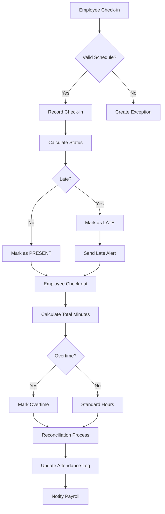
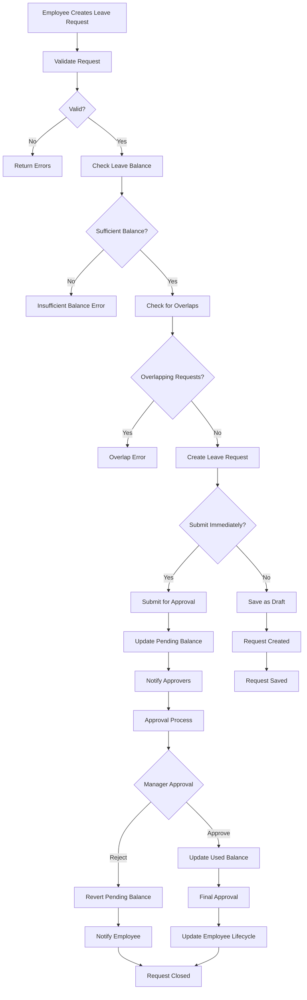
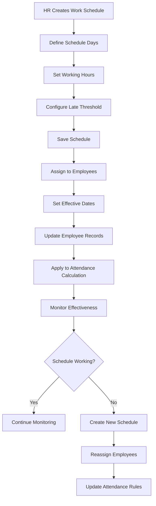

# Attendance, Leave & Time Management System - Technical Documentation

## Executive Overview

This document provides comprehensive technical documentation for the BLIH Attendance, Leave & Time Management system, including all API endpoints, database models, TypeScript types, business logic workflows, and implementation gaps for enterprise HR requirements.

### System Status Summary

- **Current Implementation**: 35% complete
- **Database Schema**: 100% complete (7 models)
- **TypeScript Types**: 100% complete
- **API Endpoints**: 15 implemented, 25+ missing
- **Business Logic**: Core attendance and leave workflows complete

## 1. Database Architecture

### 1.1 Complete Database Models

#### Attendance Models

```sql
-- AttendanceLog Model
CREATE TABLE "attendance_logs" (
  "id" UUID NOT NULL DEFAULT gen_random_uuid(),
  "employee_id" UUID NOT NULL,
  "date" DATE NOT NULL,
  "check_in_at" TIMESTAMP(3),
  "check_out_at" TIMESTAMP(3),
  "total_minutes" INTEGER,
  "status" "AttendanceStatus" NOT NULL DEFAULT 'PRESENT',
  "is_auto_calculated" BOOLEAN NOT NULL DEFAULT true,
  "overtime_minutes" INTEGER,
  "overtime_approved" BOOLEAN NOT NULL DEFAULT false,
  "check_in_method" VARCHAR(32),
  "check_out_method" VARCHAR(32),
  "check_in_ip" VARCHAR(64),
  "check_in_location" JSONB,
  "reconciled_at" TIMESTAMP(3),
  "notes" TEXT,
  "created_at" TIMESTAMP(3) NOT NULL DEFAULT CURRENT_TIMESTAMP,
  "updated_at" TIMESTAMP(3) NOT NULL DEFAULT CURRENT_TIMESTAMP,
  CONSTRAINT "attendance_logs_pkey" PRIMARY KEY ("id"),
  CONSTRAINT "attendance_logs_employee_id_date_key" UNIQUE ("employee_id", "date")
);

-- WorkSchedule Model
CREATE TABLE "work_schedules" (
  "id" UUID NOT NULL DEFAULT gen_random_uuid(),
  "name" VARCHAR(255) NOT NULL,
  "description" TEXT,
  "timezone" VARCHAR(64),
  "is_default" BOOLEAN NOT NULL DEFAULT false,
  "late_threshold_minutes" INTEGER NOT NULL DEFAULT 15,
  "standard_minutes_per_day" INTEGER NOT NULL DEFAULT 480,
  "created_at" TIMESTAMP(3) NOT NULL DEFAULT CURRENT_TIMESTAMP,
  "updated_at" TIMESTAMP(3) NOT NULL DEFAULT CURRENT_TIMESTAMP,
  CONSTRAINT "work_schedules_pkey" PRIMARY KEY ("id"),
  CONSTRAINT "work_schedules_name_key" UNIQUE ("name")
);

-- WorkScheduleDay Model
CREATE TABLE "work_schedule_days" (
  "id" UUID NOT NULL DEFAULT gen_random_uuid(),
  "schedule_id" UUID NOT NULL,
  "day_of_week" "DayOfWeek" NOT NULL,
  "is_working_day" BOOLEAN NOT NULL DEFAULT true,
  "start_minute" INTEGER,
  "end_minute" INTEGER,
  "expected_minutes" INTEGER,
  "remote_allowed" BOOLEAN NOT NULL DEFAULT false,
  "created_at" TIMESTAMP(3) NOT NULL DEFAULT CURRENT_TIMESTAMP,
  "updated_at" TIMESTAMP(3) NOT NULL DEFAULT CURRENT_TIMESTAMP,
  CONSTRAINT "work_schedule_days_pkey" PRIMARY KEY ("id"),
  CONSTRAINT "work_schedule_days_schedule_id_day_of_week_key" UNIQUE ("schedule_id", "day_of_week")
);

-- UserWorkSchedule Model
CREATE TABLE "user_work_schedules" (
  "id" UUID NOT NULL DEFAULT gen_random_uuid(),
  "employee_id" UUID NOT NULL,
  "schedule_id" UUID NOT NULL,
  "effective_from" DATE NOT NULL,
  "effective_to" DATE,
  "created_at" TIMESTAMP(3) NOT NULL DEFAULT CURRENT_TIMESTAMP,
  "updated_at" TIMESTAMP(3) NOT NULL DEFAULT CURRENT_TIMESTAMP,
  CONSTRAINT "user_work_schedules_pkey" PRIMARY KEY ("id")
);

-- Holiday Model
CREATE TABLE "holidays" (
  "id" UUID NOT NULL DEFAULT gen_random_uuid(),
  "name" VARCHAR(255) NOT NULL,
  "date" DATE NOT NULL,
  "country_id" UUID,
  "is_recurring_annual" BOOLEAN NOT NULL DEFAULT false,
  "created_at" TIMESTAMP(3) NOT NULL DEFAULT CURRENT_TIMESTAMP,
  "updated_at" TIMESTAMP(3) NOT NULL DEFAULT CURRENT_TIMESTAMP,
  CONSTRAINT "holidays_pkey" PRIMARY KEY ("id"),
  CONSTRAINT "holidays_name_date_country_id_key" UNIQUE ("name", "date", "country_id")
);
```

#### Leave Models

```sql
-- LeaveRequest Model
CREATE TABLE "leave_requests" (
  "id" UUID NOT NULL DEFAULT gen_random_uuid(),
  "request_id" VARCHAR(32) NOT NULL,
  "employee_id" UUID NOT NULL,
  "leave_type" "LeaveType" NOT NULL,
  "start_date" DATE NOT NULL,
  "end_date" DATE NOT NULL,
  "days_requested" DECIMAL(5,2) NOT NULL,
  "reason" TEXT,
  "description" TEXT,
  "contact_during_leave" JSONB,
  "handover_delegate_id" UUID,
  "handover_notes" TEXT,
  "start_half_day" BOOLEAN NOT NULL DEFAULT false,
  "end_half_day" BOOLEAN NOT NULL DEFAULT false,
  "balance_snapshot" JSONB,
  "submitted_at" TIMESTAMP(3),
  "status" "LeaveRequestStatus" NOT NULL DEFAULT 'DRAFT',
  "approved_by_id" UUID,
  "approved_at" TIMESTAMP(3),
  "rejection_reason" TEXT,
  "created_at" TIMESTAMP(3) NOT NULL DEFAULT CURRENT_TIMESTAMP,
  "updated_at" TIMESTAMP(3) NOT NULL DEFAULT CURRENT_TIMESTAMP,
  CONSTRAINT "leave_requests_pkey" PRIMARY KEY ("id"),
  CONSTRAINT "leave_requests_request_id_key" UNIQUE ("request_id")
);

-- LeaveBalance Model
CREATE TABLE "leave_balances" (
  "id" UUID NOT NULL DEFAULT gen_random_uuid(),
  "employee_id" UUID NOT NULL,
  "leave_type" "LeaveType" NOT NULL,
  "year" INTEGER NOT NULL,
  "total_days" DECIMAL(5,2) NOT NULL,
  "used_days" DECIMAL(5,2) NOT NULL DEFAULT 0,
  "pending_days" DECIMAL(5,2) NOT NULL DEFAULT 0,
  "carried_over" DECIMAL(5,2) NOT NULL DEFAULT 0,
  "created_at" TIMESTAMP(3) NOT NULL DEFAULT CURRENT_TIMESTAMP,
  "updated_at" TIMESTAMP(3) NOT NULL DEFAULT CURRENT_TIMESTAMP,
  CONSTRAINT "leave_balances_pkey" PRIMARY KEY ("id"),
  CONSTRAINT "leave_balances_employee_id_leave_type_year_key" UNIQUE ("employee_id", "leave_type", "year")
);

-- LeaveApproval Model
CREATE TABLE "leave_approvals" (
  "id" UUID NOT NULL DEFAULT gen_random_uuid(),
  "leave_request_id" UUID NOT NULL,
  "approver_id" UUID NOT NULL,
  "level" INTEGER NOT NULL,
  "decision" "ApprovalDecision" NOT NULL DEFAULT 'PENDING',
  "comments" TEXT,
  "decided_at" TIMESTAMP(3),
  "created_at" TIMESTAMP(3) NOT NULL DEFAULT CURRENT_TIMESTAMP,
  CONSTRAINT "leave_approvals_pkey" PRIMARY KEY ("id"),
  CONSTRAINT "leave_approvals_leave_request_id_level_key" UNIQUE ("leave_request_id", "level")
);
```

### 1.2 Database Enums

```sql
-- Attendance Status Enum
CREATE TYPE "AttendanceStatus" AS ENUM ('PRESENT', 'ABSENT', 'LATE', 'EARLY_DEPARTURE', 'ON_LEAVE', 'HALF_DAY', 'REMOTE', 'BUSINESS_TRIP');

-- Leave Type Enum
CREATE TYPE "LeaveType" AS ENUM ('ANNUAL', 'SICK', 'MATERNITY', 'PATERNITY', 'BEREAVEMENT', 'UNPAID', 'STUDY', 'EMERGENCY', 'COMPASSIONATE');

-- Leave Request Status Enum
CREATE TYPE "LeaveRequestStatus" AS ENUM ('DRAFT', 'PENDING', 'APPROVED', 'REJECTED', 'CANCELLED');

-- Approval Decision Enum
CREATE TYPE "ApprovalDecision" AS ENUM ('PENDING', 'APPROVED', 'REJECTED');

-- Day of Week Enum
CREATE TYPE "DayOfWeek" AS ENUM ('MONDAY', 'TUESDAY', 'WEDNESDAY', 'THURSDAY', 'FRIDAY', 'SATURDAY', 'SUNDAY');
```

## 2. TypeScript Types & DTOs

### 2.1 Attendance Types

```typescript
// attendance-log.ts
export type AttendanceStatus =
  | 'PRESENT'
  | 'ABSENT'
  | 'LATE'
  | 'EARLY_DEPARTURE'
  | 'ON_LEAVE'
  | 'HALF_DAY'
  | 'REMOTE'
  | 'BUSINESS_TRIP';

export interface CreateOrUpdateAttendanceLogDto {
  employeeId: string;
  date: string;
  checkInAt?: string | null;
  checkOutAt?: string | null;
  totalMinutes?: number | null;
  status?: AttendanceStatus;
  recalculateStatus?: boolean;
  overtimeApproved?: boolean | null;
  checkInMethod?: string | null;
  checkOutMethod?: string | null;
  checkInIp?: string | null;
  checkInLocation?: Record<string, unknown> | null;
  notes?: string | null;
}

export interface AttendanceLogResponseDto {
  id: string;
  employeeId: string;
  date: string;
  checkInAt: string | null;
  checkOutAt: string | null;
  totalMinutes: number | null;
  status: AttendanceStatus;
  isAutoCalculated: boolean;
  overtimeMinutes: number | null;
  overtimeApproved: boolean;
  checkInMethod: string | null;
  checkOutMethod: string | null;
  checkInIp: string | null;
  checkInLocation: unknown;
  reconciledAt: string | null;
  notes: string | null;
  createdAt: string;
  updatedAt: string;
}

// work-schedule.ts
export type DayOfWeek =
  | 'MONDAY'
  | 'TUESDAY'
  | 'WEDNESDAY'
  | 'THURSDAY'
  | 'FRIDAY'
  | 'SATURDAY'
  | 'SUNDAY';

export interface WorkScheduleDayDto {
  dayOfWeek: DayOfWeek;
  isWorkingDay: boolean;
  startMinute?: number | null;
  endMinute?: number | null;
  expectedMinutes?: number | null;
  remoteAllowed?: boolean;
}

export interface CreateWorkScheduleDto {
  name: string;
  description?: string | null;
  timezone?: string | null;
  isDefault?: boolean;
  lateThresholdMinutes?: number;
  standardMinutesPerDay?: number;
  days: WorkScheduleDayDto[];
}

export interface WorkScheduleResponseDto {
  id: string;
  name: string;
  description: string | null;
  timezone: string | null;
  isDefault: boolean;
  lateThresholdMinutes: number;
  standardMinutesPerDay: number;
  days: WorkScheduleDayDto[];
  createdAt: string;
  updatedAt: string;
}

export interface AssignUserWorkScheduleDto {
  employeeId: string;
  scheduleId: string;
  effectiveFrom: string;
  effectiveTo?: string | null;
}

// holiday.ts
export interface CreateHolidayDto {
  name: string;
  date: string;
  countryId?: string | null;
  isRecurringAnnual?: boolean;
}

export interface HolidayResponseDto {
  id: string;
  name: string;
  date: string;
  countryId: string | null;
  isRecurringAnnual: boolean;
  createdAt: string;
  updatedAt: string;
}
```

### 2.2 Leave Types

```typescript
// leave-request.ts
export type LeaveType =
  | 'ANNUAL'
  | 'SICK'
  | 'MATERNITY'
  | 'PATERNITY'
  | 'BEREAVEMENT'
  | 'UNPAID'
  | 'STUDY'
  | 'EMERGENCY'
  | 'COMPASSIONATE';

export type LeaveRequestStatus =
  | 'DRAFT'
  | 'PENDING'
  | 'APPROVED'
  | 'REJECTED'
  | 'CANCELLED';

export type LeaveApprovalDecision = 'PENDING' | 'APPROVED' | 'REJECTED';

export interface CreateLeaveRequestDto {
  employeeId: string;
  leaveType: LeaveType;
  startDate: string;
  endDate: string;
  daysRequested: number;
  startHalfDay?: boolean;
  endHalfDay?: boolean;
  reason?: string | null;
  description?: string | null;
  contactDuringLeave?: Record<string, unknown> | null;
  handoverDelegateId?: string | null;
  handoverNotes?: string | null;
  submit?: boolean;
}

export interface LeaveRequestResponseDto {
  id: string;
  requestId: string;
  employeeId: string;
  leaveType: LeaveType;
  startDate: string;
  endDate: string;
  daysRequested: number;
  startHalfDay: boolean;
  endHalfDay: boolean;
  reason: string | null;
  description: string | null;
  contactDuringLeave: unknown;
  handoverDelegateId: string | null;
  handoverNotes: string | null;
  balanceSnapshot: unknown;
  submittedAt: string | null;
  approvalSteps: LeaveApprovalResponseDto[];
  status: LeaveRequestStatus;
  approvedById: string | null;
  approvedAt: string | null;
  rejectionReason: string | null;
  createdAt: string;
  updatedAt: string;
}

export interface LeaveBalanceDto {
  leaveType: LeaveType;
  year: number;
  totalDays: number;
  carriedOver: number;
  used: number;
  pending: number;
  available: number;
}

export interface RejectLeaveRequestDto {
  rejectionReason: string;
}
```

## 3. API Endpoints Documentation

### 3.1 Implemented Attendance Endpoints (8 total)

#### Base Path: `/api/v1/hr/attendance`

| Method | Path                     | Description                                          | Permissions         |
| ------ | ------------------------ | ---------------------------------------------------- | ------------------- |
| POST   | `/logs`                  | Create or update attendance log (check-in/check-out) | `attendance:create` |
| GET    | `/logs`                  | List attendance logs by employee and date range      | `attendance:view`   |
| GET    | `/logs/:id`              | Get specific attendance log                          | `attendance:view`   |
| POST   | `/schedules`             | Create work schedule                                 | `attendance:update` |
| GET    | `/schedules`             | List work schedules                                  | `attendance:view`   |
| POST   | `/schedules/assignments` | Assign work schedule to employee                     | `attendance:update` |
| GET    | `/schedules/assignments` | List employee schedule assignments                   | `attendance:view`   |
| POST   | `/holidays`              | Create holiday calendar entry                        | `attendance:update` |
| GET    | `/holidays`              | List holidays by date range and country              | `attendance:view`   |

#### Request/Response Examples

**POST /api/v1/hr/attendance/logs**

```typescript
// Request
{
  "employeeId": "uuid",
  "date": "2026-03-04",
  "checkInAt": "2026-03-04T09:00:00Z",
  "checkOutAt": "2026-03-04T17:30:00Z",
  "checkInMethod": "BIOMETRIC",
  "checkInIp": "192.168.1.100",
  "notes": "Regular work day"
}

// Response
{
  "id": "uuid",
  "employeeId": "uuid",
  "date": "2026-03-04",
  "checkInAt": "2026-03-04T09:00:00Z",
  "checkOutAt": "2026-03-04T17:30:00Z",
  "totalMinutes": 510,
  "status": "PRESENT",
  "isAutoCalculated": true,
  "overtimeMinutes": 30,
  "overtimeApproved": false,
  "checkInMethod": "BIOMETRIC",
  "checkOutMethod": "BIOMETRIC",
  "checkInIp": "192.168.1.100",
  "checkInLocation": null,
  "reconciledAt": null,
  "notes": "Regular work day",
  "createdAt": "2026-03-04T09:00:00Z",
  "updatedAt": "2026-03-04T17:30:00Z"
}
```

### 3.2 Implemented Leave Endpoints (7 total)

#### Base Path: `/api/v1/hr/leave`

| Method | Path                    | Description                            | Permissions     |
| ------ | ----------------------- | -------------------------------------- | --------------- |
| POST   | `/requests`             | Create leave request (draft or submit) | `leave:create`  |
| GET    | `/requests`             | List leave requests                    | `leave:view`    |
| GET    | `/requests/:id`         | Get specific leave request             | `leave:view`    |
| POST   | `/requests/:id/submit`  | Submit leave request for approval      | `leave:create`  |
| POST   | `/requests/:id/approve` | Approve leave request                  | `leave:approve` |
| POST   | `/requests/:id/reject`  | Reject leave request                   | `leave:reject`  |
| GET    | `/balance`              | Get leave balance for employee         | `leave:view`    |

#### Request/Response Examples

**POST /api/v1/hr/leave/requests**

```typescript
// Request
{
  "employeeId": "uuid",
  "leaveType": "ANNUAL",
  "startDate": "2026-03-10",
  "endDate": "2026-03-14",
  "daysRequested": 5,
  "reason": "Family vacation",
  "handoverDelegateId": "delegate-uuid",
  "handoverNotes": "All projects completed before leave",
  "submit": true
}

// Response
{
  "id": "uuid",
  "requestId": "LV-2026-0001",
  "employeeId": "uuid",
  "leaveType": "ANNUAL",
  "startDate": "2026-03-10",
  "endDate": "2026-03-14",
  "daysRequested": 5,
  "startHalfDay": false,
  "endHalfDay": false,
  "reason": "Family vacation",
  "description": null,
  "contactDuringLeave": null,
  "handoverDelegateId": "delegate-uuid",
  "handoverNotes": "All projects completed before leave",
  "balanceSnapshot": {
    "year": 2026,
    "leaveType": "ANNUAL",
    "totalDays": 21,
    "carriedOver": 2,
    "used": 10,
    "pending": 5,
    "available": 8,
    "requested": 5
  },
  "submittedAt": "2026-03-04T10:00:00Z",
  "approvalSteps": [],
  "status": "PENDING",
  "approvedById": null,
  "approvedAt": null,
  "rejectionReason": null,
  "createdAt": "2026-03-04T10:00:00Z",
  "updatedAt": "2026-03-04T10:00:00Z"
}
```

### 3.3 Missing API Endpoints (25+ planned)

#### Attendance Correction Endpoints

| Method | Path                       | Description                          | Status     |
| ------ | -------------------------- | ------------------------------------ | ---------- |
| GET    | `/corrections`             | List attendance correction requests  | ❌ Missing |
| POST   | `/corrections`             | Create attendance correction request | ❌ Missing |
| GET    | `/corrections/:id`         | Get correction request details       | ❌ Missing |
| POST   | `/corrections/:id/approve` | Approve attendance correction        | ❌ Missing |
| POST   | `/corrections/:id/reject`  | Reject attendance correction         | ❌ Missing |

#### Overtime Request Endpoints

| Method | Path                    | Description                  | Status     |
| ------ | ----------------------- | ---------------------------- | ---------- |
| GET    | `/overtime`             | List overtime requests       | ❌ Missing |
| POST   | `/overtime`             | Create overtime request      | ❌ Missing |
| GET    | `/overtime/:id`         | Get overtime request details | ❌ Missing |
| POST   | `/overtime/:id/approve` | Approve overtime request     | ❌ Missing |
| POST   | `/overtime/:id/reject`  | Reject overtime request      | ❌ Missing |

#### Work-from-Home/Flex Request Endpoints

| Method | Path                         | Description                   | Status     |
| ------ | ---------------------------- | ----------------------------- | ---------- |
| GET    | `/flex-requests`             | List work-from-home requests  | ❌ Missing |
| POST   | `/flex-requests`             | Create work-from-home request | ❌ Missing |
| GET    | `/flex-requests/:id`         | Get flex request details      | ❌ Missing |
| POST   | `/flex-requests/:id/approve` | Approve flex request          | ❌ Missing |
| POST   | `/flex-requests/:id/reject`  | Reject flex request           | ❌ Missing |

#### Punctuality Tracking Endpoints

| Method | Path                  | Description               | Status     |
| ------ | --------------------- | ------------------------- | ---------- |
| GET    | `/punctuality`        | Get punctuality reports   | ❌ Missing |
| GET    | `/punctuality/trends` | Get punctuality trends    | ❌ Missing |
| POST   | `/punctuality/alerts` | Create punctuality alerts | ❌ Missing |

#### Timesheet Management Endpoints

| Method | Path                      | Description            | Status     |
| ------ | ------------------------- | ---------------------- | ---------- |
| GET    | `/timesheets`             | List timesheets        | ❌ Missing |
| POST   | `/timesheets`             | Create timesheet entry | ❌ Missing |
| GET    | `/timesheets/:id`         | Get timesheet details  | ❌ Missing |
| POST   | `/timesheets/:id/approve` | Approve timesheet      | ❌ Missing |

#### Analytics & Reporting Endpoints

| Method | Path                    | Description              | Status     |
| ------ | ----------------------- | ------------------------ | ---------- |
| GET    | `/analytics/attendance` | Get attendance analytics | ❌ Missing |
| GET    | `/analytics/leave`      | Get leave analytics      | ❌ Missing |
| GET    | `/reports/monthly`      | Get monthly reports      | ❌ Missing |
| GET    | `/reports/compliance`   | Get compliance reports   | ❌ Missing |

## 4. Business Logic Workflows

### 4.1 Attendance Management Workflow



### 4.2 Leave Request Workflow



### 4.3 Work Schedule Assignment Workflow



## 5. Security & Permissions

### 5.1 RBAC Permission Matrix

| Resource               | View | Create | Update | Approve | Reject |
| ---------------------- | ---- | ------ | ------ | ------- | ------ |
| Attendance Logs        | ✅   | ✅     | ✅     | ❌      | ❌     |
| Work Schedules         | ✅   | ❌     | ✅     | ❌      | ❌     |
| Holidays               | ✅   | ❌     | ✅     | ❌      | ❌     |
| Leave Requests         | ✅   | ✅     | ✅     | ✅      | ✅     |
| Leave Balance          | ✅   | ❌     | ❌     | ❌      | ❌     |
| Attendance Corrections | ❌   | ❌     | ❌     | ❌      | ❌     |
| Overtime Requests      | ❌   | ❌     | ❌     | ❌      | ❌     |
| Flex Requests          | ❌   | ❌     | ❌     | ❌      | ❌     |

### 5.2 Current Permission Constants

```typescript
export const AttendancePermissions = {
  VIEW: 'attendance:view',
  CREATE: 'attendance:create',
  UPDATE: 'attendance:update',
  ALL: 'attendance:*',
} as const;

export const LeavePermissions = {
  VIEW: 'leave:view',
  CREATE: 'leave:create',
  APPROVE: 'leave:approve',
  REJECT: 'leave:reject',
  ALL: 'leave:*',
} as const;
```

### 5.3 Missing Permission Constants

```typescript
// Required for missing functionality
export const AttendanceCorrectionPermissions = {
  VIEW: 'attendance-correction:view',
  CREATE: 'attendance-correction:create',
  APPROVE: 'attendance-correction:approve',
  REJECT: 'attendance-correction:reject',
  ALL: 'attendance-correction:*',
} as const;

export const OvertimePermissions = {
  VIEW: 'overtime:view',
  CREATE: 'overtime:create',
  APPROVE: 'overtime:approve',
  REJECT: 'overtime:reject',
  ALL: 'overtime:*',
} as const;

export const FlexWorkPermissions = {
  VIEW: 'flex-work:view',
  CREATE: 'flex-work:create',
  APPROVE: 'flex-work:approve',
  REJECT: 'flex-work:reject',
  ALL: 'flex-work:*',
} as const;
```

## 6. Implementation Gap Analysis

### 6.1 Current Implementation Status

#### ✅ Completed Components (35%)

- **Database Schema**: All 7 models with relationships and constraints
- **TypeScript Types**: Complete DTOs and interfaces
- **Core Attendance API**: Check-in/check-out, logs, schedules, holidays
- **Core Leave API**: Requests, approvals, balance tracking
- **Business Logic**: Attendance calculation, leave validation, schedule management
- **Security**: RBAC permissions for implemented features

#### ❌ Missing Components (65%)

**Critical Missing APIs:**

1. **Attendance Correction System** - No correction request workflows
2. **Overtime Management** - No overtime request and approval system
3. **Work-from-Home/Flex Requests** - No remote work approval system
4. **Punctuality Tracking** - No punctuality monitoring and analytics
5. **Timesheet Management** - No timesheet creation and approval
6. **Analytics & Reporting** - No advanced reporting capabilities

**Missing Business Logic:**

- Attendance correction validation and approval matrices
- Overtime calculation algorithms and policy enforcement
- Remote work compliance monitoring and reporting
- Punctuality trend analysis and alerting
- Timesheet calculation and validation rules
- Advanced attendance analytics and compliance reporting

### 6.2 Enterprise Requirements Gap

**Time Management Essentials:**

- Multi-level approval workflows for corrections and overtime
- Automated overtime calculation based on company policies
- Remote work compliance tracking and reporting
- Punctuality monitoring with trend analysis
- Comprehensive timesheet management with approval chains
- Advanced analytics for compliance and decision making

**Integration Requirements:**

- Payroll system integration for overtime and corrections
- Employee lifecycle integration for attendance status
- Compliance reporting for labor regulations
- Mobile app support for check-in/check-out
- Biometric integration for attendance tracking
- Calendar integration for leave and schedule management

## 7. Implementation Roadmap

### Phase 1: Attendance Correction System (4-6 weeks)

- Create attendance correction request models and APIs
- Implement approval workflow with multi-level approvals
- Add correction validation and business rules
- Create correction history tracking
- Integrate with existing attendance logs

### Phase 2: Overtime Management (6-8 weeks)

- Create overtime request models and APIs
- Implement overtime calculation algorithms
- Add overtime approval workflows
- Create overtime policy enforcement
- Integrate with payroll system

### Phase 3: Work-from-Home & Flex Requests (4-6 weeks)

- Create flex request models and APIs
- Implement remote work compliance tracking
- Add flex request approval workflows
- Create compliance reporting
- Integrate with schedule management

### Phase 4: Advanced Analytics & Timesheets (6-8 weeks)

- Create timesheet management system
- Implement punctuality tracking and analytics
- Add advanced attendance reporting
- Create compliance dashboards
- Implement mobile app support

## 8. Integration Points

### 8.1 Internal System Integrations

**Employee Management Integration:**

- Employee profile data for attendance and leave
- Employment status validation for time tracking
- Position and department information for approvals

**Payroll System Integration:**

- Overtime hours calculation and transmission
- Attendance correction impact on payroll
- Leave deduction calculations
- Timesheet data for payroll processing

**User Management Integration:**

- Keycloak authentication for time tracking
- User permissions for attendance features
- Manager-employee relationships for approvals

### 8.2 External System Integrations

**Biometric Systems:**

- Check-in/check-out data synchronization
- Fingerprint and facial recognition integration
- Device management and monitoring

**Calendar Systems:**

- Holiday calendar synchronization
- Leave request calendar integration
- Schedule visibility in employee calendars

**Compliance Systems:**

- Labor law compliance monitoring
- Working time directive compliance
- Audit trail generation for compliance

## 9. Testing Strategy

### 9.1 Unit Testing

- Attendance calculation logic validation
- Leave balance calculation testing
- Schedule assignment logic testing
- Business rule validation testing

### 9.2 Integration Testing

- End-to-end attendance workflows
- Leave request approval chains
- Schedule assignment effectiveness
- Cross-module data consistency

### 9.3 Performance Testing

- Large dataset attendance queries
- Concurrent leave request processing
- Schedule calculation performance
- Report generation performance

### 9.4 Security Testing

- Permission enforcement validation
- Data access control testing
- API endpoint security testing
- Audit trail completeness testing

## 10. Success Metrics

### 10.1 Operational Metrics

- **Attendance Accuracy**: >99.5% automated calculation accuracy
- **Leave Processing Time**: <24 hours for approval completion
- **System Availability**: >99.9% uptime during business hours
- **Response Time**: <2 seconds for all API endpoints

### 10.2 Business Metrics

- **Employee Satisfaction**: >90% satisfaction with time management
- **Manager Efficiency**: 50% reduction in manual time tracking
- **Compliance Rate**: 100% labor law compliance
- **Cost Savings**: 20% reduction in overtime costs

### 10.3 Technical Metrics

- **Code Coverage**: >90% test coverage
- **Bug Rate**: <5 critical bugs per release
- **Performance**: <500ms average response time
- **Scalability**: Support 10,000+ concurrent users

---

## Conclusion

The BLIH Attendance, Leave & Time Management system provides a solid foundation with 35% implementation complete. The database schema and core APIs are well-designed and functional. However, significant gaps exist in enterprise time management features including attendance corrections, overtime management, remote work requests, punctuality tracking, and advanced analytics.

The 4-phase implementation roadmap will transform the current system into a comprehensive enterprise time management solution capable of handling complex business requirements, ensuring compliance, and providing valuable insights for organizational decision-making.

**Key Next Steps:**

1. Implement attendance correction system for data accuracy
2. Add overtime management with policy enforcement
3. Create work-from-home request system for flexibility
4. Develop advanced analytics and reporting capabilities

This documentation serves as the definitive technical reference for developers, business stakeholders, and implementation teams working on the Attendance, Leave & Time Management system.
