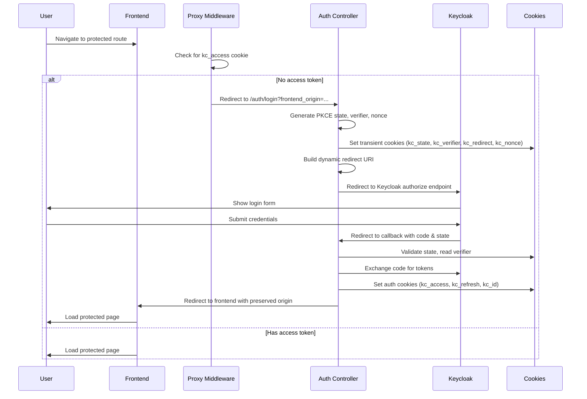
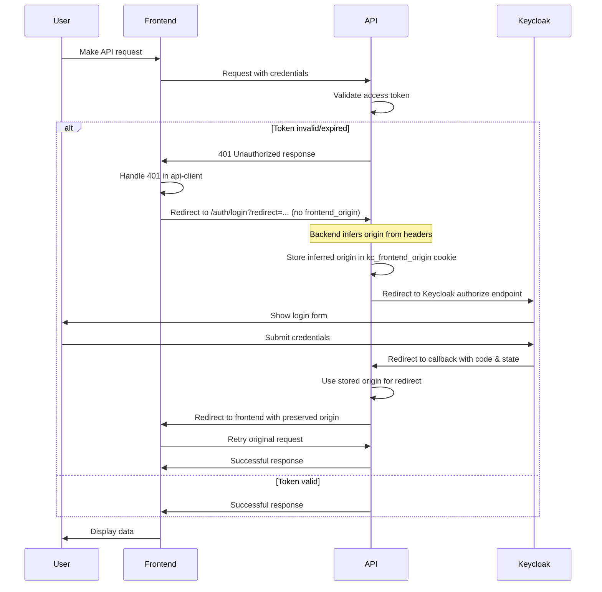
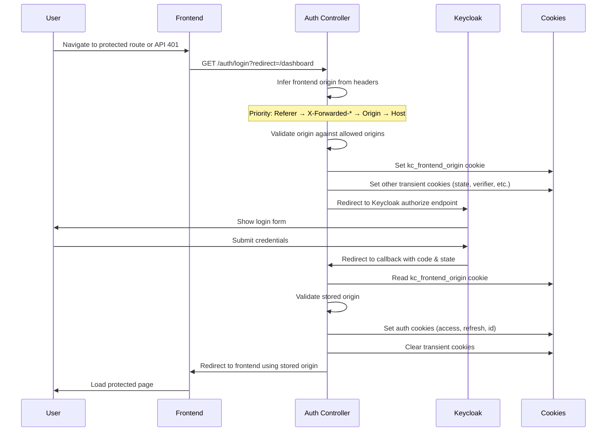
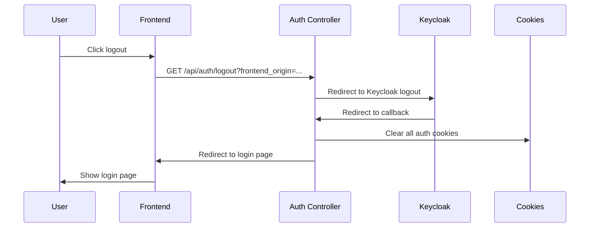

# BLIH System Authentication Flow - Comprehensive Documentation

## Overview

The BLIH System implements a comprehensive OAuth 2.0 / OpenID Connect (OIDC) authentication flow using Keycloak as the identity provider. This documentation covers the complete authentication architecture, flow sequences, security measures, and implementation details.

## Architecture Components

### Backend Components

#### 1. Auth Controller (`auth.controller.ts`)

- **Endpoints**: `/auth/login`, `/auth/callback`, `/auth/logout`, `/auth/me`
- **Responsibilities**:
  - Initiates OIDC login flow with PKCE
  - Handles Keycloak callbacks
  - Manages session cookies
  - Validates tokens and user sessions

#### 2. OIDC Utilities (`oidc.util.ts`)

- **Functions**: Dynamic redirect URI generation, origin detection, cookie management
- **Security Features**: PKCE, nonce validation, state management, CSRF protection

#### 3. Environment Configuration (`env.config.ts`)

- **Dynamic Settings**: `KEYCLOAK_AUTH_REDIRECT_URI_DYNAMIC` enables environment-aware redirect URIs
- **Security Configuration**: Cookie settings, CORS origins, allowed redirect paths

### Frontend Components

#### 1. API Client (`lib/api-client.ts`)

- **401 Handling**: Automatic redirect to login with redirect path only
- **Cookie Management**: Includes credentials in all API requests
- **Current Implementation**: Does NOT include frontend_origin parameter

#### 2. Proxy Middleware (`proxy.ts`)

- **Route Protection**: Middleware-level authentication checks
- **Origin Preservation**: Passes frontend origin to backend during redirects
- **Frontend Origin**: Added via `request.nextUrl.origin` parameter

#### 3. Logout Route (`app/api/auth/logout/route.ts`)

- **Session Termination**: Frontend-initiated logout with origin tracking
- **Origin Parameter**: Includes frontend origin in logout redirects

## Authentication Flow Sequences

### 1. Initial Login Flow



### 2. API Request Flow with 401 Handling



### 3. Enhanced Login Flow with Backend Origin Inference



### 4. Logout Flow



## Security Features

### 1. PKCE (Proof Key for Code Exchange)

- **Purpose**: Prevents authorization code interception attacks
- **Implementation**:
  - Code verifier: Random 64-byte string
  - Code challenge: SHA256 hash of verifier
  - Method: S256

### 2. State Management

- **Purpose**: Prevents CSRF attacks
- **Implementation**:
  - Random 32-byte state token
  - Stored in transient cookie
  - Validated on callback

### 3. Nonce Validation

- **Purpose**: Prevents replay attacks on ID tokens
- **Implementation**:
  - Random 32-byte nonce
  - Included in authorization request
  - Validated against ID token claim

### 4. Dynamic Redirect URI Generation

- **Purpose**: Environment-aware callback handling
- **Implementation**:
  - Detects request origin from headers
  - Builds appropriate callback URL
  - Prevents domain mismatch issues

### 5. Enhanced Origin Detection

- **5-Tier Priority System**:
  1. **Referer header** (most reliable for direct navigation)
  2. **X-Forwarded-\* headers** (proxy/load balancer scenarios)
  3. **Origin header** (CORS requests)
  4. **Host header** (fallback for direct requests)
  5. **Configured fallback** (AUTH_FRONTEND_BASE_URL)

- **Security Validation**:
  - Strict whitelist validation against allowed origins
  - Subdomain matching support (e.g., app.example.com → example.com)
  - Development-friendly prefix matching
  - Fallback to secure default when validation fails

### 6. Cookie Security

- **Settings**:
  - HttpOnly: Prevents XSS access
  - Secure: HTTPS-only in production
  - SameSite: Lax for CSRF protection
  - Domain: Scoped to current domain
  - Path: Root path for broad access

## Cookie Management

### Transient Cookies (Login Flow)

- `kc_state`: CSRF protection token (10min TTL)
- `kc_verifier`: PKCE code verifier (10min TTL)
- `kc_redirect`: Post-login redirect path (10min TTL)
- `kc_nonce`: ID token nonce (10min TTL)
- `kc_frontend_origin`: **Inferred frontend origin** (10min TTL)

### Persistent Cookies (Session)

- `kc_access`: Primary access token (30min TTL)
- `kc_refresh`: Refresh token (30 days TTL)
- `kc_id`: ID token for logout (30min TTL)

## Environment Configuration

### Development Environment

```env
KEYCLOAK_URL=http://localhost:8080
KEYCLOAK_AUTH_REDIRECT_URI=http://localhost:5000/api/v1/auth/callback
KEYCLOAK_AUTH_REDIRECT_URI_DYNAMIC=true
AUTH_FRONTEND_BASE_URL=http://localhost:3000
AUTH_ALLOWED_REDIRECT_ORIGINS=http://localhost:3000,http://localhost:3001
```

### Production Environment

```env
KEYCLOAK_URL=https://keycloak.blihmarketing.com
KEYCLOAK_AUTH_REDIRECT_URI=https://blihapi.blihmarketing.com/api/v1/auth/callback
KEYCLOAK_AUTH_REDIRECT_URI_DYNAMIC=true
AUTH_FRONTEND_BASE_URL=https://project-k22it.vercel.app
AUTH_ALLOWED_REDIRECT_ORIGINS=https://project-k22it.vercel.app
```

## Error Handling

### 1. Invalid State/CSRF

- **Detection**: State mismatch or missing cookies
- **Action**: Clear transient cookies, redirect to login error
- **Logging**: Audit event with failure reason

### 2. Token Validation Failures

- **Detection**: Invalid/expired access tokens
- **Action**: 401 response triggers frontend re-authentication
- **Logging**: Security event logged

### 3. Origin Validation Failures

- **Detection**: Frontend origin not in allowed list
- **Action**: Fallback to configured base URL
- **Security**: Prevents open redirect attacks

## Rate Limiting

### Login Attempts

- **Limit**: 10 attempts per minute per IP
- **Action**: Temporary block on exceeded attempts
- **Logging**: Rate limit events audited

### Token Exchange

- **Limit**: Configurable per endpoint
- **Purpose**: Prevent token abuse
- **Implementation**: In-memory rate limiting

## Integration Points

### 1. Keycloak Integration

- **Client Configuration**: `blih-system-auth` for web login
- **Resource Server**: `blih-system-api` for token validation
- **Realm**: `blih` (production) / `blih-dev` (development)

### 2. Frontend Integration

- **API Client**: Automatic 401 handling
- **Middleware**: Route protection
- **Cookie Management**: Browser-based session storage

### 3. Database Integration

- **User Sync**: Periodic Keycloak user synchronization
- **Role Sync**: Role mapping and synchronization
- **Audit Logging**: Authentication events stored in database

## Monitoring and Auditing

### 1. Audit Events

- **Login Initiated**: Successful login flow starts
- **Login Success**: User authenticated successfully
- **Login Failure**: Authentication errors and reasons
- **Callback Failure**: Invalid state or missing parameters
- **Logout**: User-initiated logout events

### 2. Security Monitoring

- **Failed Login Attempts**: Pattern detection
- **Rate Limit Exceeded**: Potential attack detection
- **Invalid Origins**: Redirect attack attempts
- **Token Validation Failures**: Potential token abuse

### 3. Performance Monitoring

- **Login Flow Duration**: End-to-end timing
- **Token Exchange Performance**: Keycloak response times
- **Cookie Operations**: Storage and retrieval performance

## Best Practices

### 1. Security Best Practices

- Always use HTTPS in production
- Implement proper CORS policies
- Validate all redirect URLs
- Use short-lived access tokens
- Regular token rotation

### 2. Development Best Practices

- Test both local and production flows
- Verify cookie domain settings
- Test direct navigation scenarios
- Validate origin detection logic

### 3. Operational Best Practices

- Monitor authentication failure rates
- Regular security audits
- Keep Keycloak updated
- Backup realm configurations

## Troubleshooting Guide

### Common Issues

#### 1. Redirect Loop

- **Cause**: Frontend origin not detected during direct navigation
- **Solution**: Check if request came through proxy middleware or direct navigation
- **Verification**: Check `kc_frontend_origin` cookie presence

#### 2. Cookie Domain Mismatch

- **Cause**: Different domains for login and callback
- **Solution**: Enable dynamic redirect URI generation
- **Verification**: Check `KEYCLOAK_AUTH_REDIRECT_URI_DYNAMIC` setting

#### 3. 401 Unauthorized Issues

- **Cause**: API client doesn't send frontend_origin, relies on proxy
- **Solution**: Ensure proxy middleware is properly configured
- **Verification**: Check if requests go through proxy or direct API calls

#### 4. CORS Issues

- **Cause**: Frontend origin not in allowed list
- **Solution**: Update `CORS_ORIGIN` and `AUTH_ALLOWED_REDIRECT_ORIGINS`
- **Verification**: Check browser network tab for CORS errors

### Debug Tools

#### 1. Browser DevTools

- **Application Tab**: Check cookie values and domains
- **Network Tab**: Monitor redirect flows and headers
- **Console Tab**: Check for JavaScript errors

#### 2. Backend Logs

- **Authentication Events**: Track login flow progress
- **Audit Logs**: Security event monitoring
- **Error Logs**: Exception tracking

#### 3. Keycloak Admin Console

- **User Sessions**: Active session monitoring
- **Client Configuration**: Verify client settings
- **Realm Settings**: Check security configurations

## Future Enhancements

### 1. Multi-Factor Authentication

- **TOTP Integration**: Time-based one-time passwords
- **SMS Authentication**: Phone-based verification
- **Hardware Tokens**: Physical security keys

### 2. Advanced Session Management

- **Session Concurrency**: Limit simultaneous sessions
- **Device Management**: Trusted device registration
- **Session Analytics**: Usage pattern analysis

### 3. Enhanced Security

- **Biometric Authentication**: Fingerprint/Face ID
- **Risk-Based Authentication**: Adaptive security
- **Zero Trust Architecture**: Never trust, always verify

---

This documentation provides a comprehensive overview of the BLIH System authentication architecture, implementation details, and operational guidelines. The system is designed to be secure, scalable, and maintainable while providing a seamless user experience across development and production environments.
