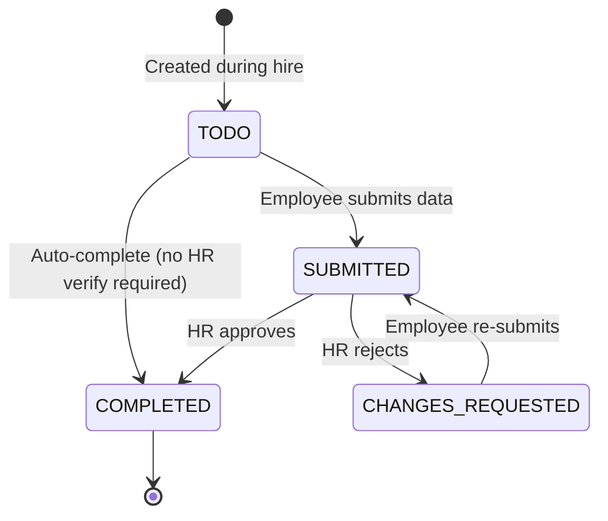
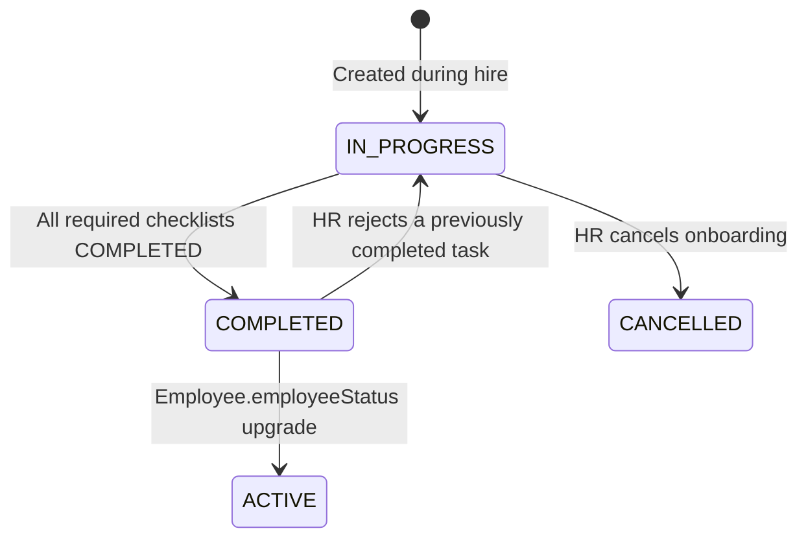

# Employee Account Creation & Onboarding Invitation — Technical Documentation

## Table of Contents

1. [Overview](#overview)
2. [Architecture Flow](#architecture-flow)
3. [Trigger: Hiring an Applicant](#trigger-hiring-an-applicant)
4. [Phase 1: Employee Account Creation](#phase-1-employee-account-creation)
5. [Phase 2: Onboarding Initialization](#phase-2-onboarding-initialization)
6. [Phase 3: Onboarding Invitation](#phase-3-onboarding-invitation)
7. [Data Structures](#data-structures)
8. [API Endpoints](#api-endpoints)
9. [Error Handling & Rollback](#error-handling--rollback)
10. [Onboarding Task Library](#onboarding-task-library)

---

## Overview

When HR hires an applicant who has accepted a job offer, the system performs an **atomic orchestration** that:

1. Creates the employee's identity (Keycloak + local DB)
2. Initializes an onboarding record with a full checklist
3. Sends a welcome invitation (email + in-app notification)

All database operations run inside a **single Prisma `$transaction`**. If anything fails, the entire operation rolls back — including cleanup of the external Keycloak identity.

---

## Architecture Flow

```mermaid
sequenceDiagram
    participant HR as HR User
    participant API as Applicants Controller
    participant RTS as RecruitmentTransitionService
    participant KC as Keycloak (IAM)
    participant UPS as UserProvisioningService
    participant DB as PostgreSQL (Prisma)
    participant NS as NotificationService

    HR->>API: POST /hr/recruitment/applicants/:id/hire
    API->>RTS: hireApplicant(applicantId, dto, changedById)

    Note over RTS: Validate: applicant exists + has ACCEPTED offer

    RTS->>UPS: generateUniqueUsername()
    RTS->>UPS: assertLocalIdentityAvailable()
    RTS->>KC: createExternalUser() → keycloakId

    rect rgb(40, 40, 60)
    Note over RTS,DB: Prisma $transaction (atomic)
        RTS->>UPS: createLocalUserGraph(tx, {...})
        Note over DB: Creates: User → Employee → Employment → Compensation → Lifecycle
        RTS->>DB: applicant.update → link to Employee
        RTS->>DB: transitionApplicantStatus → HIRED
        RTS->>DB: recalculateJobMetrics
        RTS->>DB: onboardingTask.findMany() → fetch task library
        RTS->>DB: onboarding.create(IN_PROGRESS)
        loop For each OnboardingTask
            RTS->>DB: onboardingTaskInstance.create (snapshot)
            RTS->>DB: onboardingChecklist.create (TODO, due: +14 days)
        end
        RTS->>DB: offer.update → link onboardingId
    end

    RTS->>KC: sendRequiredActionsEmail(UPDATE_PASSWORD, 7 days)
    RTS->>NS: Welcome notification (email + in_app)
```



---

## Trigger: Hiring an Applicant

### Preconditions

| Condition                                             | Validation                                                |
| ----------------------------------------------------- | --------------------------------------------------------- |
| Applicant must exist                                  | `NotFoundException` if not found                          |
| Applicant must have at least one **ACCEPTED** offer   | `BadRequestException` if no accepted offers               |
| Email/username must not already exist in the local DB | `ConflictException` from `assertLocalIdentityAvailable()` |

### Who Triggers It

**HR manually** — after reviewing the list of applicants with accepted offers. This is NOT an automatic trigger from offer acceptance.

**How to find applicants ready for hiring:**

```
GET /api/v1/hr/recruitment/applicants?status=OFFER&jobId=<job-uuid>
```

Then inspect each applicant's `offers` array for `status: ACCEPTED`.

---

## Phase 1: Employee Account Creation

### Step 1: External Identity (Keycloak)

```typescript
// 1. Generate a unique username from email/name
const username = await provisioning.generateUniqueUsername({
  email,
  firstName,
  lastName,
});

// 2. Verify no collision in local DB
await provisioning.assertLocalIdentityAvailable({ email, username });

// 3. Create Keycloak user (external IAM)
const keycloakId = await provisioning.createExternalUser({
  email,
  username,
  firstName,
  lastName,
  phone,
});
```

**Keycloak user attributes:**

- `email` → primary login identity
- `username` → auto-generated (e.g., `abel.tesfaye` or `abel.tesfaye1`)
- `firstName`, `lastName` → display name
- `phone` → optional contact

### Step 2: Local User Graph (inside transaction)

`UserProvisioningService.createLocalUserGraph()` creates a complete entity tree in one call:

```
User
├── Employee (status: ONBOARDING)
│   ├── UserEmployment
│   │   ├── positionId ← from Job
│   │   ├── employmentType ← from Offer (fallback: Job, default: FULL_TIME)
│   │   ├── managerEmploymentId ← resolved from Job.hiringManagerId
│   │   └── hiredAt ← Offer.startDate or now()
│   ├── UserCompensation
│   │   ├── baseSalary ← from Offer.salary
│   │   ├── currency ← from Offer.currency
│   │   ├── payFrequency ← from Offer.payFrequency (default: MONTHLY)
│   │   └── bonusEligible ← true if Offer.bonus > 0
│   └── UserLifecycleEvent (status: ONBOARDING)
└── metadata (JSON) ← recruitment context snapshot
```

**Recruitment metadata preserved:**

```json
{
  "recruitment": {
    "offerId": "offer-uuid",
    "links": {
      "linkedinUrl": "...",
      "portfolioUrl": "...",
      "githubUrl": "..."
    },
    "skills": ["TypeScript", "NestJS"],
    "experienceSummary": {
      "yearsExperience": 5,
      "currentCompany": "TechCo",
      "currentPosition": "Senior Dev",
      "educationLevel": "BSc",
      "highestDegree": "MSc"
    },
    "experienceItems": [
      { "company": "...", "title": "...", "startDate": "...", "endDate": "..." }
    ],
    "educationItems": [
      { "institution": "...", "degree": "...", "field": "..." }
    ],
    "bonusAmount": "5000",
    "equityAmount": null,
    "source": "LINKEDIN",
    "referredById": null,
    "coverLetter": "..."
  }
}
```

### Step 3: Applicant Linking

After creating the employee, the system:

1. **Links Applicant → Employee**: `applicant.update({ employee: { connect: { id: employee.id } } })`
2. **Transitions status**: `OFFER → HIRED` (with audit trail via `ApplicantStatusHistory`)
3. **Recalculates job metrics**: Updates `Job.metrics` counters (totalApplicants, hired, etc.)

---

## Phase 2: Onboarding Initialization

Still inside the same transaction:

### Step 1: Fetch Task Library

```typescript
const allTasks = await tx.onboardingTask.findMany({
  orderBy: { createdAt: 'asc' },
});
```

Retrieves all tasks from the **OnboardingTask library** (8 standard tasks after seeding).

### Step 2: Create Onboarding Record

```typescript
const onboarding = await tx.onboarding.create({
  data: {
    employeeId: employee.id,
    status: 'IN_PROGRESS',
    startedAt: joinDate, // Offer.startDate or now()
  },
});
```

**Key constraints:**

- `employeeId` is `@unique` — enforces **one onboarding per employee**
- Status starts as `IN_PROGRESS`

### Step 3: Snapshot Tasks → Checklist Items

For each task in the library:

```typescript
// 1. Create an immutable snapshot (preserves historical data)
const instance = await tx.onboardingTaskInstance.create({
  data: {
    title: task.title,
    description: task.description,
    taskType: task.taskType,
    targetDataModel: task.targetDataModel,
    requiresHrVerification: task.requiresHrVerification,
  },
});

// 2. Create checklist entry linking onboarding ↔ task instance
await tx.onboardingChecklist.create({
  data: {
    onboardingId: onboarding.id,
    taskInstanceId: instance.id,
    status: 'TODO',
    dueDate: joinDate + 14 days,
    isRequired: true,
  },
});
```

**Why snapshots?** If HR later edits a task in the library (e.g., renames "Upload Documents" to "Upload Required Files"), existing onboarding records retain the original task data.

### Step 4: Link Offer → Onboarding

```typescript
await tx.offer.update({
  where: { id: offer.id },
  data: { onboardingId: onboarding.id },
});
```

Creates a bidirectional link: `Offer.onboardingId → Onboarding.id`.

---

## Phase 3: Onboarding Invitation

Runs **after** the transaction commits successfully:

### Step 1: Keycloak Password Reset Email

```typescript
await provisioning.sendRequiredActionsEmail({
  keycloakId,
  actions: ['UPDATE_PASSWORD'],
  lifespanSeconds: 604800, // 7 days
});
```

The new hire receives an email with a link to set their password and activate their account.

### Step 2: In-App Welcome Notification

```typescript
await notifications.execute({
  type: 'onboarding',
  priority: 'high',
  title: 'Welcome to BLIH',
  body: 'Your account is ready. Log in to complete your onboarding tasks.',
  userId: userId,
  recipients: [email],
  channels: ['email', 'in_app'],
  payload: {
    employeeId,
    jobId,
    applicantId,
    onboardingId, // ← enables frontend deep-linking
  },
});
```

**Payload for frontend deep-linking:**

- `onboardingId` → route to `/onboarding/:onboardingId` dashboard
- `employeeId` → resolve employee context
- `jobId` → show position details

> **Note:** Both notification steps are wrapped in try/catch — a notification failure does NOT roll back the hire. The employee account is still created.

---

## Data Structures

### Database Schema

```
┌─────────────────┐     ┌─────────────────┐     ┌──────────────────────┐
│     Offer       │     │   Onboarding    │     │  OnboardingChecklist │
├─────────────────┤     ├─────────────────┤     ├──────────────────────┤
│ id              │     │ id              │     │ id                   │
│ salary          │──┐  │ employeeId (1:1)│     │ onboardingId         │
│ status: ACCEPTED│  └─►│ status          │◄────│ taskInstanceId       │
│ onboardingId ───┼────►│ startedAt       │     │ status: TODO         │
│ startDate       │     │ completedAt     │     │ dueDate              │
└─────────────────┘     │ checklists[]    │     │ isRequired           │
                        └────────┬────────┘     │ verifiedAt/By        │
                                 │              │ rejectionReason      │
                        ┌────────▼────────┐     └──────────┬───────────┘
                        │    Employee     │                │
                        ├─────────────────┤     ┌──────────▼───────────┐
                        │ id              │     │OnboardingTaskInstance│
                        │ userId          │     ├──────────────────────┤
                        │ employeeStatus: │     │ id                   │
                        │   ONBOARDING    │     │ title                │
                        │ employment[]    │     │ description          │
                        │ compensation[]  │     │ taskType             │
                        └─────────────────┘     │ targetDataModel      │
                                                │ requiresHrVerification│
                                                └──────────────────────┘
```

### OnboardingChecklist Status Flow



### Onboarding Status Flow



---

## API Endpoints

### Recruitment → Hiring

| Method | Endpoint                                               | Description                                        | Auth               |
| ------ | ------------------------------------------------------ | -------------------------------------------------- | ------------------ |
| `GET`  | `/hr/recruitment/applicants?status=OFFER&jobId=<uuid>` | List applicants with accepted offers per job       | `applicant:view`   |
| `POST` | `/hr/recruitment/applicants/:id/hire`                  | **Hire applicant** → creates employee + onboarding | `applicant:update` |

#### `POST /hr/recruitment/applicants/:id/hire`

**Request Body (`HireApplicantDto`):**

```json
{
  "companyEmail": "abel.tesfaye@blih.com", // optional override
  "isCompanyEmailPrimary": true, // use company email as login
  "companyPhone": "+251123456789", // optional override
  "isCompanyPhonePrimary": true // use company phone as primary
}
```

**Response:**

```json
{
  "employeeId": "employee-uuid",
  "userId": "user-uuid",
  "applicantId": "applicant-uuid",
  "jobId": "job-uuid",
  "onboardingId": "onboarding-uuid"
}
```

### Onboarding Management

| Method   | Endpoint                    | Description                                         | Auth                |
| -------- | --------------------------- | --------------------------------------------------- | ------------------- |
| `GET`    | `/hr/onboarding`            | List all onboardings (filter by employeeId, status) | `onboarding:view`   |
| `GET`    | `/hr/onboarding/paginated`  | Paginated onboarding list                           | `onboarding:view`   |
| `GET`    | `/hr/onboarding/:id`        | Get onboarding by ID (includes checklists)          | `onboarding:view`   |
| `POST`   | `/hr/onboarding`            | Create onboarding manually                          | `onboarding:create` |
| `PATCH`  | `/hr/onboarding/:id`        | Update onboarding                                   | `onboarding:update` |
| `POST`   | `/hr/onboarding/:id/cancel` | Cancel onboarding                                   | `onboarding:update` |
| `DELETE` | `/hr/onboarding/:id`        | Delete onboarding                                   | `onboarding:delete` |

### Onboarding Checklist — Employee Submit Endpoints

All endpoints: `POST /hr/onboarding/tasks/:taskId/<type>` — requires `onboarding:update`

| Endpoint                    | TargetDataModel                   | DTO                             | What it creates/updates                            |
| --------------------------- | --------------------------------- | ------------------------------- | -------------------------------------------------- |
| `:taskId/profile`           | `USER_PROFILE`                    | `SubmitUserProfileDto`          | `UserProfile` (phone, DOB, gender, marital status) |
| `:taskId/address`           | `EMPLOYEE_ADDRESS`                | `SubmitAddressTaskDto`          | `EmployeeAddress` (country, city, region, street)  |
| `:taskId/bank-detail`       | `EMPLOYEE_BANK_DETAIL`            | `SubmitBankDetailTaskDto`       | `EmployeeBankDetail` + `BankAccount`               |
| `:taskId/emergency-contact` | `EMPLOYEE_EMERGENCY_CONTACT`      | `SubmitEmergencyContactTaskDto` | `EmployeeEmergencyContact`                         |
| `:taskId/education`         | `EMPLOYEE_EDUCATION`              | `SubmitEducationTaskDto`        | `EmployeeEducation`                                |
| `:taskId/document`          | `EMPLOYEE_DOCUMENT`               | `SubmitDocumentTaskDto`         | `EmployeeDocument` (file upload)                   |
| `:taskId/policy`            | `EMPLOYEE_POLICY_ACKNOWLEDGEMENT` | `SubmitPolicyTaskDto`           | `PolicyAcknowledgement` records                    |
| `:taskId/contract`          | `EMPLOYEE_CONTRACT`               | `SubmitContractTaskDto`         | `EmployeeContract` + linked `Contract`             |
| `:taskId/done`              | _(CUSTOM tasks)_                  | _(none)_                        | Marks custom task as done                          |

### Onboarding Checklist — HR Verify Endpoints

All endpoints: `POST /hr/onboarding/tasks/:taskId/<type>/verify` — requires `onboarding:verify`

| Endpoint                           | Action                                |
| ---------------------------------- | ------------------------------------- |
| `:taskId/profile/verify`           | Approve/reject profile data           |
| `:taskId/address/verify`           | Approve/reject address                |
| `:taskId/bank-detail/verify`       | Approve/reject bank details           |
| `:taskId/emergency-contact/verify` | Approve/reject emergency contact      |
| `:taskId/education/verify`         | Approve/reject education              |
| `:taskId/document/verify`          | Approve/reject uploaded document      |
| `:taskId/contract/verify`          | Approve/reject contract signing       |
| `:taskId/policy/verify`            | Approve/reject policy acknowledgement |
| `:taskId/done/verify`              | Approve/reject custom task            |

**Verify Request Body (`VerifyPayloadDto`):**

```json
// Approve
{ "approved": true }

// Reject
{ "approved": false, "hrFeedback": "Address details are incomplete." }
```

### Onboarding Admin — Checklist Status Override

| Method  | Endpoint                               | Description                                | Auth                |
| ------- | -------------------------------------- | ------------------------------------------ | ------------------- |
| `PATCH` | `/hr/onboarding/checklists/:id/status` | Direct status/dueDate override (admin use) | `onboarding:update` |

### Onboarding Task Library CRUD

| Method   | Endpoint                         | Description             | Auth                     |
| -------- | -------------------------------- | ----------------------- | ------------------------ |
| `POST`   | `/hr/onboarding/tasks`           | Create task template    | `onboarding_task:create` |
| `GET`    | `/hr/onboarding/tasks`           | List all task templates | `onboarding_task:view`   |
| `GET`    | `/hr/onboarding/tasks/paginated` | Paginated task list     | `onboarding_task:view`   |
| `GET`    | `/hr/onboarding/tasks/:id`       | Get task by ID          | `onboarding_task:view`   |
| `PATCH`  | `/hr/onboarding/tasks/:id`       | Update task template    | `onboarding_task:update` |
| `DELETE` | `/hr/onboarding/tasks/:id`       | Delete task template    | `onboarding_task:delete` |

---

## Error Handling & Rollback

### Transaction Atomicity

```
┌──────────────────────────────────────────────────────────────────┐
│                     Prisma $transaction                         │
│                                                                  │
│  ✓ User + Employee + Employment + Compensation + Lifecycle       │
│  ✓ Applicant → Employee link                                    │
│  ✓ Applicant status → HIRED                                     │
│  ✓ Job metrics recalculation                                    │
│  ✓ Onboarding + TaskInstances + Checklists                     │
│  ✓ Offer → Onboarding link                                     │
│                                                                  │
│  ⚡ ANY failure → entire block rolls back                        │
└──────────────────────────────────────────────────────────────────┘

If transaction fails:
  → provisioning.cleanupExternalUser(keycloakId) ← deletes Keycloak user
  → provisioning.rethrowPersistenceError(error)  ← re-throws with context
```

### Notification Failures (Non-Fatal)

Both invitation steps (Keycloak email + in-app notification) are wrapped in try/catch:

- **Keycloak email fails** → logged as `recruitment.onboarding.keycloak_invite.failure`, hire proceeds
- **Notification fails** → logged as `recruitment.onboarding.notification.failure`, hire proceeds

---

## Onboarding Task Library

### Default Seed Data (8 tasks)

| #   | Title                         | Type         | TargetDataModel                   | HR Verification  |
| --- | ----------------------------- | ------------ | --------------------------------- | ---------------- |
| 1   | Complete Personal Information | `NON_CUSTOM` | `USER_PROFILE`                    | ✅ Required      |
| 2   | Provide Home Address          | `NON_CUSTOM` | `EMPLOYEE_ADDRESS`                | ✅ Required      |
| 3   | Add Bank Account Details      | `NON_CUSTOM` | `EMPLOYEE_BANK_DETAIL`            | ✅ Required      |
| 4   | Add Emergency Contact         | `NON_CUSTOM` | `EMPLOYEE_EMERGENCY_CONTACT`      | ✅ Required      |
| 5   | Confirm Education History     | `NON_CUSTOM` | `EMPLOYEE_EDUCATION`              | ✅ Required      |
| 6   | Upload Required Documents     | `NON_CUSTOM` | `EMPLOYEE_DOCUMENT`               | ✅ Required      |
| 7   | Review & Acknowledge Policies | `NON_CUSTOM` | `EMPLOYEE_POLICY_ACKNOWLEDGEMENT` | ❌ Auto-complete |
| 8   | Sign Employment Contract      | `NON_CUSTOM` | `EMPLOYEE_CONTRACT`               | ✅ Required      |

### Task Types

- **`NON_CUSTOM`**: System-integrated. The `targetDataModel` tells the frontend which form to render. Each has a dedicated submit + verify endpoint.
- **`CUSTOM`**: Ad-hoc HR tasks (e.g., "Meet your manager", "Collect laptop"). No data model — employee just marks as done.

### Auto-Completion Logic (`EvaluateOnboardingUseCase`)

After every submit or verify action:

1. Check if **all required** checklist items are `COMPLETED`
2. If yes → set `Onboarding.status = COMPLETED`, `completedAt = now()`
3. If `Employee.employeeStatus === ONBOARDING` → upgrade to `ACTIVE`
4. If a previously completed task is rejected → revert `Onboarding.status` to `IN_PROGRESS`

---

## Key Files Reference

| File                                                             | Purpose                        |
| ---------------------------------------------------------------- | ------------------------------ |
| `recruitment/applicants.controller.ts`                           | `POST :id/hire` endpoint       |
| `recruitment/recruitment-transition.service.ts`                  | Main orchestrator              |
| `recruitment/dto/applicant.dto.ts`                               | `HireApplicantDto`             |
| `core/users/user-provisioning.service.ts`                        | Keycloak + local user creation |
| `onboarding/onboarding.controller.ts`                            | Onboarding CRUD                |
| `onboarding/onboarding-checklist/execution.controller.ts`        | Submit + Verify endpoints      |
| `onboarding/onboarding-checklist/evaluate-onboarding.usecase.ts` | Auto-completion logic          |
| `database/schema/onboarding.prisma`                              | Schema definitions             |
| `database/seed/onboarding-task.seed.ts`                          | Default task library seed      |
