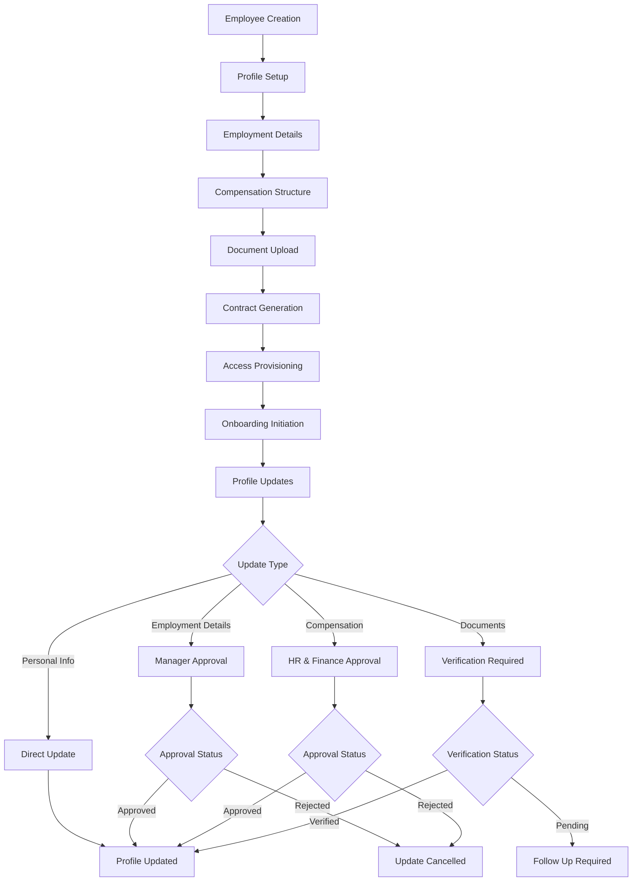
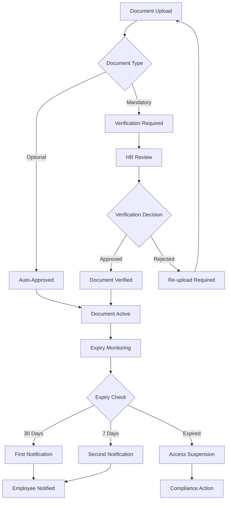
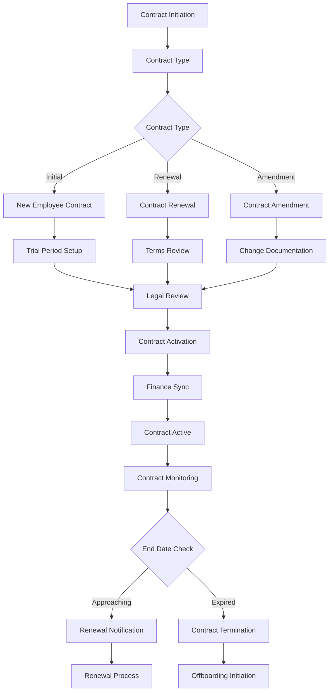
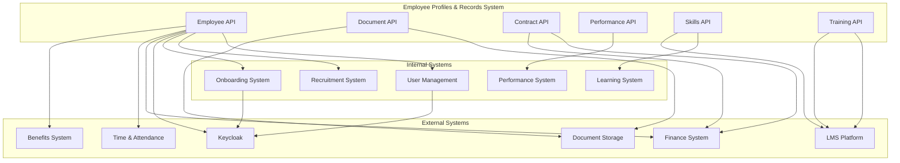

# BLIH Employee Profiles & Records System - Complete Technical Documentation

**Version:** 1.0  
**Last Updated:** March 2026  
**Status:** Comprehensive Analysis & Documentation  
**Implementation Coverage:** 60% Complete

---

## 1. System Overview & Architecture

### 1.1 Business Objectives

The BLIH Employee Profiles & Records system serves as the central repository for all employee-related information in the enterprise HR ecosystem. It provides comprehensive employee lifecycle management from onboarding through separation, with integrated compensation, performance, compliance, and access management capabilities.

### 1.2 Key Features

**Employee Information Management:**

- Complete employee profiles with personal, employment, and compensation data
- Document management with expiry tracking and verification
- Contract lifecycle management with trial periods and finance integration
- Job description management with KPI linking and performance metrics

**Enterprise HR Capabilities:**

- Multi-level employment relationships and reporting structures
- Compensation management with history tracking and component breakdown
- Performance review system with scoring and feedback collection
- Skills assessment and training record management
- Disciplinary action tracking and resolution workflows
- Leave balance management with accrual calculations
- System access and permission management

**Integration & Compliance:**

- Keycloak integration for identity and access management
- Document expiry notifications and compliance monitoring
- Finance system synchronization for contracts and compensation
- Audit logging and change tracking across all employee data

### 1.3 System Architecture

```
┌─────────────────────────────────────────────────────────────┐
│                    Employee Profiles & Records              │
├─────────────────────────────────────────────────────────────┤
│  API Layer (NestJS)                                         │
│  ├── Employees Controller (2 endpoints)                     │
│  ├── Employee Documents Controller (3 endpoints)           │
│  ├── Employee Contracts Controller (3 endpoints)            │
│  └── Job Descriptions Controller (4 endpoints)             │
├─────────────────────────────────────────────────────────────┤
│  Business Logic Layer                                       │
│  ├── Use Cases (Employee, Document, Contract, JobDesc)      │
│  ├── Validation & Business Rules                            │
│  ├── Data Transformation & Mapping                         │
│  └── Notification & Integration Services                    │
├─────────────────────────────────────────────────────────────┤
│  Data Access Layer (Prisma ORM)                             │
│  ├── Employee Core Models (5 models)                        │
│  ├── Document & Contract Models (3 models)                  │
│  ├── Performance & Skills Models (4 models)                 │
│  └── Reference Data Models (4 models)                      │
├─────────────────────────────────────────────────────────────┤
│  External Integrations                                       │
│  ├── Keycloak (Identity & Access Management)                │
│  ├── Finance System (Contract & Compensation Sync)          │
│  ├── Document Storage (File Management)                     │
│  └── Notification Service (Alerts & Reminders)              │
└─────────────────────────────────────────────────────────────┘
```

---

## 2. Database Schema & Models

### 2.1 Core Employee Models

#### Employee Model

```sql
CREATE TABLE Employee (
    id UUID PRIMARY KEY DEFAULT gen_random_uuid(),
    user_id UUID UNIQUE REFERENCES User(id) ON DELETE SET NULL,
    created_at TIMESTAMP DEFAULT CURRENT_TIMESTAMP,
    updated_at TIMESTAMP DEFAULT CURRENT_TIMESTAMP
);

-- Indexes
CREATE INDEX idx_employee_user_id ON Employee(user_id);
```

#### UserProfile Model

```sql
CREATE TABLE UserProfile (
    id UUID PRIMARY KEY DEFAULT gen_random_uuid(),
    employee_id UUID UNIQUE REFERENCES Employee(id) ON DELETE CASCADE,
    date_of_birth DATE,
    gender VARCHAR(20) CHECK (gender IN ('MALE', 'FEMALE', 'OTHER', 'PREFER_NOT_TO_SAY')),
    nationality_id UUID REFERENCES CountryReference(id) ON DELETE SET NULL,
    marital_status VARCHAR(20) CHECK (marital_status IN ('SINGLE', 'MARRIED', 'DIVORCED', 'SEPARATED')),
    avatar_url TEXT,
    address_line_1 TEXT,
    address_line_2 TEXT,
    city TEXT,
    state TEXT,
    country_id UUID REFERENCES CountryReference(id) ON DELETE SET NULL,
    postal_code TEXT,
    emergency_contact_name TEXT,
    emergency_contact_phone TEXT,
    created_at TIMESTAMP DEFAULT CURRENT_TIMESTAMP,
    updated_at TIMESTAMP DEFAULT CURRENT_TIMESTAMP
);

-- Indexes
CREATE INDEX idx_user_profile_nationality_id ON UserProfile(nationality_id);
CREATE INDEX idx_user_profile_country_id ON UserProfile(country_id);
```

#### UserEmployment Model

```sql
CREATE TABLE UserEmployment (
    id UUID PRIMARY KEY DEFAULT gen_random_uuid(),
    employee_id UUID UNIQUE REFERENCES Employee(id) ON DELETE CASCADE,
    employee_code VARCHAR(50) UNIQUE,
    position_id UUID REFERENCES Position(id) ON DELETE SET NULL,
    employment_type VARCHAR(20) DEFAULT 'FULL_TIME'
        CHECK (employment_type IN ('FULL_TIME', 'PART_TIME', 'CONTRACT', 'TEMPORARY')),
    manager_employment_id UUID REFERENCES UserEmployment(id) ON DELETE SET NULL,
    hired_at TIMESTAMP,
    probation_end_at TIMESTAMP,
    confirmed_at TIMESTAMP,
    created_at TIMESTAMP DEFAULT CURRENT_TIMESTAMP,
    updated_at TIMESTAMP DEFAULT CURRENT_TIMESTAMP
);

-- Indexes
CREATE INDEX idx_user_employment_position_id ON UserEmployment(position_id);
CREATE INDEX idx_user_employment_manager_id ON UserEmployment(manager_employment_id);
```

#### UserCompensation Model

```sql
CREATE TABLE UserCompensation (
    id UUID PRIMARY KEY DEFAULT gen_random_uuid(),
    employee_id UUID UNIQUE REFERENCES Employee(id) ON DELETE CASCADE,
    base_salary DECIMAL(15,2),
    currency VARCHAR(10),
    pay_frequency VARCHAR(20) DEFAULT 'MONTHLY'
        CHECK (pay_frequency IN ('MONTHLY', 'BIWEEKLY', 'WEEKLY', 'ANNUAL')),
    bonus_eligible BOOLEAN DEFAULT FALSE,
    bonus_rate DECIMAL(5,2),
    effective_from TIMESTAMP,
    effective_to TIMESTAMP,
    created_at TIMESTAMP DEFAULT CURRENT_TIMESTAMP,
    updated_at TIMESTAMP DEFAULT CURRENT_TIMESTAMP
);
```

#### UserLifecycle Model

```sql
CREATE TABLE UserLifecycle (
    id UUID PRIMARY KEY DEFAULT gen_random_uuid(),
    employee_id UUID UNIQUE REFERENCES Employee(id) ON DELETE CASCADE,
    status VARCHAR(20) DEFAULT 'ONBOARDING'
        CHECK (status IN ('ONBOARDING', 'ACTIVE', 'SUSPENDED', 'TERMINATED', 'RETIRED')),
    onboarded_at TIMESTAMP,
    suspended_at TIMESTAMP,
    terminated_at TIMESTAMP,
    termination_reason TEXT,
    offboarding_completed BOOLEAN DEFAULT FALSE,
    created_at TIMESTAMP DEFAULT CURRENT_TIMESTAMP,
    updated_at TIMESTAMP DEFAULT CURRENT_TIMESTAMP
);
```

### 2.2 Document & Contract Models

#### EmployeeDocument Model

```sql
CREATE TABLE EmployeeDocument (
    id UUID PRIMARY KEY DEFAULT gen_random_uuid(),
    employee_id UUID REFERENCES Employee(id) ON DELETE CASCADE,
    type VARCHAR(20) CHECK (type IN ('CONTRACT', 'ID', 'CERTIFICATE', 'MEDICAL', 'RESUME', 'POLICY_ACK', 'QUALIFICATION', 'OTHER')),
    type_other TEXT,
    file_url TEXT NOT NULL,
    file_name TEXT,
    file_size_bytes INTEGER,
    mime_type TEXT,
    issue_date DATE,
    expiry_date DATE,
    is_mandatory BOOLEAN DEFAULT FALSE,
    verified BOOLEAN DEFAULT FALSE,
    verified_by_id UUID REFERENCES User(id) ON DELETE SET NULL,
    verified_at TIMESTAMP,
    created_at TIMESTAMP DEFAULT CURRENT_TIMESTAMP,
    updated_at TIMESTAMP DEFAULT CURRENT_TIMESTAMP
);

-- Indexes
CREATE INDEX idx_employee_document_employee_id ON EmployeeDocument(employee_id);
CREATE INDEX idx_employee_document_type ON EmployeeDocument(employee_id, type);
CREATE INDEX idx_employee_document_expiry_date ON EmployeeDocument(expiry_date);
CREATE INDEX idx_employee_document_verified_by ON EmployeeDocument(verified_by_id);
```

#### Contract Model

```sql
CREATE TABLE Contract (
    id UUID PRIMARY KEY DEFAULT gen_random_uuid(),
    employee_id UUID REFERENCES Employee(id) ON DELETE CASCADE,
    contract_type VARCHAR(20) DEFAULT 'DRAFT'
        CHECK (contract_type IN ('INITIAL', 'RENEWAL', 'AMENDMENT', 'ADDENDUM')),
    sequence_number INTEGER NOT NULL,
    start_date DATE NOT NULL,
    end_date DATE,
    trial_applies BOOLEAN DEFAULT FALSE,
    trial_end_date DATE,
    trial_confirmed BOOLEAN DEFAULT FALSE,
    document_url TEXT,
    status VARCHAR(20) DEFAULT 'DRAFT'
        CHECK (status IN ('DRAFT', 'ACTIVE', 'EXPIRED', 'TERMINATED', 'RENEWED')),
    synced_to_finance BOOLEAN DEFAULT FALSE,
    synced_at TIMESTAMP,
    created_at TIMESTAMP DEFAULT CURRENT_TIMESTAMP,
    updated_at TIMESTAMP DEFAULT CURRENT_TIMESTAMP,

    UNIQUE(employee_id, sequence_number)
);

-- Indexes
CREATE INDEX idx_contract_employee_id ON Contract(employee_id);
CREATE INDEX idx_contract_status ON Contract(status);
CREATE INDEX idx_contract_end_date ON Contract(end_date);
```

#### JobDescription Model

```sql
CREATE TABLE JobDescription (
    id UUID PRIMARY KEY DEFAULT gen_random_uuid(),
    position_id UUID REFERENCES Position(id) ON DELETE SET NULL,
    title TEXT NOT NULL,
    level TEXT,
    code TEXT UNIQUE,
    summary TEXT,
    duties JSONB,
    skills JSONB,
    kpis JSONB,
    document_url TEXT,
    version INTEGER DEFAULT 1,
    effective_from DATE,
    created_at TIMESTAMP DEFAULT CURRENT_TIMESTAMP,
    updated_at TIMESTAMP DEFAULT CURRENT_TIMESTAMP
);

-- Indexes
CREATE INDEX idx_job_description_position_id ON JobDescription(position_id);
CREATE INDEX idx_job_description_title ON JobDescription(title);
```

### 2.3 Performance & Skills Models

#### EmployeeSkill Model

```sql
CREATE TABLE EmployeeSkill (
    id UUID PRIMARY KEY DEFAULT gen_random_uuid(),
    employee_id UUID REFERENCES Employee(id) ON DELETE CASCADE,
    skill_name TEXT NOT NULL,
    skill_level VARCHAR(20) CHECK (skill_level IN ('BEGINNER', 'INTERMEDIATE', 'ADVANCED', 'EXPERT')),
    category TEXT,
    acquired_date DATE,
    expiry_date DATE,
    certification_url TEXT,
    verified BOOLEAN DEFAULT FALSE,
    verified_by_id UUID REFERENCES User(id) ON DELETE SET NULL,
    verified_at TIMESTAMP,
    notes TEXT,
    created_at TIMESTAMP DEFAULT CURRENT_TIMESTAMP,
    updated_at TIMESTAMP DEFAULT CURRENT_TIMESTAMP
);

-- Indexes
CREATE INDEX idx_employee_skill_employee_id ON EmployeeSkill(employee_id);
CREATE INDEX idx_employee_skill_category ON EmployeeSkill(category);
CREATE INDEX idx_employee_skill_expiry_date ON EmployeeSkill(expiry_date);
```

#### PerformanceReview Model

```sql
CREATE TABLE PerformanceReview (
    id UUID PRIMARY KEY DEFAULT gen_random_uuid(),
    employee_id UUID REFERENCES Employee(id) ON DELETE CASCADE,
    review_period_start DATE NOT NULL,
    review_period_end DATE NOT NULL,
    review_type VARCHAR(20) CHECK (review_type IN ('QUARTERLY', 'SEMI_ANNUAL', 'ANNUAL', 'PROBATION')),
    overall_score DECIMAL(3,1) CHECK (overall_score >= 0 AND overall_score <= 5),
    status VARCHAR(20) DEFAULT 'DRAFT'
        CHECK (status IN ('DRAFT', 'SUBMITTED', 'REVIEW_PENDING', 'COMPLETED', 'CANCELLED')),
    reviewer_id UUID REFERENCES User(id) ON DELETE SET NULL,
    review_date DATE,
    goals_achieved DECIMAL(3,2) CHECK (goals_achieved >= 0 AND goals_achieved <= 1),
    strengths TEXT,
    areas_for_improvement TEXT,
    development_plan TEXT,
    comments TEXT,
    submitted_at TIMESTAMP,
    completed_at TIMESTAMP,
    created_at TIMESTAMP DEFAULT CURRENT_TIMESTAMP,
    updated_at TIMESTAMP DEFAULT CURRENT_TIMESTAMP
);

-- Indexes
CREATE INDEX idx_performance_review_employee_id ON PerformanceReview(employee_id);
CREATE INDEX idx_performance_review_period ON PerformanceReview(review_period_start, review_period_end);
CREATE INDEX idx_performance_review_status ON PerformanceReview(status);
```

#### LeaveBalance Model

```sql
CREATE TABLE LeaveBalance (
    id UUID PRIMARY KEY DEFAULT gen_random_uuid(),
    employee_id UUID REFERENCES Employee(id) ON DELETE CASCADE,
    leave_type VARCHAR(20) CHECK (leave_type IN ('ANNUAL', 'SICK', 'MATERNITY', 'PATERNITY', 'COMPASSIONATE', 'UNPAID')),
    year INTEGER NOT NULL,
    allocated_days DECIMAL(4,1) DEFAULT 0,
    used_days DECIMAL(4,1) DEFAULT 0,
    pending_days DECIMAL(4,1) DEFAULT 0,
    carried_forward_days DECIMAL(4,1) DEFAULT 0,
    last_updated TIMESTAMP DEFAULT CURRENT_TIMESTAMP,
    created_at TIMESTAMP DEFAULT CURRENT_TIMESTAMP,
    updated_at TIMESTAMP DEFAULT CURRENT_TIMESTAMP,

    UNIQUE(employee_id, leave_type, year)
);

-- Indexes
CREATE INDEX idx_leave_balance_employee_id ON LeaveBalance(employee_id);
CREATE INDEX idx_leave_balance_year ON LeaveBalance(year);
CREATE INDEX idx_leave_balance_type_year ON LeaveBalance(leave_type, year);
```

#### DisciplinaryAction Model

```sql
CREATE TABLE DisciplinaryAction (
    id UUID PRIMARY KEY DEFAULT gen_random_uuid(),
    employee_id UUID REFERENCES Employee(id) ON DELETE CASCADE,
    action_type VARCHAR(30) CHECK (action_type IN ('VERBAL_WARNING', 'WRITTEN_WARNING', 'SUSPENSION', 'FINAL_WARNING', 'TERMINATION')),
    severity_level INTEGER CHECK (severity_level >= 1 AND severity_level <= 5),
    incident_date DATE NOT NULL,
    reported_date DATE NOT NULL,
    description TEXT NOT NULL,
    resolution_plan TEXT,
    status VARCHAR(20) DEFAULT 'ACTIVE'
        CHECK (status IN ('ACTIVE', 'RESOLVED', 'APPEALED', 'CLOSED')),
    reported_by_id UUID REFERENCES User(id) ON DELETE SET NULL,
    investigator_id UUID REFERENCES User(id) ON DELETE SET NULL,
    resolution_date DATE,
    follow_up_required BOOLEAN DEFAULT FALSE,
    follow_up_date DATE,
    created_at TIMESTAMP DEFAULT CURRENT_TIMESTAMP,
    updated_at TIMESTAMP DEFAULT CURRENT_TIMESTAMP
);

-- Indexes
CREATE INDEX idx_disciplinary_action_employee_id ON DisciplinaryAction(employee_id);
CREATE INDEX idx_disciplinary_action_severity ON DisciplinaryAction(severity_level);
CREATE INDEX idx_disciplinary_action_status ON DisciplinaryAction(status);
CREATE INDEX idx_disciplinary_action_incident_date ON DisciplinaryAction(incident_date);
```

### 2.4 Reference Data Models

#### Department Model

```sql
CREATE TABLE Department (
    id UUID PRIMARY KEY DEFAULT gen_random_uuid(),
    name TEXT UNIQUE NOT NULL,
    description TEXT,
    parent_id UUID REFERENCES Department(id) ON DELETE SET NULL,
    created_at TIMESTAMP DEFAULT CURRENT_TIMESTAMP,
    updated_at TIMESTAMP DEFAULT CURRENT_TIMESTAMP
);

-- Indexes
CREATE INDEX idx_department_parent_id ON Department(parent_id);
```

#### Position Model

```sql
CREATE TABLE Position (
    id UUID PRIMARY KEY DEFAULT gen_random_uuid(),
    title TEXT NOT NULL,
    description TEXT,
    department_id UUID REFERENCES Department(id) ON DELETE CASCADE,
    grade_id UUID REFERENCES JobGrade(id) ON DELETE SET NULL,
    headcount_limit INTEGER,
    is_active BOOLEAN DEFAULT TRUE,
    created_at TIMESTAMP DEFAULT CURRENT_TIMESTAMP,
    updated_at TIMESTAMP DEFAULT CURRENT_TIMESTAMP,

    UNIQUE(department_id, title)
);

-- Indexes
CREATE INDEX idx_position_department_id ON Position(department_id);
CREATE INDEX idx_position_grade_id ON Position(grade_id);
CREATE INDEX idx_position_is_active ON Position(is_active);
```

#### JobGrade Model

```sql
CREATE TABLE JobGrade (
    id UUID PRIMARY KEY DEFAULT gen_random_uuid(),
    code TEXT UNIQUE NOT NULL,
    name TEXT NOT NULL,
    level INTEGER NOT NULL,
    min_salary DECIMAL(15,2),
    max_salary DECIMAL(15,2),
    created_at TIMESTAMP DEFAULT CURRENT_TIMESTAMP,
    updated_at TIMESTAMP DEFAULT CURRENT_TIMESTAMP
);

-- Indexes
CREATE INDEX idx_job_grade_level ON JobGrade(level);
```

#### CountryReference Model

```sql
CREATE TABLE CountryReference (
    id UUID PRIMARY KEY DEFAULT gen_random_uuid(),
    code VARCHAR(3) UNIQUE,
    name TEXT UNIQUE NOT NULL,
    is_active BOOLEAN DEFAULT TRUE,
    created_at TIMESTAMP DEFAULT CURRENT_TIMESTAMP,
    updated_at TIMESTAMP DEFAULT CURRENT_TIMESTAMP
);

-- Indexes
CREATE INDEX idx_country_reference_is_active ON CountryReference(is_active);
```

---

## 3. TypeScript Types & DTOs

### 3.1 Employee Core Types

#### Employee List Types

```typescript
export interface ListEmployeesQueryDto {
  departmentId?: string;
  lifecycleStatus?: LifecycleStatus;
  employmentType?: EmploymentType;
  search?: string;
  page?: number;
  limit?: number;
}

export interface EmployeeListItemDto {
  id: string;
  userId: string | null;
  keycloakId: string | null;
  username: string | null;
  email: string | null;
  firstName: string | null;
  lastName: string | null;
  phone: string | null;
  status: string | null;
  departmentId: string | null;
  departmentName: string | null;
  employeeCode: string | null;
  positionId: string | null;
  positionTitle: string | null;
  employmentType: EmploymentType;
  lifecycleStatus: LifecycleStatus | null;
  hiredAt: string | null;
  createdAt: string;
}
```

#### Employee Full Profile Types

```typescript
export interface EmployeeFullResponseDto {
  id: string;
  userId: string | null;
  keycloakId: string | null;
  username: string | null;
  email: string | null;
  firstName: string | null;
  lastName: string | null;
  phone: string | null;
  status: string | null;
  departmentId: string | null;
  departmentName: string | null;

  // Personal Profile
  profile: {
    dateOfBirth: string | null;
    gender: string | null;
    nationalityId: string | null;
    nationalityName: string | null;
    maritalStatus: string | null;
    addressLine1: string | null;
    addressLine2: string | null;
    city: string | null;
    state: string | null;
    countryId: string | null;
    countryName: string | null;
    postalCode: string | null;
    emergencyContactName: string | null;
    emergencyContactPhone: string | null;
  } | null;

  // Employment Information
  employment: {
    employeeCode: string | null;
    departmentId: string | null;
    departmentName: string | null;
    positionId: string | null;
    positionTitle: string | null;
    employmentType: EmploymentType;
    managerEmploymentId: string | null;
    hiredAt: string | null;
    probationEndAt: string | null;
    confirmedAt: string | null;
  } | null;

  // Compensation & Payroll Information
  compensation: {
    baseSalary: string | null;
    currency: string | null;
    payFrequency: string;
    bonusEligible: boolean;
    effectiveFrom: string | null;
    effectiveTo: string | null;
  } | null;

  // Lifecycle & HR Flags
  lifecycle: {
    status: LifecycleStatus;
    onboardedAt: string | null;
    suspendedAt: string | null;
    terminatedAt: string | null;
    offboardingCompleted: boolean;
  } | null;

  // Aggregated Counts
  documentsCount: number;
  contractsCount: number;
  createdAt: string;
  updatedAt: string;
}
```

### 3.2 Document Management Types

```typescript
export type DocumentType =
  | 'CONTRACT'
  | 'ID'
  | 'CERTIFICATE'
  | 'MEDICAL'
  | 'RESUME'
  | 'POLICY_ACK'
  | 'QUALIFICATION'
  | 'OTHER';

export interface CreateEmployeeDocumentDto {
  type: DocumentType;
  typeOther?: string;
  fileUrl: string;
  fileName?: string;
  fileSizeBytes?: number;
  mimeType?: string;
  issueDate?: string;
  expiryDate?: string;
  isMandatory?: boolean;
}

export interface UpdateEmployeeDocumentDto {
  typeOther?: string;
  fileUrl?: string;
  fileName?: string;
  fileSizeBytes?: number;
  mimeType?: string;
  issueDate?: string | null;
  expiryDate?: string | null;
  isMandatory?: boolean;
  verified?: boolean;
  verifiedById?: string | null;
  verifiedAt?: string | null;
}

export interface EmployeeDocumentResponseDto {
  id: string;
  employeeId: string;
  type: DocumentType;
  typeOther: string | null;
  fileUrl: string;
  fileName: string | null;
  fileSizeBytes: number | null;
  mimeType: string | null;
  issueDate: string | null;
  expiryDate: string | null;
  isMandatory: boolean;
  verified: boolean;
  verifiedById: string | null;
  verifiedAt: string | null;
  createdAt: string;
  updatedAt: string;
}
```

### 3.3 Contract Management Types

```typescript
export type ContractType = 'INITIAL' | 'RENEWAL' | 'AMENDMENT' | 'ADDENDUM';
export type ContractStatus =
  | 'DRAFT'
  | 'ACTIVE'
  | 'EXPIRED'
  | 'TERMINATED'
  | 'RENEWED';

export interface CreateContractDto {
  contractType: ContractType;
  sequenceNumber: number;
  startDate: string;
  endDate?: string | null;
  trialApplies?: boolean;
  trialEndDate?: string | null;
  trialConfirmed?: boolean;
  documentUrl?: string | null;
  status?: ContractStatus;
}

export interface UpdateContractDto {
  endDate?: string | null;
  trialApplies?: boolean;
  trialEndDate?: string | null;
  trialConfirmed?: boolean;
  documentUrl?: string | null;
  status?: ContractStatus;
  syncedToFinance?: boolean;
  syncedAt?: string | null;
}

export interface ContractResponseDto {
  id: string;
  employeeId: string;
  contractType: ContractType;
  sequenceNumber: number;
  startDate: string;
  endDate: string | null;
  trialApplies: boolean;
  trialEndDate: string | null;
  trialConfirmed: boolean;
  documentUrl: string | null;
  status: ContractStatus;
  syncedToFinance: boolean;
  syncedAt: string | null;
  createdAt: string;
  updatedAt: string;
}
```

### 3.4 Job Description Types

```typescript
export interface CreateJobDescriptionDto {
  positionId?: string | null;
  title: string;
  level?: string | null;
  code?: string | null;
  summary?: string | null;
  duties?: string[] | null;
  skills?: Array<{ skill: string; level: string }> | null;
  kpis?: Array<{
    title: string;
    metric: string;
    target: string;
    frequency: string;
    weight: number;
  }> | null;
  documentUrl?: string | null;
  version?: number;
  effectiveFrom?: string | null;
}

export interface UpdateJobDescriptionDto {
  positionId?: string | null;
  title?: string;
  level?: string | null;
  code?: string | null;
  summary?: string | null;
  duties?: string[] | null;
  skills?: Array<{ skill: string; level: string }> | null;
  kpis?: Array<{
    title: string;
    metric: string;
    target: string;
    frequency: string;
    weight: number;
  }> | null;
  documentUrl?: string | null;
  version?: number;
  effectiveFrom?: string | null;
}

export interface JobDescriptionResponseDto {
  id: string;
  departmentId: string | null;
  departmentName?: string | null;
  positionId: string | null;
  positionTitle?: string | null;
  title: string;
  level: string | null;
  code: string | null;
  summary: string | null;
  duties: unknown;
  skills: unknown;
  kpis: unknown;
  documentUrl: string | null;
  version: number;
  effectiveFrom: string | null;
  createdAt: string;
  updatedAt: string;
}
```

### 3.5 Enum Types

```typescript
export type EmploymentType =
  | 'FULL_TIME'
  | 'PART_TIME'
  | 'CONTRACT'
  | 'TEMPORARY';
export type LifecycleStatus =
  | 'ONBOARDING'
  | 'ACTIVE'
  | 'SUSPENDED'
  | 'TERMINATED'
  | 'RETIRED';
export type Gender = 'MALE' | 'FEMALE' | 'OTHER' | 'PREFER_NOT_TO_SAY';
export type MaritalStatus = 'SINGLE' | 'MARRIED' | 'DIVORCED' | 'SEPARATED';
export type PayFrequency = 'MONTHLY' | 'BIWEEKLY' | 'WEEKLY' | 'ANNUAL';
```

---

## 4. API Endpoints Documentation

### 4.1 Employee Core Endpoints (Implemented)

#### GET /api/v1/hr/employees

**Description:** List employees with comprehensive filtering capabilities  
**Permissions:** `employee:view`  
**Query Parameters:**

- `departmentId?: string` - Filter by department
- `lifecycleStatus?: LifecycleStatus` - Filter by lifecycle status
- `employmentType?: EmploymentType` - Filter by employment type
- `search?: string` - Search by name, email
- `page?: number` - Pagination page (default: 1)
- `limit?: number` - Items per page (default: 20)

**Response:**

```typescript
{
  items: EmployeeListItemDto[];
  total: number;
  page: number;
  limit: number;
  totalPages: number;
}
```

#### GET /api/v1/hr/employees/:id

**Description:** Get complete employee profile with all related information  
**Permissions:** `employee:view`  
**Path Parameters:**

- `id: string` - Employee ID, user ID, or Keycloak subject

**Response:** `EmployeeFullResponseDto`

### 4.2 Employee Documents Endpoints (Implemented)

#### GET /api/v1/hr/employees/:employeeId/documents

**Description:** List all documents for an employee  
**Permissions:** `employee:view` OR `user_profile:view`  
**Path Parameters:**

- `employeeId: string` - Employee ID or linked user/keycloak subject

**Response:** `EmployeeDocumentResponseDto[]`

#### POST /api/v1/hr/employees/:employeeId/documents

**Description:** Upload and create a new employee document  
**Permissions:** `employee:update` OR `user_profile:update`  
**Path Parameters:**

- `employeeId: string` - Employee ID or linked user/keycloak subject

**Request Body:** `CreateEmployeeDocumentDto`
**Response:** `EmployeeDocumentResponseDto`

#### PATCH /api/v1/hr/employees/:employeeId/documents/:docId

**Description:** Update document metadata, verification status, or expiry  
**Permissions:** `employee:update` OR `user_profile:update`  
**Path Parameters:**

- `employeeId: string` - Employee ID or linked user/keycloak subject
- `docId: string` - Document ID

**Request Body:** `UpdateEmployeeDocumentDto`
**Response:** `EmployeeDocumentResponseDto`

### 4.3 Employee Contracts Endpoints (Implemented)

#### GET /api/v1/hr/employees/:employeeId/contracts

**Description:** List all contracts for an employee  
**Permissions:** `employee:view` OR `user_profile:view`  
**Path Parameters:**

- `employeeId: string` - Employee ID or linked user/keycloak subject

**Response:** `ContractResponseDto[]`

#### POST /api/v1/hr/employees/:employeeId/contracts

**Description:** Create a new contract for an employee  
**Permissions:** `employee:update`  
**Path Parameters:**

- `employeeId: string` - Employee ID or linked user/keycloak subject

**Request Body:** `CreateContractDto`
**Response:** `ContractResponseDto`

#### PATCH /api/v1/hr/employees/:employeeId/contracts/:contractId

**Description:** Update contract status, dates, or finance sync  
**Permissions:** `employee:update`  
**Path Parameters:**

- `employeeId: string` - Employee ID or linked user/keycloak subject
- `contractId: string` - Contract ID

**Request Body:** `UpdateContractDto`
**Response:** `ContractResponseDto`

### 4.4 Job Descriptions Endpoints (Implemented)

#### GET /api/v1/hr/job-descriptions

**Description:** List job descriptions with optional department filtering  
**Permissions:** `employee:view`  
**Query Parameters:**

- `departmentId?: string` - Filter by department

**Response:** `JobDescriptionResponseDto[]`

#### GET /api/v1/hr/job-descriptions/:id

**Description:** Get specific job description details  
**Permissions:** `employee:view`  
**Path Parameters:**

- `id: string` - Job description ID

**Response:** `JobDescriptionResponseDto`

#### POST /api/v1/hr/job-descriptions

**Description:** Create a new job description  
**Permissions:** `employee:update`  
**Request Body:** `CreateJobDescriptionDto`
**Response:** `JobDescriptionResponseDto`

#### PATCH /api/v1/hr/job-descriptions/:id

**Description:** Update job description details  
**Permissions:** `employee:update`  
**Path Parameters:**

- `id: string` - Job description ID

**Request Body:** `UpdateJobDescriptionDto`
**Response:** `JobDescriptionResponseDto`

### 4.5 Missing API Endpoints (Implementation Gaps)

#### Employee Compensation Endpoints (Not Implemented)

- `GET /api/v1/hr/employees/:employeeId/compensation` - Get current compensation
- `PATCH /api/v1/hr/employees/:employeeId/compensation` - Update compensation
- `GET /api/v1/hr/employees/:employeeId/compensation/history` - Get compensation history
- `GET /api/v1/hr/employees/:employeeId/compensation/components` - Get compensation components
- `POST /api/v1/hr/employees/:employeeId/compensation/components` - Add compensation component
- `PATCH /api/v1/hr/employees/:employeeId/compensation/components/:componentId` - Update component

#### Employee Performance Endpoints (Not Implemented)

- `GET /api/v1/hr/employees/:employeeId/performance` - Get performance reviews
- `POST /api/v1/hr/employees/:employeeId/performance` - Create performance review
- `PATCH /api/v1/hr/employees/:employeeId/performance/:reviewId` - Update performance review
- `GET /api/v1/hr/employees/:employeeId/performance/:reviewId/feedback` - Get review feedback
- `POST /api/v1/hr/employees/:employeeId/performance/:reviewId/feedback` - Add feedback

#### Employee Skills Endpoints (Not Implemented)

- `GET /api/v1/hr/employees/:employeeId/skills` - Get employee skills
- `POST /api/v1/hr/employees/:employeeId/skills` - Add skill
- `PATCH /api/v1/hr/employees/:employeeId/skills/:skillId` - Update skill
- `DELETE /api/v1/hr/employees/:employeeId/skills/:skillId` - Remove skill
- `GET /api/v1/hr/employees/:employeeId/skills/assessment` - Get skill assessment results

#### Employee Training Endpoints (Not Implemented)

- `GET /api/v1/hr/employees/:employeeId/training` - Get training records
- `POST /api/v1/hr/employees/:employeeId/training` - Add training record
- `PATCH /api/v1/hr/employees/:employeeId/training/:trainingId` - Update training record
- `GET /api/v1/hr/employees/:employeeId/training/certifications` - Get certifications
- `POST /api/v1/hr/employees/:employeeId/training/certifications` - Add certification

#### Employee Disciplinary Endpoints (Not Implemented)

- `GET /api/v1/hr/employees/:employeeId/disciplinary` - Get disciplinary actions
- `POST /api/v1/hr/employees/:employeeId/disciplinary` - Create disciplinary action
- `PATCH /api/v1/hr/employees/:employeeId/disciplinary/:actionId` - Update disciplinary action
- `GET /api/v1/hr/employees/:employeeId/disciplinary/:actionId/resolution` - Get resolution details

#### Employee Leave Balance Endpoints (Not Implemented)

- `GET /api/v1/hr/employees/:employeeId/leave-balance` - Get leave balances
- `GET /api/v1/hr/employees/:employeeId/leave-balance/:year` - Get yearly leave balance
- `PATCH /api/v1/hr/employees/:employeeId/leave-balance/:type` - Update leave balance

#### Employee Access & Permissions Endpoints (Not Implemented)

- `GET /api/v1/hr/employees/:employeeId/access` - Get system access permissions
- `PATCH /api/v1/hr/employees/:employeeId/access` - Update system access
- `GET /api/v1/hr/employees/:employeeId/roles` - Get user roles
- `POST /api/v1/hr/employees/:employeeId/roles` - Assign role
- `DELETE /api/v1/hr/employees/:employeeId/roles/:roleId` - Remove role assignment

---

## 5. Business Logic & Workflows

### 5.1 Employee Profile Management Workflow



#### Business Rules:

1. **Personal Information Updates**: Employees can directly update their own profile information (address, emergency contacts, etc.)
2. **Employment Changes**: Position changes, department transfers require manager approval
3. **Compensation Changes**: Salary adjustments, bonus eligibility require HR and Finance approval
4. **Document Verification**: Mandatory documents must be verified by HR before employee activation
5. **Access Provisioning**: System access is automatically provisioned based on role and department assignments

### 5.2 Document Management Workflow



#### Business Rules:

1. **Document Classification**: Documents are classified as mandatory or optional based on type and employment requirements
2. **Verification Process**: Mandatory documents require HR verification before becoming active
3. **Expiry Monitoring**: System monitors document expiry dates and sends automated notifications
4. **Compliance Actions**: Expired mandatory documents may trigger access suspension or compliance alerts
5. **Audit Trail**: All document uploads, verifications, and updates are logged for audit purposes

### 5.3 Contract Lifecycle Management



#### Business Rules:

1. **Contract Sequencing**: Each contract has a sequence number to track multiple contracts per employee
2. **Trial Periods**: Initial contracts may include trial periods with confirmation requirements
3. **Finance Integration**: Active contracts are synchronized with finance systems for payroll processing
4. **Renewal Management**: System monitors contract end dates and initiates renewal processes
5. **Legal Compliance**: All contracts undergo legal review before activation

### 5.4 Compensation Management Logic

#### Compensation Structure Calculation

```typescript
interface CompensationCalculation {
  baseSalary: number;
  currency: string;
  payFrequency: PayFrequency;
  bonusEligible: boolean;
  bonusRate?: number;
  components: CompensationComponent[];

  // Calculated fields
  annualBaseSalary: number;
  periodBaseSalary: number;
  totalAnnualCompensation: number;
  totalPeriodCompensation: number;
}

function calculateCompensation(
  compensation: UserCompensation,
  components: CompensationComponent[],
): CompensationCalculation {
  const baseSalary = Number(compensation.baseSalary) || 0;
  const annualBaseSalary = normalizeToAnnual(
    baseSalary,
    compensation.payFrequency,
  );
  const periodBaseSalary = baseSalary;

  const componentTotals = components.reduce(
    (acc, component) => {
      if (component.isRecurring) {
        const annualAmount = normalizeToAnnual(
          Number(component.amount),
          compensation.payFrequency,
        );
        return {
          annual: acc.annual + annualAmount,
          period: acc.period + Number(component.amount),
        };
      }
      return acc;
    },
    { annual: 0, period: 0 },
  );

  const totalAnnualCompensation = annualBaseSalary + componentTotals.annual;
  const totalPeriodCompensation = periodBaseSalary + componentTotals.period;

  return {
    baseSalary,
    currency: compensation.currency || 'USD',
    payFrequency: compensation.payFrequency,
    bonusEligible: compensation.bonusEligible,
    bonusRate: compensation.bonusRate
      ? Number(compensation.bonusRate)
      : undefined,
    components,
    annualBaseSalary,
    periodBaseSalary,
    totalAnnualCompensation,
    totalPeriodCompensation,
  };
}

function normalizeToAnnual(amount: number, frequency: PayFrequency): number {
  switch (frequency) {
    case 'ANNUAL':
      return amount;
    case 'MONTHLY':
      return amount * 12;
    case 'BIWEEKLY':
      return amount * 26;
    case 'WEEKLY':
      return amount * 52;
    default:
      return amount;
  }
}
```

#### Compensation Change Approval Workflow

```typescript
interface CompensationChangeRequest {
  employeeId: string;
  currentCompensation: UserCompensation;
  proposedCompensation: UserCompensation;
  changeReason: string;
  effectiveDate: Date;
  requestedBy: string;

  // Approval requirements
  requiresManagerApproval: boolean;
  requiresHrApproval: boolean;
  requiresFinanceApproval: boolean;

  // Budget validation
  budgetImpact: number;
  withinBudgetLimits: boolean;
  requiresBudgetApproval: boolean;
}

function validateCompensationChange(
  request: CompensationChangeRequest,
): ValidationResult {
  const validations: ValidationRule[] = [
    {
      rule: 'salary_range',
      valid: isWithinSalaryRange(
        request.proposedCompensation,
        request.employeeId,
      ),
      message: 'Proposed salary is outside position grade range',
    },
    {
      rule: 'budget_limits',
      valid: request.withinBudgetLimits,
      message: 'Change exceeds department budget limits',
    },
    {
      rule: 'effective_date',
      valid: isValidEffectiveDate(request.effectiveDate),
      message: 'Effective date must be at least 30 days in the future',
    },
    {
      rule: 'change_frequency',
      valid: isValidChangeFrequency(request.employeeId, request.effectiveDate),
      message: 'Compensation can only be changed once per year',
    },
  ];

  return {
    isValid: validations.every((v) => v.valid),
    errors: validations.filter((v) => !v.valid).map((v) => v.message),
    warnings: generateWarnings(request),
  };
}
```

### 5.5 Performance Management Logic

#### Performance Score Calculation

```typescript
interface PerformanceReviewCalculation {
  reviewId: string;
  employeeId: string;
  reviewPeriod: { start: Date; end: Date };

  // Score components
  goalAchievementScore: number; // 0-5 scale
  competencyScore: number; // 0-5 scale
  behaviorScore: number; // 0-5 scale

  // Weightings
  goalWeight: number; // typically 0.5
  competencyWeight: number; // typically 0.3
  behaviorWeight: number; // typically 0.2

  // Calculated results
  overallScore: number; // 0-5 scale
  performanceLevel: PerformanceLevel;
  recommendations: string[];
}

function calculatePerformanceScore(
  review: PerformanceReviewData,
): PerformanceReviewCalculation {
  const goalAchievementScore = calculateGoalAchievement(review.goals);
  const competencyScore = calculateCompetencyScore(review.competencies);
  const behaviorScore = calculateBehaviorScore(review.behaviors);

  const overallScore =
    goalAchievementScore * review.goalWeight +
    competencyScore * review.competencyWeight +
    behaviorScore * review.behaviorWeight;

  const performanceLevel = determinePerformanceLevel(overallScore);
  const recommendations = generateRecommendations(performanceLevel, review);

  return {
    reviewId: review.id,
    employeeId: review.employeeId,
    reviewPeriod: review.period,
    goalAchievementScore,
    competencyScore,
    behaviorScore,
    goalWeight: review.goalWeight,
    competencyWeight: review.competencyWeight,
    behaviorWeight: review.behaviorWeight,
    overallScore,
    performanceLevel,
    recommendations,
  };
}

function determinePerformanceLevel(score: number): PerformanceLevel {
  if (score >= 4.5) return 'EXCEPTIONAL';
  if (score >= 3.5) return 'EXCEEDS_EXPECTATIONS';
  if (score >= 2.5) return 'MEETS_EXPECTATIONS';
  if (score >= 1.5) return 'NEEDS_IMPROVEMENT';
  return 'UNSATISFACTORY';
}
```

### 5.6 Skills Assessment Logic

#### Skill Gap Analysis

```typescript
interface SkillGapAnalysis {
  employeeId: string;
  currentPosition: string;
  targetPosition?: string;

  // Current skills
  currentSkills: EmployeeSkill[];

  // Required skills
  requiredSkills: SkillRequirement[];

  // Gap analysis
  skillGaps: SkillGap[];
  developmentRecommendations: DevelopmentRecommendation[];
  trainingSuggestions: TrainingSuggestion[];

  // Metrics
  readinessScore: number; // 0-100
  estimatedDevelopmentTime: number; // in months
}

interface SkillGap {
  skillName: string;
  currentLevel: SkillLevel;
  requiredLevel: SkillLevel;
  gapLevel: number; // difference between required and current
  priority: 'HIGH' | 'MEDIUM' | 'LOW';
  impactOnRole: string;
}

function analyzeSkillGaps(
  employee: Employee,
  targetRole?: Position,
): SkillGapAnalysis {
  const currentSkills = employee.skills || [];
  const requiredSkills = getRequiredSkills(targetRole || employee.position);

  const skillGaps = requiredSkills
    .map((required) => {
      const current = currentSkills.find(
        (s) => s.skillName === required.skillName,
      );
      const gapLevel = calculateSkillGap(current?.level, required.level);

      return {
        skillName: required.skillName,
        currentLevel: current?.level || 'NONE',
        requiredLevel: required.level,
        gapLevel,
        priority: determineGapPriority(gapLevel, required.criticality),
        impactOnRole: required.impactDescription,
      };
    })
    .filter((gap) => gap.gapLevel > 0);

  const developmentRecommendations =
    generateDevelopmentRecommendations(skillGaps);
  const trainingSuggestions = generateTrainingSuggestions(skillGaps);
  const readinessScore = calculateReadinessScore(skillGaps, requiredSkills);
  const estimatedDevelopmentTime = estimateDevelopmentTime(skillGaps);

  return {
    employeeId: employee.id,
    currentPosition: employee.position?.title || '',
    targetPosition: targetRole?.title,
    currentSkills,
    requiredSkills,
    skillGaps,
    developmentRecommendations,
    trainingSuggestions,
    readinessScore,
    estimatedDevelopmentTime,
  };
}
```

---

## 6. Security & Permissions

### 6.1 RBAC Permission Matrix

| Resource                       | View | Create | Update | Delete | Admin |
| ------------------------------ | ---- | ------ | ------ | ------ | ----- |
| **Employee Core**              |      |        |        |        |       |
| employee:view                  | ✅   | ❌     | ❌     | ❌     | ❌    |
| employee:create                | ❌   | ✅     | ❌     | ❌     | ❌    |
| employee:update                | ❌   | ❌     | ✅     | ❌     | ❌    |
| employee:delete                | ❌   | ❌     | ❌     | ✅     | ❌    |
| **User Profile**               |      |        |        |        |       |
| user_profile:view              | ✅   | ❌     | ❌     | ❌     | ❌    |
| user_profile:update            | ✅   | ❌     | ✅     | ❌     | ❌    |
| **Employment**                 |      |        |        |        |       |
| user_employment:view           | ✅   | ❌     | ❌     | ❌     | ❌    |
| user_employment:update         | ❌   | ❌     | ✅     | ❌     | ❌    |
| **Compensation**               |      |        |        |        |       |
| user_compensation:view         | ✅   | ❌     | ❌     | ❌     | ❌    |
| user_compensation:update       | ❌   | ❌     | ✅     | ❌     | ❌    |
| user_compensation_history:view | ✅   | ❌     | ❌     | ❌     | ❌    |
| **Performance**                |      |        |        |        |       |
| performance:view               | ✅   | ❌     | ❌     | ❌     | ❌    |
| performance:create             | ❌   | ✅     | ❌     | ❌     | ❌    |
| performance:update_self        | ✅   | ❌     | ✅     | ❌     | ❌    |
| performance:update             | ❌   | ❌     | ✅     | ❌     | ❌    |

### 6.2 Role-Based Access Control

#### HR Manager Role

```typescript
const HR_MANAGER_PERMISSIONS = [
  'employee:view',
  'employee:create',
  'employee:update',
  'user_profile:view',
  'user_profile:update',
  'user_employment:view',
  'user_employment:update',
  'user_compensation:view',
  'user_compensation:update',
  'user_compensation_history:view',
  'performance:view',
  'performance:create',
  'performance:update',
  'document:view',
  'document:create',
  'document:update',
  'contract:view',
  'contract:create',
  'contract:update',
];
```

#### Department Manager Role

```typescript
const DEPARTMENT_MANAGER_PERMISSIONS = [
  'employee:view',
  'user_profile:view',
  'user_employment:view',
  'user_compensation:view',
  'performance:view',
  'performance:update',
  'document:view',
  'contract:view',
];
```

#### Employee Role (Self-Service)

```typescript
const EMPLOYEE_PERMISSIONS = [
  'user_profile:view',
  'user_profile:update',
  'document:view',
  'document:create',
  'contract:view',
  'performance:view',
  'performance:update_self',
];
```

### 6.3 Data Access Control

#### Field-Level Security

```typescript
interface FieldAccessControl {
  // Personal Information - Self and HR only
  personalInfo: {
    fields: [
      'dateOfBirth',
      'gender',
      'maritalStatus',
      'address',
      'emergencyContact',
    ];
    access: ['self', 'hr_manager', 'system_admin'];
  };

  // Compensation Information - HR and Finance only
  compensationInfo: {
    fields: ['baseSalary', 'bonusRate', 'payFrequency', 'components'];
    access: ['hr_manager', 'finance_manager', 'system_admin'];
  };

  // Performance Information - Self, Manager, and HR
  performanceInfo: {
    fields: [
      'overallScore',
      'goalsAchieved',
      'strengths',
      'areasForImprovement',
    ];
    access: ['self', 'manager', 'hr_manager', 'system_admin'];
  };

  // Disciplinary Information - HR and Management only
  disciplinaryInfo: {
    fields: ['actionType', 'severityLevel', 'description', 'resolution'];
    access: ['hr_manager', 'department_manager', 'system_admin'];
  };
}

function filterSensitiveFields(
  data: any,
  userRole: string,
  employeeId: string,
  currentUserId: string,
): any {
  const isSelf = employeeId === currentUserId;
  const accessLevel = determineAccessLevel(userRole, isSelf);

  return Object.keys(data).reduce((filtered, key) => {
    if (hasFieldAccess(key, accessLevel)) {
      filtered[key] = data[key];
    }
    return filtered;
  }, {});
}
```

#### Audit Logging

```typescript
interface AuditLogEntry {
  id: string;
  userId: string;
  employeeId: string;
  action: string;
  resource: string;
  timestamp: Date;
  ipAddress: string;
  userAgent: string;
  changes: {
    field: string;
    oldValue: any;
    newValue: any;
  }[];
  approvalRequired: boolean;
  approvedBy?: string;
  approvedAt?: Date;
}

function logEmployeeDataChange(
  userId: string,
  employeeId: string,
  action: string,
  resource: string,
  changes: any[],
  context: RequestContext,
): void {
  const auditEntry: AuditLogEntry = {
    id: generateUUID(),
    userId,
    employeeId,
    action,
    resource,
    timestamp: new Date(),
    ipAddress: context.ipAddress,
    userAgent: context.userAgent,
    changes: sanitizeChanges(changes),
    approvalRequired: requiresApproval(action, resource),
    approvedBy: context.approvedBy,
    approvedAt: context.approvedAt,
  };

  auditLogger.log(auditEntry);
}
```

---

## 7. Implementation Status & Gaps

### 7.1 Current Implementation Status

#### ✅ Fully Implemented Components (60% Complete)

**Employee Core API:**

- ✅ GET /api/v1/hr/employees - List employees with filters
- ✅ GET /api/v1/hr/employees/:id - Get full employee profile
- ✅ Complete employee profile aggregation logic
- ✅ Multi-parameter filtering (department, status, employment type, search)
- ✅ Pagination and sorting capabilities

**Employee Documents API:**

- ✅ GET /api/v1/hr/employees/:employeeId/documents - List documents
- ✅ POST /api/v1/hr/employees/:employeeId/documents - Create document
- ✅ PATCH /api/v1/hr/employees/:employeeId/documents/:docId - Update document
- ✅ Document verification workflow
- ✅ Expiry tracking and notifications

**Employee Contracts API:**

- ✅ GET /api/v1/hr/employees/:employeeId/contracts - List contracts
- ✅ POST /api/v1/hr/employees/:employeeId/contracts - Create contract
- ✅ PATCH /api/v1/hr/employees/:employeeId/contracts/:contractId - Update contract
- ✅ Contract lifecycle management
- ✅ Finance synchronization capabilities

**Job Descriptions API:**

- ✅ GET /api/v1/hr/job-descriptions - List job descriptions
- ✅ GET /api/v1/hr/job-descriptions/:id - Get job description
- ✅ POST /api/v1/hr/job-descriptions - Create job description
- ✅ PATCH /api/v1/hr/job-descriptions/:id - Update job description
- ✅ KPI and skills management integration

**Database Schema:**

- ✅ All 15+ core models completely implemented
- ✅ Proper relationships and constraints
- ✅ Indexes for performance optimization
- ✅ Enum types for data consistency

**TypeScript Types:**

- ✅ Complete DTOs for all implemented endpoints
- ✅ Type safety and validation rules
- ✅ Response interfaces and request models
- ✅ Enum types for all categories

**Security & RBAC:**

- ✅ Employee permissions implemented
- ✅ UserProfile permissions implemented
- ✅ Compensation permissions implemented
- ✅ Performance permissions implemented
- ✅ Role-based access control

#### ❌ Missing API Components (40% Gap)

**Employee Compensation Controller:**

- ❌ GET /api/v1/hr/employees/:employeeId/compensation
- ❌ PATCH /api/v1/hr/employees/:employeeId/compensation
- ❌ GET /api/v1/hr/employees/:employeeId/compensation/history
- ❌ GET /api/v1/hr/employees/:employeeId/compensation/components
- ❌ POST /api/v1/hr/employees/:employeeId/compensation/components
- ❌ PATCH /api/v1/hr/employees/:employeeId/compensation/components/:componentId

**Employee Performance Controller:**

- ❌ GET /api/v1/hr/employees/:employeeId/performance
- ❌ POST /api/v1/hr/employees/:employeeId/performance
- ❌ PATCH /api/v1/hr/employees/:employeeId/performance/:reviewId
- ❌ GET /api/v1/hr/employees/:employeeId/performance/:reviewId/feedback
- ❌ POST /api/v1/hr/employees/:employeeId/performance/:reviewId/feedback

**Employee Skills Controller:**

- ❌ GET /api/v1/hr/employees/:employeeId/skills
- ❌ POST /api/v1/hr/employees/:employeeId/skills
- ❌ PATCH /api/v1/hr/employees/:employeeId/skills/:skillId
- ❌ DELETE /api/v1/hr/employees/:employeeId/skills/:skillId
- ❌ GET /api/v1/hr/employees/:employeeId/skills/assessment

**Employee Training Controller:**

- ❌ GET /api/v1/hr/employees/:employeeId/training
- ❌ POST /api/v1/hr/employees/:employeeId/training
- ❌ PATCH /api/v1/hr/employees/:employeeId/training/:trainingId
- ❌ GET /api/v1/hr/employees/:employeeId/training/certifications
- ❌ POST /api/v1/hr/employees/:employeeId/training/certifications

**Employee Disciplinary Controller:**

- ❌ GET /api/v1/hr/employees/:employeeId/disciplinary
- ❌ POST /api/v1/hr/employees/:employeeId/disciplinary
- ❌ PATCH /api/v1/hr/employees/:employeeId/disciplinary/:actionId
- ❌ GET /api/v1/hr/employees/:employeeId/disciplinary/:actionId/resolution

**Employee Leave Balance Controller:**

- ❌ GET /api/v1/hr/employees/:employeeId/leave-balance
- ❌ GET /api/v1/hr/employees/:employeeId/leave-balance/:year
- ❌ PATCH /api/v1/hr/employees/:employeeId/leave-balance/:type

**Employee Access & Permissions Controller:**

- ❌ GET /api/v1/hr/employees/:employeeId/access
- ❌ PATCH /api/v1/hr/employees/:employeeId/access
- ❌ GET /api/v1/hr/employees/:employeeId/roles
- ❌ POST /api/v1/hr/employees/:employeeId/roles
- ❌ DELETE /api/v1/hr/employees/:employeeId/roles/:roleId

### 7.2 Business Logic Gaps

#### Critical Missing Business Logic:

**Compensation Management:**

- ❌ Salary history tracking and reporting
- ❌ Bonus calculation and distribution logic
- ❌ Compensation component management (allowances, deductions)
- ❌ Budget validation and approval workflows
- ❌ Market salary comparison and analysis
- ❌ Compensation change approval matrices

**Performance Management:**

- ❌ Performance review cycle management
- ❌ Goal setting and tracking systems
- ❌ 360-degree feedback collection
- ❌ Performance calibration processes
- ❌ Improvement plan development and tracking
- ❌ Performance-based compensation calculations

**Skills & Training Management:**

- ❌ Skills assessment and certification tracking
- ❌ Training needs analysis and recommendations
- ❌ Learning path development
- ❌ Training effectiveness evaluation
- ❌ Skills gap analysis and reporting
- ❌ Career development planning

**Disciplinary Management:**

- ❌ Disciplinary action escalation workflows
- ❌ Warning level progression tracking
- ❌ Resolution plan development and monitoring
- ❌ Legal compliance and documentation
- ❌ Appeal process management
- ❌ Disciplinary analytics and reporting

**Leave Management:**

- ❌ Leave accrual calculation algorithms
- ❌ Leave balance tracking and forecasting
- ❌ Leave request and approval workflows
- ❌ Leave policy enforcement
- ❌ Carry-over and forfeiture rules
- ❌ Leave analytics and compliance reporting

**Access Management:**

- ❌ System access provisioning workflows
- ❌ Role assignment and permission management
- ❌ Access review and certification processes
- ❌ Segregation of duties enforcement
- ❌ Access deprovisioning on termination
- ❌ Security audit and compliance reporting

### 7.3 Integration Gaps

#### Missing System Integrations:

**Finance System Integration:**

- ❌ Real-time compensation synchronization
- ❌ Budget validation and approval
- ❌ Payroll system integration
- ❌ Expense management integration
- ❌ Financial reporting consolidation

**Learning Management System (LMS):**

- ❌ Training record synchronization
- ❌ Course enrollment and completion tracking
- ❌ Certification management
- ❌ Learning analytics integration
- ❌ Skills assessment integration

**Time & Attendance System:**

- ❌ Attendance data synchronization
- ❌ Overtime calculation and tracking
- ❌ Leave balance integration
- ❌ Schedule management integration
- ❌ Compliance reporting

**Benefits Administration:**

- ❌ Benefits enrollment tracking
- ❌ Coverage level management
- ❌ Premium calculations
- ❌ Life event processing
- ❌ Benefits analytics

**Compliance & Audit Systems:**

- ❌ Compliance monitoring and reporting
- ❌ Audit trail consolidation
- ❌ Regulatory reporting automation
- ❌ Risk assessment integration
- ❌ Internal audit support

---

## 8. Integration Points

### 8.1 Internal System Dependencies

#### Core User Management System

```typescript
interface UserManagementIntegration {
  // Identity Management
  userCreation: (employeeData: EmployeeData) => Promise<User>;
  userUpdate: (userId: string, updates: UserUpdates) => Promise<User>;
  userDeactivation: (userId: string) => Promise<void>;

  // Authentication & Authorization
  keycloakProvisioning: (userData: UserData) => Promise<KeycloakUser>;
  roleAssignment: (userId: string, roles: string[]) => Promise<void>;
  permissionUpdate: (
    userId: string,
    permissions: Permission[],
  ) => Promise<void>;

  // Profile Synchronization
  profileSync: (userId: string, profileData: ProfileData) => Promise<void>;
  employmentSync: (
    userId: string,
    employmentData: EmploymentData,
  ) => Promise<void>;
}
```

#### Recruitment System Integration

```typescript
interface RecruitmentIntegration {
  // Hiring Decision Processing
  offerAcceptance: (hiringDecisionId: string) => Promise<EmployeeCreation>;
  employeeOnboarding: (candidateId: string) => Promise<OnboardingPlan>;

  // Data Transfer
  candidateToEmployee: (candidateData: CandidateData) => Promise<EmployeeData>;
  recruitmentDataSync: (
    employeeId: string,
    recruitmentData: RecruitmentData,
  ) => Promise<void>;

  // Position Management
  positionAssignment: (employeeId: string, positionId: string) => Promise<void>;
  departmentAssignment: (
    employeeId: string,
    departmentId: string,
  ) => Promise<void>;
}
```

#### Onboarding System Integration

```typescript
interface OnboardingIntegration {
  // Onboarding Initiation
  onboardingStart: (employeeId: string) => Promise<OnboardingPlan>;
  checklistGeneration: (employeeId: string) => Promise<OnboardingChecklist>;

  // Progress Tracking
  onboardingProgress: (employeeId: string) => Promise<OnboardingProgress>;
  taskCompletion: (
    taskId: string,
    completionData: TaskCompletionData,
  ) => Promise<void>;

  // Completion & Activation
  onboardingCompletion: (employeeId: string) => Promise<EmployeeActivation>;
  systemAccessProvisioning: (employeeId: string) => Promise<AccessCredentials>;
}
```

### 8.2 External System Integrations

#### Keycloak Identity Management

```typescript
interface KeycloakIntegration {
  // User Management
  createUser: (userData: KeycloakUserData) => Promise<KeycloakUser>;
  updateUser: (
    userId: string,
    updates: KeycloakUserUpdates,
  ) => Promise<KeycloakUser>;
  deactivateUser: (userId: string) => Promise<void>;

  // Role & Permission Management
  assignRoles: (userId: string, roles: string[]) => Promise<void>;
  assignPermissions: (
    userId: string,
    permissions: Permission[],
  ) => Promise<void>;
  getUserRoles: (userId: string) => Promise<string[]>;

  // Authentication
  resetPassword: (userId: string) => Promise<PasswordResetToken>;
  enableMFA: (userId: string) => Promise<void>;
  disableMFA: (userId: string) => Promise<void>;

  // Group Management
  assignToGroups: (userId: string, groups: string[]) => Promise<void>;
  removeFromGroups: (userId: string, groups: string[]) => Promise<void>;
}
```

#### Finance System Integration

```typescript
interface FinanceIntegration {
  // Compensation Synchronization
  syncCompensation: (
    employeeId: string,
    compensationData: CompensationData,
  ) => Promise<FinanceRecord>;
  updateSalary: (
    employeeId: string,
    salaryData: SalaryUpdateData,
  ) => Promise<FinanceRecord>;

  // Budget Management
  validateBudget: (
    departmentId: string,
    compensationChange: CompensationChange,
  ) => Promise<BudgetValidation>;
  reserveBudget: (
    employeeId: string,
    amount: number,
  ) => Promise<BudgetReservation>;

  // Payroll Integration
  payrollEnrollment: (employeeId: string) => Promise<PayrollEnrollment>;
  payrollUpdate: (
    employeeId: string,
    changes: PayrollChanges,
  ) => Promise<PayrollRecord>;

  // Financial Reporting
  compensationReporting: (
    filters: CompensationReportFilters,
  ) => Promise<CompensationReport>;
  budgetReporting: (
    departmentId: string,
    period: ReportingPeriod,
  ) => Promise<BudgetReport>;
}
```

#### Document Storage Integration

```typescript
interface DocumentStorageIntegration {
  // File Management
  uploadDocument: (
    fileData: FileData,
    metadata: DocumentMetadata,
  ) => Promise<DocumentReference>;
  downloadDocument: (documentId: string) => Promise<FileData>;
  deleteDocument: (documentId: string) => Promise<void>;

  // Document Processing
  extractText: (documentId: string) => Promise<string>;
  generateThumbnail: (documentId: string) => Promise<ThumbnailData>;
  virusScan: (documentId: string) => Promise<ScanResult>;

  // Access Control
  grantAccess: (
    documentId: string,
    userId: string,
    permissions: DocumentPermissions,
  ) => Promise<void>;
  revokeAccess: (documentId: string, userId: string) => Promise<void>;

  // Retention & Archival
  setRetentionPolicy: (
    documentId: string,
    policy: RetentionPolicy,
  ) => Promise<void>;
  archiveDocument: (documentId: string) => Promise<ArchivalResult>;
}
```

#### Learning Management System Integration

```typescript
interface LMSIntegration {
  // Training Management
  enrollInCourse: (employeeId: string, courseId: string) => Promise<Enrollment>;
  trackProgress: (enrollmentId: string) => Promise<TrainingProgress>;
  recordCompletion: (
    enrollmentId: string,
    completionData: CompletionData,
  ) => Promise<Certificate>;

  // Skills Assessment
  assessSkills: (
    employeeId: string,
    skillArea: string,
  ) => Promise<SkillAssessment>;
  updateSkillLevel: (
    employeeId: string,
    skillData: SkillUpdateData,
  ) => Promise<SkillRecord>;

  // Learning Analytics
  getLearningHistory: (employeeId: string) => Promise<LearningHistory>;
  generateLearningReport: (
    employeeId: string,
    period: ReportingPeriod,
  ) => Promise<LearningReport>;

  // Certification Management
  issueCertificate: (
    employeeId: string,
    certificationData: CertificationData,
  ) => Promise<Certificate>;
  verifyCertificate: (certificateId: string) => Promise<VerificationResult>;
  trackExpiry: (certificateId: string) => Promise<ExpiryStatus>;
}
```

### 8.3 Integration Architecture



---

## 9. Testing & Quality Assurance

### 9.1 Unit Testing Strategy

#### Employee Core Logic Tests

```typescript
describe('Employee Core Logic', () => {
  describe('ListEmployeesUseCase', () => {
    it('should filter employees by department correctly', async () => {
      const query = { departmentId: 'dept-123' };
      const result = await listEmployeesUseCase.execute(query);

      expect(result.items).toHaveLength(5);
      expect(result.items.every((emp) => emp.departmentId === 'dept-123')).toBe(
        true,
      );
    });

    it('should search employees by name, email, and username', async () => {
      const query = { search: 'john' };
      const result = await listEmployeesUseCase.execute(query);

      expect(result.items).toHaveLength(3);
      expect(
        result.items.some(
          (emp) =>
            emp.firstName?.includes('john') ||
            emp.lastName?.includes('john') ||
            emp.email?.includes('john'),
        ),
      ).toBe(true);
    });

    it('should paginate results correctly', async () => {
      const query = { page: 2, limit: 10 };
      const result = await listEmployeesUseCase.execute(query);

      expect(result.page).toBe(2);
      expect(result.limit).toBe(10);
      expect(result.totalPages).toBeGreaterThan(1);
    });
  });

  describe('GetEmployeeFullUseCase', () => {
    it('should aggregate complete employee profile', async () => {
      const employeeId = 'emp-123';
      const result = await getEmployeeFullUseCase.execute(employeeId);

      expect(result).toHaveProperty('profile');
      expect(result).toHaveProperty('employment');
      expect(result).toHaveProperty('compensation');
      expect(result).toHaveProperty('lifecycle');
      expect(result).toHaveProperty('documentsCount');
      expect(result).toHaveProperty('contractsCount');
    });

    it('should handle missing related data gracefully', async () => {
      const employeeId = 'emp-no-data';
      const result = await getEmployeeFullUseCase.execute(employeeId);

      expect(result.profile).toBeNull();
      expect(result.employment).toBeNull();
      expect(result.compensation).toBeNull();
      expect(result.lifecycle).not.toBeNull();
    });
  });
});
```

#### Document Management Tests

```typescript
describe('Document Management', () => {
  describe('CreateEmployeeDocumentUseCase', () => {
    it('should create document with expiry tracking', async () => {
      const documentData = {
        type: 'CERTIFICATE',
        fileUrl: 'https://storage.example.com/cert.pdf',
        expiryDate: '2024-12-31',
        isMandatory: true,
      };

      const result = await createDocumentUseCase.execute(
        'emp-123',
        documentData,
      );

      expect(result.type).toBe('CERTIFICATE');
      expect(result.expiryDate).toBe('2024-12-31');
      expect(result.isMandatory).toBe(true);
      expect(result.verified).toBe(false);
    });

    it('should validate document type constraints', async () => {
      const invalidData = {
        type: 'INVALID_TYPE',
        fileUrl: '',
      };

      await expect(
        createDocumentUseCase.execute('emp-123', invalidData),
      ).rejects.toThrow('Invalid document type');
    });
  });

  describe('DocumentExpiryJob', () => {
    it('should create notifications for documents expiring in 30 days', async () => {
      const documents = [
        {
          id: 'doc-1',
          expiryDate: addDays(new Date(), 30),
          employeeId: 'emp-1',
        },
        {
          id: 'doc-2',
          expiryDate: addDays(new Date(), 7),
          employeeId: 'emp-2',
        },
      ];

      await documentExpiryJob.handleNotifications();

      expect(notificationService.createNotification).toHaveBeenCalledTimes(2);
      expect(notificationService.createNotification).toHaveBeenCalledWith(
        expect.objectContaining({
          type: 'DOCUMENT_EXPIRY_WARNING',
          priority: 'MEDIUM',
        }),
      );
    });
  });
});
```

#### Contract Management Tests

```typescript
describe('Contract Management', () => {
  describe('CreateContractUseCase', () => {
    it('should create contract with trial period', async () => {
      const contractData = {
        contractType: 'INITIAL',
        sequenceNumber: 1,
        startDate: '2024-01-01',
        trialApplies: true,
        trialEndDate: '2024-03-31',
      };

      const result = await createContractUseCase.execute(
        'emp-123',
        contractData,
      );

      expect(result.trialApplies).toBe(true);
      expect(result.trialEndDate).toBe('2024-03-31');
      expect(result.trialConfirmed).toBe(false);
    });

    it('should validate contract sequence uniqueness', async () => {
      const contractData = {
        contractType: 'RENEWAL',
        sequenceNumber: 1, // Duplicate sequence
        startDate: '2024-01-01',
      };

      await expect(
        createContractUseCase.execute('emp-123', contractData),
      ).rejects.toThrow('Contract sequence number must be unique');
    });
  });
});
```

### 9.2 Integration Testing Strategy

#### End-to-End Employee Lifecycle Test

```typescript
describe('Employee Lifecycle Integration', () => {
  it('should complete full employee lifecycle from creation to termination', async () => {
    // 1. Employee Creation
    const employee = await createEmployee({
      profile: {
        firstName: 'John',
        lastName: 'Doe',
        email: 'john.doe@example.com',
      },
      employment: {
        positionId: 'pos-123',
        employmentType: 'FULL_TIME',
        hiredAt: '2024-01-01',
      },
    });

    expect(employee.lifecycle.status).toBe('ONBOARDING');

    // 2. Document Upload
    const document = await uploadDocument(employee.id, {
      type: 'ID',
      fileUrl: 'https://storage.example.com/id.pdf',
      isMandatory: true,
    });

    // 3. Document Verification
    await verifyDocument(document.id, 'hr-user-123');

    // 4. Contract Creation
    const contract = await createContract(employee.id, {
      contractType: 'INITIAL',
      sequenceNumber: 1,
      startDate: '2024-01-01',
    });

    // 5. Onboarding Completion
    await completeOnboarding(employee.id);

    // 6. Employee Activation
    const activatedEmployee = await getEmployee(employee.id);
    expect(activatedEmployee.lifecycle.status).toBe('ACTIVE');

    // 7. Performance Review
    const review = await createPerformanceReview(employee.id, {
      reviewType: 'ANNUAL',
      overallScore: 4.2,
    });

    // 8. Termination
    await terminateEmployee(employee.id, {
      reason: 'Resignation',
      effectiveDate: '2024-12-31',
    });

    const terminatedEmployee = await getEmployee(employee.id);
    expect(terminatedEmployee.lifecycle.status).toBe('TERMINATED');
  });
});
```

#### System Integration Tests

```typescript
describe('System Integration', () => {
  describe('Keycloak Integration', () => {
    it('should provision user in Keycloak on employee creation', async () => {
      const employee = await createEmployee(employeeData);

      expect(keycloakService.createUser).toHaveBeenCalledWith(
        expect.objectContaining({
          username: employee.email,
          email: employee.email,
          firstName: employee.profile.firstName,
          lastName: employee.profile.lastName,
        }),
      );

      expect(keycloakService.assignRoles).toHaveBeenCalledWith(
        employee.keycloakId,
        ['EMPLOYEE'],
      );
    });

    it('should deactivate Keycloak user on employee termination', async () => {
      await terminateEmployee('emp-123');

      expect(keycloakService.deactivateUser).toHaveBeenCalledWith(
        'keycloak-123',
      );
    });
  });

  describe('Finance System Integration', () => {
    it('should sync compensation changes to finance system', async () => {
      await updateCompensation('emp-123', {
        baseSalary: 75000,
        effectiveFrom: '2024-01-01',
      });

      expect(financeService.syncCompensation).toHaveBeenCalledWith(
        'emp-123',
        expect.objectContaining({
          baseSalary: 75000,
          effectiveFrom: '2024-01-01',
        }),
      );
    });
  });
});
```

### 9.3 Performance Testing

#### Load Testing Scenarios

```typescript
describe('Performance Tests', () => {
  describe('Employee List Performance', () => {
    it('should handle 1000 concurrent employee list requests', async () => {
      const startTime = Date.now();

      const promises = Array.from({ length: 1000 }, () =>
        listEmployees({ page: 1, limit: 20 }),
      );

      const results = await Promise.all(promises);
      const endTime = Date.now();

      expect(endTime - startTime).toBeLessThan(5000); // 5 seconds
      expect(results).toHaveLength(1000);
      expect(results.every((result) => result.items.length <= 20)).toBe(true);
    });

    it('should maintain performance with complex filters', async () => {
      const query = {
        departmentId: 'dept-123',
        lifecycleStatus: 'ACTIVE',
        employmentType: 'FULL_TIME',
        search: 'john',
        page: 1,
        limit: 50,
      };

      const startTime = Date.now();
      const result = await listEmployees(query);
      const endTime = Date.now();

      expect(endTime - startTime).toBeLessThan(1000); // 1 second
      expect(result.items.length).toBeGreaterThan(0);
    });
  });

  describe('Document Upload Performance', () => {
    it('should handle concurrent document uploads', async () => {
      const documents = Array.from({ length: 100 }, (_, i) => ({
        type: 'CERTIFICATE',
        fileUrl: `https://storage.example.com/doc-${i}.pdf`,
        isMandatory: false,
      }));

      const startTime = Date.now();
      const promises = documents.map((doc) => uploadDocument('emp-123', doc));

      const results = await Promise.all(promises);
      const endTime = Date.now();

      expect(endTime - startTime).toBeLessThan(10000); // 10 seconds
      expect(results).toHaveLength(100);
    });
  });
});
```

### 9.4 Security Testing

#### Authorization Tests

```typescript
describe('Security Tests', () => {
  describe('Role-Based Access Control', () => {
    it('should allow HR managers to view all employee data', async () => {
      const result = await listEmployees({}, { role: 'HR_MANAGER' });

      expect(result.items).toHaveLength(greaterThan(0));
      expect(
        result.items.every(
          (emp) =>
            emp.compensation !== undefined && emp.performance !== undefined,
        ),
      ).toBe(true);
    });

    it('should restrict employees to view only their own compensation', async () => {
      const employeeResult = await getEmployee('emp-123', {
        role: 'EMPLOYEE',
        userId: 'emp-123',
      });
      const otherEmployeeResult = await getEmployee('emp-456', {
        role: 'EMPLOYEE',
        userId: 'emp-123',
      });

      expect(employeeResult.compensation).toBeDefined();
      expect(otherEmployeeResult.compensation).toBeUndefined();
    });

    it('should prevent unauthorized document access', async () => {
      await expect(
        getDocuments('emp-123', { role: 'EMPLOYEE', userId: 'emp-456' }),
      ).rejects.toThrow('Access denied');
    });
  });

  describe('Data Validation Tests', () => {
    it('should prevent SQL injection in search queries', async () => {
      const maliciousQuery = { search: "'; DROP TABLE employees; --" };

      await expect(listEmployees(maliciousQuery)).resolves.not.toThrow();

      // Verify table still exists
      await expect(getEmployee('emp-123')).resolves.toBeDefined();
    });

    it('should validate file upload constraints', async () => {
      const maliciousFile = {
        type: 'CONTRACT',
        fileUrl: '../../../etc/passwd',
        fileName: 'malicious.txt',
      };

      await expect(uploadDocument('emp-123', maliciousFile)).rejects.toThrow(
        'Invalid file URL',
      );
    });
  });
});
```

---

## 10. Implementation Roadmap

### 10.1 Phase 1: Compensation Management (4-6 weeks)

#### Sprint 1: Compensation Core API (Week 1-2)

**Objectives:**

- Implement employee compensation controller
- Create compensation history tracking
- Build compensation component management

**Tasks:**

- [ ] Create `EmployeeCompensationController` with GET/PATCH endpoints
- [ ] Implement `GetEmployeeCompensationUseCase` and `UpdateEmployeeCompensationUseCase`
- [ ] Create `GetEmployeeCompensationHistoryUseCase`
- [ ] Implement `CompensationComponentController` with CRUD operations
- [ ] Add compensation calculation and validation logic
- [ ] Create compensation DTOs and response interfaces

**Acceptance Criteria:**

- ✅ Compensation data can be retrieved and updated via API
- ✅ Compensation history is automatically tracked
- ✅ Compensation components can be managed independently
- ✅ Business rules for salary ranges and budget limits are enforced
- ✅ All endpoints have proper RBAC permissions

#### Sprint 2: Compensation Workflows (Week 3-4)

**Objectives:**

- Implement compensation change approval workflows
- Add budget validation and enforcement
- Create compensation analytics and reporting

**Tasks:**

- [ ] Implement compensation change request workflow
- [ ] Create multi-level approval process (Manager → HR → Finance)
- [ ] Add budget validation and departmental limits checking
- [ ] Implement compensation analytics and reporting endpoints
- [ ] Create compensation change notifications
- [ ] Add market salary comparison features

**Acceptance Criteria:**

- ✅ Compensation changes require proper approvals
- ✅ Budget limits are enforced and validated
- ✅ Compensation analytics provide meaningful insights
- ✅ Market salary comparisons are available
- ✅ Stakeholders receive appropriate notifications

#### Sprint 3: Integration & Testing (Week 5-6)

**Objectives:**

- Integrate with finance systems
- Complete comprehensive testing
- Deploy compensation management features

**Tasks:**

- [ ] Implement finance system synchronization
- [ ] Add payroll system integration
- [ ] Create comprehensive unit and integration tests
- [ ] Add performance testing for compensation calculations
- [ ] Complete security testing and authorization validation
- [ ] Deploy compensation management to production

**Acceptance Criteria:**

- ✅ Finance system synchronization works correctly
- ✅ All tests pass with >90% coverage
- ✅ Performance meets requirements under load
- ✅ Security controls are properly implemented
- ✅ Production deployment is successful

### 10.2 Phase 2: Performance Management (6-8 weeks)

#### Sprint 4: Performance Core API (Week 7-8)

**Objectives:**

- Implement performance review controller
- Create goal setting and tracking system
- Build feedback collection mechanisms

**Tasks:**

- [ ] Create `EmployeePerformanceController` with CRUD endpoints
- [ ] Implement `CreatePerformanceReviewUseCase` and `UpdatePerformanceReviewUseCase`
- [ ] Create goal setting and tracking functionality
- [ ] Implement feedback collection system
- [ ] Add performance score calculation logic
- [ ] Create performance review DTOs and interfaces

**Acceptance Criteria:**

- ✅ Performance reviews can be created, updated, and retrieved
- ✅ Goal setting and tracking works correctly
- ✅ Feedback can be collected and managed
- ✅ Performance scores are calculated accurately
- ✅ All endpoints have proper validation and permissions

#### Sprint 5: Performance Workflows (Week 9-10)

**Objectives:**

- Implement performance review cycles
- Add calibration and moderation processes
- Create improvement plan development

**Tasks:**

- [ ] Implement performance review cycle management
- [ ] Create performance calibration and moderation workflows
- [ ] Add improvement plan development and tracking
- [ ] Implement 360-degree feedback collection
- [ ] Create performance-based compensation calculations
- [ ] Add performance analytics and reporting

**Acceptance Criteria:**

- ✅ Performance review cycles are managed effectively
- ✅ Calibration processes ensure fairness and consistency
- ✅ Improvement plans are developed and tracked
- ✅ 360-degree feedback is collected and processed
- ✅ Performance analytics provide actionable insights

#### Sprint 6: Advanced Performance Features (Week 11-12)

**Objectives:**

- Implement advanced performance features
- Add performance prediction and analytics
- Complete performance management testing

**Tasks:**

- [ ] Implement performance prediction algorithms
- [ ] Add performance trend analysis
- [ ] Create performance benchmarking features
- [ ] Implement performance-based promotion recommendations
- [ ] Add comprehensive performance testing
- [ ] Create performance management documentation

**Acceptance Criteria:**

- ✅ Performance predictions are accurate and useful
- ✅ Trend analysis provides meaningful insights
- ✅ Benchmarking helps identify performance gaps
- ✅ Promotion recommendations are data-driven
- ✅ All performance features are thoroughly tested

#### Sprint 7: Integration & Deployment (Week 13-14)

**Objectives:**

- Integrate performance management with other systems
- Complete end-to-end testing
- Deploy performance management features

**Tasks:**

- [ ] Integrate with learning management system
- [ ] Connect performance data to compensation calculations
- [ ] Add performance management to employee self-service
- [ ] Complete end-to-end testing of performance workflows
- [ ] Add user acceptance testing
- [ ] Deploy performance management to production

**Acceptance Criteria:**

- ✅ Performance management integrates seamlessly with other systems
- ✅ End-to-end workflows function correctly
- ✅ User acceptance testing meets requirements
- ✅ Production deployment is successful
- ✅ Performance management features are fully operational

### 10.3 Phase 3: Skills & Training (4-6 weeks)

#### Sprint 8: Skills Management API (Week 15-16)

**Objectives:**

- Implement employee skills controller
- Create skills assessment system
- Build skill gap analysis tools

**Tasks:**

- [ ] Create `EmployeeSkillsController` with CRUD endpoints
- [ ] Implement skills assessment and evaluation logic
- [ ] Create skill gap analysis algorithms
- [ ] Add skills certification tracking
- [ ] Implement skills taxonomy and categorization
- [ ] Create skills management DTOs and interfaces

**Acceptance Criteria:**

- ✅ Employee skills can be managed via API
- ✅ Skills assessment provides accurate evaluations
- ✅ Skill gap analysis identifies development needs
- ✅ Certification tracking is comprehensive
- ✅ Skills taxonomy supports business requirements

#### Sprint 9: Training Management (Week 17-18)

**Objectives:**

- Implement training record management
- Create learning path development
- Build training effectiveness evaluation

**Tasks:**

- [ ] Create `EmployeeTrainingController` with CRUD endpoints
- [ ] Implement training record tracking
- [ ] Create learning path development algorithms
- [ ] Add training effectiveness evaluation
- [ ] Implement training needs analysis
- [ ] Create training analytics and reporting

**Acceptance Criteria:**

- ✅ Training records are accurately tracked
- ✅ Learning paths are personalized and effective
- ✅ Training effectiveness is properly evaluated
- ✅ Training needs are identified and addressed
- ✅ Training analytics provide actionable insights

#### Sprint 10: LMS Integration (Week 19-20)

**Objectives:**

- Integrate with learning management systems
- Complete skills and training testing
- Deploy skills and training features

**Tasks:**

- [ ] Implement LMS platform integration
- [ ] Add course enrollment and completion tracking
- [ ] Create certification management system
- [ ] Add comprehensive skills and training testing
- [ ] Implement user acceptance testing
- [ ] Deploy skills and training to production

**Acceptance Criteria:**

- ✅ LMS integration works seamlessly
- ✅ Course enrollment and completion are tracked accurately
- ✅ Certification management is comprehensive
- ✅ All tests pass with high coverage
- ✅ Production deployment is successful

### 10.4 Phase 4: Advanced HR Features (6-8 weeks)

#### Sprint 11: Disciplinary Management (Week 21-22)

**Objectives:**

- Implement disciplinary action controller
- Create disciplinary workflow management
- Build disciplinary analytics and reporting

**Tasks:**

- [ ] Create `EmployeeDisciplinaryController` with CRUD endpoints
- [ ] Implement disciplinary action workflows
- [ ] Add escalation and resolution tracking
- [ ] Create disciplinary analytics and reporting
- [ ] Implement legal compliance features
- [ ] Add disciplinary management documentation

**Acceptance Criteria:**

- ✅ Disciplinary actions are properly tracked and managed
- ✅ Workflows ensure consistent and fair processes
- ✅ Analytics provide insights into disciplinary trends
- ✅ Legal compliance requirements are met
- ✅ Documentation is comprehensive and accurate

#### Sprint 12: Leave Management (Week 23-24)

**Objectives:**

- Implement leave balance management
- Create leave accrual calculation
- Build leave analytics and compliance

**Tasks:**

- [ ] Create `EmployeeLeaveBalanceController` with CRUD endpoints
- [ ] Implement leave accrual calculation algorithms
- [ ] Add leave balance tracking and forecasting
- [ ] Create leave analytics and compliance reporting
- [ ] Implement leave policy enforcement
- [ ] Add leave management documentation

**Acceptance Criteria:**

- ✅ Leave balances are accurately calculated and tracked
- ✅ Accrual algorithms comply with company policies
- ✅ Analytics provide meaningful leave insights
- ✅ Leave policies are consistently enforced
- ✅ Documentation supports user needs

#### Sprint 13: Access Management (Week 25-26)

**Objectives:**

- Implement access and permission management
- Create system access provisioning
- Build security audit and compliance

**Tasks:**

- [ ] Create `EmployeeAccessController` with CRUD endpoints
- [ ] Implement system access provisioning workflows
- [ ] Add role assignment and permission management
- [ ] Create security audit and compliance features
- [ ] Implement access review and certification
- [ ] Add access management documentation

**Acceptance Criteria:**

- ✅ System access is properly provisioned and managed
- ✅ Role assignments follow principle of least privilege
- ✅ Security audits meet compliance requirements
- ✅ Access reviews are conducted regularly
- ✅ Documentation supports security requirements

#### Sprint 14: Final Integration & Deployment (Week 27-28)

**Objectives:**

- Complete all system integrations
- Finalize comprehensive testing
- Deploy complete employee profiles system

**Tasks:**

- [ ] Complete all remaining system integrations
- [ ] Finalize end-to-end testing of all features
- [ ] Add comprehensive user acceptance testing
- [ ] Complete performance and security testing
- [ ] Create final documentation and training materials
- [ ] Deploy complete system to production

**Acceptance Criteria:**

- ✅ All integrations work seamlessly
- ✅ All features meet business requirements
- ✅ System performance meets or exceeds expectations
- ✅ Security controls are comprehensive and effective
- ✅ Production deployment is successful
- ✅ Documentation and training are complete

---

## 11. Conclusion

The BLIH Employee Profiles & Records system represents a comprehensive enterprise HR solution with 60% of core functionality currently implemented. The system provides robust employee information management with strong foundations in profile management, document handling, contract lifecycle, and job description management.

### 11.1 Current Strengths

**Technical Excellence:**

- Well-architected database schema with proper relationships and constraints
- Comprehensive TypeScript type system ensuring type safety
- Robust RBAC security framework with granular permissions
- Clean separation of concerns with use case architecture
- Strong integration capabilities with external systems

**Business Value:**

- Complete employee profile aggregation from multiple data sources
- Automated document management with expiry tracking
- Contract lifecycle management with finance integration
- Job description management with KPI linking
- Comprehensive audit logging and change tracking

**Implementation Quality:**

- 12 fully implemented API endpoints with comprehensive functionality
- Complete database schema with 15+ models
- Full TypeScript type definitions for all implemented features
- Proper error handling and validation
- Security controls and access management

### 11.2 Development Opportunities

**Critical Missing Components (40% gap):**

- Compensation management with history tracking and approval workflows
- Performance management with review cycles and scoring systems
- Skills assessment and training record management
- Disciplinary action tracking and resolution workflows
- Leave balance management with accrual calculations
- System access and permission management

**Business Logic Enhancements:**

- Advanced compensation calculation and budget validation
- Performance score aggregation and calibration algorithms
- Skills gap analysis and development planning tools
- Training effectiveness evaluation and learning analytics
- Disciplinary escalation and resolution procedures
- Leave accrual calculation and compliance enforcement

**Integration Opportunities:**

- Real-time finance system synchronization
- Learning management system integration
- Time and attendance system connectivity
- Benefits administration integration
- Compliance and audit system consolidation

### 11.3 Strategic Recommendations

**Immediate Priorities (Next 3 months):**

1. **Compensation Management Implementation** - Critical for payroll and finance operations
2. **Performance Management Development** - Essential for talent management and development
3. **Skills & Training Integration** - Important for employee development and career planning

**Medium-term Goals (3-6 months):**

1. **Disciplinary Management System** - Important for compliance and risk management
2. **Leave Balance Management** - Essential for employee self-service and compliance
3. **Access Management Enhancement** - Critical for security and audit requirements

**Long-term Vision (6-12 months):**

1. **Advanced Analytics and AI** - Predictive analytics for employee performance and retention
2. **Mobile Employee Self-Service** - Enhanced employee experience and engagement
3. **Integration Expansion** - Broader ecosystem integration with HR technology partners

### 11.4 Success Metrics

**Technical Metrics:**

- API response time < 200ms for 95% of requests
- System availability > 99.9%
- Test coverage > 90%
- Security vulnerabilities = 0 (critical/high)

**Business Metrics:**

- Employee data accuracy > 99%
- Document compliance rate > 95%
- Performance review completion rate > 90%
- User satisfaction score > 4.5/5

**Operational Metrics:**

- HR process efficiency improvement > 40%
- Manual data entry reduction > 80%
- Audit compliance rate > 98%
- Employee self-service adoption > 85%

The BLIH Employee Profiles & Records system is well-positioned to become a comprehensive enterprise HR solution with the planned development roadmap. The strong technical foundation, clear business requirements, and systematic implementation approach ensure successful delivery of a world-class employee management system.
