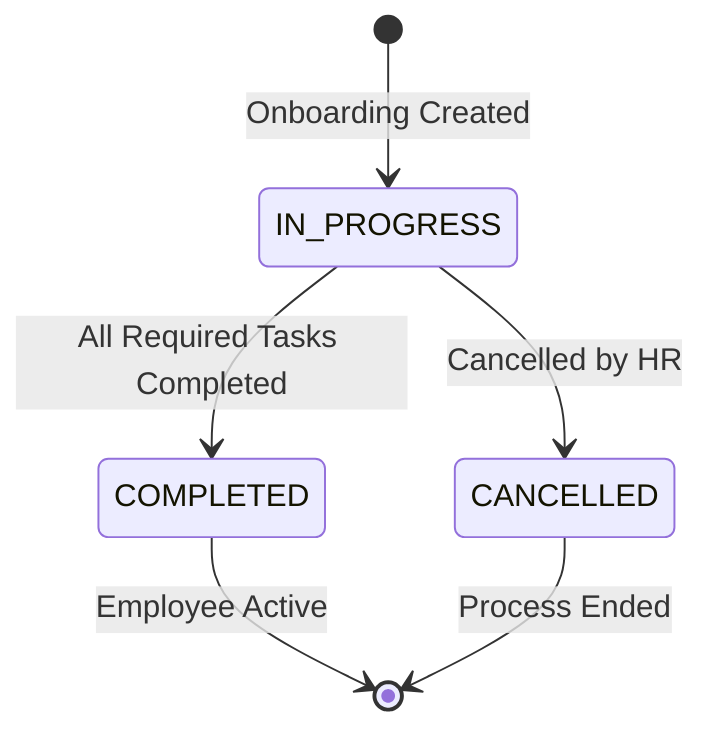
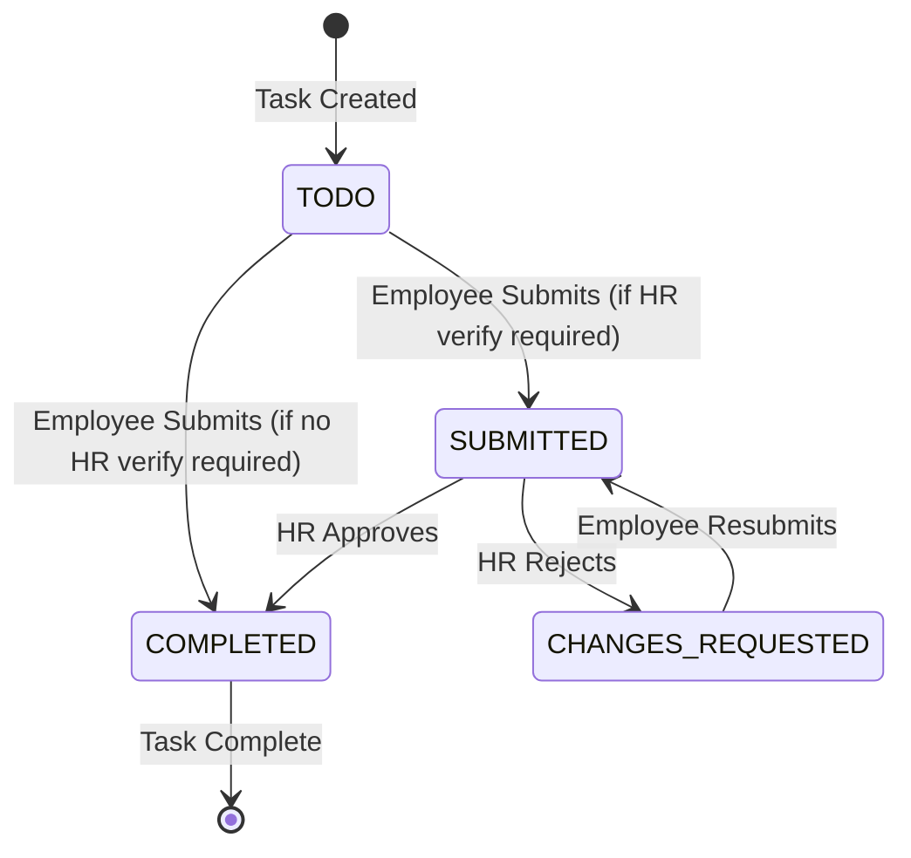
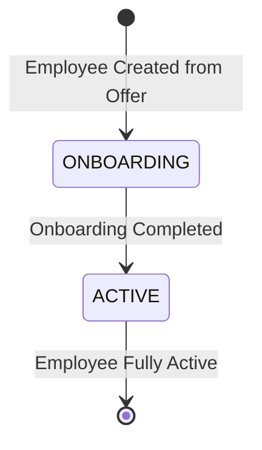

# BLIH Onboarding Flow: Offer Acceptance to Full Onboarding

## Table of Contents

1. [Overview](#overview)
2. [System Architecture](#system-architecture)
3. [Database Models](#database-models)
4. [Onboarding Workflow](#onboarding-workflow)
5. [API Endpoints](#api-endpoints)
6. [Business Logic](#business-logic)
7. [State Transitions](#state-transitions)
8. [RBAC Permissions](#rbac-permissions)
9. [Integration Points](#integration-points)
10. [Error Handling](#error-handling)

---

## Overview

The BLIH Onboarding System implements a comprehensive employee onboarding workflow from offer acceptance through to full onboarding completion. This documentation covers the complete onboarding lifecycle where accepted offers trigger employee creation, onboarding initialization, checklist generation, task submission, HR verification, and final transition to active employee status.

**Workflow**: OFFER ACCEPTED → Hire Applicant → Employee Created (ONBOARDING) → Onboarding Initiated → Checklist Generated → Employee Submits Tasks → HR Verifies → Onboarding Completed → Employee Status (ACTIVE)

### Key Features

- **Automated onboarding initiation** triggered by offer acceptance
- **Task library system** with customizable onboarding tasks
- **Task instance snapshots** preserving historical records
- **Multi-type task support** (system-integrated and custom tasks)
- **Employee submission workflow** for profile, address, bank, emergency contact, education, contract, and policy tasks
- **HR verification workflow** with approval/rejection capability
- **Automatic onboarding evaluation** triggering employee status transitions
- **Progress tracking** with due date management
- **Required vs optional task** distinction
- **HR verification requirement** configuration

### System Scope

**In Scope**:

- Onboarding record management (CRUD)
- Task library management (OnboardingTask)
- Task instance creation from library
- Checklist status tracking
- Employee task submission (7 task types)
- HR verification workflow
- Onboarding completion evaluation
- Employee status transition (ONBOARDING → ACTIVE)

**Out of Scope**:

- Asset provisioning (equipment, access cards)
- IT system access provisioning
- Manager assignment and notifications
- Onboarding templates by role/department
- Document management integration
- Training course enrollment
- Probation period management (separate system)

---

## System Architecture

### Module Structure

```
apps/api/src/domains/hr/
├── onboarding/
│   ├── onboarding.controller.ts          # Onboarding CRUD endpoints
│   ├── onboarding.dto.ts                 # Onboarding DTOs
│   ├── create-onboarding.usecase.ts      # Create onboarding record
│   ├── update-onboarding.usecase.ts      # Update onboarding record
│   ├── delete-onboarding.usecase.ts      # Delete onboarding record
│   ├── cancel-onboarding.usecase.ts       # Cancel onboarding
│   ├── query-onboarding.usecase.ts       # Query onboarding records
│   ├── onboarding.module.ts              # Onboarding module
│   ├── onboarding.docs.ts                # Swagger documentation
│   ├── onboarding-tasks/
│   │   ├── onboarding-tasks.controller.ts    # Task library CRUD
│   │   ├── onboarding-tasks.dto.ts           # Task library DTOs
│   │   ├── create-onboarding-tasks.usecase.ts
│   │   ├── update-onboarding-tasks.usecase.ts
│   │   ├── delete-onboarding-tasks.usecase.ts
│   │   ├── query-onboarding-tasks.usecase.ts
│   │   ├── onboarding-tasks.module.ts
│   │   └── onboarding-tasks.docs.ts
│   └── onboarding-checklist/
│       ├── onboarding-checklist.controller.ts  # Checklist status updates
│       ├── onboarding-checklist.dto.ts         # Checklist DTOs
│       ├── update-checklist-status.usecase.ts   # Update checklist status
│       ├── onboarding-checklist.module.ts
│       ├── onboarding-checklist.docs.ts
│       ├── execution.controller.ts             # Task submit/verify endpoints
│       ├── execution.dto.ts                    # Submit DTOs for each task type
│       ├── evaluate-onboarding.usecase.ts      # Evaluate completion
│       ├── submit/                              # Employee submission use cases
│       │   ├── submit-profile.usecase.ts
│       │   ├── submit-address.usecase.ts
│       │   ├── submit-bank-detail.usecase.ts
│       │   ├── submit-emergency-contact.usecase.ts
│       │   ├── submit-education.usecase.ts
│       │   ├── submit-contract.usecase.ts
│       │   ├── submit-policy.usecase.ts
│       │   └── submit-custom-task.usecase.ts
│       └── verify/                              # HR verification use cases
│           ├── verify-payload.dto.ts
│           ├── verify-profile.usecase.ts
│           ├── verify-address.usecase.ts
│           ├── verify-bank-detail.usecase.ts
│           ├── verify-emergency-contact.usecase.ts
│           ├── verify-education.usecase.ts
│           ├── verify-contract.usecase.ts
│           ├── verify-policy.usecase.ts
│           └── verify-custom-task.usecase.ts
└── recruitment/
    └── recruitment-transition.service.ts        # Hiring → Onboarding transition
```

### Technology Stack

- **Backend**: NestJS with TypeScript
- **Database**: PostgreSQL with Prisma ORM
- **Authentication**: Keycloak
- **Authorization**: RBAC (Role-Based Access Control)
- **API Documentation**: Swagger/OpenAPI
- **Validation**: class-validator
- **Transaction Management**: Prisma transactions

---

## Database Models

### Onboarding

Stores the onboarding record for an employee.

```prisma
model Onboarding {
  id          String                @id @default(uuid()) @db.Uuid
  employeeId  String                @unique @map("employee_id") @db.Uuid
  status      OnboardingStatus      @default(IN_PROGRESS)
  startedAt   DateTime?             @map("started_at")
  completedAt DateTime?             @map("completed_at")
  createdAt   DateTime              @default(now())
  updatedAt   DateTime              @updatedAt
  checklists  OnboardingChecklist[]
  employee    Employee              @relation(fields: [employeeId], references: [id], onDelete: Cascade)
  offer       Offer?                @relation("OnboardingOffer")

  @@index([employeeId])
  @@index([status])
}
```

**Key Fields**:

- `status`: IN_PROGRESS, COMPLETED, CANCELLED
- `employeeId`: Unique constraint ensures one onboarding per employee
- `startedAt`: Set when first task is submitted
- `completedAt`: Set when all required tasks are completed
- `offer`: Optional link to accepted offer

**Unique Constraint**: `employeeId` prevents duplicate onboarding records

### OnboardingChecklist

Tracks individual task completion status within an onboarding.

```prisma
model OnboardingChecklist {
  id             String                    @id @default(uuid()) @db.Uuid
  onboardingId   String                    @map("onboarding_id") @db.Uuid
  taskInstanceId String                    @map("task_instance_id") @db.Uuid
  status         OnboardingChecklistStatus @default(TODO)
  dueDate        DateTime?                 @map("due_date")
  isRequired     Boolean                   @default(true)
  verifiedAt     DateTime?                 @map("verified_at")
  verifiedBy     String?                   @map("verified_by") @db.Uuid
  rejectionReason String?                   @map("rejection_reason") @db.Text
  createdAt      DateTime                  @default(now())
  updatedAt      DateTime                  @updatedAt
  onboarding     Onboarding                @relation(fields: [onboardingId], references: [id], onDelete: Cascade)
  taskInstance   OnboardingTaskInstance     @relation(fields: [taskInstanceId], references: [id], onDelete: Cascade)

  @@unique([onboardingId, taskInstanceId])
  @@index([onboardingId])
  @@index([status])
}
```

**Key Fields**:

- `status`: TODO, SUBMITTED, CHANGES_REQUESTED, COMPLETED
- `dueDate`: Optional deadline for task completion
- `isRequired`: Whether task must be completed for onboarding to finish
- `verifiedAt`: Timestamp when HR verified the task
- `verifiedBy`: HR user ID who verified
- `rejectionReason`: Feedback when HR rejects a submission

**Unique Constraint**: `onboardingId + taskInstanceId` prevents duplicate tasks

### OnboardingTask

Global task library defining available onboarding tasks.

```prisma
model OnboardingTask {
  id                     String           @id @default(uuid()) @db.Uuid
  title                  String
  description            String?          @db.Text
  taskType               TaskType
  targetDataModel        TargetDataModel?
  requiresHrVerification Boolean          @default(false)
  createdAt              DateTime         @default(now())
  updatedAt              DateTime         @updatedAt
}
```

**Key Fields**:

- `taskType`: NON_CUSTOM (system-integrated), CUSTOM (ad-hoc human tasks)
- `targetDataModel`: For NON_CUSTOM tasks, specifies which data model to render
  - USER_PROFILE
  - EMPLOYEE_ADDRESS
  - EMPLOYEE_BANK_DETAIL
  - EMPLOYEE_EMERGENCY_CONTACT
  - EMPLOYEE_EDUCATION
  - EMPLOYEE_CONTRACT
  - EMPLOYEE_POLICY_ACKNOWLEDGEMENT
- `requiresHrVerification`: Whether HR must verify before marking complete

### OnboardingTaskInstance

Snapshot of a task cloned from the library when onboarding starts.

```prisma
model OnboardingTaskInstance {
  id                     String                @id @default(uuid()) @db.Uuid
  title                  String
  description            String?               @db.Text
  taskType               TaskType
  targetDataModel        TargetDataModel?
  requiresHrVerification Boolean               @default(false)
  checklist              OnboardingChecklist[]
  createdAt              DateTime              @default(now())
  updatedAt              DateTime              @updatedAt
}
```

**Purpose**: Preserves historical records even if HR edits the original OnboardingTask later

### Enums

**OnboardingStatus**:

- IN_PROGRESS
- COMPLETED
- CANCELLED

**OnboardingChecklistStatus**:

- TODO (initial state)
- SUBMITTED (employee completed, waiting for HR verification if required)
- CHANGES_REQUESTED (HR rejected, sent back to employee)
- COMPLETED (fully done and verified if required)

**TaskType**:

- NON_CUSTOM (system-integrated tasks with typed forms)
- CUSTOM (ad-hoc human tasks like "Meet your manager")

**TargetDataModel** (for NON_CUSTOM tasks):

- USER_PROFILE
- EMPLOYEE_ADDRESS
- EMPLOYEE_BANK_DETAIL
- EMPLOYEE_EMERGENCY_CONTACT
- EMPLOYEE_EDUCATION
- EMPLOYEE_CONTRACT
- EMPLOYEE_POLICY_ACKNOWLEDGEMENT

---

## Detailed Task Descriptions

### 1. Profile Task (USER_PROFILE)

**Purpose**: Collects personal information including contact details, date of birth, gender, marital status, and nationality.

**Required Fields**:

- `phone`: Primary phone number (validated format)
- `dateOfBirth`: Date of birth (ISO 8601)
- `gender`: MALE, FEMALE, OTHER, PREFER_NOT_TO_SAY
- `maritalStatus`: SINGLE, MARRIED, DIVORCED, WIDOWED

**Optional Fields**:

- `additionalEmail`, `additionalPhone`: Secondary contact info
- `nationalityId`: Reference to country
- `avatarUrl`, `passportSizePhotoURL`: Photo URLs
- `faydaNumber`, `governmentIdCard`: Ethiopian ID details

**Validation Rules**:

- Phone must match international format (+251...)
- Date of birth must be ≥18 years ago
- Email addresses must be valid format

**Data Model**: `UserProfile` linked to Employee
**Status Flow**: PENDING_REVIEW → VERIFIED/REJECTED
**HR Verification Required**: Yes (configurable)

---

### 2. Address Task (EMPLOYEE_ADDRESS)

**Purpose**: Collects residential address for payroll, tax, and emergency communications.

**Required Fields**:

- `countryId`: Reference to country (UUID)
- `city`: City name
- `region`: State/region (optional)

**Optional Fields**:

- `subCity`, `woreda`, `kebele`: Ethiopia-specific fields
- `street`, `houseNumber`, `postalCode`

**Validation Rules**:

- Country must exist in CountryReference table
- City is required and cannot be empty

**Data Model**: `EmployeeAddress` linked to Employee
**Status Flow**: PENDING_REVIEW → VERIFIED/REJECTED
**HR Verification Required**: Yes (configurable)

---

### 3. Bank Detail Task (EMPLOYEE_BANK_DETAIL)

**Purpose**: Collects banking information for salary deposits and payroll processing.

**Required Fields**:

- `bankName`: Bank name (e.g., "Commercial Bank of Ethiopia")
- `accountName`: Name on account (e.g., "SAVING")
- `accountNumber`: Bank account number

**Optional Fields**:

- `branchName`, `swiftCode`

**Validation Rules**:

- Account number must be valid format
- Bank name must be from approved partner banks
- At least one account marked as primary

**Data Model**: `EmployeeBankDetail` (wrapper) + `BankAccount` (children)
**Status Flow**: PENDING_REVIEW → VERIFIED/REJECTED
**HR Verification Required**: Yes (typically required for payroll)

**Special Logic**: First account auto-marked as primary; multiple accounts allowed

---

### 4. Emergency Contact Task (EMPLOYEE_EMERGENCY_CONTACT)

**Purpose**: Collects emergency contact information for workplace emergencies.

**Required Fields**:

- `name`: Full name of contact
- `relationship`: Relationship to employee
- `phone`: Primary phone number

**Optional Fields**:

- `email`, `address` (with city, country, etc.)

**Validation Rules**:

- Phone must be valid format
- Relationship cannot be empty
- At least one contact must be `isFirstToCall = true`

**Data Model**: `EmployeeEmergencyContact` (wrapper) + `EmergencyContact` (children)
**Status Flow**: PENDING_REVIEW → VERIFIED/REJECTED
**HR Verification Required**: Yes (configurable)

**Special Logic**: Multiple contacts allowed; one designated as first to call

---

### 5. Education Task (EMPLOYEE_EDUCATION)

**Purpose**: Collects educational background for HR records and qualification verification.

**Required Fields**:

- `institution`: Educational institution name
- `degree`: Degree obtained (BSc, MSc, Diploma)
- `fieldOfStudy`: Field/major of study
- `startDate`: Start date

**Optional Fields**:

- `endDate`, `grade`, `description`, `documentUrl`, `level`

**Validation Rules**:

- Institution and degree cannot be empty
- Start date must be before end date
- If endDate in past, `isCompleted` auto-set to true

**Data Model**: `EmployeeEducation` (wrapper) + `Education` (children)
**Status Flow**: PENDING_REVIEW → VERIFIED/REJECTED
**HR Verification Required**: Yes (configurable)

**Special Logic**: Multiple education records preserved; most recent updated

---

### 6. Contract Task (EMPLOYEE_CONTRACT)

**Purpose**: Links employee to employment contract and captures signed contract.

**Required Fields**:

- `contractId`: Reference to Contract record (UUID)
- `signedFileUrl`: URL to signed contract PDF

**Validation Rules**:

- Contract must exist and be in appropriate status
- Signed file URL must be accessible PDF
- File size must be < 10MB

**Data Model**: `EmployeeContract` (wrapper) + `Contract` (linked)
**Status Flow**: PENDING_REVIEW → VERIFIED/REJECTED
**HR Verification Required**: Yes (typically required)

**Special Logic**: Contract generated by HR/Finance; employee signs and uploads

---

### 7. Policy Task (EMPLOYEE_POLICY_ACKNOWLEDGEMENT)

**Purpose**: Records employee acknowledgements of company policies for compliance.

**Required Fields**:

- `acknowledgements`: Array of `{policyId, policyVersionId}`

**Validation Rules**:

- Policy must exist and be active
- Policy version must be current/latest
- All required policies must be acknowledged

**Data Model**: `EmployeePolicyAcknowledgement` (wrapper) + `PolicyAcknowledgement` (children)
**Status Flow**: No status flow (binary acknowledgement)
**HR Verification Required**: Yes (typically required for compliance)

**Typical Required Policies**: Employee Handbook, Code of Conduct, Data Privacy, IT Security, Health & Safety, Anti-Harassment

**Special Logic**: Timestamp auto-recorded; acknowledgements immutable

---

### 8. Custom Task (CUSTOM)

**Purpose**: Ad-hoc onboarding tasks that don't fit system-integrated categories.

**Required Fields**: None

**Optional Fields**:

- `notes`: Employee comments
- `evidenceUrl`: URL to completion evidence

**Data Model**: No data model (only checklist status)
**Status Flow**: TODO → SUBMITTED → COMPLETED
**HR Verification Required**: Configurable per task

**Examples**: "Meet your manager", "Complete IT security training", "Get laptop", "Attend orientation"

---

## Onboarding Workflow

### Phase 0: Offer Acceptance to Hiring Handoff

**Trigger**: Candidate accepts offer (via Offer Management API)

**Process**:

1. **Offer Response** (handled by Offer Management):
   - Candidate accepts offer via `POST /api/v1/hr/recruitment/offers/:id/respond`
   - Offer status transitions: SENT → ACCEPTED
   - `respondedAt` timestamp set

2. **Hire Applicant** (handled by RecruitmentTransitionService):
   - HR calls `POST /api/v1/hr/recruitment/applicants/:id/hire`
   - Validates applicant has accepted offer
   - Generates unique username
   - Creates Keycloak user account
   - Creates local User record
   - Creates Employee record with status ONBOARDING
   - Creates Employment record
   - Creates Compensation record
   - Links applicant to employee
   - Transitions applicant status to HIRED
   - Sends welcome notification

**API Endpoint**:

```http
POST /api/v1/hr/recruitment/applicants/{id}/hire
```

**Request Example**:

```json
{
  "companyEmail": "abel.tesfaye@blih.com",
  "companyPhone": "+251911234567",
  "isCompanyEmailPrimary": true,
  "isCompanyPhonePrimary": true,
  "managerId": "manager-uuid"
}
```

**Response**:

```json
{
  "employeeId": "employee-uuid",
  "userId": "user-uuid",
  "username": "abel.tesfaye",
  "keycloakId": "keycloak-uuid",
  "employeeStatus": "ONBOARDING",
  "employmentId": "employment-uuid"
}
```

### Phase 1: Onboarding Initialization

**Trigger**: HR initiates onboarding for new employee

**Process**:

1. **Create Onboarding Record**:
   - HR calls `POST /api/v1/hr/onboarding`
   - Validates employee exists and has ONBOARDING status
   - Creates Onboarding record with status IN_PROGRESS
   - Optionally selects tasks from library

2. **Generate Checklist**:
   - If tasks provided in request:
     - Validates tasks exist in library
     - Creates OnboardingTaskInstance snapshots for each task
     - Creates OnboardingChecklist items linking to instances
     - Sets initial status to TODO
     - Configures due dates and required flags

**API Endpoint**:

```http
POST /api/v1/hr/onboarding
```

**Request Example**:

```json
{
  "employeeId": "employee-uuid",
  "status": "IN_PROGRESS",
  "startedAt": "2026-03-11T08:00:00.000Z",
  "tasks": [
    {
      "taskId": "task-uuid-1",
      "dueDate": "2026-03-15T10:00:00.000Z",
      "isRequired": true
    },
    {
      "taskId": "task-uuid-2",
      "dueDate": "2026-03-16T10:00:00.000Z",
      "isRequired": true
    }
  ]
}
```

**Response**:

```json
{
  "id": "onboarding-uuid",
  "employeeId": "employee-uuid",
  "status": "IN_PROGRESS",
  "startedAt": "2026-03-11T08:00:00.000Z",
  "completedAt": null,
  "createdAt": "2026-03-11T08:00:00.000Z",
  "updatedAt": "2026-03-11T08:00:00.000Z",
  "checklists": [
    {
      "id": "checklist-uuid-1",
      "taskInstanceId": "task-instance-uuid-1",
      "onboardingId": "onboarding-uuid",
      "status": "TODO",
      "dueDate": "2026-03-15T10:00:00.000Z",
      "createdAt": "2026-03-11T08:00:00.000Z",
      "updatedAt": "2026-03-11T08:00:00.000Z"
    }
  ]
}
```

### Phase 2: Employee Task Submission

**Trigger**: Employee completes onboarding tasks

**Process**:

For each task type, employee submits data via dedicated endpoint. Each submission follows a detailed workflow:

#### 1. Profile Task Submission Workflow

**Endpoint**: `POST /api/v1/hr/onboarding/tasks/{taskInstanceId}/profile`

**Step-by-Step Process**:

1. **Request Validation**:
   - System validates task instance exists in checklist
   - Verifies task type matches USER_PROFILE
   - Validates employee is associated with the checklist
   - Validates request body fields against DTO rules

2. **Data Processing**:
   - System ensures Employee record exists for the user
   - Creates or updates UserProfile record with submitted data
   - Sets UserProfile status to PENDING_REVIEW
   - Clears any previous hrFeedback from previous rejections

3. **Checklist Status Update**:
   - If task requires HR verification: checklist status → SUBMITTED
   - If task does NOT require HR verification: checklist status → COMPLETED
   - Sets updatedAt timestamp

4. **Onboarding Evaluation**:
   - Invokes EvaluateOnboardingUseCase
   - If first submission: sets onboarding.startedAt
   - Evaluates if all required tasks are completed
   - If all completed: transitions onboarding to COMPLETED

5. **Response**:
   - Returns success confirmation
   - No data returned (employee can query checklist separately)

**Transaction Scope**: All operations within a single database transaction

---

#### 2. Address Task Submission Workflow

**Endpoint**: `POST /api/v1/hr/onboarding/tasks/{taskInstanceId}/address`

**Step-by-Step Process**:

1. **Request Validation**:
   - Validates task instance exists and is USER_PROFILE type
   - Validates employee association
   - Validates countryId references existing country
   - Validates required fields (countryId, city)

2. **Data Processing**:
   - Ensures Employee record exists
   - Upserts EmployeeAddress wrapper record
   - Creates or updates Address child record with submitted data
   - Sets EmployeeAddress status to PENDING_REVIEW
   - Handles Ethiopia-specific fields (woreda, kebele) validation

3. **Checklist Status Update**:
   - Determines next status based on requiresHrVerification flag
   - Updates checklist status and timestamps

4. **Onboarding Evaluation**:
   - Triggers evaluation of overall onboarding progress
   - May transition onboarding to COMPLETED if all required tasks done

---

#### 3. Bank Detail Task Submission Workflow

**Endpoint**: `POST /api/v1/hr/onboarding/tasks/{taskInstanceId}/bank-detail`

**Step-by-Step Process**:

1. **Request Validation**:
   - Validates task instance is EMPLOYEE_BANK_DETAIL type
   - Validates bank name against approved partner banks list
   - Validates account number format
   - Validates at least one account is marked as primary

2. **Data Processing**:
   - Ensures Employee record exists
   - Upserts EmployeeBankDetail wrapper record
   - Creates or updates BankAccount child record(s)
   - If first account: auto-marks as primary
   - If multiple accounts: ensures only one is primary
   - Sets EmployeeBankDetail status to PENDING_REVIEW

3. **Checklist Status Update**:
   - Updates checklist status based on verification requirement
   - Records submission timestamp

4. **Onboarding Evaluation**:
   - Evaluates overall onboarding completion status

**Special Logic**: Supports multiple bank accounts with primary designation

---

#### 4. Emergency Contact Task Submission Workflow

**Endpoint**: `POST /api/v1/hr/onboarding/tasks/{taskInstanceId}/emergency-contact`

**Step-by-Step Process**:

1. **Request Validation**:
   - Validates task instance is EMPLOYEE_EMERGENCY_CONTACT type
   - Validates required fields (name, relationship, phone)
   - Validates phone number format
   - Validates at least one contact is marked isFirstToCall

2. **Data Processing**:
   - Ensures Employee record exists
   - Upserts EmployeeEmergencyContact wrapper record
   - Creates or updates EmergencyContact child record(s)
   - Handles nested address fields if provided
   - Sets EmployeeEmergencyContact status to PENDING_REVIEW

3. **Checklist Status Update**:
   - Updates checklist status based on verification requirement

4. **Onboarding Evaluation**:
   - Triggers completion evaluation

**Special Logic**: Supports multiple emergency contacts with priority ordering

---

#### 5. Education Task Submission Workflow

**Endpoint**: `POST /api/v1/hr/onboarding/tasks/{taskInstanceId}/education`

**Step-by-Step Process**:

1. **Request Validation**:
   - Validates task instance is EMPLOYEE_EDUCATION type
   - Validates required fields (institution, degree, fieldOfStudy, startDate)
   - Validates startDate is before endDate (if provided)
   - Validates documentUrl accessibility if provided

2. **Data Processing**:
   - Ensures Employee record exists
   - Upserts EmployeeEducation wrapper record
   - Creates or updates Education child record
   - If endDate in past: auto-sets isCompleted to true
   - Sets EmployeeEducation status to PENDING_REVIEW
   - Handles document upload integration

3. **Checklist Status Update**:
   - Updates checklist status based on verification requirement

4. **Onboarding Evaluation**:
   - Evaluates overall completion status

**Special Logic**: Preserves education history; most recent record updated

---

#### 6. Contract Task Submission Workflow

**Endpoint**: `POST /api/v1/hr/onboarding/tasks/{taskInstanceId}/contract`

**Step-by-Step Process**:

1. **Request Validation**:
   - Validates task instance is EMPLOYEE_CONTRACT type
   - Validates contractId references existing Contract record
   - Validates Contract is in appropriate status (GENERATED, READY_FOR_SIGNATURE)
   - Validates signedFileUrl is accessible
   - Validates file is PDF format
   - Validates file size < 10MB

2. **Data Processing**:
   - Ensures Employee record exists
   - Upserts EmployeeContract wrapper record
   - Links Contract record via employeeContractId
   - Updates Contract.signedFileUrl with submitted URL
   - Sets EmployeeContract status to PENDING_REVIEW

3. **Checklist Status Update**:
   - Updates checklist status based on verification requirement

4. **Onboarding Evaluation**:
   - Evaluates overall completion status

**Special Logic**: Contract must be pre-generated by HR/Finance system

---

#### 7. Policy Task Submission Workflow

**Endpoint**: `POST /api/v1/hr/onboarding/tasks/{taskInstanceId}/policy`

**Step-by-Step Process**:

1. **Request Validation**:
   - Validates task instance is EMPLOYEE_POLICY_ACKNOWLEDGEMENT type
   - Validates each policyId references existing Policy
   - Validates each policyVersionId references current/latest version
   - Validates all required policies are included in acknowledgements array

2. **Data Processing**:
   - Ensures Employee record exists
   - Upserts EmployeePolicyAcknowledgement wrapper record
   - For each acknowledgement:
     - Creates or updates PolicyAcknowledgement record
     - Sets acknowledgedAt to current timestamp
     - Links to policy and policy version
   - No status field (acknowledgement is binary)

3. **Checklist Status Update**:
   - Updates checklist status based on verification requirement
   - Typically requires HR verification for compliance

4. **Onboarding Evaluation**:
   - Evaluates overall completion status

**Special Logic**: Acknowledgements are immutable once recorded

---

#### 8. Custom Task Submission Workflow

**Endpoint**: `POST /api/v1/hr/onboarding/tasks/{taskInstanceId}/done`

**Step-by-Step Process**:

1. **Request Validation**:
   - Validates task instance is CUSTOM type
   - Validates task requires no data model (custom tasks are free-form)
   - Validates optional notes and evidenceUrl if provided

2. **Data Processing**:
   - No data model updates (custom tasks don't map to database tables)
   - Stores notes in checklist if provided
   - Stores evidenceUrl in checklist if provided

3. **Checklist Status Update**:
   - If task requires HR verification: checklist status → SUBMITTED
   - If task does NOT require HR verification: checklist status → COMPLETED
   - Records submission timestamp

4. **Onboarding Evaluation**:
   - Evaluates overall completion status

**Special Logic**: No database model updates; only checklist status tracking

---

#### After Each Submission - Common Workflow

**EvaluateOnboardingUseCase Execution**:

1. **Fetch Onboarding State**:
   - Retrieves onboarding record with all checklists
   - Includes checklist status and isRequired flags

2. **Determine Progress**:
   - Counts required checklists (isRequired = true)
   - Counts completed required checklists (status = COMPLETED)
   - Checks if any activity has occurred (SUBMITTED, CHANGES_REQUESTED, COMPLETED)

3. **Status Transition Logic**:
   - **First Activity**: If startedAt is null, set startedAt to now, status = IN_PROGRESS
   - **Completion**: If all required completed, set status = COMPLETED, set completedAt
   - **Reversion**: If previously COMPLETED but no longer complete, revert to IN_PROGRESS

4. **Employee Status Upgrade**:
   - If newly completed and employee status is ONBOARDING:
     - Update UserLifecycle.status to ACTIVE
     - Set onboardedAt timestamp
     - Log transition

5. **Audit Logging**:
   - Logs all state transitions
   - Records timestamps for audit trail

**Transaction Scope**: All operations within a single database transaction for data integrity

**Example: Profile Submission**:

```http
POST /api/v1/hr/onboarding/tasks/{taskInstanceId}/profile
```

**Request Example**:

```json
{
  "phone": "+251912345678",
  "dateOfBirth": "1995-06-15",
  "gender": "MALE",
  "maritalStatus": "SINGLE"
}
```

**Response**:

```json
{
  "success": true
}
```

### Phase 3: HR Verification

**Trigger**: HR reviews submitted tasks requiring verification

**Process**:

For each task type requiring HR verification, HR performs detailed verification workflow:

#### 1. Profile Task Verification Workflow

**Endpoint**: `POST /api/v1/hr/onboarding/tasks/{taskInstanceId}/profile/verify`

**Step-by-Step Process**:

1. **Request Validation**:
   - Validates task instance exists in checklist
   - Verifies task type matches USER_PROFILE
   - Validates checklist is in SUBMITTED status (cannot verify TODO or COMPLETED)
   - Validates HR user has `onboarding:verify` permission
   - Validates request body contains `approved` boolean field

2. **Data Review** (HR Manual Step):
   - HR reviews submitted profile data
   - Validates phone number format and reachability
   - Validates date of birth meets employment age requirements (≥18)
   - Validates gender and marital status are appropriate
   - Checks for completeness and accuracy
   - Reviews any uploaded photos (avatar, passport photo)

3. **Approval Decision**:
   - **If Approved**:
     - Updates UserProfile status to VERIFIED
     - Clears any previous hrFeedback
     - Updates OnboardingChecklist status to COMPLETED
     - Sets verifiedAt to current timestamp
     - Sets verifiedBy to HR user ID
     - Clears rejectionReason
   - **If Rejected**:
     - Updates UserProfile status to REJECTED
     - Sets hrFeedback with specific rejection reason
     - Updates OnboardingChecklist status to CHANGES_REQUESTED
     - Sets rejectionReason with feedback
     - Does NOT set verifiedAt or verifiedBy

4. **Onboarding Evaluation**:
   - Invokes EvaluateOnboardingUseCase
   - If approval completes last required task: transitions onboarding to COMPLETED
   - If rejection occurs after onboarding was COMPLETED: reverts to IN_PROGRESS

5. **Response**:
   - Returns success confirmation
   - Employee notified via notification system (if configured)

**Transaction Scope**: All operations within a single database transaction

---

#### 2. Address Task Verification Workflow

**Endpoint**: `POST /api/v1/hr/onboarding/tasks/{taskInstanceId}/address/verify`

**Step-by-Step Process**:

1. **Request Validation**:
   - Validates task instance is EMPLOYEE_ADDRESS type
   - Validates checklist is in SUBMITTED status
   - Validates HR has verification permission

2. **Data Review** (HR Manual Step):
   - HR reviews address data for completeness
   - Validates country and city exist
   - For Ethiopia addresses: validates woreda/kebele accuracy
   - Checks if address is within reasonable commuting distance
   - May cross-reference with government records if needed

3. **Approval Decision**:
   - **If Approved**:
     - Updates EmployeeAddress status to VERIFIED
     - Updates checklist status to COMPLETED
     - Records verifiedAt and verifiedBy
   - **If Rejected**:
     - Updates EmployeeAddress status to REJECTED
     - Sets hrFeedback with specific issues
     - Updates checklist status to CHANGES_REQUESTED
     - Records rejectionReason

4. **Onboarding Evaluation**:
   - Triggers re-evaluation of onboarding completion status

---

#### 3. Bank Detail Task Verification Workflow

**Endpoint**: `POST /api/v1/hr/onboarding/tasks/{taskInstanceId}/bank-detail/verify`

**Step-by-Step Process**:

1. **Request Validation**:
   - Validates task instance is EMPLOYEE_BANK_DETAIL type
   - Validates checklist is in SUBMITTED status

2. **Data Review** (HR Manual Step):
   - HR validates bank is approved partner bank
   - Verifies account number format matches bank requirements
   - May contact bank to verify account existence (for payroll)
   - Validates account name matches employee name
   - Confirms branch is valid for the bank

3. **Approval Decision**:
   - **If Approved**:
     - Updates EmployeeBankDetail status to VERIFIED
     - Updates checklist status to COMPLETED
     - Records verification metadata
   - **If Rejected**:
     - Updates EmployeeBankDetail status to REJECTED
     - Provides specific feedback on what needs correction
     - Updates checklist status to CHANGES_REQUESTED

4. **Onboarding Evaluation**:
   - Evaluates overall onboarding status

**Critical Note**: Bank verification is critical for payroll; rejection typically requires employee to provide correct banking details before payroll can be processed

---

#### 4. Emergency Contact Task Verification Workflow

**Endpoint**: `POST /api/v1/hr/onboarding/tasks/{taskInstanceId}/emergency-contact/verify`

**Step-by-Step Process**:

1. **Request Validation**:
   - Validates task instance is EMPLOYEE_EMERGENCY_CONTACT type
   - Validates checklist is in SUBMITTED status

2. **Data Review** (HR Manual Step):
   - HR validates contact name and relationship
   - Verifies phone number is reachable
   - May attempt to contact emergency contact to confirm
   - Validates address if provided
   - Ensures at least one contact is designated as first to call

3. **Approval Decision**:
   - **If Approved**:
     - Updates EmployeeEmergencyContact status to VERIFIED
     - Updates checklist status to COMPLETED
     - Records verification metadata
   - **If Rejected**:
     - Updates EmployeeEmergencyContact status to REJECTED
     - Provides feedback on what needs correction
     - Updates checklist status to CHANGES_REQUESTED

4. **Onboarding Evaluation**:
   - Evaluates overall onboarding status

**Safety Note**: Emergency contacts are critical for workplace safety; HR may require at least 2 verified emergency contacts

---

#### 5. Education Task Verification Workflow

**Endpoint**: `POST /api/v1/hr/onboarding/tasks/{taskInstanceId}/education/verify`

**Step-by-Step Process**:

1. **Request Validation**:
   - Validates task instance is EMPLOYEE_EDUCATION type
   - Validates checklist is in SUBMITTED status

2. **Data Review** (HR Manual Step):
   - HR reviews institution name and accreditation
   - Validates degree and field of study
   - Reviews uploaded documents (transcripts, certificates)
   - May cross-reference with external verification services
   - Validates dates are reasonable (no future dates)

3. **Approval Decision**:
   - **If Approved**:
     - Updates EmployeeEducation status to VERIFIED
     - Updates checklist status to COMPLETED
     - Records verification metadata
   - **If Rejected**:
     - Updates EmployeeEducation status to REJECTED
     - Requests additional documentation if needed
     - Updates checklist status to CHANGES_REQUESTED

4. **Onboarding Evaluation**:
   - Evaluates overall onboarding status

**Compliance Note**: Education verification may be required for certain roles or compliance regulations

---

#### 6. Contract Task Verification Workflow

**Endpoint**: `POST /api/v1/hr/onboarding/tasks/{taskInstanceId}/contract/verify`

**Step-by-Step Process**:

1. **Request Validation**:
   - Validates task instance is EMPLOYEE_CONTRACT type
   - Validates checklist is in SUBMITTED status

2. **Data Review** (HR Manual Step):
   - HR reviews signed contract document
   - Verifies signature authenticity
   - Confirms contract terms match employment offer
   - Validates contract is properly signed and dated
   - May involve legal team for review

3. **Approval Decision**:
   - **If Approved**:
     - Updates EmployeeContract status to VERIFIED
     - Updates checklist status to COMPLETED
     - Records verification metadata
     - Triggers contract filing with legal/compliance
   - **If Rejected**:
     - Updates EmployeeContract status to REJECTED
     - Specifies what needs correction (signature, terms, etc.)
     - Updates checklist status to CHANGES_REQUESTED
     - May require new contract generation

4. **Onboarding Evaluation**:
   - Evaluates overall onboarding status

**Legal Note**: Contract verification is critical for legal compliance; may involve multiple stakeholders (HR, Legal, Finance)

---

#### 7. Policy Task Verification Workflow

**Endpoint**: `POST /api/v1/hr/onboarding/tasks/{taskInstanceId}/policy/verify`

**Step-by-Step Process**:

1. **Request Validation**:
   - Validates task instance is EMPLOYEE_POLICY_ACKNOWLEDGEMENT type
   - Validates checklist is in SUBMITTED status

2. **Data Review** (HR Manual Step):
   - HR verifies all required policies are acknowledged
   - Validates acknowledgements are for current policy versions
   - Checks acknowledgement timestamps are reasonable
   - May verify employee actually read policies (if tracking enabled)
   - Confirms no missing required policies

3. **Approval Decision**:
   - **If Approved**:
     - Updates checklist status to COMPLETED
     - Records verifiedAt and verifiedBy
     - Note: No data model status update (acknowledgements are binary)
   - **If Rejected**:
     - Updates checklist status to CHANGES_REQUESTED
     - Specifies which policies need re-acknowledgement
     - Records rejectionReason

4. **Onboarding Evaluation**:
   - Evaluates overall onboarding status

**Compliance Note**: Policy acknowledgements are critical for compliance; HR typically requires verification before employee can access certain systems

---

#### 8. Custom Task Verification Workflow

**Endpoint**: `POST /api/v1/hr/onboarding/tasks/{taskInstanceId}/done/verify`

**Step-by-Step Process**:

1. **Request Validation**:
   - Validates task instance is CUSTOM type
   - Validates checklist is in SUBMITTED status

2. **Data Review** (HR Manual Step):
   - HR reviews task completion based on task nature
   - Reviews employee notes if provided
   - Reviews evidence (photos, documents) if provided
   - May verify with other stakeholders (IT, Manager, etc.)
   - Confirms task was actually completed

3. **Approval Decision**:
   - **If Approved**:
     - Updates checklist status to COMPLETED
     - Records verifiedAt and verifiedBy
     - Note: No data model updates (custom tasks are free-form)
   - **If Rejected**:
     - Updates checklist status to CHANGES_REQUESTED
     - Provides feedback on what needs to be done
     - Records rejectionReason

4. **Onboarding Evaluation**:
   - Evaluates overall onboarding status

**Flexibility Note**: Custom tasks are highly variable; verification process depends on task nature

---

#### After Each Verification - Common Workflow

**EvaluateOnboardingUseCase Execution**:

1. **Fetch Onboarding State**:
   - Retrieves onboarding record with all checklists
   - Includes current status of each checklist

2. **Re-evaluate Completion**:
   - Counts required checklists (isRequired = true)
   - Counts completed required checklists (status = COMPLETED)
   - Determines if all required tasks are now complete

3. **Status Transition Logic**:
   - **If all required completed**:
     - Set onboarding status to COMPLETED
     - Set completedAt timestamp
     - Trigger employee status upgrade to ACTIVE
   - **If task rejected after completion**:
     - Revert onboarding status to IN_PROGRESS
     - Clear completedAt timestamp
     - Employee remains in ONBOARDING status

4. **Employee Status Consideration**:
   - If onboarding reverts to IN_PROGRESS after being ACTIVE:
     - Employee may need to revert to ONBOARDING (depending on business rules)
     - System logs the reversion for audit trail

5. **Notification**:
   - Employee notified of verification result
   - If approved: task marked complete
   - If rejected: employee notified to resubmit

**Transaction Scope**: All operations within a single database transaction

**Example: Profile Verification**:

```http
POST /api/v1/hr/onboarding/tasks/{taskInstanceId}/profile/verify
```

**Request Example (Approval)**:

```json
{
  "approved": true
}
```

**Request Example (Rejection)**:

```json
{
  "approved": false,
  "hrFeedback": "Phone number format is incorrect. Please provide valid format."
}
```

**Response**:

```json
{
  "success": true
}
```

### Phase 4: Onboarding Completion

**Trigger**: All required checklist items reach COMPLETED status

**Process**:

1. **Evaluation** (handled by EvaluateOnboardingUseCase):
   - Checks all required checklist items
   - Verifies all have status COMPLETED
   - If complete:
     - Sets onboarding status to COMPLETED
     - Sets completedAt timestamp
     - Transitions employee status from ONBOARDING to ACTIVE
   - If incomplete:
     - Keeps onboarding status as IN_PROGRESS
     - Clears completedAt if previously set

2. **Employee Status Transition**:
   - Employee status: ONBOARDING → ACTIVE
   - Employee gains full system access
   - Ready for probation period (separate system)

**Completion Criteria**:

- All checklist items with `isRequired = true` must have status COMPLETED
- Optional tasks (isRequired = false) do not block completion

---

## API Endpoints

### Onboarding Management Endpoints

| Method | Endpoint                            | Description                       | Permissions         |
| ------ | ----------------------------------- | --------------------------------- | ------------------- |
| POST   | `/api/v1/hr/onboarding`             | Create onboarding record          | `onboarding:create` |
| GET    | `/api/v1/hr/onboarding`             | List all onboarding records       | `onboarding:view`   |
| GET    | `/api/v1/hr/onboarding/paginated`   | List paginated onboarding records | `onboarding:view`   |
| GET    | `/api/v1/hr/onboarding/{id}`        | Get onboarding by ID              | `onboarding:view`   |
| PATCH  | `/api/v1/hr/onboarding/{id}`        | Update onboarding record          | `onboarding:update` |
| POST   | `/api/v1/hr/onboarding/{id}/cancel` | Cancel onboarding                 | `onboarding:update` |
| DELETE | `/api/v1/hr/onboarding/{id}`        | Delete onboarding record          | `onboarding:delete` |

### Onboarding Task Library Endpoints

| Method | Endpoint                                | Description                         | Permissions              |
| ------ | --------------------------------------- | ----------------------------------- | ------------------------ |
| POST   | `/api/v1/hr/onboarding/tasks`           | Create task library entry           | `onboarding_task:create` |
| GET    | `/api/v1/hr/onboarding/tasks`           | List all task library entries       | `onboarding_task:view`   |
| GET    | `/api/v1/hr/onboarding/tasks/paginated` | List paginated task library entries | `onboarding_task:view`   |
| GET    | `/api/v1/hr/onboarding/tasks/{id}`      | Get task by ID                      | `onboarding_task:view`   |
| PATCH  | `/api/v1/hr/onboarding/tasks/{id}`      | Update task library entry           | `onboarding_task:update` |
| DELETE | `/api/v1/hr/onboarding/tasks/{id}`      | Delete task library entry           | `onboarding_task:delete` |

### Onboarding Checklist Endpoints

| Method | Endpoint                                       | Description             | Permissions         |
| ------ | ---------------------------------------------- | ----------------------- | ------------------- |
| PATCH  | `/api/v1/hr/onboarding/checklists/{id}/status` | Update checklist status | `onboarding:update` |

### Employee Task Submission Endpoints

| Method | Endpoint                                                 | Description                   | Permissions         |
| ------ | -------------------------------------------------------- | ----------------------------- | ------------------- |
| POST   | `/api/v1/hr/onboarding/tasks/{taskId}/profile`           | Submit profile task           | `onboarding:update` |
| POST   | `/api/v1/hr/onboarding/tasks/{taskId}/address`           | Submit address task           | `onboarding:update` |
| POST   | `/api/v1/hr/onboarding/tasks/{taskId}/bank-detail`       | Submit bank detail task       | `onboarding:update` |
| POST   | `/api/v1/hr/onboarding/tasks/{taskId}/emergency-contact` | Submit emergency contact task | `onboarding:update` |
| POST   | `/api/v1/hr/onboarding/tasks/{taskId}/education`         | Submit education task         | `onboarding:update` |
| POST   | `/api/v1/hr/onboarding/tasks/{taskId}/contract`          | Submit contract task          | `onboarding:update` |
| POST   | `/api/v1/hr/onboarding/tasks/{taskId}/policy`            | Submit policy task            | `onboarding:update` |
| POST   | `/api/v1/hr/onboarding/tasks/{taskId}/done`              | Mark custom task done         | `onboarding:update` |

### HR Verification Endpoints

| Method | Endpoint                                                        | Description                   | Permissions         |
| ------ | --------------------------------------------------------------- | ----------------------------- | ------------------- |
| POST   | `/api/v1/hr/onboarding/tasks/{taskId}/profile/verify`           | Verify profile task           | `onboarding:verify` |
| POST   | `/api/v1/hr/onboarding/tasks/{taskId}/address/verify`           | Verify address task           | `onboarding:verify` |
| POST   | `/api/v1/hr/onboarding/tasks/{taskId}/bank-detail/verify`       | Verify bank detail task       | `onboarding:verify` |
| POST   | `/api/v1/hr/onboarding/tasks/{taskId}/emergency-contact/verify` | Verify emergency contact task | `onboarding:verify` |
| POST   | `/api/v1/hr/onboarding/tasks/{taskId}/education/verify`         | Verify education task         | `onboarding:verify` |
| POST   | `/api/v1/hr/onboarding/tasks/{taskId}/contract/verify`          | Verify contract task          | `onboarding:verify` |
| POST   | `/api/v1/hr/onboarding/tasks/{taskId}/policy/verify`            | Verify policy task            | `onboarding:verify` |
| POST   | `/api/v1/hr/onboarding/tasks/{taskId}/done/verify`              | Verify custom task            | `onboarding:verify` |

---

## Detailed API Request/Response Examples

### Task Submission Examples

#### 1. Profile Task Submission

**Request**:

```http
POST /api/v1/hr/onboarding/tasks/{taskInstanceId}/profile
Content-Type: application/json
Authorization: Bearer {employee-jwt-token}
```

**Request Body**:

```json
{
  "phone": "+251911234567",
  "dateOfBirth": "1995-06-15",
  "gender": "MALE",
  "maritalStatus": "SINGLE",
  "additionalEmail": "abel.personal@gmail.com",
  "additionalEmailType": "PERSONAL",
  "nationalityId": "country-uuid-ethiopia",
  "faydaNumber": "1234567890",
  "governmentIdCard": "ET-1234567890",
  "governmentIdCardType": "PASSPORT"
}
```

**Response**:

```json
{
  "success": true
}
```

---

#### 2. Address Task Submission

**Request**:

```http
POST /api/v1/hr/onboarding/tasks/{taskInstanceId}/address
Content-Type: application/json
Authorization: Bearer {employee-jwt-token}
```

**Request Body**:

```json
{
  "countryId": "country-uuid-ethiopia",
  "city": "Addis Ababa",
  "region": "Addis Ababa",
  "subCity": "Bole",
  "woreda": "05",
  "kebele": "12",
  "street": "Bole Road",
  "houseNumber": "123",
  "postalCode": "1000"
}
```

**Response**:

```json
{
  "success": true
}
```

---

#### 3. Bank Detail Task Submission

**Request**:

```http
POST /api/v1/hr/onboarding/tasks/{taskInstanceId}/bank-detail
Content-Type: application/json
Authorization: Bearer {employee-jwt-token}
```

**Request Body**:

```json
{
  "bankName": "Commercial Bank of Ethiopia",
  "accountName": "SAVING",
  "accountNumber": "1000123456789",
  "branchName": "Bole Branch",
  "swiftCode": "CBETETAA"
}
```

**Response**:

```json
{
  "success": true
}
```

---

#### 4. Emergency Contact Task Submission

**Request**:

```http
POST /api/v1/hr/onboarding/tasks/{taskInstanceId}/emergency-contact
Content-Type: application/json
Authorization: Bearer {employee-jwt-token}
```

**Request Body**:

```json
{
  "name": "Tesfaye Abebe",
  "relationship": "Father",
  "phone": "+251912345678",
  "email": "tesfaye.father@gmail.com",
  "isFirstToCall": true,
  "address": {
    "countryId": "country-uuid-ethiopia",
    "city": "Addis Ababa",
    "subCity": "Bole",
    "street": "Bole Road"
  }
}
```

**Response**:

```json
{
  "success": true
}
```

---

#### 5. Education Task Submission

**Request**:

```http
POST /api/v1/hr/onboarding/tasks/{taskInstanceId}/education
Content-Type: application/json
Authorization: Bearer {employee-jwt-token}
```

**Request Body**:

```json
{
  "institution": "Addis Ababa University",
  "degree": "BSc",
  "fieldOfStudy": "Computer Science",
  "startDate": "2018-09-01",
  "endDate": "2022-07-15",
  "grade": "3.8",
  "level": "UNDERGRADUATE",
  "description": "Graduated with honors",
  "documentUrl": "https://storage.blih.com/documents/transcript-abel.pdf"
}
```

**Response**:

```json
{
  "success": true
}
```

---

#### 6. Contract Task Submission

**Request**:

```http
POST /api/v1/hr/onboarding/tasks/{taskInstanceId}/contract
Content-Type: application/json
Authorization: Bearer {employee-jwt-token}
```

**Request Body**:

```json
{
  "contractId": "contract-uuid-12345",
  "signedFileUrl": "https://storage.blih.com/documents/signed-contract-abel.pdf"
}
```

**Response**:

```json
{
  "success": true
}
```

---

#### 7. Policy Task Submission

**Request**:

```http
POST /api/v1/hr/onboarding/tasks/{taskInstanceId}/policy
Content-Type: application/json
Authorization: Bearer {employee-jwt-token}
```

**Request Body**:

```json
{
  "acknowledgements": [
    {
      "policyId": "policy-uuid-handbook",
      "policyVersionId": "policy-version-uuid-handbook-v2"
    },
    {
      "policyId": "policy-uuid-code-of-conduct",
      "policyVersionId": "policy-version-uuid-code-of-conduct-v3"
    },
    {
      "policyId": "policy-uuid-data-privacy",
      "policyVersionId": "policy-version-uuid-data-privacy-v1"
    },
    {
      "policyId": "policy-uuid-it-security",
      "policyVersionId": "policy-version-uuid-it-security-v2"
    }
  ]
}
```

**Response**:

```json
{
  "success": true
}
```

---

#### 8. Custom Task Submission

**Request**:

```http
POST /api/v1/hr/onboarding/tasks/{taskInstanceId}/done
Content-Type: application/json
Authorization: Bearer {employee-jwt-token}
```

**Request Body**:

```json
{
  "notes": "Completed IT security training session with IT department",
  "evidenceUrl": "https://storage.blih.com/documents/training-certificate.pdf"
}
```

**Response**:

```json
{
  "success": true
}
```

---

### HR Verification Examples

#### 1. Profile Task Verification (Approval)

**Request**:

```http
POST /api/v1/hr/onboarding/tasks/{taskInstanceId}/profile/verify
Content-Type: application/json
Authorization: Bearer {hr-jwt-token}
```

**Request Body**:

```json
{
  "approved": true
}
```

**Response**:

```json
{
  "success": true
}
```

---

#### 2. Profile Task Verification (Rejection)

**Request**:

```http
POST /api/v1/hr/onboarding/tasks/{taskInstanceId}/profile/verify
Content-Type: application/json
Authorization: Bearer {hr-jwt-token}
```

**Request Body**:

```json
{
  "approved": false,
  "hrFeedback": "Phone number format is incorrect. Please provide valid format with country code (+251)."
}
```

**Response**:

```json
{
  "success": true
}
```

---

#### 3. Bank Detail Verification (Approval)

**Request**:

```http
POST /api/v1/hr/onboarding/tasks/{taskInstanceId}/bank-detail/verify
Content-Type: application/json
Authorization: Bearer {hr-jwt-token}
```

**Request Body**:

```json
{
  "approved": true
}
```

**Response**:

```json
{
  "success": true
}
```

---

#### 4. Bank Detail Verification (Rejection)

**Request**:

```http
POST /api/v1/hr/onboarding/tasks/{taskInstanceId}/bank-detail/verify
Content-Type: application/json
Authorization: Bearer {hr-jwt-token}
```

**Request Body**:

```json
{
  "approved": false,
  "hrFeedback": "Account number does not match bank format. Please verify with Commercial Bank of Ethiopia and provide correct account number."
}
```

**Response**:

```json
{
  "success": true
}
```

---

#### 5. Contract Verification (Approval)

**Request**:

```http
POST /api/v1/hr/onboarding/tasks/{taskInstanceId}/contract/verify
Content-Type: application/json
Authorization: Bearer {hr-jwt-token}
```

**Request Body**:

```json
{
  "approved": true
}
```

**Response**:

```json
{
  "success": true
}
```

---

#### 6. Policy Verification (Approval)

**Request**:

```http
POST /api/v1/hr/onboarding/tasks/{taskInstanceId}/policy/verify
Content-Type: application/json
Authorization: Bearer {hr-jwt-token}
```

**Request Body**:

```json
{
  "approved": true
}
```

**Response**:

```json
{
  "success": true
}
```

---

#### 7. Custom Task Verification (Approval)

**Request**:

```http
POST /api/v1/hr/onboarding/tasks/{taskInstanceId}/done/verify
Content-Type: application/json
Authorization: Bearer {hr-jwt-token}
```

**Request Body**:

```json
{
  "approved": true
}
```

**Response**:

```json
{
  "success": true
}
```

---

### Onboarding Creation Example

**Request**:

```http
POST /api/v1/hr/onboarding
Content-Type: application/json
Authorization: Bearer {hr-jwt-token}
```

**Request Body**:

```json
{
  "employeeId": "employee-uuid-abel",
  "status": "IN_PROGRESS",
  "tasks": [
    {
      "taskId": "task-uuid-profile",
      "dueDate": "2026-03-15T10:00:00.000Z",
      "isRequired": true
    },
    {
      "taskId": "task-uuid-address",
      "dueDate": "2026-03-16T10:00:00.000Z",
      "isRequired": true
    },
    {
      "taskId": "task-uuid-bank-detail",
      "dueDate": "2026-03-17T10:00:00.000Z",
      "isRequired": true
    },
    {
      "taskId": "task-uuid-emergency-contact",
      "dueDate": "2026-03-18T10:00:00.000Z",
      "isRequired": true
    },
    {
      "taskId": "task-uuid-education",
      "dueDate": "2026-03-19T10:00:00.000Z",
      "isRequired": true
    },
    {
      "taskId": "task-uuid-contract",
      "dueDate": "2026-03-20T10:00:00.000Z",
      "isRequired": true
    },
    {
      "taskId": "task-uuid-policy",
      "dueDate": "2026-03-21T10:00:00.000Z",
      "isRequired": true
    },
    {
      "taskId": "task-uuid-meet-manager",
      "dueDate": "2026-03-22T10:00:00.000Z",
      "isRequired": false
    }
  ]
}
```

**Response**:

```json
{
  "id": "onboarding-uuid-abel",
  "employeeId": "employee-uuid-abel",
  "status": "IN_PROGRESS",
  "startedAt": null,
  "completedAt": null,
  "createdAt": "2026-03-11T08:00:00.000Z",
  "updatedAt": "2026-03-11T08:00:00.000Z",
  "checklists": [
    {
      "id": "checklist-uuid-1",
      "onboardingId": "onboarding-uuid-abel",
      "taskInstanceId": "task-instance-uuid-1",
      "status": "TODO",
      "dueDate": "2026-03-15T10:00:00.000Z",
      "isRequired": true,
      "verifiedAt": null,
      "verifiedBy": null,
      "rejectionReason": null,
      "createdAt": "2026-03-11T08:00:00.000Z",
      "updatedAt": "2026-03-11T08:00:00.000Z",
      "taskInstance": {
        "id": "task-instance-uuid-1",
        "title": "Complete Profile Information",
        "description": "Provide personal information including contact details, date of birth, gender, marital status, and nationality.",
        "taskType": "NON_CUSTOM",
        "targetDataModel": "USER_PROFILE",
        "requiresHrVerification": true
      }
    }
  ]
}
```

---

## Business Logic

### Onboarding Creation

**Validation Rules**:

- Employee must exist in Employee table
- Employee must have ONBOARDING status in UserLifecycle
- Task IDs must exist in OnboardingTask library
- Task IDs must be unique within request (no duplicates)
- Due dates must be future dates (if provided)
- At least one task must be provided (optional depending on configuration)

**Transaction Flow**:

1. **Employee Validation**:
   - Query Employee by employeeId
   - Query UserLifecycle for employee
   - Validate status is ONBOARDING
   - Throw NotFoundException if employee not found
   - Throw BadRequestException if status is not ONBOARDING

2. **Task Library Validation**:
   - Query OnboardingTask for each taskId
   - Validate all tasks exist
   - Throw NotFoundException if any task not found
   - Validate no duplicate task IDs in request

3. **Onboarding Record Creation**:
   - Create Onboarding record with employeeId
   - Set status to IN_PROGRESS
   - Set startedAt to null (set on first task submission)
   - Set completedAt to null

4. **Task Instance Creation**:
   - For each task in request:
     - Create OnboardingTaskInstance snapshot
     - Copy title, description, taskType, targetDataModel, requiresHrVerification from library
     - Preserve historical record even if library task is later modified

5. **Checklist Item Creation**:
   - For each OnboardingTaskInstance:
     - Create OnboardingChecklist record
     - Link to Onboarding and OnboardingTaskInstance
     - Set status to TODO
     - Set isRequired from request (default true)
     - Set dueDate from request (optional)
     - Apply unique constraint: onboardingId + taskInstanceId

6. **Response Generation**:
   - Return created Onboarding with nested checklists
   - Include OnboardingTaskInstance details in each checklist
   - Include task details (title, description, etc.)

**Error Handling**:

- `NotFoundException`: Employee or task not found
- `BadRequestException`: Invalid employee status, duplicate tasks, invalid due dates
- `ConflictException`: Onboarding already exists for employee

---

### Task Submission

**Validation Rules**:

- Task instance must exist in OnboardingChecklist
- Task must map to correct target data model for the endpoint
- Employee must be associated with the checklist (via onboarding.employeeId)
- Checklist status must be TODO or CHANGES_REQUESTED (cannot resubmit SUBMITTED or COMPLETED)
- Request body must match DTO validation rules

**Data Update Flow**:

1. **Checklist Lookup**:
   - Query OnboardingChecklist by taskInstanceId
   - Include OnboardingTaskInstance to validate targetDataModel
   - Include Onboarding to get employeeId
   - Throw NotFoundException if checklist not found

2. **Task Type Validation**:
   - Validate OnboardingTaskInstance.targetDataModel matches expected type
   - Example: Profile endpoint expects USER_PROFILE
   - Throw BadRequestException if mismatch
   - This prevents submitting wrong data to wrong endpoint

3. **Employee Association Validation**:
   - Validate onboarding.employeeId matches authenticated user's employeeId
   - Throw ForbiddenException if employee not associated
   - Ensures employees can only submit their own tasks

4. **Checklist Status Validation**:
   - Validate checklist status is TODO or CHANGES_REQUESTED
   - Throw BadRequestException if status is SUBMITTED (already submitted)
   - Throw BadRequestException if status is COMPLETED (already verified)

5. **Data Model Upsert**:
   - Ensure Employee record exists (using ensureEmployeeForUser utility)
   - Upsert target data model record (e.g., UserProfile, EmployeeAddress)
   - Set data model status to PENDING_REVIEW
   - Clear any previous hrFeedback from rejections
   - Handle wrapper + child record structure (e.g., EmployeeBankDetail + BankAccount)

6. **Checklist Status Determination**:
   - Query OnboardingTaskInstance.requiresHrVerification
   - If requiresHrVerification = true: checklist status → SUBMITTED
   - If requiresHrVerification = false: checklist status → COMPLETED
   - Set updatedAt timestamp

7. **Onboarding Evaluation**:
   - Invoke EvaluateOnboardingUseCase
   - Pass onboardingId and transaction client
   - Evaluation determines if onboarding should transition to COMPLETED

8. **Transaction Commit**:
   - Commit transaction if all operations succeed
   - Rollback if any operation fails

**Special Cases**:

- **Bank Details**: Supports multiple accounts; first account auto-marked as primary
- **Education**: Preserves history; most recent record updated
- **Contract**: Links to pre-generated Contract record
- **Policy**: Creates multiple PolicyAcknowledgement records
- **Custom Tasks**: No data model updates; only checklist status

**Error Handling**:

- `NotFoundException`: Task instance or checklist not found
- `BadRequestException`: Task type mismatch, invalid checklist status, validation errors
- `ForbiddenException`: Employee not associated with checklist
- `ConflictException`: Data integrity issues

---

### HR Verification

**Validation Rules**:

- Task instance must exist in OnboardingChecklist
- Checklist status must be SUBMITTED (cannot verify TODO, CHANGES_REQUESTED, or COMPLETED)
- Task must map to correct target data model
- HR user must have `onboarding:verify` permission
- Request body must contain `approved` boolean field
- If approved = false, `hrFeedback` should be provided

**Verification Flow**:

1. **Checklist Lookup**:
   - Query OnboardingChecklist by taskInstanceId
   - Include OnboardingTaskInstance to validate targetDataModel
   - Include Onboarding to get employeeId
   - Throw NotFoundException if checklist not found

2. **Checklist Status Validation**:
   - Validate checklist status is SUBMITTED
   - Throw BadRequestException if status is TODO (not submitted yet)
   - Throw BadRequestException if status is CHANGES_REQUESTED (employee hasn't resubmitted)
   - Throw BadRequestException if status is COMPLETED (already verified)

3. **Task Type Validation**:
   - Validate OnboardingTaskInstance.targetDataModel matches expected type
   - Example: Profile verification expects USER_PROFILE
   - Throw BadRequestException if mismatch

4. **HR Permission Validation**:
   - Validate authenticated user has `onboarding:verify` permission
   - Throw ForbiddenException if permission missing
   - RBAC guard enforces this at controller level

5. **Approval Decision Processing**:

   **If Approved (approved = true)**:
   - Update data model status to VERIFIED
   - Clear hrFeedback field
   - Update OnboardingChecklist status to COMPLETED
   - Set verifiedAt to current timestamp
   - Set verifiedBy to HR user ID
   - Clear rejectionReason field

   **If Rejected (approved = false)**:
   - Update data model status to REJECTED
   - Set hrFeedback with rejection reason (from request)
   - Update OnboardingChecklist status to CHANGES_REQUESTED
   - Set rejectionReason with feedback
   - Do NOT set verifiedAt or verifiedBy

   **Special Case - Policy Tasks**:
   - No data model status update (acknowledgements are binary)
   - Only checklist status is updated
   - HR verifies that all required policies are acknowledged

6. **Onboarding Evaluation**:
   - Invoke EvaluateOnboardingUseCase
   - Pass onboardingId and transaction client
   - If approval completes last required task: onboarding → COMPLETED
   - If rejection occurs after onboarding was COMPLETED: onboarding → IN_PROGRESS

7. **Transaction Commit**:
   - Commit transaction if all operations succeed
   - Rollback if any operation fails

8. **Notification**:
   - Employee notified of verification result (if notification system configured)
   - If approved: task marked complete
   - If rejected: employee notified to resubmit with feedback

**Special Cases**:

- **Bank Verification**: Critical for payroll; may involve bank contact verification
- **Contract Verification**: May involve legal team review
- **Policy Verification**: Ensures compliance before system access granted
- **Custom Tasks**: Verification depends on task nature; may involve other stakeholders

**Error Handling**:

- `NotFoundException`: Task instance or checklist not found
- `BadRequestException`: Invalid checklist status, task type mismatch, missing feedback
- `ForbiddenException`: HR lacks verification permission

---

### Onboarding Evaluation

**Evaluation Logic**:

1. **Fetch Onboarding State**:
   - Query Onboarding by onboardingId
   - Include all OnboardingChecklist items
   - Select only status and isRequired fields
   - Throw NotFoundException if onboarding not found

2. **Calculate Progress Metrics**:
   - Get all checklists: `allChecklists`
   - Filter required checklists: `requiredChecklists = allChecklists.filter(c => c.isRequired)`
   - Count completed required: `requiredCompleted = requiredChecklists.filter(c => c.status === 'COMPLETED').length`
   - Check for any activity: `anyInProgressOrSubmitted = allChecklists.some(c => ['SUBMITTED', 'CHANGES_REQUESTED', 'COMPLETED'].includes(c.status))`

3. **Determine Status Transitions**:

   **First Activity Detection**:
   - If `anyInProgressOrSubmitted` is true and `onboarding.startedAt` is null:
     - Set `newStartedAt = new Date()`
     - Set `newStatus = 'IN_PROGRESS'`

   **Completion Detection**:
   - Calculate `isFullyCompleted = requiredChecklists.length > 0 && requiredCompleted === requiredChecklists.length`
   - If `isFullyCompleted`:
     - Set `newStatus = 'COMPLETED'`
     - If `onboarding.completedAt` is null: Set `newCompletedAt = new Date()`
     - Set `employeeStatusUpgrade = true` (signals transition to ACTIVE)

   **Reversion Detection**:
   - If `onboarding.status === 'COMPLETED'` and NOT `isFullyCompleted`:
     - Set `newStatus = 'IN_PROGRESS'`
     - Set `newCompletedAt = null`
     - Set `employeeStatusUpgrade = false`

4. **Apply Updates if Changed**:
   - Compare new status/timestamps with current values
   - If any change detected:
     - Update Onboarding record with new values
     - Log transition for audit trail
   - If no changes: Skip update

5. **Employee Status Upgrade**:
   - If `employeeStatusUpgrade = true`:
     - Query Employee by onboarding.employeeId
     - Validate employee status is ONBOARDING
     - Update UserLifecycle.status to ACTIVE
     - Set UserLifecycle.onboardedAt to current timestamp
     - Log transition for audit trail

6. **Error Handling**:
   - Log any errors during evaluation
   - Continue with partial updates if possible
   - Notify stakeholders of evaluation results

**Transaction Scope**:

- All operations within a single Prisma transaction
- Ensures data consistency across onboarding and employee status updates
- Rollback on any failure

**Edge Cases**:

- **No Required Tasks**: If all tasks are optional (isRequired = false), onboarding can complete immediately
- **Task Reversion**: If HR rejects a task after onboarding completed, onboarding reverts to IN_PROGRESS
- **Employee Already Active**: If employee already ACTIVE, no status change needed
- **Missing Employee**: If employee not found, log error and continue

---

### Employee Status Transition

**Transition Conditions**:

- Onboarding status must be COMPLETED
- UserLifecycle.status must be ONBOARDING
- All required checklist items must be COMPLETED (status = COMPLETED)
- Onboarding.completedAt must be set

**Transition Flow**:

1. **Fetch Employee Lifecycle**:
   - Query UserLifecycle by onboarding.employeeId
   - Throw NotFoundException if not found

2. **Validate Current Status**:
   - Validate UserLifecycle.status is ONBOARDING
   - If already ACTIVE: Skip transition (no-op)
   - If other status: Log warning and skip

3. **Update Lifecycle Status**:
   - Update UserLifecycle.status to ACTIVE
   - Set UserLifecycle.onboardedAt to current timestamp
   - Clear any suspension/termination related fields if present

4. **Log Transition**:
   - Record status transition in audit log
   - Include onboardingId, previous status, new status, timestamp
   - Include HR user who triggered the transition (if applicable)

5. **Trigger Downstream Effects**:
   - Employee gains full system access
   - Employee becomes eligible for probation period (separate system)
   - Employee can access company resources (IT provisioning, etc.)
   - Employee visible in active employee directories

6. **Notification**:
   - Notify employee of status transition
   - Notify manager of employee becoming active
   - Notify IT/systems for access provisioning

**Business Rules**:

- **One-Time Transition**: Employee can only transition from ONBOARDING to ACTIVE once
- **No Reversion**: Once ACTIVE, employee cannot revert to ONBOARDING via onboarding system
- **Manual Override**: HR can manually update employee status via separate endpoint if needed
- **Probation Handoff**: Active status triggers probation system (separate workflow)

**Error Handling**:

- `NotFoundException`: Employee or UserLifecycle not found
- `ConflictException`: Employee already in ACTIVE status
- `BadRequestException`: Invalid status transition

---

### Due Date Management

**Purpose**: Track task deadlines and identify overdue items

**Business Logic**:

1. **Due Date Setting**:
   - Due dates set during onboarding creation (per task)
   - Can be updated via PATCH endpoint
   - Optional field (null = no deadline)

2. **Overdue Detection**:
   - System calculates overdue status based on current date vs dueDate
   - Overdue if: `dueDate < now() AND status != COMPLETED`
   - Not stored in database; calculated at query time

3. **Notifications**:
   - System can send reminder notifications as due date approaches
   - System can send overdue notifications to HR
   - Configurable notification intervals (e.g., 3 days before, 1 day before, day after)

4. **Reporting**:
   - HR dashboard shows overdue tasks
   - Employee dashboard shows tasks due soon
   - Analytics track onboarding completion rates vs due dates

**Use Cases**:

- HR sets due dates for critical tasks (e.g., contract signing)
- Employees receive reminders before deadlines
- HR can prioritize verification of overdue tasks
- Management can track onboarding efficiency

---

## State Transitions

### Onboarding Status State Machine



### Checklist Item Status State Machine



### Employee Status State Machine (Onboarding Context)



### Transition Rules

**Onboarding Status Transitions**:

| From Status | To Status   | Trigger                        | Conditions                          |
| ----------- | ----------- | ------------------------------ | ----------------------------------- |
| (none)      | IN_PROGRESS | Onboarding created             | Employee exists                     |
| IN_PROGRESS | COMPLETED   | All required tasks completed   | All required checklists = COMPLETED |
| IN_PROGRESS | CANCELLED   | HR cancels                     | Valid transition                    |
| COMPLETED   | IN_PROGRESS | Task rejected after completion | Required checklist reverted         |

**Checklist Status Transitions**:

| From Status       | To Status         | Trigger            | Conditions                            |
| ----------------- | ----------------- | ------------------ | ------------------------------------- |
| (none)            | TODO              | Checklist created  | Task instance linked                  |
| TODO              | SUBMITTED         | Employee submits   | Task requires HR verification         |
| TODO              | COMPLETED         | Employee submits   | Task does not require HR verification |
| SUBMITTED         | COMPLETED         | HR approves        | approved = true                       |
| SUBMITTED         | CHANGES_REQUESTED | HR rejects         | approved = false                      |
| CHANGES_REQUESTED | SUBMITTED         | Employee resubmits | Valid resubmission                    |

**Employee Status Transitions**:

| From Status | To Status  | Trigger              | Conditions                    |
| ----------- | ---------- | -------------------- | ----------------------------- |
| (none)      | ONBOARDING | Employee hired       | Offer accepted                |
| ONBOARDING  | ACTIVE     | Onboarding completed | Onboarding status = COMPLETED |

### Timestamp Tracking

| Timestamp     | Set When                     | Purpose                          |
| ------------- | ---------------------------- | -------------------------------- |
| `startedAt`   | First task submitted         | Track onboarding start time      |
| `completedAt` | All required tasks completed | Track onboarding completion time |
| `verifiedAt`  | HR verifies task             | Track verification time          |
| `createdAt`   | Record created               | Audit trail                      |
| `updatedAt`   | Record updated               | Audit trail                      |

---

## RBAC Permissions

### Onboarding Permissions

| Permission          | Description               | Typical Roles  |
| ------------------- | ------------------------- | -------------- |
| `onboarding:view`   | View onboarding records   | HR, HR_MANAGER |
| `onboarding:create` | Create onboarding records | HR, HR_MANAGER |
| `onboarding:update` | Update onboarding records | HR, HR_MANAGER |
| `onboarding:delete` | Delete onboarding records | HR_MANAGER     |
| `onboarding:verify` | Verify submitted tasks    | HR, HR_MANAGER |

### Onboarding Task Permissions

| Permission               | Description                 | Typical Roles  |
| ------------------------ | --------------------------- | -------------- |
| `onboarding_task:view`   | View task library           | HR, HR_MANAGER |
| `onboarding_task:create` | Create task library entries | HR_MANAGER     |
| `onboarding_task:update` | Update task library entries | HR_MANAGER     |
| `onboarding_task:delete` | Delete task library entries | HR_MANAGER     |

### Permission Enforcement

**Task Submission**:

- Requires `onboarding:update` permission
- Employees can submit their own tasks
- System validates employee association with checklist

**HR Verification**:

- Requires `onboarding:verify` permission
- Only HR users can verify submissions
- HR user ID recorded in verifiedBy field

**Onboarding Management**:

- `onboarding:create`: Only HR can initiate onboarding
- `onboarding:update`: HR can modify onboarding details
- `onboarding:delete`: Only HR_MANAGER can delete records

---

## Integration Points

### Recruitment System

**Offer Acceptance Handoff**:

- Offer status: SENT → ACCEPTED
- Triggers hiring workflow
- Creates employee with ONBOARDING status
- Links offer to onboarding record

**Data Flow**:

```
Offer (ACCEPTED) → Applicant (HIRED) → Employee (ONBOARDING) → Onboarding (IN_PROGRESS)
```

### Employee System

**Employee Creation**:

- RecruitmentTransitionService creates employee
- Employee status set to ONBOARDING
- Employment and compensation records created
- User account provisioned in Keycloak

**Employee Status Transition**:

- Onboarding completion triggers: ONBOARDING → ACTIVE
- Employee gains full system access
- Ready for probation period

**Data Updates**:

- UserProfile updated on profile task submission
- EmployeeAddress updated on address task submission
- EmployeeBankDetail updated on bank task submission
- EmployeeEmergencyContact updated on emergency contact task
- EmployeeEducation updated on education task submission

### User System

**User Provisioning**:

- Keycloak user account created during hiring
- Username generated from email and name
- Email and phone configured
- Authentication enabled

**Identity Management**:

- User record linked to employee
- Keycloak ID stored for authentication
- Username unique across system

### Notification System

**Welcome Notification**:

- Sent after employee creation
- Includes login credentials
- Provides onboarding portal link
- Sent to employee email

**Status Updates**:

- Optional: Notify employee on task verification results
- Optional: Notify HR on task submissions
- Optional: Notify manager on onboarding completion

### Document System

**Contract Management**:

- Contract task links to generated contract template
- Signed file URL stored in contract record
- Contract verification ensures legal compliance

**Policy Acknowledgement**:

- Policy task links to policy versions
- Acknowledgements recorded for compliance
- HR verification ensures policy understanding

---

## Error Handling

### Common Error Scenarios

#### 1. Employee Not Found During Onboarding Creation

**Scenario**: HR attempts to create onboarding for an employee that doesn't exist or has invalid ID.

**Error Response**:

```json
{
  "statusCode": 404,
  "message": "Employee with ID 'employee-uuid-invalid' not found",
  "error": "NOT_FOUND",
  "timestamp": "2026-03-11T10:00:00.000Z"
}
```

**Recovery Steps**:

1. Verify employeeId is correct
2. Check if employee was created during hiring process
3. If employee not hired, complete hiring workflow first
4. Retry onboarding creation with correct employeeId

---

#### 2. Employee Not in ONBOARDING Status

**Scenario**: HR attempts to create onboarding for employee who is not in ONBOARDING status (e.g., already ACTIVE, SUSPENDED, or TERMINATED).

**Error Response**:

```json
{
  "statusCode": 400,
  "message": "Employee must have ONBOARDING status to create onboarding. Current status: ACTIVE",
  "error": "BAD_REQUEST",
  "timestamp": "2026-03-11T10:00:00.000Z"
}
```

**Recovery Steps**:

1. Check employee's current lifecycle status
2. If employee already ACTIVE: no onboarding needed
3. If employee status incorrect: manually update via employee management
4. Retry onboarding creation once status is ONBOARDING

---

#### 3. Task Not Found in Library

**Scenario**: HR provides taskId that doesn't exist in OnboardingTask library.

**Error Response**:

```json
{
  "statusCode": 404,
  "message": "Task with ID 'task-uuid-invalid' not found in task library",
  "error": "NOT_FOUND",
  "timestamp": "2026-03-11T10:00:00.000Z"
}
```

**Recovery Steps**:

1. Verify taskId is correct
2. Check if task exists in task library
3. If task doesn't exist: create it first via task library API
4. Retry onboarding creation with valid taskIds

---

#### 4. Duplicate Task IDs in Request

**Scenario**: HR accidentally includes the same taskId multiple times in onboarding creation request.

**Error Response**:

```json
{
  "statusCode": 400,
  "message": "Duplicate taskId detected: 'task-uuid-profile' appears multiple times",
  "error": "BAD_REQUEST",
  "timestamp": "2026-03-11T10:00:00.000Z"
}
```

**Recovery Steps**:

1. Remove duplicate taskIds from request
2. Ensure each taskId appears only once
3. Retry onboarding creation with unique taskIds

---

#### 5. Onboarding Already Exists for Employee

**Scenario**: HR attempts to create second onboarding for employee who already has one.

**Error Response**:

```json
{
  "statusCode": 409,
  "message": "Onboarding already exists for employee 'employee-uuid-abel'",
  "error": "CONFLICT",
  "existingOnboardingId": "onboarding-uuid-abel",
  "timestamp": "2026-03-11T10:00:00.000Z"
}
```

**Recovery Steps**:

1. Retrieve existing onboarding via GET endpoint
2. Update existing onboarding if needed (PATCH endpoint)
3. Or cancel existing onboarding and create new one (if required)
4. Do not create duplicate onboarding for same employee

---

#### 6. Task Instance Not Found During Submission

**Scenario**: Employee attempts to submit task with taskInstanceId that doesn't exist in their checklist.

**Error Response**:

```json
{
  "statusCode": 404,
  "message": "Task instance 'task-instance-uuid-invalid' not found in checklist",
  "error": "NOT_FOUND",
  "timestamp": "2026-03-11T10:00:00.000Z"
}
```

**Recovery Steps**:

1. Verify taskInstanceId is correct
2. Check employee's checklist for valid task instance IDs
3. Ensure employee is submitting to their own onboarding tasks
4. Retry with correct taskInstanceId

---

#### 7. Task Type Mismatch

**Scenario**: Employee attempts to submit wrong data type to endpoint (e.g., submitting address data to profile endpoint).

**Error Response**:

```json
{
  "statusCode": 400,
  "message": "Task instance does not map to USER_PROFILE. Expected: EMPLOYEE_ADDRESS",
  "error": "BAD_REQUEST",
  "expectedType": "USER_PROFILE",
  "actualType": "EMPLOYEE_ADDRESS",
  "timestamp": "2026-03-11T10:00:00.000Z"
}
```

**Recovery Steps**:

1. Verify task type matches endpoint
2. Submit data to correct endpoint (e.g., use /address endpoint for address data)
3. Review task library to confirm target data model
4. Retry with correct endpoint and data

---

#### 8. Employee Not Associated with Checklist

**Scenario**: Employee attempts to submit task for another employee's checklist (authorization issue).

**Error Response**:

```json
{
  "statusCode": 403,
  "message": "Employee not authorized to submit this task. Checklist belongs to different employee",
  "error": "FORBIDDEN",
  "timestamp": "2026-03-11T10:00:00.000Z"
}
```

**Recovery Steps**:

1. Ensure employee is authenticated as correct user
2. Verify employee is submitting their own tasks
3. Check if there's a user mapping issue
4. Retry with correct authentication

---

#### 9. Invalid Checklist Status for Submission

**Scenario**: Employee attempts to resubmit task that is already SUBMITTED or COMPLETED.

**Error Response**:

```json
{
  "statusCode": 400,
  "message": "Cannot submit task with status 'SUBMITTED'. Current status must be TODO or CHANGES_REQUESTED",
  "error": "BAD_REQUEST",
  "currentStatus": "SUBMITTED",
  "expectedStatus": "TODO or CHANGES_REQUESTED",
  "timestamp": "2026-03-11T10:00:00.000Z"
}
```

**Recovery Steps**:

1. Wait for HR verification if status is SUBMITTED
2. If HR rejected (CHANGES_REQUESTED): resubmit after corrections
3. If already COMPLETED: task is done, no further action needed
4. Contact HR if status needs manual reset

---

#### 10. Invalid Checklist Status for Verification

**Scenario**: HR attempts to verify task that is not in SUBMITTED status.

**Error Response**:

```json
{
  "statusCode": 400,
  "message": "Cannot verify a checklist item in status \"TODO\". Status must be SUBMITTED",
  "error": "BAD_REQUEST",
  "currentStatus": "TODO",
  "expectedStatus": "SUBMITTED",
  "timestamp": "2026-03-11T10:00:00.000Z"
}
```

**Recovery Steps**:

1. Wait for employee to submit task if status is TODO
2. If status is CHANGES_REQUESTED: wait for employee to resubmit
3. If status is COMPLETED: task already verified, no action needed
4. Contact employee to remind them to submit pending tasks

---

#### 11. Missing HR Feedback on Rejection

**Scenario**: HR rejects task without providing hrFeedback, making it unclear what needs correction.

**Error Response**:

```json
{
  "statusCode": 400,
  "message": "hrFeedback is required when approved is false",
  "error": "BAD_REQUEST",
  "timestamp": "2026-03-11T10:00:00.000Z"
}
```

**Recovery Steps**:

1. Provide hrFeedback explaining rejection reason
2. Be specific about what needs correction
3. Include guidance on how to fix the issue
4. Retry verification with feedback included

---

#### 12. HR Lacks Verification Permission

**Scenario**: User without `onboarding:verify` permission attempts to verify tasks.

**Error Response**:

```json
{
  "statusCode": 403,
  "message": "User lacks required permission: onboarding:verify",
  "error": "FORBIDDEN",
  "requiredPermission": "onboarding:verify",
  "timestamp": "2026-03-11T10:00:00.000Z"
}
```

**Recovery Steps**:

1. Verify user has appropriate HR role
2. Contact administrator to grant `onboarding:verify` permission
3. Use user with correct permissions for verification
4. Retry verification with authorized user

---

#### 13. Validation Errors in Request Data

**Scenario**: Employee submits data that fails validation (e.g., invalid phone format, missing required fields).

**Error Response**:

```json
{
  "statusCode": 400,
  "message": "Validation failed",
  "error": "BAD_REQUEST",
  "details": [
    {
      "field": "phone",
      "message": "Phone number must match format +251...",
      "value": "0911234567"
    },
    {
      "field": "dateOfBirth",
      "message": "Date of birth must be at least 18 years ago",
      "value": "2010-06-15"
    }
  ],
  "timestamp": "2026-03-11T10:00:00.000Z"
}
```

**Recovery Steps**:

1. Review validation error details
2. Correct data according to validation rules
3. Ensure all required fields are provided
4. Retry submission with corrected data

---

#### 14. Country Reference Not Found

**Scenario**: Employee submits address with countryId that doesn't exist in CountryReference table.

**Error Response**:

```json
{
  "statusCode": 400,
  "message": "Country with ID 'country-uuid-invalid' not found",
  "error": "BAD_REQUEST",
  "field": "countryId",
  "timestamp": "2026-03-11T10:00:00.000Z"
}
```

**Recovery Steps**:

1. Verify countryId is correct
2. Check CountryReference table for valid country IDs
3. Use correct country reference
4. Retry submission with valid countryId

---

#### 15. Contract Not Found or Invalid Status

**Scenario**: Employee submits contract with contractId that doesn't exist or is not ready for signature.

**Error Response**:

```json
{
  "statusCode": 400,
  "message": "Contract with ID 'contract-uuid-invalid' not found or not in READY_FOR_SIGNATURE status",
  "error": "BAD_REQUEST",
  "field": "contractId",
  "timestamp": "2026-03-11T10:00:00.000Z"
}
```

**Recovery Steps**:

1. Verify contractId is correct
2. Check contract status (should be READY_FOR_SIGNATURE)
3. Contact HR/Finance if contract not generated
4. Retry submission once contract is ready

---

#### 16. Policy Version Not Current

**Scenario**: Employee acknowledges policy with outdated version ID.

**Error Response**:

```json
{
  "statusCode": 400,
  "message": "Policy version 'policy-version-uuid-v1' is not the current version. Current version: 'policy-version-uuid-v2'",
  "error": "BAD_REQUEST",
  "policyId": "policy-uuid-handbook",
  "providedVersion": "policy-version-uuid-v1",
  "currentVersion": "policy-version-uuid-v2",
  "timestamp": "2026-03-11T10:00:00.000Z"
}
```

**Recovery Steps**:

1. Refresh policy acknowledgement page to get current versions
2. Acknowledge current policy version
3. Ensure all required policies use latest versions
4. Retry submission with correct policy version IDs

---

#### 17. File Upload Failure

**Scenario**: Employee attempts to upload document (contract, education transcript) but file is invalid or too large.

**Error Response**:

```json
{
  "statusCode": 400,
  "message": "File upload failed: File size exceeds 10MB limit",
  "error": "BAD_REQUEST",
  "field": "documentUrl",
  "maxSize": "10MB",
  "actualSize": "15MB",
  "timestamp": "2026-03-11T10:00:00.000Z"
}
```

**Recovery Steps**:

1. Compress file to reduce size
2. Ensure file is in acceptable format (PDF)
3. Check file size before upload
4. Retry with smaller or properly formatted file

---

#### 18. Database Transaction Failure

**Scenario**: System error during database operation (connection issue, constraint violation, etc.).

**Error Response**:

```json
{
  "statusCode": 500,
  "message": "Database transaction failed. Please try again.",
  "error": "INTERNAL_SERVER_ERROR",
  "timestamp": "2026-03-11T10:00:00.000Z"
}
```

**Recovery Steps**:

1. Retry the operation after a short delay
2. If persistent, report to system administrator
3. Check database connection status
4. Ensure no concurrent modifications causing conflicts

---

#### 19. Concurrent Modification Conflict

**Scenario**: Two users try to update same checklist item simultaneously.

**Error Response**:

```json
{
  "statusCode": 409,
  "message": "Concurrent modification detected. Please refresh and try again.",
  "error": "CONFLICT",
  "timestamp": "2026-03-11T10:00:00.000Z"
}
```

**Recovery Steps**:

1. Refresh the data to get latest state
2. Re-apply changes on latest data
3. Retry the operation
4. Coordinate with other users to avoid simultaneous edits

---

### Validation Errors Summary

| Error Type               | HTTP Status | Common Cause                 | Recovery                     |
| ------------------------ | ----------- | ---------------------------- | ---------------------------- |
| Employee Not Found       | 404         | Invalid employeeId           | Verify employee exists       |
| Invalid Employee Status  | 400         | Employee not ONBOARDING      | Update employee status       |
| Task Not Found           | 404         | Invalid taskId               | Use valid task from library  |
| Duplicate Task IDs       | 400         | Same taskId in request       | Remove duplicates            |
| Onboarding Exists        | 409         | Duplicate onboarding         | Update existing onboarding   |
| Task Instance Not Found  | 404         | Invalid taskInstanceId       | Use correct instance ID      |
| Task Type Mismatch       | 400         | Wrong endpoint for data type | Use correct endpoint         |
| Unauthorized Submission  | 403         | Wrong employee               | Authenticate as correct user |
| Invalid Checklist Status | 400         | Wrong status for operation   | Wait for correct status      |
| Missing Feedback         | 400         | Rejection without feedback   | Provide hrFeedback           |
| Permission Denied        | 403         | Lacks required permission    | Grant permission             |
| Validation Failed        | 400         | Invalid data format          | Correct data format          |
| Country Not Found        | 400         | Invalid countryId            | Use valid country reference  |
| Contract Invalid         | 400         | Contract not ready           | Wait for contract generation |
| Policy Version Outdated  | 400         | Old policy version           | Use current version          |
| File Upload Failed       | 400         | Invalid file                 | Use valid file               |
| Transaction Failed       | 500         | Database error               | Retry operation              |
| Concurrent Modification  | 409         | Simultaneous edits           | Refresh and retry            |

---

### State Transition Errors

**Invalid Checklist Status for Verification**:

```json
{
  "statusCode": 400,
  "message": "Cannot verify a checklist item in status \"TODO\""
}
```

**No Accepted Offer**:

```json
{
  "statusCode": 400,
  "message": "Only applicants with accepted offers can be hired."
}
```

### Transaction Errors

**Concurrent Modifications**:

- Prisma transactions ensure atomicity
- Optimistic locking prevents race conditions
- Rollback on any failure

**Database Constraints**:

- Unique constraints prevent duplicate records
- Foreign key constraints ensure referential integrity
- Cascade deletes clean up related records

### Error Recovery

**Rejection Handling**:

- HR can reject with feedback
- Employee can resubmit after corrections
- Checklist status cycles: SUBMITTED → CHANGES_REQUESTED → SUBMITTED

**Cancellation Handling**:

- HR can cancel onboarding at any time
- Employee status may need manual adjustment
- Cleanup of partial data may be required

**Verification Reversion**:

- If HR rejects a previously completed task
- Onboarding reverts from COMPLETED to IN_PROGRESS
- Employee status may revert from ACTIVE to ONBOARDING

---

## Best Practices

### Onboarding Setup

1. **Pre-configure Task Library**:
   - Create standard tasks for common onboarding requirements
   - Set appropriate HR verification requirements
   - Define target data models for system-integrated tasks

2. **Customize by Role**:
   - Create role-specific task sets
   - Adjust due dates based on role complexity
   - Mark optional tasks appropriately

3. **Set Realistic Due Dates**:
   - Allow sufficient time for employees to complete tasks
   - Consider holiday schedules
   - Build in buffer for HR verification time

### Task Submission

1. **Employee Guidance**:
   - Provide clear instructions for each task type
   - Include examples of required formats
   - Offer help documentation

2. **Data Validation**:
   - Validate at submission time
   - Provide immediate feedback on errors
   - Allow corrections before HR review

3. **Progress Tracking**:
   - Show completion percentage
   - Highlight overdue tasks
   - Display next required task

### HR Verification

1. **Timely Review**:
   - Set SLA for verification turnaround
   - Prioritize time-sensitive tasks
   - Queue notifications for pending verifications

2. **Clear Feedback**:
   - Provide specific rejection reasons
   - Suggest corrections
   - Reference requirements or policies

3. **Quality Assurance**:
   - Double-check critical information (bank details, contracts)
   - Verify policy acknowledgements
   - Ensure compliance with regulations

### Completion Management

1. **Final Review**:
   - Verify all required tasks completed
   - Check for any pending verifications
   - Confirm employee data accuracy

2. **Status Transition**:
   - Monitor automatic employee status transition
   - Verify ACTIVE status applied correctly
   - Ensure system access granted

3. **Handoff to Probation**:
   - Coordinate with probation system
   - Transfer relevant documentation
   - Schedule probation kickoff

---

## Metrics and KPIs

### Onboarding Metrics

- **Average Time to Complete**: From onboarding start to completion
- **Task Completion Rate**: Percentage of tasks completed on time
- **Verification Turnaround Time**: Average time from submission to HR verification
- **Rejection Rate**: Percentage of submissions requiring corrections
- **Onboarding Duration**: From offer acceptance to ACTIVE status

### Quality Metrics

- **Data Accuracy**: Percentage of verified tasks without corrections
- **Task Compliance**: Percentage of tasks meeting requirements
- **HR Verification Quality**: Consistency of verification decisions

### Employee Experience Metrics

- **Submission Frequency**: How often employees submit tasks
- **Resubmission Rate**: How often tasks need corrections
- **Onboarding Satisfaction**: Employee feedback on process

---

## Future Enhancements

### Planned Features

1. **Onboarding Templates**:
   - Role-based templates
   - Department-specific templates
   - Employment type templates

2. **Automated Notifications**:
   - Task due date reminders
   - Submission confirmations
   - Verification status updates

3. **Progress Dashboard**:
   - Real-time onboarding status
   - Team onboarding overview
   - Bottleneck identification

4. **Document Management Integration**:
   - Upload supporting documents
   - Attach to specific tasks
   - Version control

5. **Manager Involvement**:
   - Manager task assignments
   - Manager verification for certain tasks
   - Welcome meeting scheduling

### Technical Improvements

1. **Bulk Operations**:
   - Bulk task creation
   - Bulk status updates
   - Bulk verification

2. **Advanced Search**:
   - Filter by status, role, department
   - Search by employee name
   - Date range queries

3. **Reporting**:
   - Onboarding completion reports
   - Task performance analytics
   - HR verification metrics

4. **Integration Enhancements**:
   - LMS integration for training tasks
   - Asset management for equipment tasks
   - IT system integration for access tasks

---

## Conclusion

The BLIH Onboarding System provides a comprehensive, structured approach to employee onboarding from offer acceptance through to full onboarding completion. The system ensures data quality through HR verification, maintains historical records through task instance snapshots, and automates employee status transitions upon completion.

**Key Strengths**:

- Flexible task library supporting both system-integrated and custom tasks
- Clear separation between employee submission and HR verification
- Automatic evaluation and status transitions
- Comprehensive audit trail through timestamps and user tracking
- Transactional data integrity

**Current Capabilities**:

- Complete onboarding record management
- Task library management
- 7 task types with dedicated submission/verification workflows
- Automatic employee status transition
- Progress tracking and due date management

**Integration Points**:

- Seamless handoff from recruitment (offer acceptance)
- Employee system integration for data updates
- User provisioning for authentication
- Notification system for communication
- Document system for contracts and policies

The system is production-ready for core onboarding workflows, with clear paths for enhancement to support more complex onboarding scenarios and improved employee experience.
