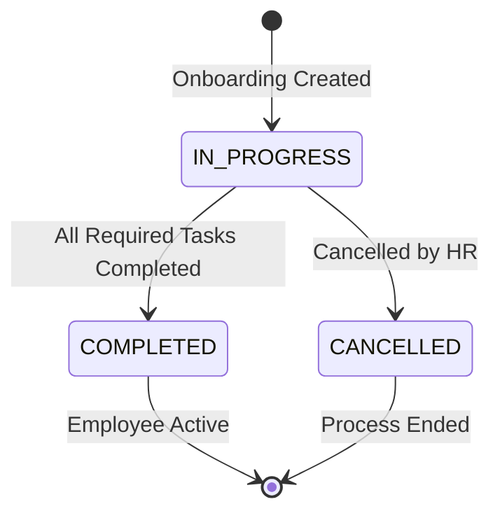
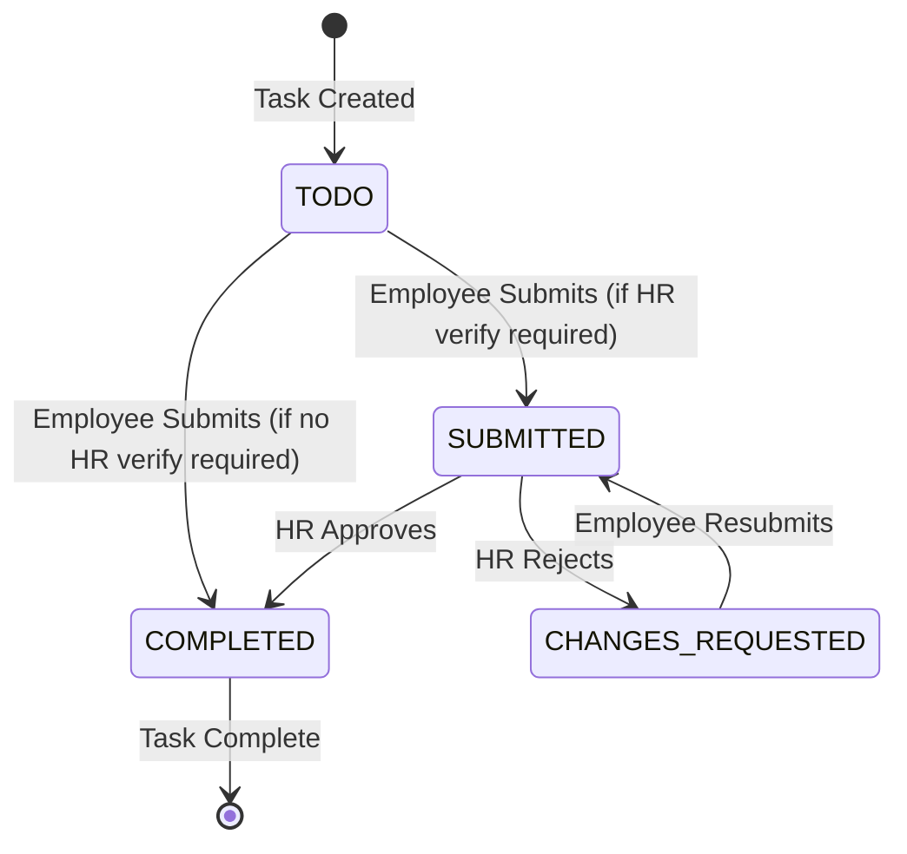
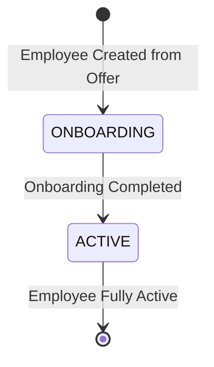

# BLIH Onboarding Flow: Offer Acceptance to Full Onboarding

## Table of Contents

1. [Overview](#overview)
2. [System Architecture](#system-architecture)
3. [Database Models](#database-models)
4. [Onboarding Workflow](#onboarding-workflow)
5. [API Endpoints](#api-endpoints)
6. [Business Logic](#business-logic)
7. [State Transitions](#state-transitions)
8. [RBAC Permissions](#rbac-permissions)
9. [Integration Points](#integration-points)
10. [Error Handling](#error-handling)

---

## Overview

The BLIH Onboarding System implements a comprehensive employee onboarding workflow from offer acceptance through to full onboarding completion. This documentation covers the complete onboarding lifecycle where accepted offers trigger employee creation, onboarding initialization, checklist generation, task submission, HR verification, and final transition to active employee status.

**Workflow**: OFFER ACCEPTED → Hire Applicant → Employee Created (ONBOARDING) → Onboarding Initiated → Checklist Generated → Employee Submits Tasks → HR Verifies → Onboarding Completed → Employee Status (ACTIVE)

### Key Features

- **Automated onboarding initiation** triggered by offer acceptance
- **Task library system** with customizable onboarding tasks
- **Task instance snapshots** preserving historical records
- **Multi-type task support** (system-integrated and custom tasks)
- **Employee submission workflow** for profile, address, bank, emergency contact, education, contract, and policy tasks
- **HR verification workflow** with approval/rejection capability
- **Automatic onboarding evaluation** triggering employee status transitions
- **Progress tracking** with due date management
- **Required vs optional task** distinction
- **HR verification requirement** configuration

### System Scope

**In Scope**:

- Onboarding record management (CRUD)
- Task library management (OnboardingTask)
- Task instance creation from library
- Checklist status tracking
- Employee task submission (7 task types)
- HR verification workflow
- Onboarding completion evaluation
- Employee status transition (ONBOARDING → ACTIVE)

**Out of Scope**:

- Asset provisioning (equipment, access cards)
- IT system access provisioning
- Manager assignment and notifications
- Onboarding templates by role/department
- Document management integration
- Training course enrollment
- Probation period management (separate system)

---

## System Architecture

### Module Structure

```
apps/api/src/domains/hr/
├── onboarding/
│   ├── onboarding.controller.ts          # Onboarding CRUD endpoints
│   ├── onboarding.dto.ts                 # Onboarding DTOs
│   ├── create-onboarding.usecase.ts      # Create onboarding record
│   ├── update-onboarding.usecase.ts      # Update onboarding record
│   ├── delete-onboarding.usecase.ts      # Delete onboarding record
│   ├── cancel-onboarding.usecase.ts       # Cancel onboarding
│   ├── query-onboarding.usecase.ts       # Query onboarding records
│   ├── onboarding.module.ts              # Onboarding module
│   ├── onboarding.docs.ts                # Swagger documentation
│   ├── onboarding-tasks/
│   │   ├── onboarding-tasks.controller.ts    # Task library CRUD
│   │   ├── onboarding-tasks.dto.ts           # Task library DTOs
│   │   ├── create-onboarding-tasks.usecase.ts
│   │   ├── update-onboarding-tasks.usecase.ts
│   │   ├── delete-onboarding-tasks.usecase.ts
│   │   ├── query-onboarding-tasks.usecase.ts
│   │   ├── onboarding-tasks.module.ts
│   │   └── onboarding-tasks.docs.ts
│   └── onboarding-checklist/
│       ├── onboarding-checklist.controller.ts  # Checklist status updates
│       ├── onboarding-checklist.dto.ts         # Checklist DTOs
│       ├── update-checklist-status.usecase.ts   # Update checklist status
│       ├── onboarding-checklist.module.ts
│       ├── onboarding-checklist.docs.ts
│       ├── execution.controller.ts             # Task submit/verify endpoints
│       ├── execution.dto.ts                    # Submit DTOs for each task type
│       ├── evaluate-onboarding.usecase.ts      # Evaluate completion
│       ├── submit/                              # Employee submission use cases
│       │   ├── submit-profile.usecase.ts
│       │   ├── submit-address.usecase.ts
│       │   ├── submit-bank-detail.usecase.ts
│       │   ├── submit-emergency-contact.usecase.ts
│       │   ├── submit-education.usecase.ts
│       │   ├── submit-contract.usecase.ts
│       │   ├── submit-policy.usecase.ts
│       │   └── submit-custom-task.usecase.ts
│       └── verify/                              # HR verification use cases
│           ├── verify-payload.dto.ts
│           ├── verify-profile.usecase.ts
│           ├── verify-address.usecase.ts
│           ├── verify-bank-detail.usecase.ts
│           ├── verify-emergency-contact.usecase.ts
│           ├── verify-education.usecase.ts
│           ├── verify-contract.usecase.ts
│           ├── verify-policy.usecase.ts
│           └── verify-custom-task.usecase.ts
└── recruitment/
    └── recruitment-transition.service.ts        # Hiring → Onboarding transition
```

### Technology Stack

- **Backend**: NestJS with TypeScript
- **Database**: PostgreSQL with Prisma ORM
- **Authentication**: Keycloak
- **Authorization**: RBAC (Role-Based Access Control)
- **API Documentation**: Swagger/OpenAPI
- **Validation**: class-validator
- **Transaction Management**: Prisma transactions

---

## Database Models

### Onboarding

Stores the onboarding record for an employee.

```prisma
model Onboarding {
  id          String                @id @default(uuid()) @db.Uuid
  employeeId  String                @unique @map("employee_id") @db.Uuid
  status      OnboardingStatus      @default(IN_PROGRESS)
  startedAt   DateTime?             @map("started_at")
  completedAt DateTime?             @map("completed_at")
  createdAt   DateTime              @default(now())
  updatedAt   DateTime              @updatedAt
  checklists  OnboardingChecklist[]
  employee    Employee              @relation(fields: [employeeId], references: [id], onDelete: Cascade)
  offer       Offer?                @relation("OnboardingOffer")

  @@index([employeeId])
  @@index([status])
}
```

**Key Fields**:

- `status`: IN_PROGRESS, COMPLETED, CANCELLED
- `employeeId`: Unique constraint ensures one onboarding per employee
- `startedAt`: Set when first task is submitted
- `completedAt`: Set when all required tasks are completed
- `offer`: Optional link to accepted offer

**Unique Constraint**: `employeeId` prevents duplicate onboarding records

### OnboardingChecklist

Tracks individual task completion status within an onboarding.

```prisma
model OnboardingChecklist {
  id             String                    @id @default(uuid()) @db.Uuid
  onboardingId   String                    @map("onboarding_id") @db.Uuid
  taskInstanceId String                    @map("task_instance_id") @db.Uuid
  status         OnboardingChecklistStatus @default(TODO)
  dueDate        DateTime?                 @map("due_date")
  isRequired     Boolean                   @default(true)
  verifiedAt     DateTime?                 @map("verified_at")
  verifiedBy     String?                   @map("verified_by") @db.Uuid
  rejectionReason String?                   @map("rejection_reason") @db.Text
  createdAt      DateTime                  @default(now())
  updatedAt      DateTime                  @updatedAt
  onboarding     Onboarding                @relation(fields: [onboardingId], references: [id], onDelete: Cascade)
  taskInstance   OnboardingTaskInstance     @relation(fields: [taskInstanceId], references: [id], onDelete: Cascade)

  @@unique([onboardingId, taskInstanceId])
  @@index([onboardingId])
  @@index([status])
}
```

**Key Fields**:

- `status`: TODO, SUBMITTED, CHANGES_REQUESTED, COMPLETED
- `dueDate`: Optional deadline for task completion
- `isRequired`: Whether task must be completed for onboarding to finish
- `verifiedAt`: Timestamp when HR verified the task
- `verifiedBy`: HR user ID who verified
- `rejectionReason`: Feedback when HR rejects a submission

**Unique Constraint**: `onboardingId + taskInstanceId` prevents duplicate tasks

### OnboardingTask

Global task library defining available onboarding tasks.

```prisma
model OnboardingTask {
  id                     String           @id @default(uuid()) @db.Uuid
  title                  String
  description            String?          @db.Text
  taskType               TaskType
  targetDataModel        TargetDataModel?
  requiresHrVerification Boolean          @default(false)
  createdAt              DateTime         @default(now())
  updatedAt              DateTime         @updatedAt
}
```

**Key Fields**:

- `taskType`: NON_CUSTOM (system-integrated), CUSTOM (ad-hoc human tasks)
- `targetDataModel`: For NON_CUSTOM tasks, specifies which data model to render
  - USER_PROFILE
  - EMPLOYEE_ADDRESS
  - EMPLOYEE_BANK_DETAIL
  - EMPLOYEE_EMERGENCY_CONTACT
  - EMPLOYEE_EDUCATION
  - EMPLOYEE_CONTRACT
  - EMPLOYEE_POLICY_ACKNOWLEDGEMENT
- `requiresHrVerification`: Whether HR must verify before marking complete

### OnboardingTaskInstance

Snapshot of a task cloned from the library when onboarding starts.

```prisma
model OnboardingTaskInstance {
  id                     String                @id @default(uuid()) @db.Uuid
  title                  String
  description            String?               @db.Text
  taskType               TaskType
  targetDataModel        TargetDataModel?
  requiresHrVerification Boolean               @default(false)
  checklist              OnboardingChecklist[]
  createdAt              DateTime              @default(now())
  updatedAt              DateTime              @updatedAt
}
```

**Purpose**: Preserves historical records even if HR edits the original OnboardingTask later

### Enums

**OnboardingStatus**:

- IN_PROGRESS
- COMPLETED
- CANCELLED

**OnboardingChecklistStatus**:

- TODO (initial state)
- SUBMITTED (employee completed, waiting for HR verification if required)
- CHANGES_REQUESTED (HR rejected, sent back to employee)
- COMPLETED (fully done and verified if required)

**TaskType**:

- NON_CUSTOM (system-integrated tasks with typed forms)
- CUSTOM (ad-hoc human tasks like "Meet your manager")

**TargetDataModel** (for NON_CUSTOM tasks):

- USER_PROFILE
- EMPLOYEE_ADDRESS
- EMPLOYEE_BANK_DETAIL
- EMPLOYEE_EMERGENCY_CONTACT
- EMPLOYEE_EDUCATION
- EMPLOYEE_CONTRACT
- EMPLOYEE_POLICY_ACKNOWLEDGEMENT

---

## Onboarding Workflow

### Phase 0: Offer Acceptance to Hiring Handoff

**Trigger**: Candidate accepts offer (via Offer Management API)

**Process**:

1. **Offer Response** (handled by Offer Management):
   - Candidate accepts offer via `POST /api/v1/hr/recruitment/offers/:id/respond`
   - Offer status transitions: SENT → ACCEPTED
   - `respondedAt` timestamp set

2. **Hire Applicant** (handled by RecruitmentTransitionService):
   - HR calls `POST /api/v1/hr/recruitment/applicants/:id/hire`
   - Validates applicant has accepted offer
   - Generates unique username
   - Creates Keycloak user account
   - Creates local User record
   - Creates Employee record with status ONBOARDING
   - Creates Employment record
   - Creates Compensation record
   - Links applicant to employee
   - Transitions applicant status to HIRED
   - Sends welcome notification

**API Endpoint**:

```http
POST /api/v1/hr/recruitment/applicants/{id}/hire
```

**Request Example**:

```json
{
  "companyEmail": "abel.tesfaye@blih.com",
  "companyPhone": "+251911234567",
  "isCompanyEmailPrimary": true,
  "isCompanyPhonePrimary": true,
  "managerId": "manager-uuid"
}
```

**Response**:

```json
{
  "employeeId": "employee-uuid",
  "userId": "user-uuid",
  "username": "abel.tesfaye",
  "keycloakId": "keycloak-uuid",
  "employeeStatus": "ONBOARDING",
  "employmentId": "employment-uuid"
}
```

### Phase 1: Onboarding Initialization

**Trigger**: HR initiates onboarding for new employee

**Process**:

1. **Create Onboarding Record**:
   - HR calls `POST /api/v1/hr/onboarding`
   - Validates employee exists and has ONBOARDING status
   - Creates Onboarding record with status IN_PROGRESS
   - Optionally selects tasks from library

2. **Generate Checklist**:
   - If tasks provided in request:
     - Validates tasks exist in library
     - Creates OnboardingTaskInstance snapshots for each task
     - Creates OnboardingChecklist items linking to instances
     - Sets initial status to TODO
     - Configures due dates and required flags

**API Endpoint**:

```http
POST /api/v1/hr/onboarding
```

**Request Example**:

```json
{
  "employeeId": "employee-uuid",
  "status": "IN_PROGRESS",
  "startedAt": "2026-03-11T08:00:00.000Z",
  "tasks": [
    {
      "taskId": "task-uuid-1",
      "dueDate": "2026-03-15T10:00:00.000Z",
      "isRequired": true
    },
    {
      "taskId": "task-uuid-2",
      "dueDate": "2026-03-16T10:00:00.000Z",
      "isRequired": true
    }
  ]
}
```

**Response**:

```json
{
  "id": "onboarding-uuid",
  "employeeId": "employee-uuid",
  "status": "IN_PROGRESS",
  "startedAt": "2026-03-11T08:00:00.000Z",
  "completedAt": null,
  "createdAt": "2026-03-11T08:00:00.000Z",
  "updatedAt": "2026-03-11T08:00:00.000Z",
  "checklists": [
    {
      "id": "checklist-uuid-1",
      "taskInstanceId": "task-instance-uuid-1",
      "onboardingId": "onboarding-uuid",
      "status": "TODO",
      "dueDate": "2026-03-15T10:00:00.000Z",
      "createdAt": "2026-03-11T08:00:00.000Z",
      "updatedAt": "2026-03-11T08:00:00.000Z"
    }
  ]
}
```

### Phase 2: Employee Task Submission

**Trigger**: Employee completes onboarding tasks

**Process**:

For each task type, employee submits data via dedicated endpoint:

1. **Profile Task** (`POST /api/v1/hr/onboarding/tasks/{taskId}/profile`):
   - Updates UserProfile record
   - Sets status to PENDING_REVIEW
   - Transitions checklist to SUBMITTED (if HR verification required) or COMPLETED (if not)

2. **Address Task** (`POST /api/v1/hr/onboarding/tasks/{taskId}/address`):
   - Creates/updates EmployeeAddress record
   - Transitions checklist status

3. **Bank Detail Task** (`POST /api/v1/hr/onboarding/tasks/{taskId}/bank-detail`):
   - Creates/updates EmployeeBankDetail record
   - Transitions checklist status

4. **Emergency Contact Task** (`POST /api/v1/hr/onboarding/tasks/{taskId}/emergency-contact`):
   - Creates/updates EmployeeEmergencyContact record
   - Transitions checklist status

5. **Education Task** (`POST /api/v1/hr/onboarding/tasks/{taskId}/education`):
   - Creates/updates EmployeeEducation record
   - Transitions checklist status

6. **Contract Task** (`POST /api/v1/hr/onboarding/tasks/{taskId}/contract`):
   - Links to generated contract template
   - Accepts signed file URL
   - Transitions checklist status

7. **Policy Task** (`POST /api/v1/hr/onboarding/tasks/{taskId}/policy`):
   - Records policy acknowledgements
   - Links to policy versions
   - Transitions checklist status

8. **Custom Task** (`POST /api/v1/hr/onboarding/tasks/{taskId}/done`):
   - Employee marks custom task as done
   - Transitions to SUBMITTED (if HR verification required) or COMPLETED (if not)

**After each submission**:

- `EvaluateOnboardingUseCase` is invoked
- Sets `startedAt` if first submission
- Evaluates if all required tasks are completed
- If completed, transitions onboarding to COMPLETED and employee to ACTIVE

**Example: Profile Submission**:

```http
POST /api/v1/hr/onboarding/tasks/{taskInstanceId}/profile
```

**Request Example**:

```json
{
  "phone": "+251912345678",
  "dateOfBirth": "1995-06-15",
  "gender": "MALE",
  "maritalStatus": "SINGLE"
}
```

**Response**:

```json
{
  "success": true
}
```

### Phase 3: HR Verification

**Trigger**: HR reviews submitted tasks requiring verification

**Process**:

For each task type requiring HR verification:

1. **Verify Profile** (`POST /api/v1/hr/onboarding/tasks/{taskId}/profile/verify`):
   - If approved: Sets UserProfile status to VERIFIED, checklist to COMPLETED
   - If rejected: Sets UserProfile status to REJECTED, checklist to CHANGES_REQUESTED
   - Records verification timestamp and HR user ID

2. **Verify Address** (`POST /api/v1/hr/onboarding/tasks/{taskId}/address/verify`):
   - Similar approval/rejection logic for EmployeeAddress

3. **Verify Bank Detail** (`POST /api/v1/hr/onboarding/tasks/{taskId}/bank-detail/verify`):
   - Similar logic for EmployeeBankDetail

4. **Verify Emergency Contact** (`POST /api/v1/hr/onboarding/tasks/{taskId}/emergency-contact/verify`):
   - Similar logic for EmployeeEmergencyContact

5. **Verify Education** (`POST /api/v1/hr/onboarding/tasks/{taskId}/education/verify`):
   - Similar logic for EmployeeEducation

6. **Verify Contract** (`POST /api/v1/hr/onboarding/tasks/{taskId}/contract/verify`):
   - Similar logic for contract acceptance

7. **Verify Policy** (`POST /api/v1/hr/onboarding/tasks/{taskId}/policy/verify`):
   - Similar logic for policy acknowledgements

8. **Verify Custom Task** (`POST /api/v1/hr/onboarding/tasks/{taskId}/done/verify`):
   - Similar logic for custom tasks

**After each verification**:

- `EvaluateOnboardingUseCase` is invoked
- Re-evaluates onboarding completion status
- May revert onboarding from COMPLETED to IN_PROGRESS if a task was rejected
- May transition employee back to ONBOARDING if previously ACTIVE

**Example: Profile Verification**:

```http
POST /api/v1/hr/onboarding/tasks/{taskInstanceId}/profile/verify
```

**Request Example (Approval)**:

```json
{
  "approved": true
}
```

**Request Example (Rejection)**:

```json
{
  "approved": false,
  "hrFeedback": "Phone number format is incorrect. Please provide valid format."
}
```

**Response**:

```json
{
  "success": true
}
```

### Phase 4: Onboarding Completion

**Trigger**: All required checklist items reach COMPLETED status

**Process**:

1. **Evaluation** (handled by EvaluateOnboardingUseCase):
   - Checks all required checklist items
   - Verifies all have status COMPLETED
   - If complete:
     - Sets onboarding status to COMPLETED
     - Sets completedAt timestamp
     - Transitions employee status from ONBOARDING to ACTIVE
   - If incomplete:
     - Keeps onboarding status as IN_PROGRESS
     - Clears completedAt if previously set

2. **Employee Status Transition**:
   - Employee status: ONBOARDING → ACTIVE
   - Employee gains full system access
   - Ready for probation period (separate system)

**Completion Criteria**:

- All checklist items with `isRequired = true` must have status COMPLETED
- Optional tasks (isRequired = false) do not block completion

---

## API Endpoints

### Onboarding Management Endpoints

| Method | Endpoint                            | Description                       | Permissions         |
| ------ | ----------------------------------- | --------------------------------- | ------------------- |
| POST   | `/api/v1/hr/onboarding`             | Create onboarding record          | `onboarding:create` |
| GET    | `/api/v1/hr/onboarding`             | List all onboarding records       | `onboarding:view`   |
| GET    | `/api/v1/hr/onboarding/paginated`   | List paginated onboarding records | `onboarding:view`   |
| GET    | `/api/v1/hr/onboarding/{id}`        | Get onboarding by ID              | `onboarding:view`   |
| PATCH  | `/api/v1/hr/onboarding/{id}`        | Update onboarding record          | `onboarding:update` |
| POST   | `/api/v1/hr/onboarding/{id}/cancel` | Cancel onboarding                 | `onboarding:update` |
| DELETE | `/api/v1/hr/onboarding/{id}`        | Delete onboarding record          | `onboarding:delete` |

### Onboarding Task Library Endpoints

| Method | Endpoint                                | Description                         | Permissions              |
| ------ | --------------------------------------- | ----------------------------------- | ------------------------ |
| POST   | `/api/v1/hr/onboarding/tasks`           | Create task library entry           | `onboarding_task:create` |
| GET    | `/api/v1/hr/onboarding/tasks`           | List all task library entries       | `onboarding_task:view`   |
| GET    | `/api/v1/hr/onboarding/tasks/paginated` | List paginated task library entries | `onboarding_task:view`   |
| GET    | `/api/v1/hr/onboarding/tasks/{id}`      | Get task by ID                      | `onboarding_task:view`   |
| PATCH  | `/api/v1/hr/onboarding/tasks/{id}`      | Update task library entry           | `onboarding_task:update` |
| DELETE | `/api/v1/hr/onboarding/tasks/{id}`      | Delete task library entry           | `onboarding_task:delete` |

### Onboarding Checklist Endpoints

| Method | Endpoint                                       | Description             | Permissions         |
| ------ | ---------------------------------------------- | ----------------------- | ------------------- |
| PATCH  | `/api/v1/hr/onboarding/checklists/{id}/status` | Update checklist status | `onboarding:update` |

### Employee Task Submission Endpoints

| Method | Endpoint                                                 | Description                   | Permissions         |
| ------ | -------------------------------------------------------- | ----------------------------- | ------------------- |
| POST   | `/api/v1/hr/onboarding/tasks/{taskId}/profile`           | Submit profile task           | `onboarding:update` |
| POST   | `/api/v1/hr/onboarding/tasks/{taskId}/address`           | Submit address task           | `onboarding:update` |
| POST   | `/api/v1/hr/onboarding/tasks/{taskId}/bank-detail`       | Submit bank detail task       | `onboarding:update` |
| POST   | `/api/v1/hr/onboarding/tasks/{taskId}/emergency-contact` | Submit emergency contact task | `onboarding:update` |
| POST   | `/api/v1/hr/onboarding/tasks/{taskId}/education`         | Submit education task         | `onboarding:update` |
| POST   | `/api/v1/hr/onboarding/tasks/{taskId}/contract`          | Submit contract task          | `onboarding:update` |
| POST   | `/api/v1/hr/onboarding/tasks/{taskId}/policy`            | Submit policy task            | `onboarding:update` |
| POST   | `/api/v1/hr/onboarding/tasks/{taskId}/done`              | Mark custom task done         | `onboarding:update` |

### HR Verification Endpoints

| Method | Endpoint                                                        | Description                   | Permissions         |
| ------ | --------------------------------------------------------------- | ----------------------------- | ------------------- |
| POST   | `/api/v1/hr/onboarding/tasks/{taskId}/profile/verify`           | Verify profile task           | `onboarding:verify` |
| POST   | `/api/v1/hr/onboarding/tasks/{taskId}/address/verify`           | Verify address task           | `onboarding:verify` |
| POST   | `/api/v1/hr/onboarding/tasks/{taskId}/bank-detail/verify`       | Verify bank detail task       | `onboarding:verify` |
| POST   | `/api/v1/hr/onboarding/tasks/{taskId}/emergency-contact/verify` | Verify emergency contact task | `onboarding:verify` |
| POST   | `/api/v1/hr/onboarding/tasks/{taskId}/education/verify`         | Verify education task         | `onboarding:verify` |
| POST   | `/api/v1/hr/onboarding/tasks/{taskId}/contract/verify`          | Verify contract task          | `onboarding:verify` |
| POST   | `/api/v1/hr/onboarding/tasks/{taskId}/policy/verify`            | Verify policy task            | `onboarding:verify` |
| POST   | `/api/v1/hr/onboarding/tasks/{taskId}/done/verify`              | Verify custom task            | `onboarding:verify` |

---

## Business Logic

### Onboarding Creation

**Validation Rules**:

- Employee must exist
- Employee must have ONBOARDING status
- Task IDs must exist in library
- Task IDs must be unique (no duplicates)

**Transaction Flow**:

1. Validate employee exists
2. Validate task IDs and get library tasks
3. Create Onboarding record
4. For each task:
   - Create OnboardingTaskInstance snapshot
   - Create OnboardingChecklist linking to instance
   - Set initial status to TODO
5. Return onboarding with checklists

### Task Submission

**Validation Rules**:

- Task instance must exist in checklist
- Task must map to correct target data model
- Employee must be associated with checklist

**Data Update Flow**:

1. Find checklist with task instance
2. Validate task type matches endpoint
3. Upsert target data model record (e.g., UserProfile, EmployeeAddress)
4. Set data model status to PENDING_REVIEW
5. Determine next checklist status:
   - If requiresHrVerification: SUBMITTED
   - Else: COMPLETED
6. Update checklist status
7. Evaluate onboarding completion

### HR Verification

**Validation Rules**:

- Task instance must exist in checklist
- Checklist status must be SUBMITTED
- Task must map to correct target data model

**Verification Flow**:

1. Find checklist with task instance
2. Validate checklist is in SUBMITTED status
3. If approved:
   - Set data model status to VERIFIED
   - Set checklist status to COMPLETED
   - Record verifiedAt and verifiedBy
   - Clear rejectionReason
4. If rejected:
   - Set data model status to REJECTED
   - Set checklist status to CHANGES_REQUESTED
   - Record rejectionReason from hrFeedback
5. Evaluate onboarding completion

### Onboarding Evaluation

**Evaluation Logic**:

1. Fetch onboarding with all checklists
2. Filter required checklists (isRequired = true)
3. Count completed required checklists (status = COMPLETED)
4. Check if any checklist is in progress (SUBMITTED, CHANGES_REQUESTED, COMPLETED)
5. Determine new status:
   - If first activity and no startedAt: Set startedAt, status = IN_PROGRESS
   - If all required completed: status = COMPLETED, set completedAt, trigger employee upgrade
   - If previously COMPLETED but no longer complete: status = IN_PROGRESS, clear completedAt
6. Apply updates if changed
7. If newly completed: Transition employee from ONBOARDING to ACTIVE

### Employee Status Transition

**Transition Conditions**:

- Onboarding status must be COMPLETED
- Employee status must be ONBOARDING
- All required checklist items must be COMPLETED

**Transition Flow**:

1. Check employee current status
2. If ONBOARDING and onboarding COMPLETED:
   - Update employee status to ACTIVE
   - Log transition
3. Employee now has full system access

---

## State Transitions

### Onboarding Status State Machine



### Checklist Item Status State Machine



### Employee Status State Machine (Onboarding Context)



### Transition Rules

**Onboarding Status Transitions**:

| From Status | To Status   | Trigger                        | Conditions                          |
| ----------- | ----------- | ------------------------------ | ----------------------------------- |
| (none)      | IN_PROGRESS | Onboarding created             | Employee exists                     |
| IN_PROGRESS | COMPLETED   | All required tasks completed   | All required checklists = COMPLETED |
| IN_PROGRESS | CANCELLED   | HR cancels                     | Valid transition                    |
| COMPLETED   | IN_PROGRESS | Task rejected after completion | Required checklist reverted         |

**Checklist Status Transitions**:

| From Status       | To Status         | Trigger            | Conditions                            |
| ----------------- | ----------------- | ------------------ | ------------------------------------- |
| (none)            | TODO              | Checklist created  | Task instance linked                  |
| TODO              | SUBMITTED         | Employee submits   | Task requires HR verification         |
| TODO              | COMPLETED         | Employee submits   | Task does not require HR verification |
| SUBMITTED         | COMPLETED         | HR approves        | approved = true                       |
| SUBMITTED         | CHANGES_REQUESTED | HR rejects         | approved = false                      |
| CHANGES_REQUESTED | SUBMITTED         | Employee resubmits | Valid resubmission                    |

**Employee Status Transitions**:

| From Status | To Status  | Trigger              | Conditions                    |
| ----------- | ---------- | -------------------- | ----------------------------- |
| (none)      | ONBOARDING | Employee hired       | Offer accepted                |
| ONBOARDING  | ACTIVE     | Onboarding completed | Onboarding status = COMPLETED |

### Timestamp Tracking

| Timestamp     | Set When                     | Purpose                          |
| ------------- | ---------------------------- | -------------------------------- |
| `startedAt`   | First task submitted         | Track onboarding start time      |
| `completedAt` | All required tasks completed | Track onboarding completion time |
| `verifiedAt`  | HR verifies task             | Track verification time          |
| `createdAt`   | Record created               | Audit trail                      |
| `updatedAt`   | Record updated               | Audit trail                      |

---

## RBAC Permissions

### Onboarding Permissions

| Permission          | Description               | Typical Roles  |
| ------------------- | ------------------------- | -------------- |
| `onboarding:view`   | View onboarding records   | HR, HR_MANAGER |
| `onboarding:create` | Create onboarding records | HR, HR_MANAGER |
| `onboarding:update` | Update onboarding records | HR, HR_MANAGER |
| `onboarding:delete` | Delete onboarding records | HR_MANAGER     |
| `onboarding:verify` | Verify submitted tasks    | HR, HR_MANAGER |

### Onboarding Task Permissions

| Permission               | Description                 | Typical Roles  |
| ------------------------ | --------------------------- | -------------- |
| `onboarding_task:view`   | View task library           | HR, HR_MANAGER |
| `onboarding_task:create` | Create task library entries | HR_MANAGER     |
| `onboarding_task:update` | Update task library entries | HR_MANAGER     |
| `onboarding_task:delete` | Delete task library entries | HR_MANAGER     |

### Permission Enforcement

**Task Submission**:

- Requires `onboarding:update` permission
- Employees can submit their own tasks
- System validates employee association with checklist

**HR Verification**:

- Requires `onboarding:verify` permission
- Only HR users can verify submissions
- HR user ID recorded in verifiedBy field

**Onboarding Management**:

- `onboarding:create`: Only HR can initiate onboarding
- `onboarding:update`: HR can modify onboarding details
- `onboarding:delete`: Only HR_MANAGER can delete records

---

## Integration Points

### Recruitment System

**Offer Acceptance Handoff**:

- Offer status: SENT → ACCEPTED
- Triggers hiring workflow
- Creates employee with ONBOARDING status
- Links offer to onboarding record

**Data Flow**:

```
Offer (ACCEPTED) → Applicant (HIRED) → Employee (ONBOARDING) → Onboarding (IN_PROGRESS)
```

### Employee System

**Employee Creation**:

- RecruitmentTransitionService creates employee
- Employee status set to ONBOARDING
- Employment and compensation records created
- User account provisioned in Keycloak

**Employee Status Transition**:

- Onboarding completion triggers: ONBOARDING → ACTIVE
- Employee gains full system access
- Ready for probation period

**Data Updates**:

- UserProfile updated on profile task submission
- EmployeeAddress updated on address task submission
- EmployeeBankDetail updated on bank task submission
- EmployeeEmergencyContact updated on emergency contact task
- EmployeeEducation updated on education task submission

### User System

**User Provisioning**:

- Keycloak user account created during hiring
- Username generated from email and name
- Email and phone configured
- Authentication enabled

**Identity Management**:

- User record linked to employee
- Keycloak ID stored for authentication
- Username unique across system

### Notification System

**Welcome Notification**:

- Sent after employee creation
- Includes login credentials
- Provides onboarding portal link
- Sent to employee email

**Status Updates**:

- Optional: Notify employee on task verification results
- Optional: Notify HR on task submissions
- Optional: Notify manager on onboarding completion

### Document System

**Contract Management**:

- Contract task links to generated contract template
- Signed file URL stored in contract record
- Contract verification ensures legal compliance

**Policy Acknowledgement**:

- Policy task links to policy versions
- Acknowledgements recorded for compliance
- HR verification ensures policy understanding

---

## Error Handling

### Validation Errors

**Employee Not Found**:

```json
{
  "statusCode": 400,
  "message": "employeeId does not reference an existing employee"
}
```

**Task Not Found**:

```json
{
  "statusCode": 404,
  "message": "Task instance {taskId} not found in checklist"
}
```

**Duplicate Task IDs**:

```json
{
  "statusCode": 400,
  "message": "tasks contains duplicate taskId values"
}
```

**Invalid Task Type**:

```json
{
  "statusCode": 400,
  "message": "Task instance does not map to USER_PROFILE"
}
```

### State Transition Errors

**Invalid Checklist Status for Verification**:

```json
{
  "statusCode": 400,
  "message": "Cannot verify a checklist item in status \"TODO\""
}
```

**No Accepted Offer**:

```json
{
  "statusCode": 400,
  "message": "Only applicants with accepted offers can be hired."
}
```

### Transaction Errors

**Concurrent Modifications**:

- Prisma transactions ensure atomicity
- Optimistic locking prevents race conditions
- Rollback on any failure

**Database Constraints**:

- Unique constraints prevent duplicate records
- Foreign key constraints ensure referential integrity
- Cascade deletes clean up related records

### Error Recovery

**Rejection Handling**:

- HR can reject with feedback
- Employee can resubmit after corrections
- Checklist status cycles: SUBMITTED → CHANGES_REQUESTED → SUBMITTED

**Cancellation Handling**:

- HR can cancel onboarding at any time
- Employee status may need manual adjustment
- Cleanup of partial data may be required

**Verification Reversion**:

- If HR rejects a previously completed task
- Onboarding reverts from COMPLETED to IN_PROGRESS
- Employee status may revert from ACTIVE to ONBOARDING

---

## Best Practices

### Onboarding Setup

1. **Pre-configure Task Library**:
   - Create standard tasks for common onboarding requirements
   - Set appropriate HR verification requirements
   - Define target data models for system-integrated tasks

2. **Customize by Role**:
   - Create role-specific task sets
   - Adjust due dates based on role complexity
   - Mark optional tasks appropriately

3. **Set Realistic Due Dates**:
   - Allow sufficient time for employees to complete tasks
   - Consider holiday schedules
   - Build in buffer for HR verification time

### Task Submission

1. **Employee Guidance**:
   - Provide clear instructions for each task type
   - Include examples of required formats
   - Offer help documentation

2. **Data Validation**:
   - Validate at submission time
   - Provide immediate feedback on errors
   - Allow corrections before HR review

3. **Progress Tracking**:
   - Show completion percentage
   - Highlight overdue tasks
   - Display next required task

### HR Verification

1. **Timely Review**:
   - Set SLA for verification turnaround
   - Prioritize time-sensitive tasks
   - Queue notifications for pending verifications

2. **Clear Feedback**:
   - Provide specific rejection reasons
   - Suggest corrections
   - Reference requirements or policies

3. **Quality Assurance**:
   - Double-check critical information (bank details, contracts)
   - Verify policy acknowledgements
   - Ensure compliance with regulations

### Completion Management

1. **Final Review**:
   - Verify all required tasks completed
   - Check for any pending verifications
   - Confirm employee data accuracy

2. **Status Transition**:
   - Monitor automatic employee status transition
   - Verify ACTIVE status applied correctly
   - Ensure system access granted

3. **Handoff to Probation**:
   - Coordinate with probation system
   - Transfer relevant documentation
   - Schedule probation kickoff

---

## Metrics and KPIs

### Onboarding Metrics

- **Average Time to Complete**: From onboarding start to completion
- **Task Completion Rate**: Percentage of tasks completed on time
- **Verification Turnaround Time**: Average time from submission to HR verification
- **Rejection Rate**: Percentage of submissions requiring corrections
- **Onboarding Duration**: From offer acceptance to ACTIVE status

### Quality Metrics

- **Data Accuracy**: Percentage of verified tasks without corrections
- **Task Compliance**: Percentage of tasks meeting requirements
- **HR Verification Quality**: Consistency of verification decisions

### Employee Experience Metrics

- **Submission Frequency**: How often employees submit tasks
- **Resubmission Rate**: How often tasks need corrections
- **Onboarding Satisfaction**: Employee feedback on process

---

## Future Enhancements

### Planned Features

1. **Onboarding Templates**:
   - Role-based templates
   - Department-specific templates
   - Employment type templates

2. **Automated Notifications**:
   - Task due date reminders
   - Submission confirmations
   - Verification status updates

3. **Progress Dashboard**:
   - Real-time onboarding status
   - Team onboarding overview
   - Bottleneck identification

4. **Document Management Integration**:
   - Upload supporting documents
   - Attach to specific tasks
   - Version control

5. **Manager Involvement**:
   - Manager task assignments
   - Manager verification for certain tasks
   - Welcome meeting scheduling

### Technical Improvements

1. **Bulk Operations**:
   - Bulk task creation
   - Bulk status updates
   - Bulk verification

2. **Advanced Search**:
   - Filter by status, role, department
   - Search by employee name
   - Date range queries

3. **Reporting**:
   - Onboarding completion reports
   - Task performance analytics
   - HR verification metrics

4. **Integration Enhancements**:
   - LMS integration for training tasks
   - Asset management for equipment tasks
   - IT system integration for access tasks

---

## Conclusion

The BLIH Onboarding System provides a comprehensive, structured approach to employee onboarding from offer acceptance through to full onboarding completion. The system ensures data quality through HR verification, maintains historical records through task instance snapshots, and automates employee status transitions upon completion.

**Key Strengths**:

- Flexible task library supporting both system-integrated and custom tasks
- Clear separation between employee submission and HR verification
- Automatic evaluation and status transitions
- Comprehensive audit trail through timestamps and user tracking
- Transactional data integrity

**Current Capabilities**:

- Complete onboarding record management
- Task library management
- 7 task types with dedicated submission/verification workflows
- Automatic employee status transition
- Progress tracking and due date management

**Integration Points**:

- Seamless handoff from recruitment (offer acceptance)
- Employee system integration for data updates
- User provisioning for authentication
- Notification system for communication
- Document system for contracts and policies

The system is production-ready for core onboarding workflows, with clear paths for enhancement to support more complex onboarding scenarios and improved employee experience.
