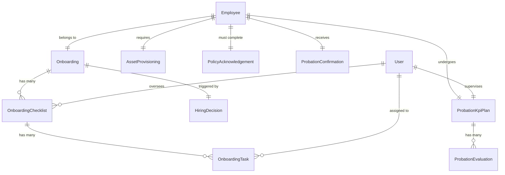
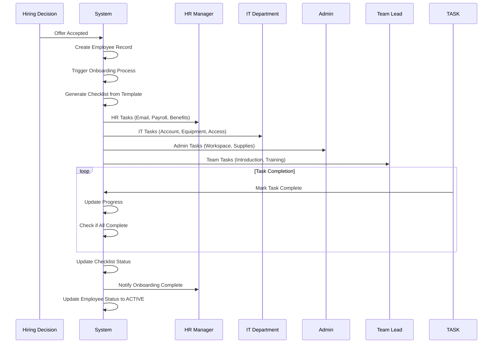
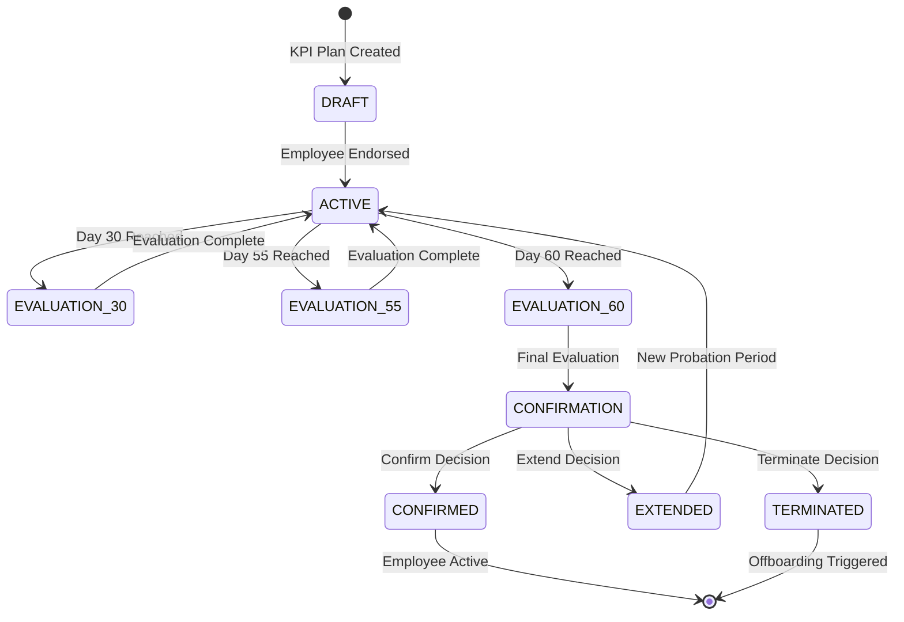

# BLIH Onboarding & Probation System - Complete Technical Documentation

## Table of Contents

1. [System Overview](#system-overview)
2. [Database Schema & Models](#database-schema--models)
3. [TypeScript Types & DTOs](#typescript-types--dtos)
4. [API Endpoints Documentation](#api-endpoints-documentation)
5. [Business Logic & Workflows](#business-logic--workflows)
6. [Security & Permissions](#security--permissions)
7. [Implementation Status & Gaps](#implementation-status--gaps)
8. [Integration Points](#integration-points)
9. [Testing & Quality Assurance](#testing--quality-assurance)

---

## System Overview

The BLIH Onboarding & Probation system manages the complete employee integration journey from offer acceptance to active employment status. The system ensures structured onboarding through departmental checklists, asset provisioning, policy compliance, and comprehensive probation management with KPI tracking and evaluations.

### Key Features

- **Automated Checklist Generation**: Role-based onboarding tasks with due dates
- **Asset Provisioning**: Equipment allocation and platform permission management
- **Policy Acknowledgement**: Compliance tracking with system access integration
- **Probation Management**: 60-day KPI plans with milestone evaluations
- **Multi-Level Approvals**: Supervisor → HR → CEO approval workflows
- **Employee Lifecycle Integration**: Seamless transition from ONBOARDING to ACTIVE status

### Business Objectives

- Reduce onboarding time from 14 days to 7 days
- Achieve 95%+ checklist completion rate
- Maintain 90%+ probation confirmation rate
- Ensure 100% policy compliance tracking

---

## Database Schema & Models

### Core Onboarding Models

```sql
-- Onboarding Model
CREATE TABLE onboardings (
    id UUID PRIMARY KEY DEFAULT uuid_generate_v4(),
    employee_id UUID NOT NULL REFERENCES employees(id) ON DELETE CASCADE,
    status VARCHAR(20) DEFAULT 'PENDING' CHECK (status IN ('PENDING', 'IN_PROGRESS', 'COMPLETED')),
    started_at TIMESTAMP,
    completed_at TIMESTAMP,
    created_at TIMESTAMP DEFAULT NOW(),
    updated_at TIMESTAMP DEFAULT NOW(),
    hiring_decision_id UUID REFERENCES hiring_decisions(id) ON DELETE SET NULL,
    checklists OnboardingChecklist[]
);

-- Onboarding Checklist Model
CREATE TABLE onboarding_checklists (
    id UUID PRIMARY KEY DEFAULT uuid_generate_v4(),
    employee_id UUID NOT NULL REFERENCES employees(id) ON DELETE CASCADE,
    onboarding_id UUID REFERENCES onboardings(id) ON DELETE SET NULL,
    hiring_decision_id UUID REFERENCES hiring_decisions(id) ON DELETE SET NULL,
    join_date DATE NOT NULL,
    overseer_id UUID REFERENCES users(id) ON DELETE SET NULL,
    total_items INTEGER DEFAULT 0,
    completed_items INTEGER DEFAULT 0,
    status VARCHAR(20) DEFAULT 'NOT_STARTED' CHECK (status IN ('NOT_STARTED', 'IN_PROGRESS', 'COMPLETED', 'OVERDUE')),
    team_lead_verified_at TIMESTAMP,
    ceo_sign_off_required BOOLEAN DEFAULT FALSE,
    ceo_sign_off_at TIMESTAMP,
    created_at TIMESTAMP DEFAULT NOW(),
    updated_at TIMESTAMP DEFAULT NOW(),
    tasks OnboardingTask[]
);

-- Onboarding Task Model
CREATE TABLE onboarding_tasks (
    id UUID PRIMARY KEY DEFAULT uuid_generate_v4(),
    checklist_id UUID NOT NULL REFERENCES onboarding_checklists(id) ON DELETE CASCADE,
    department VARCHAR(20) NOT NULL CHECK (department IN ('HR', 'IT', 'ADMIN', 'TEAM')),
    title VARCHAR(255) NOT NULL,
    description TEXT,
    due_date DATE,
    assigned_to_id UUID REFERENCES users(id) ON DELETE SET NULL,
    status VARCHAR(20) DEFAULT 'PENDING' CHECK (status IN ('PENDING', 'IN_PROGRESS', 'COMPLETED', 'OVERDUE')),
    completed_at TIMESTAMP,
    completed_by_id UUID REFERENCES users(id) ON DELETE SET NULL,
    created_at TIMESTAMP DEFAULT NOW(),
    updated_at TIMESTAMP DEFAULT NOW()
);
```

### Asset Provisioning Model

```sql
CREATE TABLE asset_provisionings (
    id UUID PRIMARY KEY DEFAULT uuid_generate_v4(),
    employee_id UUID NOT NULL REFERENCES employees(id) ON DELETE CASCADE,
    equipment JSONB, -- Array of equipment items with asset IDs, serial numbers
    platform_permissions JSONB, -- Platform access permissions and roles
    it_supervisor_approved_at TIMESTAMP,
    admin_approved_at TIMESTAMP,
    finance_approval_required BOOLEAN DEFAULT FALSE,
    status VARCHAR(20) DEFAULT 'PENDING' CHECK (status IN ('PENDING', 'APPROVED', 'PROVISIONED', 'REJECTED', 'COMPLETED')),
    created_at TIMESTAMP DEFAULT NOW(),
    updated_at TIMESTAMP DEFAULT NOW()
);
```

### Policy Acknowledgement Model

```sql
CREATE TABLE policy_acknowledgements (
    id UUID PRIMARY KEY DEFAULT uuid_generate_v4(),
    employee_id UUID NOT NULL REFERENCES employees(id) ON DELETE CASCADE,
    policies JSONB, -- Array of acknowledged policies with versions and timestamps
    all_acknowledged BOOLEAN DEFAULT FALSE,
    confirmed_at TIMESTAMP,
    system_access_granted_at TIMESTAMP,
    verified_by_id UUID REFERENCES users(id) ON DELETE SET NULL,
    verified_at TIMESTAMP,
    created_at TIMESTAMP DEFAULT NOW(),
    updated_at TIMESTAMP DEFAULT NOW()
);
```

### Probation Management Models

```sql
-- Probation KPI Plan Model
CREATE TABLE probation_kpi_plans (
    id UUID PRIMARY KEY DEFAULT uuid_generate_v4(),
    employee_id UUID NOT NULL REFERENCES employees(id) ON DELETE CASCADE,
    supervisor_id UUID REFERENCES users(id) ON DELETE SET NULL,
    probation_start DATE NOT NULL,
    probation_end DATE NOT NULL,
    goals JSONB, -- Array of goals with measures, targets, and importance weights
    development JSONB, -- Development plan with sessions, mentor, milestones
    employee_endorsed_at TIMESTAMP,
    supervisor_endorsed_at TIMESTAMP,
    hr_endorsed_at TIMESTAMP,
    status VARCHAR(20) DEFAULT 'DRAFT' CHECK (status IN ('DRAFT', 'ACTIVE', 'COMPLETED', 'CANCELLED')),
    created_at TIMESTAMP DEFAULT NOW(),
    updated_at TIMESTAMP DEFAULT NOW(),
    evaluations ProbationEvaluation[]
);

-- Probation Evaluation Model
CREATE TABLE probation_evaluations (
    id UUID PRIMARY KEY DEFAULT uuid_generate_v4(),
    kpi_plan_id UUID NOT NULL REFERENCES probation_kpi_plans(id) ON DELETE CASCADE,
    employee_id UUID NOT NULL REFERENCES employees(id) ON DELETE CASCADE,
    evaluation_round VARCHAR(20) NOT NULL CHECK (evaluation_round IN ('DAY_30', 'DAY_55', 'DAY_60_FINAL')),
    evaluation_date DATE NOT NULL,
    goal_reviews JSONB, -- Array of goal reviews with ratings and comments
    conduct JSONB, -- Conduct scores: timekeeping, collaboration, drive, communication
    average_rating DECIMAL(5,2),
    supervisor_recommendation VARCHAR(20) CHECK (supervisor_recommendation IN ('CONFIRM', 'EXTEND', 'TERMINATE')),
    hr_remarks TEXT,
    hr_verdict VARCHAR(20) CHECK (hr_verdict IN ('CONFIRM', 'EXTEND', 'TERMINATE')),
    employee_acknowledged_at TIMESTAMP,
    supervisor_approved_at TIMESTAMP,
    hr_approved_at TIMESTAMP,
    ceo_approved_at TIMESTAMP,
    final_decision VARCHAR(20) CHECK (final_decision IN ('CONFIRM', 'EXTEND', 'TERMINATE')),
    extension_days INTEGER,
    new_end_date DATE,
    employee_status_updated_at TIMESTAMP,
    created_at TIMESTAMP DEFAULT NOW(),
    updated_at TIMESTAMP DEFAULT NOW()
);

-- Probation Confirmation Model
CREATE TABLE probation_confirmations (
    id UUID PRIMARY KEY DEFAULT uuid_generate_v4(),
    employee_id UUID NOT NULL REFERENCES employees(id) ON DELETE CASCADE,
    review_summary JSONB, -- Summary of probation period performance
    verdict VARCHAR(20) NOT NULL CHECK (verdict IN ('CONFIRM', 'EXTEND', 'TERMINATE')),
    extension JSONB, -- Extension details if applicable
    termination JSONB, -- Termination details if applicable
    confirmation JSONB, -- Confirmation details if applicable
    hr_checked_at TIMESTAMP,
    ceo_sign_off_at TIMESTAMP,
    employee_notified_at TIMESTAMP,
    archived_in_employee_file BOOLEAN DEFAULT FALSE,
    created_at TIMESTAMP DEFAULT NOW(),
    updated_at TIMESTAMP DEFAULT NOW()
);
```

### Entity Relationship Diagram



---

## TypeScript Types & DTOs

### Onboarding Checklist Types

```typescript
// Enums
export type OnboardingChecklistStatus =
  | 'NOT_STARTED'
  | 'IN_PROGRESS'
  | 'COMPLETED'
  | 'OVERDUE';
export type OnboardingTaskDepartment = 'HR' | 'IT' | 'ADMIN' | 'TEAM';
export type OnboardingTaskStatus =
  | 'PENDING'
  | 'IN_PROGRESS'
  | 'COMPLETED'
  | 'OVERDUE';

// Request/Response DTOs
export interface CreateOnboardingChecklistDto {
  employeeId: string;
  onboardingId?: string | null;
  hiringDecisionId?: string | null;
  joinDate: string;
  overseerId?: string | null;
  ceoSignOffRequired?: boolean;
  generateTasksFromTemplate?: boolean;
}

export interface UpdateOnboardingChecklistDto {
  status?: OnboardingChecklistStatus;
  teamLeadVerifiedAt?: string | null;
  ceoSignOffAt?: string | null;
}

export interface OnboardingTaskResponseDto {
  id: string;
  checklistId: string;
  department: OnboardingTaskDepartment;
  title: string;
  description: string | null;
  dueDate: string | null;
  assignedToId: string | null;
  status: OnboardingTaskStatus;
  completedAt: string | null;
  completedById: string | null;
  createdAt: string;
  updatedAt: string;
}

export interface OnboardingChecklistResponseDto {
  id: string;
  employeeId: string;
  onboardingId: string | null;
  hiringDecisionId: string | null;
  joinDate: string;
  overseerId: string | null;
  totalItems: number;
  completedItems: number;
  status: OnboardingChecklistStatus;
  teamLeadVerifiedAt: string | null;
  ceoSignOffRequired: boolean;
  ceoSignOffAt: string | null;
  createdAt: string;
  updatedAt: string;
  tasks?: OnboardingTaskResponseDto[];
}
```

### Asset Provisioning Types

```typescript
// Enums
export type AssetProvisioningStatus =
  | 'PENDING'
  | 'APPROVED'
  | 'PROVISIONED'
  | 'REJECTED'
  | 'COMPLETED';

// Request/Response DTOs
export interface AssetProvisioningEquipmentItem {
  item?: string;
  assetId?: string;
  serialNumber?: string;
  status?: string;
  allocatedAt?: string;
}

export interface CreateAssetProvisioningDto {
  employeeId: string;
  equipment?: AssetProvisioningEquipmentItem[];
  platformPermissions?: Record<string, unknown>;
  financeApprovalRequired?: boolean;
}

export interface UpdateAssetProvisioningDto {
  equipment?: AssetProvisioningEquipmentItem[];
  platformPermissions?: Record<string, unknown>;
  itSupervisorApprovedAt?: string | null;
  adminApprovedAt?: string | null;
  financeApprovalRequired?: boolean;
  status?: AssetProvisioningStatus;
}

export interface AssetProvisioningResponseDto {
  id: string;
  employeeId: string;
  equipment: unknown;
  platformPermissions: unknown;
  itSupervisorApprovedAt: string | null;
  adminApprovedAt: string | null;
  financeApprovalRequired: boolean;
  status: AssetProvisioningStatus;
  createdAt: string;
  updatedAt: string;
}
```

### Policy Acknowledgement Types

```typescript
export interface PolicyAcknowledgementItem {
  policyId?: string;
  name?: string;
  version?: string;
  acknowledgedAt?: string;
  ipAddress?: string;
}

export interface CreatePolicyAcknowledgementDto {
  employeeId: string;
  policies?: PolicyAcknowledgementItem[];
  allAcknowledged?: boolean;
  confirmedAt?: string | null;
}

export interface PolicyAcknowledgementResponseDto {
  id: string;
  employeeId: string;
  policies: unknown;
  allAcknowledged: boolean;
  confirmedAt: string | null;
  systemAccessGrantedAt: string | null;
  verifiedById: string | null;
  verifiedAt: string | null;
  createdAt: string;
  updatedAt: string;
}
```

### Probation Management Types

```typescript
// Enums
export type ProbationPlanStatus =
  | 'DRAFT'
  | 'ACTIVE'
  | 'COMPLETED'
  | 'CANCELLED';
export type ProbationEvaluationRound = 'DAY_30' | 'DAY_55' | 'DAY_60_FINAL';
export type ProbationRecommendation = 'CONFIRM' | 'EXTEND' | 'TERMINATE';
export type ProbationFinalDecision = 'CONFIRM' | 'EXTEND' | 'TERMINATE';
export type ProbationConfirmationVerdict = 'CONFIRM' | 'EXTEND' | 'TERMINATE';

// Probation KPI Plan Types
export interface ProbationGoalDto {
  goalId?: string;
  goal?: string;
  measure?: string;
  targetValue?: string;
  importancePercent?: number;
  notes?: string;
}

export interface ProbationDevelopmentDto {
  sessions?: unknown;
  mentorId?: string;
  milestones?: unknown;
}

export interface CreateProbationKpiPlanDto {
  employeeId: string;
  supervisorId?: string | null;
  probationStart: string;
  probationEnd: string;
  goals?: ProbationGoalDto[];
  development?: ProbationDevelopmentDto;
}

export interface UpdateProbationKpiPlanDto {
  goals?: ProbationGoalDto[];
  development?: ProbationDevelopmentDto;
  employeeEndorsedAt?: string | null;
  supervisorEndorsedAt?: string | null;
  hrEndorsedAt?: string | null;
  status?: ProbationPlanStatus;
}

export interface ProbationKpiPlanResponseDto {
  id: string;
  employeeId: string;
  supervisorId: string | null;
  probationStart: string;
  probationEnd: string;
  goals: unknown;
  development: unknown;
  employeeEndorsedAt: string | null;
  supervisorEndorsedAt: string | null;
  hrEndorsedAt: string | null;
  status: ProbationPlanStatus;
  createdAt: string;
  updatedAt: string;
}

// Probation Evaluation Types
export interface GoalReviewDto {
  goalId?: string;
  rating?: number;
  comments?: string;
}

export interface ConductDto {
  timekeeping?: number;
  collaboration?: number;
  drive?: number;
  communication?: number;
}

export interface CreateProbationEvaluationDto {
  kpiPlanId: string;
  employeeId: string;
  evaluationRound: ProbationEvaluationRound;
  evaluationDate: string;
  goalReviews?: GoalReviewDto[];
  conduct?: ConductDto;
  averageRating?: number;
  supervisorRecommendation?: ProbationRecommendation;
  hrRemarks?: string;
  hrVerdict?: ProbationRecommendation;
}

export interface UpdateProbationEvaluationDto {
  employeeAcknowledgedAt?: string | null;
  supervisorApprovedAt?: string | null;
  hrApprovedAt?: string | null;
  ceoApprovedAt?: string | null;
  finalDecision?: ProbationFinalDecision | null;
  extensionDays?: number | null;
  newEndDate?: string | null;
  employeeStatusUpdatedAt?: string | null;
}

export interface ProbationEvaluationResponseDto {
  id: string;
  kpiPlanId: string;
  employeeId: string;
  evaluationRound: ProbationEvaluationRound;
  evaluationDate: string;
  goalReviews: unknown;
  conduct: unknown;
  averageRating: number | null;
  supervisorRecommendation: ProbationRecommendation | null;
  hrRemarks: string | null;
  hrVerdict: ProbationRecommendation | null;
  employeeAcknowledgedAt: string | null;
  supervisorApprovedAt: string | null;
  hrApprovedAt: string | null;
  ceoApprovedAt: string | null;
  finalDecision: ProbationFinalDecision | null;
  extensionDays: number | null;
  newEndDate: string | null;
  employeeStatusUpdatedAt: string | null;
  createdAt: string;
  updatedAt: string;
}

// Probation Confirmation Types
export interface CreateProbationConfirmationDto {
  employeeId: string;
  reviewSummary?: Record<string, unknown>;
  verdict: ProbationConfirmationVerdict;
  extension?: Record<string, unknown>;
  termination?: Record<string, unknown>;
  confirmation?: Record<string, unknown>;
}

export interface UpdateProbationConfirmationDto {
  hrCheckedAt?: string | null;
  ceoSignOffAt?: string | null;
  employeeNotifiedAt?: string | null;
  archivedInEmployeeFile?: boolean;
}

export interface ProbationConfirmationResponseDto {
  id: string;
  employeeId: string;
  reviewSummary: unknown;
  verdict: ProbationConfirmationVerdict;
  extension: unknown;
  termination: unknown;
  confirmation: unknown;
  hrCheckedAt: string | null;
  ceoSignOffAt: string | null;
  employeeNotifiedAt: string | null;
  archivedInEmployeeFile: boolean;
  createdAt: string;
  updatedAt: string;
}
```

---

## API Endpoints Documentation

### Onboarding Checklists API

**Base Path:** `/api/v1/hr/onboarding`

| Method | Endpoint                        | Description                                               | Permissions                   | Status         |
| ------ | ------------------------------- | --------------------------------------------------------- | ----------------------------- | -------------- |
| POST   | `/checklists`                   | Create onboarding checklist with optional task generation | `onboarding_checklist:create` | ✅ Implemented |
| GET    | `/checklists`                   | List onboarding checklists with filters                   | `onboarding_checklist:view`   | ✅ Implemented |
| GET    | `/checklists/:id`               | Get specific checklist with tasks                         | `onboarding_checklist:view`   | ✅ Implemented |
| PATCH  | `/checklists/:id`               | Update checklist status and sign-offs                     | `onboarding_checklist:update` | ✅ Implemented |
| PATCH  | `/checklists/:id/tasks/:taskId` | Update task completion status                             | `onboarding_checklist:update` | ✅ Implemented |

**Request/Response Examples:**

```typescript
// POST /api/v1/hr/onboarding/checklists
interface CreateOnboardingChecklistRequest {
  employeeId: string;
  onboardingId?: string;
  hiringDecisionId?: string;
  joinDate: string; // YYYY-MM-DD
  overseerId?: string;
  ceoSignOffRequired?: boolean;
  generateTasksFromTemplate?: boolean;
}

// Response
interface OnboardingChecklistResponse {
  id: string;
  employeeId: string;
  joinDate: string;
  overseerId: string;
  totalItems: number;
  completedItems: number;
  status: 'NOT_STARTED' | 'IN_PROGRESS' | 'COMPLETED' | 'OVERDUE';
  teamLeadVerifiedAt: string;
  ceoSignOffRequired: boolean;
  ceoSignOffAt: string;
  tasks: OnboardingTask[];
}
```

### Missing API Endpoints (Implementation Required)

**Asset Provisioning API** - Base: `/api/v1/hr/onboarding/asset-provisioning`

| Method | Endpoint       | Description                             | Status     |
| ------ | -------------- | --------------------------------------- | ---------- |
| POST   | `/`            | Create asset provisioning request       | ❌ Missing |
| GET    | `/`            | List asset provisioning requests        | ❌ Missing |
| GET    | `/:id`         | Get specific asset provisioning request | ❌ Missing |
| PATCH  | `/:id`         | Update equipment and permissions        | ❌ Missing |
| POST   | `/:id/approve` | Approve asset provisioning              | ❌ Missing |

**Policy Acknowledgements API** - Base: `/api/v1/hr/onboarding/policy-acknowledgements`

| Method | Endpoint            | Description                         | Status     |
| ------ | ------------------- | ----------------------------------- | ---------- |
| POST   | `/`                 | Record policy acknowledgement       | ❌ Missing |
| GET    | `/`                 | List policy acknowledgements        | ❌ Missing |
| GET    | `/:id`              | Get specific policy acknowledgement | ❌ Missing |
| POST   | `/:id/verify`       | Verify policy compliance            | ❌ Missing |
| POST   | `/:id/grant-access` | Grant system access                 | ❌ Missing |

**Probation KPI Plans API** - Base: `/api/v1/hr/onboarding/probation-plans`

| Method | Endpoint       | Description                 | Status     |
| ------ | -------------- | --------------------------- | ---------- |
| POST   | `/`            | Create probation KPI plan   | ❌ Missing |
| GET    | `/`            | List probation plans        | ❌ Missing |
| GET    | `/:id`         | Get specific probation plan | ❌ Missing |
| PATCH  | `/:id`         | Update probation plan       | ❌ Missing |
| POST   | `/:id/endorse` | Endorse probation plan      | ❌ Missing |

**Probation Evaluations API** - Base: `/api/v1/hr/onboarding/probation-evaluations`

| Method | Endpoint       | Description                 | Status     |
| ------ | -------------- | --------------------------- | ---------- |
| POST   | `/`            | Create probation evaluation | ❌ Missing |
| GET    | `/`            | List probation evaluations  | ❌ Missing |
| GET    | `/:id`         | Get specific evaluation     | ❌ Missing |
| PATCH  | `/:id`         | Update evaluation           | ❌ Missing |
| POST   | `/:id/approve` | Approve evaluation          | ❌ Missing |

**Probation Confirmations API** - Base: `/api/v1/hr/onboarding/probation-confirmations`

| Method | Endpoint        | Description                   | Status     |
| ------ | --------------- | ----------------------------- | ---------- |
| POST   | `/`             | Create probation confirmation | ❌ Missing |
| GET    | `/`             | List probation confirmations  | ❌ Missing |
| GET    | `/:id`          | Get specific confirmation     | ❌ Missing |
| PATCH  | `/:id`          | Update confirmation           | ❌ Missing |
| POST   | `/:id/sign-off` | CEO sign-off confirmation     | ❌ Missing |

---

## Business Logic & Workflows

### Onboarding Checklist Generation Workflow



### Checklist Template Generation Logic

```typescript
interface ChecklistTemplate {
  department: OnboardingTaskDepartment;
  title: string;
  description: string;
  dueDaysFromJoin: number;
  requiredFor: string[]; // employment types
  roleSpecific?: string[]; // role patterns
}

const checklistTemplates: ChecklistTemplate[] = [
  // Base tasks for all employees
  {
    department: 'HR',
    title: 'Create Email Account',
    description: 'Set up company email address and initial password',
    dueDaysFromJoin: 0,
    requiredFor: ['FULL_TIME', 'CONTRACT', 'PART_TIME'],
  },
  {
    department: 'HR',
    title: 'Enroll in Payroll System',
    description: 'Add employee to payroll and set up salary details',
    dueDaysFromJoin: 0,
    requiredFor: ['FULL_TIME', 'CONTRACT'],
  },
  {
    department: 'IT',
    title: 'Provide Workstation',
    description: 'Allocate and configure computer/laptop',
    dueDaysFromJoin: 0,
    requiredFor: ['FULL_TIME', 'CONTRACT'],
  },
  {
    department: 'ADMIN',
    title: 'Prepare Workspace',
    description: 'Set up desk, chair, and office supplies',
    dueDaysFromJoin: 0,
    requiredFor: ['FULL_TIME'],
  },

  // Employment type specific
  {
    department: 'HR',
    title: 'Enroll in Benefits Program',
    description: 'Set up health insurance and other benefits',
    dueDaysFromJoin: 3,
    requiredFor: ['FULL_TIME'],
  },
  {
    department: 'HR',
    title: 'Set Up Contract Details',
    description: 'Prepare and sign employment contract',
    dueDaysFromJoin: 1,
    requiredFor: ['CONTRACT'],
  },

  // Role specific
  {
    department: 'IT',
    title: 'Grant Development Environment Access',
    description: 'Set up development tools and repository access',
    dueDaysFromJoin: 1,
    requiredFor: ['FULL_TIME', 'CONTRACT'],
    roleSpecific: ['Engineer', 'Developer', 'Programmer'],
  },
  {
    department: 'HR',
    title: 'Grant Management Permissions',
    description: 'Set up approval and management system access',
    dueDaysFromJoin: 2,
    requiredFor: ['FULL_TIME'],
    roleSpecific: ['Manager', 'Lead', 'Supervisor', 'Director'],
  },
];

function generateChecklistTasks(
  employmentType: string,
  positionTitle: string,
  joinDate: Date,
): ChecklistTemplate[] {
  return checklistTemplates
    .filter(
      (template) =>
        template.requiredFor.includes(employmentType) &&
        (!template.roleSpecific ||
          template.roleSpecific.some((role) =>
            positionTitle.toLowerCase().includes(role.toLowerCase()),
          )),
    )
    .map((template) => ({
      ...template,
      dueDate: addBusinessDays(joinDate, template.dueDaysFromJoin),
    }));
}
```

### Probation Management Workflow



### Probation Evaluation Approval Chain

```typescript
interface ProbationApprovalLevel {
  level: number;
  role: string;
  canApprove: boolean;
  requiredFor: string[];
  escalationDays?: number;
}

const probationApprovalLevels: ProbationApprovalLevel[] = [
  {
    level: 1,
    role: 'SUPERVISOR',
    canApprove: true,
    requiredFor: ['ALL_EVALUATIONS'],
  },
  {
    level: 2,
    role: 'HR_MANAGER',
    canApprove: true,
    requiredFor: ['ALL_EVALUATIONS'],
  },
  {
    level: 3,
    role: 'CEO',
    canApprove: true,
    requiredFor: ['TERMINATION', 'EXTENSION_OVER_3_MONTHS'],
    escalationDays: 7,
  },
];

async function processProbationEvaluation(
  evaluationId: string,
  approverRole: string,
  decision: 'APPROVE' | 'REJECT',
  comments?: string,
): Promise<ProbationEvaluation> {
  const evaluation = await getProbationEvaluation(evaluationId);

  if (!canApproveEvaluation(evaluation, approverRole)) {
    throw new UnauthorizedException(
      'Insufficient permissions for this approval',
    );
  }

  const approvalLevel = probationApprovalLevels.find(
    (level) => level.role === approverRole,
  );

  // Record approval
  await recordEvaluationApproval(
    evaluationId,
    approverRole,
    decision,
    comments,
  );

  // Check if all required approvals are complete
  const requiredApprovals = probationApprovalLevels.filter(
    (level) =>
      level.requiredFor.includes(evaluation.evaluationRound) ||
      level.requiredFor.includes('ALL_EVALUATIONS'),
  );

  const currentApprovals = await getEvaluationApprovals(evaluationId);

  if (currentApprovals.length >= requiredApprovals.length) {
    // All approvals complete, process final decision
    return await finalizeProbationEvaluation(evaluationId);
  }

  return evaluation;
}
```

---

## Security & Permissions

### RBAC Permission Matrix

| Permission                      | HR Manager | IT Admin     | Admin        | Team Lead       | Employee         |
| ------------------------------- | ---------- | ------------ | ------------ | --------------- | ---------------- |
| `onboarding_checklist:view`     | ✅         | ✅           | ✅           | ✅ (team)       | ✅ (own)         |
| `onboarding_checklist:create`   | ✅         | ❌           | ❌           | ❌              | ❌               |
| `onboarding_checklist:update`   | ✅         | ✅ (tasks)   | ✅ (tasks)   | ✅ (tasks)      | ❌               |
| `asset_provisioning:view`       | ✅         | ✅           | ✅           | ✅ (team)       | ✅ (own)         |
| `asset_provisioning:create`     | ✅         | ✅           | ✅           | ❌              | ❌               |
| `asset_provisioning:update`     | ✅         | ✅ (approve) | ✅ (approve) | ❌              | ❌               |
| `policy_acknowledgement:view`   | ✅         | ❌           | ❌           | ❌              | ✅ (own)         |
| `policy_acknowledgement:create` | ✅         | ❌           | ❌           | ❌              | ✅ (own)         |
| `policy_acknowledgement:verify` | ✅         | ❌           | ❌           | ❌              | ❌               |
| `probation_plan:view`           | ✅         | ❌           | ❌           | ✅ (team)       | ✅ (own)         |
| `probation_plan:create`         | ✅         | ❌           | ❌           | ❌              | ❌               |
| `probation_plan:update`         | ✅         | ❌           | ❌           | ✅ (supervisor) | ✅ (endorse)     |
| `probation_evaluation:view`     | ✅         | ❌           | ❌           | ✅ (team)       | ✅ (own)         |
| `probation_evaluation:create`   | ✅         | ❌           | ❌           | ✅ (supervisor) | ❌               |
| `probation_evaluation:update`   | ✅         | ❌           | ❌           | ✅ (supervisor) | ✅ (acknowledge) |
| `probation_confirmation:view`   | ✅         | ❌           | ❌           | ✅ (team)       | ✅ (own)         |
| `probation_confirmation:create` | ✅         | ❌           | ❌           | ❌              | ❌               |
| `probation_confirmation:update` | ✅         | ✅           | ❌           | ❌              | ❌               |

---

## Implementation Status & Gaps

### ✅ Currently Implemented (25% Complete)

**Onboarding Checklists Module:**

- ✅ Complete CRUD operations
- ✅ Template-based task generation
- ✅ Progress tracking and status management
- ✅ CEO sign-off functionality
- ✅ Business rule enforcement

**Database & Types:**

- ✅ Complete Prisma schema with all models
- ✅ All TypeScript DTOs and interfaces
- ✅ RBAC permissions for checklists
- ✅ Validation and business logic

### ❌ Critical Missing Components (75% Gap)

**Asset Provisioning API:**

- ❌ Asset provisioning CRUD controller
- ❌ Equipment allocation and tracking
- ❌ Platform permission management
- ❌ Multi-level approval workflow (IT → Admin → Finance)
- ❌ Asset inventory integration

**Policy Acknowledgement API:**

- ❌ Policy acknowledgement controller
- ❌ Compliance tracking system
- ❌ Policy verification workflow
- ❌ System access integration
- ❌ Policy management interface

**Probation Management APIs:**

- ❌ Probation KPI plan controller
- ❌ Probation evaluation controller
- ❌ Probation confirmation controller
- ❌ Multi-level approval chains (Supervisor → HR → CEO)
- ❌ Employee lifecycle integration

**Business Logic Gaps:**

- ❌ Probation milestone notifications (30-day, 7-day warnings)
- ❌ Asset approval workflows with financial thresholds
- ❌ Policy compliance verification and access control
- ❌ Automated employee status transitions
- ❌ Scheduled jobs and automation

### 🚧 High Priority Implementation Roadmap

**Phase 1: Asset Provisioning (4-6 weeks)**

1. Implement asset provisioning CRUD controller
2. Add equipment allocation and tracking system
3. Create platform permission management
4. Build approval workflow (IT → Admin → Finance)
5. Add asset inventory integration
6. Implement financial threshold checks

**Phase 2: Policy Acknowledgement (3-4 weeks)**

1. Build policy acknowledgement controller
2. Implement compliance tracking system
3. Create verification workflows
4. Add system access integration
5. Build policy management interface
6. Implement automated compliance checks

**Phase 3: Probation Management (6-8 weeks)**

1. Implement probation KPI plan controller
2. Build evaluation system (30/55/60 day)
3. Create confirmation workflow
4. Add approval chains (Supervisor → HR → CEO)
5. Integrate employee lifecycle updates
6. Implement milestone tracking

**Phase 4: Advanced Features (4-6 weeks)**

1. Build notification system
2. Add scheduled jobs and automation
3. Create reporting and analytics
4. Implement audit logging
5. Add integration with external systems
6. Build dashboard and monitoring

---

## Integration Points

### Internal System Dependencies

**Employee Management:**

- User creation and profile management
- Employment status updates (ONBOARDING → ACTIVE)
- Lifecycle state transitions
- Position and department integration

**Hiring System:**

- Offer acceptance triggers onboarding
- Hiring decision links to checklists
- Recruitment data integration
- Candidate to employee conversion

**Security & Access:**

- Keycloak user account creation
- Platform permission assignment
- System access provisioning
- Role-based access control

**Financial Systems:**

- Asset cost tracking and approval
- Budget validation for equipment
- Payroll integration
- Cost center allocation

### External System Integrations

**IT Asset Management:**

- Hardware inventory systems
- Software license management
- Network access control
- Equipment procurement systems

**Policy Management:**

- Document management systems
- Compliance tracking platforms
- Legal requirement systems
- Audit and reporting tools

**Communication Systems:**

- Email notification services
- Calendar integration
- Messaging platforms
- Alert and escalation systems

---

## Testing & Quality Assurance

### Unit Testing Strategy

```typescript
// Example: Checklist Template Generation
describe('OnboardingChecklistTemplate', () => {
  describe('generateChecklistTasks', () => {
    it('should generate base tasks for all employment types', () => {
      const tasks = generateChecklistTasks(
        'FULL_TIME',
        'Software Engineer',
        new Date(),
      );
      expect(tasks).toContainEqual(
        expect.objectContaining({
          title: 'Create Email Account',
          department: 'HR',
        }),
      );
    });

    it('should include benefits only for full-time employees', () => {
      const fullTimeTasks = generateChecklistTasks(
        'FULL_TIME',
        'Developer',
        new Date(),
      );
      const contractTasks = generateChecklistTasks(
        'CONTRACT',
        'Developer',
        new Date(),
      );

      expect(fullTimeTasks.some((t) => t.title.includes('Benefits'))).toBe(
        true,
      );
      expect(contractTasks.some((t) => t.title.includes('Benefits'))).toBe(
        false,
      );
    });

    it('should include development access for technical roles', () => {
      const engineerTasks = generateChecklistTasks(
        'FULL_TIME',
        'Software Engineer',
        new Date(),
      );
      const managerTasks = generateChecklistTasks(
        'FULL_TIME',
        'HR Manager',
        new Date(),
      );

      expect(
        engineerTasks.some((t) => t.title.includes('Development Environment')),
      ).toBe(true);
      expect(
        managerTasks.some((t) => t.title.includes('Development Environment')),
      ).toBe(false);
    });
  });
});
```

### Integration Testing Strategy

```typescript
// End-to-End Onboarding Flow
describe('Onboarding E2E Flow', () => {
  it('should complete full onboarding and probation flow', async () => {
    // 1. Accept offer and create onboarding
    const hiringDecision = await acceptHiringOffer(validOfferData);
    expect(hiringDecision.offerAccepted).toBe(true);

    // 2. Auto-create onboarding checklist
    const checklist = await getOnboardingChecklist(hiringDecision.employeeId);
    expect(checklist.status).toBe('IN_PROGRESS');
    expect(checklist.tasks.length).toBeGreaterThan(0);

    // 3. Create asset provisioning
    const assetProvisioning = await createAssetProvisioning({
      employeeId: hiringDecision.employeeId,
      equipment: [{ item: 'Laptop', assetId: 'AST-001' }],
      platformPermissions: { email: true, slack: true },
    });
    expect(assetProvisioning.status).toBe('PENDING');

    // 4. Approve assets
    await approveAssetProvisioning(assetProvisioning.id, 'IT_SUPERVISOR');
    await approveAssetProvisioning(assetProvisioning.id, 'ADMIN');
    const approvedAssets = await getAssetProvisioning(assetProvisioning.id);
    expect(approvedAssets.status).toBe('APPROVED');

    // 5. Record policy acknowledgements
    const policyAck = await createPolicyAcknowledgement({
      employeeId: hiringDecision.employeeId,
      policies: [
        { policyId: 'EMP-001', name: 'Employee Handbook', version: '2024.1' },
        { policyId: 'SEC-001', name: 'Security Policy', version: '2024.1' },
      ],
      allAcknowledged: true,
    });
    expect(policyAck.allAcknowledged).toBe(true);

    // 6. Complete onboarding tasks
    for (const task of checklist.tasks) {
      await updateOnboardingTask(checklist.id, task.id, {
        status: 'COMPLETED',
      });
    }

    const completedChecklist = await getOnboardingChecklist(checklist.id);
    expect(completedChecklist.status).toBe('COMPLETED');

    // 7. Create probation KPI plan
    const probationPlan = await createProbationKpiPlan({
      employeeId: hiringDecision.employeeId,
      supervisorId: 'supervisor-123',
      probationStart: new Date().toISOString().split('T')[0],
      probationEnd: new Date(Date.now() + 60 * 24 * 60 * 60 * 1000)
        .toISOString()
        .split('T')[0],
      goals: [
        {
          goal: 'Complete training program',
          measure: 'Completion %',
          targetValue: '100%',
          importancePercent: 30,
        },
        {
          goal: 'Achieve project milestones',
          measure: 'Milestones completed',
          targetValue: '3',
          importancePercent: 40,
        },
      ],
    });
    expect(probationPlan.status).toBe('DRAFT');

    // 8. Endorse probation plan
    await endorseProbationPlan(probationPlan.id, 'EMPLOYEE');
    await endorseProbationPlan(probationPlan.id, 'SUPERVISOR');
    await endorseProbationPlan(probationPlan.id, 'HR_MANAGER');

    const activePlan = await getProbationKpiPlan(probationPlan.id);
    expect(activePlan.status).toBe('ACTIVE');

    // 9. Create and complete probation evaluation
    const evaluation = await createProbationEvaluation({
      kpiPlanId: probationPlan.id,
      employeeId: hiringDecision.employeeId,
      evaluationRound: 'DAY_60_FINAL',
      evaluationDate: new Date().toISOString().split('T')[0],
      supervisorRecommendation: 'CONFIRM',
      averageRating: 4.5,
    });

    await approveProbationEvaluation(evaluation.id, 'SUPERVISOR');
    await approveProbationEvaluation(evaluation.id, 'HR_MANAGER');

    // 10. Create probation confirmation
    const confirmation = await createProbationConfirmation({
      employeeId: hiringDecision.employeeId,
      verdict: 'CONFIRM',
      confirmation: {
        statusUpdatedTo: 'ACTIVE',
        letterUrl: '/docs/confirmation.pdf',
      },
    });

    await signOffProbationConfirmation(confirmation.id, 'CEO');

    // 11. Verify employee status updated
    const employee = await getEmployee(hiringDecision.employeeId);
    expect(employee.lifecycleStatus).toBe('ACTIVE');
    expect(employee.employment.confirmedAt).toBeDefined();
  });
});
```

---

This comprehensive technical documentation provides complete visibility into the BLIH Onboarding & Probation system's architecture, current implementation status, missing components, and clear roadmap for full system completion. The system demonstrates solid foundation with 25% implementation and clear patterns for remaining development.
