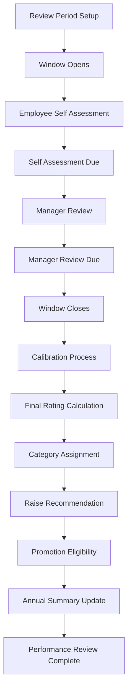
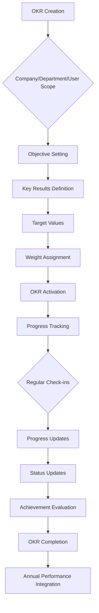
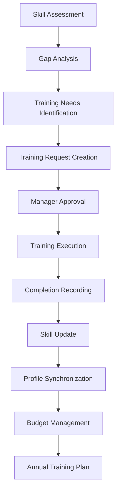
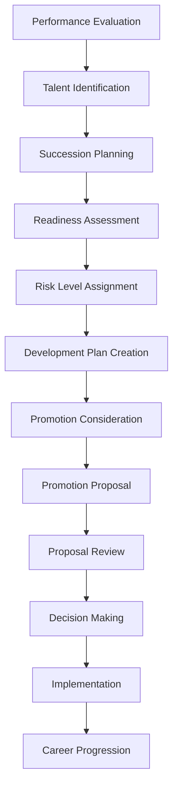

# Performance, OKRs & Career Development System - Technical Documentation

## Executive Overview

This document provides comprehensive technical documentation for BLIH Performance, OKRs & Career Development system, including all API endpoints, database models, TypeScript types, business logic workflows, and implementation gaps for enterprise HR requirements including Performance Review, Personal OKR Creation, Manager OKR Review, Annual Performance Summary, Training Needs Assessment, Career Development Plan, Internal Transfer Request, Salary Adjustment, and more.

### System Status Summary

- **Current Implementation**: 30% complete
- **Database Schema**: 100% complete (11 models)
- **TypeScript Types**: 100% complete
- **API Endpoints**: 45 implemented, 30+ missing
- **Business Logic**: Core performance and OKR workflows complete
- **Security**: RBAC permissions for implemented features

## 1. Database Architecture

### 1.1 Complete Database Models

#### Performance Management Models

```sql
-- ReviewPeriodConfig Model
CREATE TABLE "review_period_configs" (
  "id" UUID NOT NULL DEFAULT gen_random_uuid(),
  "year" INTEGER NOT NULL,
  "quarter" INTEGER NOT NULL,
  "type" "ReviewPeriodType" NOT NULL DEFAULT 'QUARTERLY',
  "window_opens_at" TIMESTAMP(3) NOT NULL,
  "self_assessment_due_at" TIMESTAMP(3) NOT NULL,
  "manager_review_due_at" TIMESTAMP(3) NOT NULL,
  "window_closes_at" TIMESTAMP(3) NOT NULL,
  "created_at" TIMESTAMP(3) NOT NULL DEFAULT CURRENT_TIMESTAMP,
  "updated_at" TIMESTAMP(3) NOT NULL DEFAULT CURRENT_TIMESTAMP,
  CONSTRAINT "review_period_configs_pkey" PRIMARY KEY ("id"),
  CONSTRAINT "review_period_configs_year_quarter_type_key" UNIQUE ("year", "quarter", "type")
);

-- PerformanceReview Model
CREATE TABLE "performance_reviews" (
  "id" UUID NOT NULL DEFAULT gen_random_uuid(),
  "employee_id" UUID NOT NULL,
  "period_config_id" UUID NOT NULL,
  "self_assessment" JSONB,
  "manager_review" JSONB,
  "final_rating" DECIMAL(3,2),
  "category" "PerformanceCategory",
  "raise_recommendation" JSONB,
  "promotion_eligible" BOOLEAN NOT NULL DEFAULT false,
  "completed_at" TIMESTAMP(3),
  "status" "ReviewStatus" NOT NULL DEFAULT 'NOT_STARTED',
  "created_at" TIMESTAMP(3) NOT NULL DEFAULT CURRENT_TIMESTAMP,
  "updated_at" TIMESTAMP(3) NOT NULL DEFAULT CURRENT_TIMESTAMP,
  CONSTRAINT "performance_reviews_pkey" PRIMARY KEY ("id"),
  CONSTRAINT "performance_reviews_employee_id_period_config_id_key" UNIQUE ("employee_id", "period_config_id")
);

-- PerformanceReviewFeedback Model
CREATE TABLE "performance_review_feedbacks" (
  "id" UUID NOT NULL DEFAULT gen_random_uuid(),
  "review_id" UUID NOT NULL,
  "reviewer_id" UUID NOT NULL,
  "role" "PerformanceFeedbackRole" NOT NULL,
  "ratings" JSONB,
  "comments" JSONB,
  "submitted_at" TIMESTAMP(3),
  "created_at" TIMESTAMP(3) NOT NULL DEFAULT CURRENT_TIMESTAMP,
  "updated_at" TIMESTAMP(3) NOT NULL DEFAULT CURRENT_TIMESTAMP,
  CONSTRAINT "performance_review_feedbacks_pkey" PRIMARY KEY ("id"),
  CONSTRAINT "performance_review_feedbacks_review_id_reviewer_id_role_key" UNIQUE ("review_id", "reviewer_id", "role")
);

-- PerformanceCalibration Model
CREATE TABLE "performance_calibrations" (
  "id" UUID NOT NULL DEFAULT gen_random_uuid(),
  "period_id" UUID NOT NULL,
  "department_id" UUID,
  "adjustments" JSONB,
  "finalized_by_id" UUID,
  "finalized_at" TIMESTAMP(3),
  "created_at" TIMESTAMP(3) NOT NULL DEFAULT CURRENT_TIMESTAMP,
  "updated_at" TIMESTAMP(3) NOT NULL DEFAULT CURRENT_TIMESTAMP,
  CONSTRAINT "performance_calibrations_pkey" PRIMARY KEY ("id"),
  CONSTRAINT "performance_calibrations_period_id_department_id_key" UNIQUE ("period_id", "department_id")
);
```

#### OKR Management Models

```sql
-- Okr Model
CREATE TABLE "okrs" (
  "id" UUID NOT NULL DEFAULT gen_random_uuid(),
  "employee_id" UUID,
  "scope" "OkrScope" NOT NULL DEFAULT 'USER',
  "department_id" UUID,
  "parent_okr_id" UUID,
  "period_year" INTEGER NOT NULL,
  "period_quarter" INTEGER NOT NULL,
  "title" VARCHAR(512) NOT NULL,
  "description" TEXT,
  "status" "OkrStatus" NOT NULL DEFAULT 'DRAFT',
  "overall_progress" INTEGER NOT NULL DEFAULT 0,
  "overall_status" "OkrStatus" NOT NULL DEFAULT 'ACTIVE',
  "start_date" DATE NOT NULL,
  "end_date" DATE NOT NULL,
  "created_at" TIMESTAMP(3) NOT NULL DEFAULT CURRENT_TIMESTAMP,
  "updated_at" TIMESTAMP(3) NOT NULL DEFAULT CURRENT_TIMESTAMP,
  CONSTRAINT "okrs_pkey" PRIMARY KEY ("id")
);

-- KeyResult Model
CREATE TABLE "key_results" (
  "id" UUID NOT NULL DEFAULT gen_random_uuid(),
  "okr_id" UUID NOT NULL,
  "title" VARCHAR(512) NOT NULL,
  "type" "KeyResultType" NOT NULL,
  "target_value" DECIMAL(15,4) NOT NULL,
  "current_value" DECIMAL(15,4),
  "progress" INTEGER NOT NULL DEFAULT 0,
  "status" "KeyResultStatus" NOT NULL DEFAULT 'NOT_STARTED',
  "weight" INTEGER NOT NULL DEFAULT 100,
  "sort_order" INTEGER NOT NULL DEFAULT 0,
  "created_at" TIMESTAMP(3) NOT NULL DEFAULT CURRENT_TIMESTAMP,
  "updated_at" TIMESTAMP(3) NOT NULL DEFAULT CURRENT_TIMESTAMP,
  CONSTRAINT "key_results_pkey" PRIMARY KEY ("id")
);

-- KeyResultUpdate Model
CREATE TABLE "key_result_updates" (
  "id" UUID NOT NULL DEFAULT gen_random_uuid(),
  "key_result_id" UUID NOT NULL,
  "previous_value" DECIMAL(15,4),
  "new_value" DECIMAL(15,4) NOT NULL,
  "comment" TEXT,
  "updated_by_id" UUID NOT NULL,
  "created_at" TIMESTAMP(3) NOT NULL DEFAULT CURRENT_TIMESTAMP,
  CONSTRAINT "key_result_updates_pkey" PRIMARY KEY ("id")
);
```

#### Training & Development Models

```sql
-- Skill Model
CREATE TABLE "skills" (
  "id" UUID NOT NULL DEFAULT gen_random_uuid(),
  "name" VARCHAR(255) NOT NULL,
  "category" VARCHAR(128),
  "description" TEXT,
  "created_at" TIMESTAMP(3) NOT NULL DEFAULT CURRENT_TIMESTAMP,
  "updated_at" TIMESTAMP(3) NOT NULL DEFAULT CURRENT_TIMESTAMP,
  CONSTRAINT "skills_pkey" PRIMARY KEY ("id"),
  CONSTRAINT "skills_name_key" UNIQUE ("name")
);

-- EmployeeSkill Model
CREATE TABLE "employee_skills" (
  "id" UUID NOT NULL DEFAULT gen_random_uuid(),
  "employee_id" UUID NOT NULL,
  "skill_id" UUID NOT NULL,
  "level" "SkillLevel" NOT NULL,
  "attested_at" TIMESTAMP(3),
  "source" "SkillSource" NOT NULL DEFAULT 'SELF',
  "created_at" TIMESTAMP(3) NOT NULL DEFAULT CURRENT_TIMESTAMP,
  "updated_at" TIMESTAMP(3) NOT NULL DEFAULT CURRENT_TIMESTAMP,
  CONSTRAINT "employee_skills_pkey" PRIMARY KEY ("id"),
  CONSTRAINT "employee_skills_employee_id_skill_id_key" UNIQUE ("employee_id", "skill_id")
);

-- TrainingRequest Model
CREATE TABLE "training_requests" (
  "id" UUID NOT NULL DEFAULT gen_random_uuid(),
  "employee_id" UUID NOT NULL,
  "department_id" UUID NOT NULL,
  "training_type" "TrainingType" NOT NULL DEFAULT 'SKILL',
  "title" VARCHAR(512) NOT NULL,
  "provider" VARCHAR(256),
  "start_date" DATE,
  "end_date" DATE,
  "duration_hours" INTEGER,
  "justification" TEXT,
  "skill_gap_link_id" UUID,
  "cost" DECIMAL(15,2),
  "cost_payer" "CostPayer",
  "status" "TrainingRequestStatus" NOT NULL DEFAULT 'DRAFT',
  "submitted_at" TIMESTAMP(3),
  "approved_by_id" UUID,
  "approved_at" TIMESTAMP(3),
  "rejection_reason" TEXT,
  "created_at" TIMESTAMP(3) NOT NULL DEFAULT CURRENT_TIMESTAMP,
  "updated_at" TIMESTAMP(3) NOT NULL DEFAULT CURRENT_TIMESTAMP,
  CONSTRAINT "training_requests_pkey" PRIMARY KEY ("id")
);

-- TrainingCompletion Model
CREATE TABLE "training_completions" (
  "id" UUID NOT NULL DEFAULT gen_random_uuid(),
  "employee_id" UUID NOT NULL,
  "training_request_id" UUID,
  "title" VARCHAR(512) NOT NULL,
  "provider" VARCHAR(256),
  "start_date" DATE,
  "end_date" DATE,
  "completion_status" "CompletionStatus" NOT NULL,
  "score_or_grade" VARCHAR(64),
  "certificate_number" VARCHAR(128),
  "certificate_url" VARCHAR(1024),
  "expiry_date" DATE,
  "skills_acquired" JSONB,
  "attested_at" TIMESTAMP(3),
  "synced_to_profile" BOOLEAN NOT NULL DEFAULT false,
  "created_at" TIMESTAMP(3) NOT NULL DEFAULT CURRENT_TIMESTAMP,
  "updated_at" TIMESTAMP(3) NOT NULL DEFAULT CURRENT_TIMESTAMP,
  CONSTRAINT "training_completions_pkey" PRIMARY KEY ("id")
);

-- TrainingBudget Model
CREATE TABLE "training_budgets" (
  "id" UUID NOT NULL DEFAULT gen_random_uuid(),
  "department_id" UUID NOT NULL,
  "year" INTEGER NOT NULL,
  "total_budget" DECIMAL(15,2) NOT NULL,
  "used_ytd" DECIMAL(15,2) NOT NULL DEFAULT 0,
  "per_person_amount" DECIMAL(15,2),
  "created_at" TIMESTAMP(3) NOT NULL DEFAULT CURRENT_TIMESTAMP,
  "updated_at" TIMESTAMP(3) NOT NULL DEFAULT CURRENT_TIMESTAMP,
  CONSTRAINT "training_budgets_pkey" PRIMARY KEY ("id"),
  CONSTRAINT "training_budgets_department_id_year_key" UNIQUE ("department_id", "year")
);

-- SkillGapAssessment Model
CREATE TABLE "skill_gap_assessments" (
  "id" UUID NOT NULL DEFAULT gen_random_uuid(),
  "department_id" UUID NOT NULL,
  "assessed_by_id" UUID NOT NULL,
  "assessed_at" TIMESTAMP(3) NOT NULL,
  "required_skills" JSONB NOT NULL,
  "current_state" JSONB NOT NULL,
  "critical_gaps_summary" TEXT,
  "training_recommendations" JSONB,
  "hire_recommendations" JSONB,
  "created_at" TIMESTAMP(3) NOT NULL DEFAULT CURRENT_TIMESTAMP,
  "updated_at" TIMESTAMP(3) NOT NULL DEFAULT CURRENT_TIMESTAMP,
  CONSTRAINT "skill_gap_assessments_pkey" PRIMARY KEY ("id")
);
```

#### Talent Management Models

```sql
-- SuccessionPlan Model
CREATE TABLE "succession_plans" (
  "id" UUID NOT NULL DEFAULT gen_random_uuid(),
  "position_id" UUID NOT NULL,
  "candidate_employee_id" UUID NOT NULL,
  "readiness" "SuccessionReadiness" NOT NULL,
  "risk_level" "SuccessionRiskLevel" NOT NULL,
  "notes" TEXT,
  "created_at" TIMESTAMP(3) NOT NULL DEFAULT CURRENT_TIMESTAMP,
  "updated_at" TIMESTAMP(3) NOT NULL DEFAULT CURRENT_TIMESTAMP,
  CONSTRAINT "succession_plans_pkey" PRIMARY KEY ("id"),
  CONSTRAINT "succession_plans_position_id_candidate_employee_id_key" UNIQUE ("position_id", "candidate_employee_id")
);

-- PromotionProposal Model
CREATE TABLE "promotion_proposals" (
  "id" UUID NOT NULL DEFAULT gen_random_uuid(),
  "employee_id" UUID NOT NULL,
  "from_position_id" UUID,
  "to_position_id" UUID,
  "proposed_by_id" UUID NOT NULL,
  "justification" JSONB,
  "status" "PromotionProposalStatus" NOT NULL DEFAULT 'PENDING',
  "approved_by_id" UUID,
  "approved_at" TIMESTAMP(3),
  "rejected_at" TIMESTAMP(3),
  "created_at" TIMESTAMP(3) NOT NULL DEFAULT CURRENT_TIMESTAMP,
  "updated_at" TIMESTAMP(3) NOT NULL DEFAULT CURRENT_TIMESTAMP,
  CONSTRAINT "promotion_proposals_pkey" PRIMARY KEY ("id")
);
```

### 1.2 Database Enums

```sql
-- Performance Management Enums
CREATE TYPE "ReviewPeriodType" AS ENUM ('QUARTERLY', 'ANNUAL');
CREATE TYPE "ReviewStatus" AS ENUM ('NOT_STARTED', 'SELF_PENDING', 'SELF_SUBMITTED', 'MANAGER_PENDING', 'MANAGER_SUBMITTED', 'COMPLETED');
CREATE TYPE "PerformanceCategory" AS ENUM ('UNSATISFACTORY', 'BELOW_EXPECTATIONS', 'MEETS_EXPECTATIONS', 'EXCEEDS_EXPECTATIONS', 'OUTSTANDING');
CREATE TYPE "PerformanceFeedbackRole" AS ENUM ('SELF', 'MANAGER', 'PEER', 'SKIP_LEVEL', 'DIRECT_REPORT');

-- OKR Management Enums
CREATE TYPE "OkrStatus" AS ENUM ('DRAFT', 'ACTIVE', 'AT_RISK', 'DELAYED', 'ACHIEVED', 'PARTIALLY_ACHIEVED', 'MISSED', 'COMPLETED');
CREATE TYPE "KeyResultType" AS ENUM ('NUMERIC', 'PERCENTAGE', 'BOOLEAN', 'MILESTONE');
CREATE TYPE "KeyResultStatus" AS ENUM ('NOT_STARTED', 'ON_TRACK', 'AT_RISK', 'DELAYED', 'ACHIEVED');
CREATE TYPE "OkrScope" AS ENUM ('COMPANY', 'DEPARTMENT', 'USER');

-- Training & Development Enums
CREATE TYPE "TrainingRequestStatus" AS ENUM ('DRAFT', 'PENDING', 'APPROVED', 'REJECTED', 'CANCELLED');
CREATE TYPE "TrainingType" AS ENUM ('SKILL', 'COMPLIANCE', 'LEADERSHIP', 'OTHER');
CREATE TYPE "CostPayer" AS ENUM ('COMPANY', 'SELF');
CREATE TYPE "CompletionStatus" AS ENUM ('COMPLETED', 'PARTIAL', 'DROPPED');
CREATE TYPE "SkillLevel" AS ENUM ('BEGINNER', 'INTERMEDIATE', 'ADVANCED', 'EXPERT');
CREATE TYPE "SkillSource" AS ENUM ('SELF', 'MANAGER', 'ASSESSMENT');

-- Talent Management Enums
CREATE TYPE "SuccessionReadiness" AS ENUM ('READY_NOW', 'ONE_YEAR', 'TWO_YEARS');
CREATE TYPE "SuccessionRiskLevel" AS ENUM ('LOW', 'MEDIUM', 'HIGH', 'CRITICAL');
CREATE TYPE "PromotionProposalStatus" AS ENUM ('PENDING', 'APPROVED', 'REJECTED');
```

## 2. TypeScript Types & DTOs

### 2.1 Performance Management Types

```typescript
// review-period.ts
export type ReviewPeriodType = 'QUARTERLY' | 'ANNUAL';

export type ReviewStatus =
  | 'NOT_STARTED'
  | 'SELF_PENDING'
  | 'SELF_SUBMITTED'
  | 'MANAGER_PENDING'
  | 'MANAGER_SUBMITTED'
  | 'COMPLETED';

export type PerformanceCategory =
  | 'UNSATISFACTORY'
  | 'BELOW_EXPECTATIONS'
  | 'MEETS_EXPECTATIONS'
  | 'EXCEEDS_EXPECTATIONS'
  | 'OUTSTANDING';

export type PerformanceFeedbackRole =
  | 'SELF'
  | 'MANAGER'
  | 'PEER'
  | 'SKIP_LEVEL'
  | 'DIRECT_REPORT';

export interface ReviewPeriodConfigResponseDto {
  id: string;
  year: number;
  quarter: number;
  type: ReviewPeriodType;
  windowOpensAt: string;
  selfAssessmentDueAt: string;
  managerReviewDueAt: string;
  windowClosesAt: string;
  createdAt: string;
  updatedAt: string;
}

export interface CreateReviewPeriodConfigDto {
  year: number;
  quarter: number;
  type?: ReviewPeriodType;
  windowOpensAt?: string;
  selfAssessmentDueAt?: string;
  managerReviewDueAt?: string;
  windowClosesAt?: string;
}

export interface PerformanceReviewResponseDto {
  id: string;
  employeeId: string;
  periodConfigId: string;
  selfAssessment: unknown;
  managerReview: unknown;
  finalRating: number | null;
  category: PerformanceCategory | null;
  raiseRecommendation: unknown;
  promotionEligible: boolean;
  completedAt: string | null;
  status: ReviewStatus;
  feedbacks?: PerformanceReviewFeedbackResponseDto[];
  createdAt: string;
  updatedAt: string;
}

export interface CreatePerformanceReviewDto {
  employeeId: string;
  periodConfigId: string;
}

export interface UpdateSelfAssessmentDto {
  goalRatings?: Array<{
    goalId: string;
    goal?: string;
    selfRating: number;
    evidence?: string;
  }>;
  achievements?: string;
  challenges?: string;
  supportNeeded?: string;
  careerAspirations?: string;
}

export interface UpdateManagerReviewDto {
  goalRatings?: Array<{
    goalId: string;
    goal?: string;
    managerRating: number;
    comments?: string;
  }>;
  overallRating?: number;
  strengths?: string[];
  developmentAreas?: string[];
  feedback?: string;
  recognition?: string;
}

export interface UpsertPerformanceReviewFeedbackDto {
  reviewerId: string;
  role: PerformanceFeedbackRole;
  ratings?: Record<string, unknown> | null;
  comments?: Record<string, unknown> | null;
  submittedAt?: string | null;
}

export interface PerformanceReviewFeedbackResponseDto {
  id: string;
  reviewId: string;
  reviewerId: string;
  role: PerformanceFeedbackRole;
  ratings: Record<string, unknown> | null;
  comments: Record<string, unknown> | null;
  submittedAt: string | null;
  createdAt: string;
  updatedAt: string;
}

export interface PerformanceCalibrationAdjustmentDto {
  reviewId: string;
  finalRating?: number | null;
  category?: PerformanceCategory | null;
  promotionEligible?: boolean;
  raiseRecommendation?: RaiseRecommendationDto | null;
  note?: string | null;
}

export interface UpsertPerformanceCalibrationDto {
  periodId: string;
  departmentId?: string | null;
  finalizedById?: string | null;
  finalizedAt?: string | null;
  adjustments?: {
    reviewAdjustments?: PerformanceCalibrationAdjustmentDto[];
    notes?: string | null;
  } | null;
}

export interface PerformanceCalibrationResponseDto {
  id: string;
  periodId: string;
  departmentId: string | null;
  adjustments: {
    reviewAdjustments?: PerformanceCalibrationAdjustmentDto[];
    notes?: string | null;
  } | null;
  finalizedById: string | null;
  finalizedAt: string | null;
  createdAt: string;
  updatedAt: string;
}

export interface RaiseRecommendationDto {
  minPercent: number;
  maxPercent: number;
}

export interface AnnualPerformanceSummaryDto {
  employeeId: string;
  year: number;
  completedReviews: number;
  averageRating: number | null;
  latestCategory: PerformanceCategory | null;
  raiseRecommendation: RaiseRecommendationDto | null;
  promotionEligible: boolean;
  okrCompletionPercent: number | null;
}
```

### 2.2 OKR Management Types

```typescript
// okr.ts
export type OkrStatus =
  | 'DRAFT'
  | 'ACTIVE'
  | 'AT_RISK'
  | 'DELAYED'
  | 'ACHIEVED'
  | 'PARTIALLY_ACHIEVED'
  | 'MISSED'
  | 'COMPLETED';

export type KeyResultType = 'NUMERIC' | 'PERCENTAGE' | 'BOOLEAN' | 'MILESTONE';

export type KeyResultStatus =
  | 'NOT_STARTED'
  | 'ON_TRACK'
  | 'AT_RISK'
  | 'DELAYED'
  | 'ACHIEVED';

export type OkrScope = 'COMPANY' | 'DEPARTMENT' | 'USER';

export interface KeyResultResponseDto {
  id: string;
  okrId: string;
  title: string;
  type: KeyResultType;
  targetValue: number;
  currentValue: number | null;
  progress: number;
  status: KeyResultStatus;
  weight: number;
  sortOrder: number;
  createdAt: string;
  updatedAt: string;
}

export interface KeyResultUpdateResponseDto {
  id: string;
  keyResultId: string;
  previousValue: number | null;
  newValue: number;
  comment: string | null;
  updatedById: string;
  createdAt: string;
}

export interface OkrResponseDto {
  id: string;
  employeeId: string | null;
  scope: OkrScope;
  departmentId: string | null;
  departmentName?: string | null;
  parentOkrId: string | null;
  periodYear: number;
  periodQuarter: number;
  title: string;
  description: string | null;
  status: OkrStatus;
  overallProgress: number;
  overallStatus: OkrStatus;
  startDate: string;
  endDate: string;
  createdAt: string;
  updatedAt: string;
  keyResults?: KeyResultResponseDto[];
}

export interface CreateOkrDto {
  employeeId?: string | null;
  scope: OkrScope;
  departmentId?: string | null;
  parentOkrId?: string | null;
  periodYear: number;
  periodQuarter: number;
  title: string;
  description?: string | null;
  startDate: string;
  endDate: string;
  keyResults?: CreateKeyResultDto[];
}

export interface CreateKeyResultDto {
  title: string;
  type: KeyResultType;
  targetValue: number;
  currentValue?: number | null;
  weight?: number;
  sortOrder?: number;
}

export interface UpdateOkrDto {
  title?: string;
  description?: string | null;
  status?: OkrStatus;
  departmentId?: string | null;
  startDate?: string;
  endDate?: string;
}

export interface UpdateKeyResultDto {
  title?: string;
  currentValue?: number | null;
  sortOrder?: number;
  updatedById?: string;
  comment?: string | null;
}

export interface ReweightKeyResultsDto {
  weights: Array<{
    keyResultId: string;
    weight: number;
  }>;
}

export interface OkrProgressResponseDto {
  okrId: string;
  overallProgress: number;
  overallStatus: OkrStatus;
  keyResults: Array<{
    id: string;
    title: string;
    progress: number;
    status: KeyResultStatus;
    weight: number;
  }>;
}
```

### 2.3 Training & Development Types

```typescript
// request.ts
export type TrainingRequestStatus =
  | 'DRAFT'
  | 'PENDING'
  | 'APPROVED'
  | 'REJECTED'
  | 'CANCELLED';
export type TrainingType = 'SKILL' | 'COMPLIANCE' | 'LEADERSHIP' | 'OTHER';
export type CostPayer = 'COMPANY' | 'SELF';

export interface TrainingRequestResponseDto {
  id: string;
  employeeId: string;
  departmentId: string;
  trainingType: TrainingType;
  title: string;
  provider: string | null;
  startDate: string | null;
  endDate: string | null;
  durationHours: number | null;
  justification: string | null;
  skillGapLinkId: string | null;
  cost: number | null;
  costPayer: CostPayer | null;
  status: TrainingRequestStatus;
  submittedAt: string | null;
  approvedById: string | null;
  approvedAt: string | null;
  rejectionReason: string | null;
  createdAt: string;
  updatedAt: string;
}

export interface CreateTrainingRequestDto {
  employeeId: string;
  departmentId: string;
  trainingType: TrainingType;
  title: string;
  provider?: string | null;
  startDate?: string | null;
  endDate?: string | null;
  durationHours?: number | null;
  justification?: string | null;
  skillGapLinkId?: string | null;
  cost?: number | null;
  costPayer?: CostPayer | null;
  submit?: boolean;
}

export interface ApproveTrainingRequestDto {
  approved: boolean;
  rejectionReason?: string | null;
}

// completion.ts
export type CompletionStatus = 'COMPLETED' | 'PARTIAL' | 'DROPPED';

export interface TrainingCompletionResponseDto {
  id: string;
  employeeId: string;
  trainingRequestId: string | null;
  title: string;
  provider: string | null;
  startDate: string | null;
  endDate: string | null;
  completionStatus: CompletionStatus;
  scoreOrGrade: string | null;
  certificateNumber: string | null;
  certificateUrl: string | null;
  expiryDate: string | null;
  skillsAcquired: unknown;
  attestedAt: string | null;
  syncedToProfile: boolean;
  createdAt: string;
  updatedAt: string;
}

export interface CreateTrainingCompletionDto {
  trainingRequestId?: string | null;
  title: string;
  provider?: string | null;
  startDate?: string | null;
  endDate?: string | null;
  completionStatus: CompletionStatus;
  scoreOrGrade?: string | null;
  certificateNumber?: string | null;
  certificateUrl?: string | null;
  expiryDate?: string | null;
  skillsAcquired?: unknown;
  attestedAt?: string | null;
  syncedToProfile?: boolean;
}

export interface UpdateTrainingCompletionDto {
  completionStatus?: CompletionStatus;
  scoreOrGrade?: string | null;
  certificateNumber?: string | null;
  certificateUrl?: string | null;
  expiryDate?: string | null;
  skillsAcquired?: unknown;
  attestedAt?: string | null;
  syncedToProfile?: boolean;
}

// skill-gap.ts
export interface CreateSkillGapAssessmentDto {
  departmentId: string;
  requiredSkills: unknown;
  currentState: unknown;
  criticalGapsSummary?: string | null;
  trainingRecommendations?: unknown;
  hireRecommendations?: unknown;
}

export interface SkillGapAssessmentResponseDto {
  id: string;
  departmentId: string;
  assessedById: string;
  assessedAt: string;
  requiredSkills: unknown;
  currentState: unknown;
  criticalGapsSummary: string | null;
  trainingRecommendations: unknown;
  hireRecommendations: unknown;
  createdAt: string;
  updatedAt: string;
}

export interface GetIndividualSkillGapDto {
  employeeId: string;
  periodYear?: number;
}
```

### 2.4 Talent Management Types

```typescript
// talent.ts
export type SuccessionReadiness = 'READY_NOW' | 'ONE_YEAR' | 'TWO_YEARS';
export type SuccessionRiskLevel = 'LOW' | 'MEDIUM' | 'HIGH' | 'CRITICAL';

export interface SuccessionPlanResponseDto {
  id: string;
  positionId: string;
  candidateEmployeeId: string;
  readiness: SuccessionReadiness;
  riskLevel: SuccessionRiskLevel;
  notes: string | null;
  createdAt: string;
  updatedAt: string;
}

export interface CreateSuccessionPlanDto {
  positionId: string;
  candidateEmployeeId: string;
  readiness: SuccessionReadiness;
  riskLevel: SuccessionRiskLevel;
  notes?: string | null;
}

export interface UpdateSuccessionPlanDto {
  readiness?: SuccessionReadiness;
  riskLevel?: SuccessionRiskLevel;
  notes?: string | null;
}

export type PromotionProposalStatus = 'PENDING' | 'APPROVED' | 'REJECTED';

export interface PromotionProposalResponseDto {
  id: string;
  employeeId: string;
  fromPositionId: string | null;
  toPositionId: string | null;
  proposedById: string;
  justification: Record<string, unknown> | null;
  status: PromotionProposalStatus;
  approvedById: string | null;
  approvedAt: string | null;
  rejectedAt: string | null;
  createdAt: string;
  updatedAt: string;
}

export interface CreatePromotionProposalDto {
  employeeId: string;
  toPositionId: string;
  proposedById: string;
  justification?: Record<string, unknown> | null;
}

export interface ReviewPromotionProposalDto {
  status: Extract<PromotionProposalStatus, 'APPROVED' | 'REJECTED'>;
  approvedById: string;
  approvedAt?: string | null;
  compensationAdjustment?: {
    baseSalary?: string;
    currency?: string;
    effectiveFrom?: string;
    changeReason?: string;
  } | null;
}
```

## 3. API Endpoints Documentation

### 3.1 Implemented Performance Management Endpoints (12 total)

#### Base Path: `/api/v1/hr/performance`

| Method | Path                         | Description                                | Permissions                                      |
| ------ | ---------------------------- | ------------------------------------------ | ------------------------------------------------ |
| GET    | `/periods`                   | List review period configs                 | `performance:view`, `performance:manage_periods` |
| POST   | `/periods`                   | Create or get review period config         | `performance:manage_periods`                     |
| GET    | `/reviews`                   | List performance reviews                   | `performance:view`                               |
| GET    | `/reviews/:id`               | Get performance review                     | `performance:view`                               |
| POST   | `/reviews`                   | Create performance review                  | `performance:create`                             |
| PATCH  | `/reviews/:id/self`          | Submit self assessment                     | `performance:update_self`                        |
| PATCH  | `/reviews/:id/manager`       | Submit manager review                      | `performance:update_manager`                     |
| POST   | `/reviews/:id/complete`      | Complete review (compute rating and raise) | `performance:complete`                           |
| GET    | `/reviews/:id/feedback`      | List 360 performance feedback              | `performance:view`                               |
| POST   | `/reviews/:id/feedback`      | Create or update 360 performance feedback  | `performance:update_feedback`                    |
| GET    | `/calibrations`              | List performance calibrations              | `performance:view`, `performance:calibrate`      |
| POST   | `/calibrations`              | Create or update a calibration pack        | `performance:calibrate`                          |
| GET    | `/summary/:employeeId/:year` | Get annual performance summary             | `performance:view_summary`, `performance:view`   |

#### Request/Response Examples

**POST /api/v1/hr/performance/reviews**

```typescript
// Request
{
  "employeeId": "uuid",
  "periodConfigId": "uuid"
}

// Response
{
  "id": "uuid",
  "employeeId": "uuid",
  "periodConfigId": "uuid",
  "selfAssessment": null,
  "managerReview": null,
  "finalRating": null,
  "category": null,
  "raiseRecommendation": null,
  "promotionEligible": false,
  "completedAt": null,
  "status": "NOT_STARTED",
  "feedbacks": [],
  "createdAt": "2026-03-04T10:00:00Z",
  "updatedAt": "2026-03-04T10:00:00Z"
}
```

### 3.2 Implemented OKR Management Endpoints (8 total)

#### Base Path: `/api/v1/hr/okrs`

| Method | Path                             | Description                                        | Permissions                     |
| ------ | -------------------------------- | -------------------------------------------------- | ------------------------------- |
| POST   | `/`                              | Create OKR with optional key results               | `okr:create`                    |
| GET    | `/`                              | List OKRs                                          | `okr:view`                      |
| GET    | `/:id`                           | Get OKR                                            | `okr:view`                      |
| PATCH  | `/:id`                           | Update OKR                                         | `okr:update`                    |
| PATCH  | `/:id/key-results/:krId`         | Update key result (recomputes progress)            | `okr:update_key_result`         |
| GET    | `/:id/progress`                  | Get OKR progress                                   | `okr:view`                      |
| GET    | `/:id/key-results/:krId/updates` | List key result check-in history                   | `okr:view`, `okr:view_checkins` |
| POST   | `/:id/key-results/weights`       | Reweight key results in a single normalized update | `okr:reweight`                  |

### 3.3 Implemented Training Management Endpoints (17 total)

#### Base Path: `/api/v1/hr/training`

| Method | Path                            | Description                 | Permissions                               |
| ------ | ------------------------------- | --------------------------- | ----------------------------------------- |
| GET    | `/skills`                       | List skills                 | `training:view`, `training:manage_skills` |
| POST   | `/skills`                       | Create skill                | `training:manage_skills`                  |
| GET    | `/employees/:employeeId/skills` | Get employee skills         | `training:view`                           |
| POST   | `/employees/:employeeId/skills` | Upsert employee skills      | `training:view`                           |
| GET    | `/budget`                       | Get training budget         | `training:view`                           |
| POST   | `/requests`                     | Create training request     | `training:create`                         |
| GET    | `/requests`                     | List training requests      | `training:view`                           |
| GET    | `/requests/:id`                 | Get training request        | `training:view`                           |
| POST   | `/requests/:id/approve`         | Approve training request    | `training:approve`                        |
| POST   | `/requests/:id/complete`        | Create training completion  | `training:create`                         |
| GET    | `/completions`                  | List training completions   | `training:view`                           |
| GET    | `/completions/:id`              | Get training completion     | `training:view`                           |
| PATCH  | `/completions/:id`              | Update training completion  | `training:create`                         |
| POST   | `/skill-gaps`                   | Create skill gap assessment | `training:create`                         |
| GET    | `/skill-gaps`                   | List skill gap assessments  | `training:view`                           |
| GET    | `/skill-gaps/:id`               | Get skill gap assessment    | `training:view`                           |
| GET    | `/skill-gaps/individual`        | Get individual skill gap    | `training:view`                           |

### 3.4 Implemented Talent Management Endpoints (8 total)

#### Base Path: `/api/v1/hr/promotion-proposals` and `/api/v1/hr/succession-plans`

| Method | Path                              | Description                          | Permissions                 |
| ------ | --------------------------------- | ------------------------------------ | --------------------------- |
| GET    | `/promotion-proposals`            | List promotion proposals             | `promotion_proposal:view`   |
| GET    | `/promotion-proposals/:id`        | Get promotion proposal               | `promotion_proposal:view`   |
| POST   | `/promotion-proposals`            | Create promotion proposal            | `promotion_proposal:create` |
| POST   | `/promotion-proposals/:id/review` | Approve or reject promotion proposal | `promotion_proposal:review` |
| GET    | `/succession-plans`               | List succession plans                | `succession_plan:view`      |
| POST   | `/succession-plans`               | Create succession plan               | `succession_plan:create`    |
| GET    | `/succession-plans/:id`           | Get succession plan                  | `succession_plan:view`      |
| PATCH  | `/succession-plans/:id`           | Update succession plan               | `succession_plan:update`    |

### 3.5 Missing API Endpoints (30+ planned)

#### Career Development Plan Endpoints

| Method | Path                                     | Description                        | Status     |
| ------ | ---------------------------------------- | ---------------------------------- | ---------- |
| GET    | `/career-development-plans`              | List career development plans      | ❌ Missing |
| POST   | `/career-development-plans`              | Create career development plan     | ❌ Missing |
| GET    | `/career-development-plans/:id`          | Get career development plan        | ❌ Missing |
| PATCH  | `/career-development-plans/:id`          | Update career development plan     | ❌ Missing |
| POST   | `/career-development-plans/:id/progress` | Update career development progress | ❌ Missing |

#### Internal Transfer Request Endpoints

| Method | Path                              | Description                      | Status     |
| ------ | --------------------------------- | -------------------------------- | ---------- |
| GET    | `/internal-transfers`             | List internal transfer requests  | ❌ Missing |
| POST   | `/internal-transfers`             | Create internal transfer request | ❌ Missing |
| GET    | `/internal-transfers/:id`         | Get transfer request             | ❌ Missing |
| PATCH  | `/internal-transfers/:id`         | Update transfer request          | ❌ Missing |
| POST   | `/internal-transfers/:id/approve` | Approve transfer request         | ❌ Missing |
| POST   | `/internal-transfers/:id/reject`  | Reject transfer request          | ❌ Missing |

#### Salary Adjustment Endpoints

| Method | Path                              | Description                      | Status     |
| ------ | --------------------------------- | -------------------------------- | ---------- |
| GET    | `/salary-adjustments`             | List salary adjustments          | ❌ Missing |
| POST   | `/salary-adjustments`             | Create salary adjustment request | ❌ Missing |
| GET    | `/salary-adjustments/:id`         | Get salary adjustment            | ❌ Missing |
| PATCH  | `/salary-adjustments/:id`         | Update salary adjustment         | ❌ Missing |
| POST   | `/salary-adjustments/:id/approve` | Approve salary adjustment        | ❌ Missing |
| POST   | `/salary-adjustments/:id/reject`  | Reject salary adjustment         | ❌ Missing |

#### Career Path Planning Endpoints

| Method | Path                      | Description            | Status     |
| ------ | ------------------------- | ---------------------- | ---------- |
| GET    | `/career-paths`           | List career paths      | ❌ Missing |
| POST   | `/career-paths`           | Create career path     | ❌ Missing |
| GET    | `/career-paths/:id`       | Get career path        | ❌ Missing |
| PATCH  | `/career-paths/:id`       | Update career path     | ❌ Missing |
| GET    | `/career-paths/:id/roles` | List career path roles | ❌ Missing |

#### Mentorship Program Endpoints

| Method | Path                                | Description               | Status     |
| ------ | ----------------------------------- | ------------------------- | ---------- |
| GET    | `/mentorship-programs`              | List mentorship programs  | ❌ Missing |
| POST   | `/mentorship-programs`              | Create mentorship program | ❌ Missing |
| GET    | `/mentorship-programs/:id`          | Get mentorship program    | ❌ Missing |
| PATCH  | `/mentorship-programs/:id`          | Update mentorship program | ❌ Missing |
| GET    | `/mentorship-programs/:id/matches`  | List mentorship matches   | ❌ Missing |
| POST   | `/mentorship-programs/:id/sessions` | Create mentorship session | ❌ Missing |

#### Performance Improvement Plan Endpoints

| Method | Path                                          | Description  | Status     |
| ------ | --------------------------------------------- | ------------ | ---------- |
| GET    | `/performance-improvement-plans`              | List PIPs    | ❌ Missing |
| POST   | `/performance-improvement-plans`              | Create PIP   | ❌ Missing |
| GET    | `/performance-improvement-plans/:id`          | Get PIP      | ❌ Missing |
| PATCH  | `/performance-improvement-plans/:id`          | Update PIP   | ❌ Missing |
| POST   | `/performance-improvement-plans/:id/complete` | Complete PIP | ❌ Missing |

#### Career Coaching Endpoints

| Method | Path                           | Description                   | Status     |
| ------ | ------------------------------ | ----------------------------- | ---------- |
| GET    | `/career-coaching`             | List career coaching sessions | ❌ Missing |
| POST   | `/career-coaching`             | Create coaching session       | ❌ Missing |
| GET    | `/career-coaching/:id`         | Get coaching session          | ❌ Missing |
| PATCH  | `/career-coaching/:id`         | Update coaching session       | ❌ Missing |
| POST   | `/career-coaching/:id/outcome` | Record coaching outcome       | ❌ Missing |

## 4. Business Logic Workflows

### 4.1 Performance Review Workflow



### 4.2 OKR Management Workflow



### 4.3 Training Management Workflow



### 4.4 Talent Management Workflow



## 5. Security & Permissions

### 5.1 RBAC Permission Matrix

| Resource             | View | Create | Update | Complete | Calibrate | Feedback | Manage |
| -------------------- | ---- | ------ | ------ | -------- | --------- | -------- | ------ |
| Performance Reviews  | ✅   | ✅     | ✅     | ✅       | ✅        | ✅       | ❌     |
| Review Periods       | ✅   | ❌     | ❌     | ❌       | ❌        | ✅       | ✅     |
| OKRs                 | ✅   | ✅     | ✅     | ❌       | ❌        | ❌       | ❌     |
| Key Results          | ✅   | ❌     | ✅     | ❌       | ❌        | ❌       | ❌     |
| Training Requests    | ✅   | ✅     | ✅     | ❌       | ❌        | ✅       | ❌     |
| Training Completions | ✅   | ✅     | ✅     | ❌       | ❌        | ❌       | ❌     |
| Skills               | ✅   | ✅     | ✅     | ❌       | ❌        | ❌       | ✅     |
| Promotion Proposals  | ✅   | ✅     | ❌     | ❌       | ❌        | ❌       | ❌     |
| Succession Plans     | ✅   | ✅     | ✅     | ❌       | ❌        | ❌       | ❌     |

### 5.2 Current Permission Constants

```typescript
export const PerformancePermissions = {
  VIEW: 'performance:view',
  CREATE: 'performance:create',
  UPDATE_SELF: 'performance:update_self',
  UPDATE_MANAGER: 'performance:update_manager',
  COMPLETE: 'performance:complete',
  CALIBRATE: 'performance:calibrate',
  VIEW_SUMMARY: 'performance:view_summary',
  UPDATE_FEEDBACK: 'performance:update_feedback',
  MANAGE_PERIODS: 'performance:manage_periods',
  ALL: 'performance:*',
} as const;

export const OkrPermissions = {
  VIEW: 'okr:view',
  CREATE: 'okr:create',
  UPDATE: 'okr:update',
  UPDATE_KEY_RESULT: 'okr:update_key_result',
  REWEIGHT: 'okr:reweight',
  VIEW_CHECKINS: 'okr:view_checkins',
  ALL: 'okr:*',
} as const;

export const TrainingPermissions = {
  VIEW: 'training:view',
  CREATE: 'training:create',
  APPROVE: 'training:approve',
  MANAGE_SKILLS: 'training:manage_skills',
  ALL: 'training:*',
} as const;

export const PromotionProposalPermissions = {
  VIEW: 'promotion_proposal:view',
  CREATE: 'promotion_proposal:create',
  REVIEW: 'promotion_proposal:review',
  ALL: 'promotion_proposal:*',
} as const;

export const SuccessionPlanPermissions = {
  VIEW: 'succession_plan:view',
  CREATE: 'succession_plan:create',
  UPDATE: 'succession_plan:update',
  ALL: 'succession_plan:*',
} as const;
```

### 5.3 Missing Permission Constants

```typescript
// Required for missing functionality
export const CareerDevelopmentPermissions = {
  VIEW: 'career_development:view',
  CREATE: 'career_development:create',
  UPDATE: 'career_development:update',
  MANAGE: 'career_development:manage',
  ALL: 'career_development:*',
} as const;

export const InternalTransferPermissions = {
  VIEW: 'internal_transfer:view',
  CREATE: 'internal_transfer:create',
  UPDATE: 'internal_transfer:update',
  APPROVE: 'internal_transfer:approve',
  ALL: 'internal_transfer:*',
} as const;

export const SalaryAdjustmentPermissions = {
  VIEW: 'salary_adjustment:view',
  CREATE: 'salary_adjustment:create',
  UPDATE: 'salary_adjustment:update',
  APPROVE: 'salary_adjustment:approve',
  ALL: 'salary_adjustment:*',
} as const;

export const CareerPathPermissions = {
  VIEW: 'career_path:view',
  CREATE: 'career_path:create',
  UPDATE: 'career_path:update',
  MANAGE: 'career_path:manage',
  ALL: 'career_path:*',
} as const;

export const MentorshipPermissions = {
  VIEW: 'mentorship:view',
  CREATE: 'mentorship:create',
  UPDATE: 'mentorship:update',
  MANAGE: 'mentorship:manage',
  ALL: 'mentorship:*',
} as const;

export const PerformanceImprovementPermissions = {
  VIEW: 'performance_improvement:view',
  CREATE: 'performance_improvement:create',
  UPDATE: 'performance_improvement:update',
  COMPLETE: 'performance_improvement:complete',
  MANAGE: 'performance_improvement:manage',
  ALL: 'performance_improvement:*',
} as const;

export const CareerCoachingPermissions = {
  VIEW: 'career_coaching:view',
  CREATE: 'career_coaching:create',
  UPDATE: 'career_coaching:update',
  MANAGE: 'career_coaching:manage',
  ALL: 'career_coaching:*',
} as const;
```

## 6. Implementation Gap Analysis

### 6.1 Current Implementation Status

#### ✅ Completed Components (30%)

- **Performance Management**: Complete review cycles, calibrations, feedback, annual summaries
- **OKR Management**: Complete OKR creation, updates, progress tracking, key results
- **Training Management**: Complete skill management, training requests, completions, budgets, gaps
- **Talent Management**: Complete promotion proposals, succession planning
- **Database Schema**: All 11 models with relationships and constraints
- **TypeScript Types**: Complete DTOs and interfaces
- **Security**: RBAC permissions for all implemented features

#### ❌ Missing Components (70%)

**Critical Missing APIs:**

1. **Career Development Plan Controller** - No career development planning system
2. **Internal Transfer Request Controller** - No internal transfer management
3. **Salary Adjustment Controller** - No salary adjustment workflows
4. **Career Path Planning Controller** - No career path management
5. **Mentorship Program Controller** - No mentorship management
6. **Performance Improvement Plan Controller** - No PIP management
7. **Career Coaching Controller** - No coaching session management

**Missing Business Logic:**

- Career development goal validation and progress tracking
- Internal transfer request evaluation and approval matrices
- Salary adjustment calculation algorithms and policy enforcement
- Career path progression logic and skill requirements
- Mentorship matching algorithms and effectiveness tracking
- PIP creation, monitoring, and completion workflows
- Career coaching session management and outcome tracking

### 6.2 Enterprise Requirements Gap

**Performance & Career Management Essentials:**

- Career development planning with goal tracking and progress monitoring
- Internal mobility and transfer management with approval workflows
- Salary adjustment and compensation review processes
- Career path planning with role progression and skill requirements
- Mentorship program management with matching and effectiveness tracking
- Performance improvement plan (PIP) workflows with monitoring and completion
- Career coaching session management with outcome tracking

**Integration Requirements:**

- Performance data integration with compensation and promotion systems
- Career development integration with learning management systems
- Internal transfer coordination with department and position management
- Salary adjustment integration with payroll and finance systems
- Mentorship program integration with performance and development systems
- Career coaching integration with performance and talent management

## 7. Implementation Roadmap

### Phase 1: Career Development Planning (4-6 weeks)

- Create career development plan models and APIs
- Implement goal setting and progress tracking workflows
- Add development plan templates and validation rules
- Create career development reporting and analytics
- Integrate with performance and training systems

### Phase 2: Internal Transfer & Mobility (6-8 weeks)

- Create internal transfer request models and APIs
- Implement transfer evaluation and approval workflows
- Add transfer coordination and transition management
- Create mobility reporting and analytics
- Integrate with position and department management

### Phase 3: Salary Adjustment & Compensation (4-6 weeks)

- Create salary adjustment models and APIs
- Implement adjustment calculation algorithms and policy enforcement
- Add adjustment approval workflows with multi-level approvals
- Create compensation reporting and analytics
- Integrate with payroll and finance systems

### Phase 4: Advanced Career Features (6-8 weeks)

- Create career path planning system
- Implement mentorship program management
- Add performance improvement plan (PIP) workflows
- Create career coaching session management
- Implement advanced analytics and reporting

## 8. Integration Points

### 8.1 Internal System Integrations

**Performance Management Integration:**

- Employee profile data for performance reviews
- Compensation data integration for raise recommendations
- Position and department information for calibration
- Training and skill data integration for development planning

**Career Development Integration:**

- Performance data for career development planning
- Training completion data for skill development
- Position and role data for career path planning
- Mentorship program integration with talent management

**Talent Management Integration:**

- Performance data for promotion considerations
- Position and department data for succession planning
- Employee profile data for talent identification
- Career development data for readiness assessment

### 8.2 External System Integrations

**Learning Management Systems:**

- Training program integration and completion tracking
- Skill assessment and certification management
- Career development plan progress synchronization
- Mentorship program coordination

**Compensation Systems:**

- Salary adjustment integration and approval workflows
- Promotion and compensation change processing
- Performance-based compensation calculations
- Budget management and approval integration

**Career Development Platforms:**

- Career path planning tools integration
- Mentorship program platforms
- Professional development resources
- External learning and certification providers

## 9. Testing Strategy

### 9.1 Unit Testing

- Performance rating calculation logic validation
- OKR progress and achievement testing
- Training request and completion workflow testing
- Career development plan logic testing
- Transfer request evaluation and approval testing

### 9.2 Integration Testing

- End-to-end performance review workflows
- OKR creation and achievement cycles
- Training request to completion processes
- Career development planning and progress tracking
- Cross-module data consistency validation

### 9.3 Performance Testing

- Large dataset performance queries and reporting
- Concurrent performance review processing
- Training request and completion performance
- Career development analytics performance
- Multi-user career planning and tracking

### 9.4 Security Testing

- Permission enforcement validation for all career features
- Data access control and privacy testing
- Performance data confidentiality testing
- Audit trail completeness and accuracy testing

## 10. Success Metrics

### 10.1 Operational Metrics

- **Performance Review Completion**: >95% on-time completion
- **OKR Achievement Rate**: >85% target achievement
- **Training Request Processing**: <48 hours for approval
- **Career Development Plan Progress**: >80% goal completion
- **System Availability**: >99.9% uptime during business hours
- **Response Time**: <2 seconds for all API endpoints

### 10.2 Business Metrics

- **Employee Career Satisfaction**: >85% satisfaction with development opportunities
- **Internal Mobility Rate**: >15% internal transfers annually
- **Promotion from Within Rate**: >60% promotions from internal candidates
- **Skill Development Effectiveness**: >75% skill gap reduction through training
- **Mentorship Program Success**: >70% career progression for mentees
- **Performance Improvement Success**: >80% successful PIP completions

### 10.3 Technical Metrics

- **Code Coverage**: >90% test coverage for all modules
- **Bug Rate**: <5 critical bugs per release
- **Performance**: <500ms average response time for all endpoints
- **Scalability**: Support 10,000+ concurrent users
- **Data Accuracy**: >99.5% data integrity across all modules

---

## Conclusion

The BLIH Performance, OKRs & Career Development system provides a solid foundation with 30% implementation complete. The database schema and core APIs for performance management, OKRs, training, and talent management are well-designed and functional. However, significant gaps exist in enterprise career development features including career development planning, internal transfer management, salary adjustment, career path planning, mentorship programs, and performance improvement plans.

The 4-phase implementation roadmap will transform the current system into a comprehensive enterprise performance and career development solution capable of handling complex business requirements, ensuring talent development, and providing valuable insights for organizational growth and employee career progression.

**Key Next Steps:**

1. Implement career development planning system with goal tracking
2. Add internal transfer request and approval workflows
3. Create salary adjustment and compensation management
4. Develop advanced career features (paths, mentorship, PIP, coaching)

This documentation serves as a definitive technical reference for developers, business stakeholders, and implementation teams working on Performance, OKRs & Career Development system.
