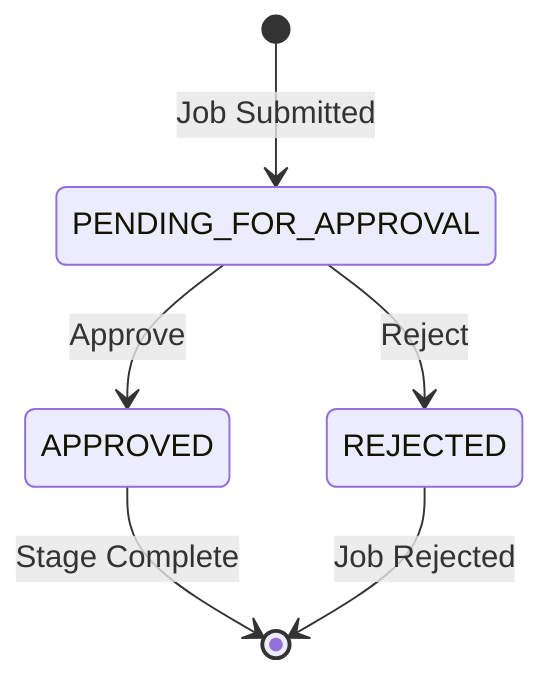
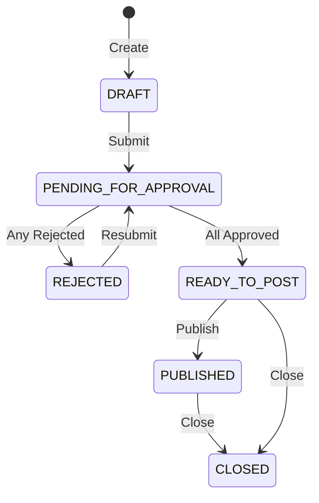

# BLIH Recruitment Flow: Job Creation to Posting

## Overview

The BLIH Recruitment System implements a multi-stage approval workflow for job creation, ensuring proper governance, budget validation, and organizational alignment before positions are published.

**Workflow**: DRAFT → PENDING_FOR_APPROVAL → READY_TO_POST → PUBLISHED → CLOSED (or REJECTED)

## Database Models

### JobRequestForm

Stores recruitment request metadata and approval workflow state.

**Key Fields**:

- `requestType`: NEW, REPLACEMENT, EXPANSION
- `urgency`: LOW, MEDIUM, HIGH, CRITICAL
- `status`: DRAFT, PENDING_FOR_APPROVAL, READY_TO_POST, REJECTED
- `priority`: MEDIUM (default), HIGH, LOW
- `approvals`: JobApprovalStep[] (3 stages)

### Job

Stores published job details visible to candidates.

**Key Fields**:

- `slug`: URL-friendly unique identifier
- `salaryMode`: COMPETITIVE, NEGOTIABLE, NOT_SPECIFIED
- `creatorIsHr`: Flag for auto-approval logic
- Metrics: viewsCount, applicationsCount, shortlistedCount, interviewsCount, offersCount, hiresCount

### JobApprovalStep

Tracks individual approval stages (FINANCE Level 1, GM Level 2, HR Level 3).

**Fields**: department, level, status (PENDING_FOR_APPROVAL, APPROVED, REJECTED), approverId, currentNote

### JobApplicationForm

Defines application form structure with applicantFields, sections, customFields.

## Recruitment Workflow

### Phase 1: Job Creation (DRAFT)

**Endpoint**: `POST /api/v1/hr/recruitment/jobs`

**Request Structure**:

```json
{
  "requestForm": {
    "jobTitle": "Senior Frontend Engineer",
    "department": "uuid",
    "position": "uuid",
    "requestType": "replacement",
    "businessJustification": "Backfill critical role",
    "employmentType": "full_time",
    "workMode": "hybrid",
    "urgency": "high",
    "neededByDate": "2026-03-30"
  },
  "job": {
    "title": "Senior Frontend Engineer",
    "departmentId": "uuid",
    "positionId": "uuid",
    "description": {"type": "doc", "content": [...]},
    "experienceLevel": "senior",
    "contractType": "permanent",
    "workLocationType": "hybrid",
    "openings": 2,
    "salaryMin": 2000,
    "salaryMax": 3000,
    "currency": "USD",
    "requiredSkills": ["React", "TypeScript"],
    "responsibilities": ["Lead frontend delivery"],
    "applicationDeadline": "2026-04-30T23:59:59.000Z"
  },
  "applicationForm": {
    "applicantFields": [
      {"key": "PHONE", "enabled": true, "required": false}
    ],
    "sections": [
      {"key": "EDUCATION", "enabled": true, "required": false}
    ],
    "customFields": [
      {"id": "custom-123", "label": "Portfolio", "type": "text"}
    ]
  }
}
```

**Validations**:

- Department and position belong to same department
- Salary range valid (min ≤ max)
- Application form configuration valid
- Unique slug generation

**Response**: Job with DRAFT status, requestForm, applicationForm, empty approvals

### Phase 2: Job Submission (PENDING_FOR_APPROVAL)

**Endpoint**: `POST /api/v1/hr/recruitment/jobs/{id}/submit`

**Validations**:

- Title present
- Description present (non-empty object)
- Department and position assigned
- Experience level, contract type, work location specified
- Openings ≥ 1
- Salary range valid
- At least 1 required skill and responsibility
- Application deadline in future

**Process**:

1. Creates 3 approval steps (FINANCE, GM, HR) with PENDING_FOR_APPROVAL
2. Auto-approves HR step if creator has HR role (reason: "CREATOR_HAS_HR_ROLE")
3. Updates requestForm status to PENDING_FOR_APPROVAL
4. Sets pendingApprovalAt timestamp

### Phase 3: Approval Workflow (PENDING_FOR_APPROVAL)

**Endpoint**: `POST /api/v1/hr/recruitment/jobs/{id}/approve`

#### Approval Structure

The approval workflow consists of three independent stages that process in parallel:

```
┌─────────────────────────────────────────────────────────────────┐
│                    JOB APPROVAL WORKFLOW                         │
├─────────────────────────────────────────────────────────────────┤
│                                                                  │
│  ┌──────────────┐  ┌──────────────┐  ┌──────────────┐         │
│  │   FINANCE    │  │      GM      │  │     HR       │         │
│  │   Level 1    │  │   Level 2    │  │   Level 3    │         │
│  │              │  │              │  │              │         │
│  │ Budget       │  │ Organizational│  │ Recruitment  │         │
│  │ Validation   │  │ Alignment    │  │ Process      │         │
│  │              │  │              │  │ Validation   │         │
│  └──────────────┘  └──────────────┘  └──────────────┘         │
│         │                 │                 │                  │
│         └─────────────────┴─────────────────┘                  │
│                           │                                      │
│                    Status Computation                           │
│                           │                                      │
│              ┌────────────┴────────────┐                        │
│              │                         │                        │
│         Any REJECTED           All APPROVED               PENDING   │
│              │                         │                        │
│         REJECTED               READY_TO_POST            Continue   │
│                                                                  │
└─────────────────────────────────────────────────────────────────┘
```

#### Approval Stage Details

**Level 1: FINANCE Approval**

**Approver Role**: `FINANCE_MANAGER`

**Responsibilities**:

- Validate budget availability for the position
- Confirm salary range is within department budget
- Verify employment type aligns with budget allocation
- Check if request type (NEW/REPLACEMENT/EXPANSION) has budget approval
- Assess urgency vs. budget constraints

**Approval Criteria**:

- Salary range within approved department budget
- Headcount allocation available (for NEW/EXPANSION requests)
- Replacement budget confirmed (for REPLACEMENT requests)
- Employment type cost structure validated
- Urgency level justified by business need

**Common Rejection Reasons**:

- Insufficient budget allocation
- Salary range exceeds budget limits
- No available headcount for NEW requests
- Replacement budget not approved
- Employment type cost not justified

**Level 2: GM (General Manager) Approval**

**Approver Role**: `SUPERADMIN`

**Responsibilities**:

- Validate organizational alignment and strategic fit
- Confirm department capacity for additional headcount
- Assess team structure impact
- Review position necessity and timing
- Evaluate business justification quality

**Approval Criteria**:

- Position aligns with department strategy
- Team has capacity for new hire (considering current workload)
- Request justification is compelling
- Timeline (neededByDate) is realistic
- Position level and responsibilities appropriate

**Common Rejection Reasons**:

- Position not aligned with current strategy
- Team at capacity (workload concerns)
- Weak business justification
- Unreasonable timeline
- Position responsibilities unclear or misaligned

**Level 3: HR Approval**

**Approver Role**: `HR_MANAGER`

**Responsibilities**:

- Validate recruitment process compliance
- Review job description completeness
- Confirm application form configuration
- Verify compensation market competitiveness
- Assess recruitment timeline feasibility

**Approval Criteria**:

- Job description meets quality standards
- Application form fields are appropriate and complete
- Compensation range is market-competitive
- Required skills are clearly defined
- Application deadline allows sufficient recruitment time

**Common Rejection Reasons**:

- Incomplete or unclear job description
- Application form missing critical fields
- Salary range not competitive in market
- Required skills undefined or unrealistic
- Application deadline too aggressive

#### Approval Process Flow

**1. Approval Step Creation**

When a job is submitted, the system creates three `JobApprovalStep` records:

```typescript
// Approval Step 1: FINANCE
{
  department: "FINANCE",
  level: 1,
  status: "PENDING_FOR_APPROVAL",
  approverId: null,
  currentNote: null,
  decidedAt: null
}

// Approval Step 2: GM
{
  department: "GM",
  level: 2,
  status: "PENDING_FOR_APPROVAL",
  approverId: null,
  currentNote: null,
  decidedAt: null
}

// Approval Step 3: HR
{
  department: "HR",
  level: 3,
  status: "PENDING_FOR_APPROVAL", // or "APPROVED" if auto-approved
  approverId: null,
  currentNote: null,
  decidedAt: null
}
```

**2. Auto-Approval Logic**

If the job creator has `HR` or `HR_MANAGER` role, the HR step is automatically approved:

```typescript
if (user.roles.includes('HR') || user.roles.includes('HR_MANAGER')) {
  await prisma.jobApprovalStep.update({
    where: {
      jobRequestFormId_department: {
        jobRequestFormId: requestForm.id,
        department: 'HR',
      },
    },
    data: {
      status: 'APPROVED',
      approverId: user.id,
      decidedAt: new Date(),
      currentNote: 'CREATOR_HAS_HR_ROLE',
    },
  });

  // Record in approval history
  await prisma.jobApprovalHistory.create({
    data: {
      approvalStepId: hrApprovalStep.id,
      fromStatus: 'PENDING_FOR_APPROVAL',
      toStatus: 'APPROVED',
      changedById: user.id,
      reason: 'Auto-approved: Creator has HR role',
    },
  });
}
```

**3. Manual Approval Process**

Approvers access pending jobs via the list endpoint filtered by approval status:

```http
GET /api/v1/hr/recruitment/jobs?financeApprovalStatus=PENDING_FOR_APPROVAL
GET /api/v1/hr/recruitment/jobs?gmApprovalStatus=PENDING_FOR_APPROVAL
GET /api/v1/hr/recruitment/jobs?hrApprovalStatus=PENDING_FOR_APPROVAL
```

Each approver can only decide their assigned stage. The system validates:

```typescript
// User must have required role for the stage
if (department === 'FINANCE' && !user.roles.includes('FINANCE_MANAGER')) {
  throw new ForbiddenException(
    'Only FINANCE_MANAGER can approve Finance stage',
  );
}

if (department === 'GM' && !user.roles.includes('SUPERADMIN')) {
  throw new ForbiddenException('Only SUPERADMIN can approve GM stage');
}

if (department === 'HR' && !user.roles.includes('HR_MANAGER')) {
  throw new ForbiddenException('Only HR_MANAGER can approve HR stage');
}
```

**4. Approval Request/Response**

**Request**:

```json
{
  "decision": "APPROVED",
  "comments": "Budget approved for this position. Salary range within allocation."
}
```

or

```json
{
  "decision": "REJECTED",
  "comments": "Insufficient budget allocation for this salary range. Please reduce to $2000-2500."
}
```

**Response**:

```json
{
  "approvalStep": {
    "id": "uuid",
    "department": "FINANCE",
    "level": 1,
    "status": "APPROVED",
    "approverId": "uuid-approver",
    "approver": {
      "firstName": "John",
      "lastName": "Doe"
    },
    "currentNote": "Budget approved for this position. Salary range within allocation.",
    "decidedAt": "2026-05-06T14:30:00.000Z"
  },
  "jobRequestForm": {
    "id": "uuid",
    "status": "PENDING_FOR_APPROVAL",
    "approvals": {
      "finance": "APPROVED",
      "gm": "PENDING_FOR_APPROVAL",
      "hr": "APPROVED"
    }
  }
}
```

**5. Approval History Recording**

Every status change creates a history record:

```typescript
await prisma.jobApprovalHistory.create({
  data: {
    approvalStepId: approvalStep.id,
    fromStatus: 'PENDING_FOR_APPROVAL',
    toStatus: 'APPROVED',
    changedById: user.id,
    reason: comments,
  },
});
```

#### Status Computation Logic

The system continuously evaluates the overall job status based on all approval steps:

```typescript
function computeJobStatusFromApprovals(
  approvals: JobApprovalStep[],
): JobWorkflowStatus {
  const finance = approvals.find((a) => a.department === 'FINANCE');
  const gm = approvals.find((a) => a.department === 'GM');
  const hr = approvals.find((a) => a.department === 'HR');

  // If any approval is rejected, job is rejected
  if (
    finance?.status === 'REJECTED' ||
    gm?.status === 'REJECTED' ||
    hr?.status === 'REJECTED'
  ) {
    return 'REJECTED';
  }

  // If all approvals are approved, job is ready to post
  if (
    finance?.status === 'APPROVED' &&
    gm?.status === 'APPROVED' &&
    hr?.status === 'APPROVED'
  ) {
    return 'READY_TO_POST';
  }

  // Otherwise, still pending
  return 'PENDING_FOR_APPROVAL';
}
```

#### Approval State Machine



#### Parallel Processing Characteristics

- **No Sequential Dependencies**: Each stage operates independently
- **Concurrent Decisions**: Multiple approvers can decide simultaneously
- **Immediate Rejection**: Any rejection immediately rejects the job
- **No Blocking**: One pending approval doesn't block others from deciding
- **Real-time Updates**: Status computed after each approval decision

#### Approval Requirements Summary

| Stage   | Required Role   | Key Validation                                                    | Typical Decision Time |
| ------- | --------------- | ----------------------------------------------------------------- | --------------------- |
| FINANCE | FINANCE_MANAGER | Budget availability, salary range, headcount                      | 1-2 business days     |
| GM      | SUPERADMIN      | Strategic alignment, team capacity, justification                 | 2-3 business days     |
| HR      | HR_MANAGER      | Job description quality, application form, market competitiveness | 1-2 business days     |

#### Approval Escalation Paths

If an approval is pending beyond expected timeframes:

1. System sends reminder notifications to approver
2. Escalation to approver's manager after 5 business days
3. HR can reassign approver if necessary (admin function)
4. Urgent requests can be flagged for priority processing

#### Rejection Handling

When a job is rejected:

1. `rejectedAt` timestamp set
2. Rejection reason recorded in approval history
3. Job creator notified with specific feedback
4. Job can be updated and resubmitted
5. Previous approvals cleared (fresh approval cycle on resubmit)

**Resubmission Process**:

- Job creator updates based on rejection feedback
- Calls submit endpoint again
- New approval steps created (fresh cycle)
- Previous approval history preserved for audit

### Phase 4: Ready to Post (READY_TO_POST)

**Trigger**: Automatic when all 3 approvals are APPROVED

**Process**:

- Sets readyToPostAt timestamp
- Job ready for HR to publish
- No API call needed

### Phase 5: Publishing (PUBLISHED)

**Endpoint**: `POST /api/v1/hr/recruitment/jobs/{id}/publish`

**Validations**:

- Job must be READY_TO_POST
- Requires JobPermissions.PUBLISH role

**Process**:

- Sets publishedAt timestamp
- Job becomes accessible via public API
- Candidates can now apply

**Public Application Endpoint**: `POST /api/v1/hr/recruitment/jobs/{id}/apply`

### Phase 6: Closing (CLOSED)

**Endpoint**: `POST /api/v1/hr/recruitment/jobs/{id}/close`

**Request**:

```json
{
  "reason": "Position filled"
}
```

**Process**:

- Sets closedAt timestamp
- Sets closingReason
- Job no longer accepts applications
- Existing applicants remain in system

## API Endpoints

| Method | Path                                         | Permission                  |
| ------ | -------------------------------------------- | --------------------------- |
| POST   | `/hr/recruitment/jobs`                       | job:create                  |
| GET    | `/hr/recruitment/jobs`                       | job:view                    |
| GET    | `/hr/recruitment/jobs/{id}`                  | job:view                    |
| PATCH  | `/hr/recruitment/jobs/{id}`                  | job:update                  |
| POST   | `/hr/recruitment/jobs/{id}/submit`           | job:submit                  |
| POST   | `/hr/recruitment/jobs/{id}/approve`          | job_approval:decide         |
| POST   | `/hr/recruitment/jobs/{id}/publish`          | job:publish                 |
| POST   | `/hr/recruitment/jobs/{id}/close`            | job:close                   |
| POST   | `/hr/recruitment/jobs/{id}/skills`           | job:manage_skills           |
| POST   | `/hr/recruitment/jobs/{id}/tools`            | job:manage_tools            |
| POST   | `/hr/recruitment/jobs/{id}/responsibilities` | job:manage_responsibilities |

**Public**: `POST /hr/recruitment/jobs/{id}/apply` (no auth required)

## State Transitions



## Business Logic

### Key Validations

**Department-Position Integrity**: Position must belong to department
**Salary Range**: salaryMin ≤ salaryMax
**Submit Readiness**: All required fields present, deadline in future
**Application Form**: No duplicate keys, SELECT/CHECKBOX have options

### Helper Functions

**generateUniqueSlug**: URL-friendly slug with duplicate handling
**normalizeSkillArray**: Lowercase, trim, deduplicate skills
**normalizeStringArray**: Trim, deduplicate strings
**computeJobStatusFromApprovals**: Determine workflow status from approvals

### Auto-Approval Logic

- Triggered when creator has HR or HR_MANAGER role
- Only HR stage auto-approved
- Reason recorded: "CREATOR_HAS_HR_ROLE"
- Other stages still require manual approval

## RBAC Permissions

**Job Management**:

- `job:create`: HR, HR_MANAGER, HIRING_MANAGER
- `job:view`: HR, HR_MANAGER, HIRING_MANAGER, FINANCE_MANAGER
- `job:update`: HR, HR_MANAGER, HIRING_MANAGER
- `job:submit`: HR, HR_MANAGER, HIRING_MANAGER
- `job:publish`: HR, HR_MANAGER
- `job:close`: HR, HR_MANAGER
- `job:manage_skills/tools/responsibilities`: HR, HR_MANAGER

**Approval**:

- `job_approval:decide`: FINANCE_MANAGER (Finance), SUPERADMIN (GM), HR_MANAGER (HR)

## Integration Points

**Employee System**: Position and Department validation
**User System**: Creator, approver, hiring manager references
**Notification System**: Approval status updates
**Audit System**: All state changes logged

## Error Handling

**Common Errors**:

- `BadRequestException`: Invalid payload, invalid transition, validation failure
- `NotFoundException`: Job/department/position not found
- `ForbiddenException`: Missing required role or user context
- `ConflictException`: Duplicate applicant (job + email)

**Validation Messages**:

- "Only draft or rejected jobs can be updated"
- "salaryMin cannot be greater than salaryMax"
- "positionId does not belong to the selected departmentId"
- "At least one required skill is required before submit"
- "applicationDeadline must be a future date before submit"
