# BLIH Recruitment Flow: Job Posting to Hiring

## Table of Contents

1. [Overview](#overview)
2. [System Architecture](#system-architecture)
3. [Database Models](#database-models)
4. [Recruitment Workflow](#recruitment-workflow)
5. [API Endpoints](#api-endpoints)
6. [Business Logic](#business-logic)
7. [State Transitions](#state-transitions)
8. [RBAC Permissions](#rbac-permissions)
9. [Integration Points](#integration-points)
10. [Error Handling](#error-handling)

---

## Overview

The BLIH Recruitment System implements a comprehensive candidate management workflow from job posting through to hiring. This documentation covers the complete recruitment lifecycle where published jobs receive applications, candidates are screened, shortlisted, scheduled for interviews, extended offers, and ultimately hired as employees.

**Workflow**: PUBLISHED → Application → APPLIED → SCREENING → SHORTLISTED → INTERVIEW → OFFER → HIRED

### Key Features

- **Public job application** with customizable forms
- **Application form validation** based on job-specific configuration
- **Applicant status tracking** with full audit history
- **Bulk status updates** for efficient candidate management
- **Multi-round interview scheduling** with flexible participant management
- **Interview feedback collection** with structured question responses
- **Profile scoring** for candidate quality assessment
- **Duplicate prevention** (job + email uniqueness)

---

## System Architecture

### Module Structure

```
apps/api/src/domains/hr/recruitment/
├── applicants.controller.ts              # Applicant CRUD and status management
├── interviews.controller.ts              # Interview scheduling and feedback
├── dto/
│   ├── applicant.dto.ts                  # Applicant-related DTOs
│   ├── interview.dto.ts                  # Interview-related DTOs
│   └── offer.dto.ts                      # Offer-related DTOs
├── use-cases/
│   ├── applicants.usecases.ts            # Applicant business logic
│   ├── interviews.usecases.ts            # Interview business logic
│   └── recruitment.usecase-helpers.ts    # Shared helper functions
└── recruitment-transition.service.ts     # Hiring transitions
```

### Technology Stack

- **Backend**: NestJS with TypeScript
- **Database**: PostgreSQL with Prisma ORM
- **Authentication**: Keycloak
- **Authorization**: RBAC with role-based guards
- **API Documentation**: Swagger/OpenAPI

---

## Database Models

### Applicant

Stores candidate application data and status history.

```prisma
model Applicant {
  id                    String                   @id @default(uuid())
  jobId                 String                   @map("job_id")
  job                   Job                      @relation(fields: [jobId], references: [id])
  applicationFormId     String?                  @map("application_form_id")
  applicationForm       JobApplicationForm?      @relation("ApplicantForm", fields: [applicationFormId])
  firstName             String                   @map("first_name")
  lastName              String                   @map("last_name")
  email                 String
  emailNormalized       String                   @map("email_normalized")
  phone                 String?
  resumeUrl             String?                  @map("resume_url")
  linkedinUrl           String?                  @map("linkedin_url")
  portfolioUrl          String?                  @map("portfolio_url")
  githubUrl             String?                  @map("github_url")
  source                CandidateSource          @default(COMPANY_SITE)
  referredById          String?                  @map("referred_by_id")
  referredBy            User?                    @relation("ApplicantReferral")
  currentCompany        String?                  @map("current_company")
  currentPosition       String?                  @map("current_position")
  yearsExperience       Int?                     @map("years_experience")
  location              String?
  nationality           String?
  expectedSalary        Decimal?                 @map("expected_salary")
  currentSalary         Decimal?                 @map("current_salary")
  educationLevel        String?                  @map("education_level")
  highestDegree         String?                  @map("highest_degree")
  skills                String[]                 @default([])
  status                ApplicantStatus          @default(APPLIED)
  coverLetter           String?                  @map("cover_letter")
  sourceSnapshot        Json?                    @map("source_snapshot")
  customFieldValues     Json?                    @map("custom_field_values")
  appliedAt             DateTime                 @default(now()) @map("applied_at")
  screeningAt           DateTime?                @map("screening_at")
  shortlistedAt         DateTime?                @map("shortlisted_at")
  interviewAt           DateTime?                @map("interview_at")
  waitlistAt            DateTime?                @map("waitlist_at")
  offerAt               DateTime?                @map("offer_at")
  hiredAt               DateTime?                @map("hired_at")
  rejectedAt            DateTime?                @map("rejected_at")
  withdrawnAt           DateTime?                @map("withdrawn_at")
  lastActivityAt        DateTime?                @map("last_activity_at")
  profileScore          Float?                   @map("profile_score")
  createdAt             DateTime                 @default(now())
  updatedAt             DateTime                 @updatedAt
  educations            ApplicantEducation[]
  experiences           ApplicantExperience[]
  interviewParticipants InterviewParticipant[]
  offers                Offer[]
  statusHistory         ApplicantStatusHistory[]
  cvScreenings          CvScreening[]
  employee              Employee?
}
```

**Key Fields**:

- `status`: APPLIED, SCREENING, SHORTLISTED, INTERVIEW, OFFER, HIRED, REJECTED, WITHDRAWN, WAITLIST
- `source`: COMPANY_SITE, LINKEDIN, REFERRAL, PORTAL, AGENCY, OTHER
- `profileScore`: Computed quality score (0-100) based on experience, skills, links, resume
- Timestamp fields track status transition times

**Unique Constraint**: `jobId + emailNormalized` prevents duplicate applications

### ApplicantEducation

Stores applicant educational background.

```prisma
model ApplicantEducation {
  id          String    @id @default(uuid())
  applicantId String    @map("applicant_id")
  applicant   Applicant @relation(fields: [applicantId])
  institution String
  degree      String
  field       String
  startDate   DateTime? @map("start_date")
  endDate     DateTime? @map("end_date")
  createdAt   DateTime  @default(now())
  updatedAt   DateTime  @updatedAt
}
```

### ApplicantExperience

Stores applicant work experience.

```prisma
model ApplicantExperience {
  id          String    @id @default(uuid())
  applicantId String    @map("applicant_id")
  applicant   Applicant @relation(fields: [applicantId])
  company     String
  title       String
  startDate   DateTime? @map("start_date")
  endDate     DateTime? @map("end_date")
  description String?   @db.Text
  createdAt   DateTime  @default(now())
  updatedAt   DateTime  @updatedAt
}
```

### ApplicantStatusHistory

Audit trail for applicant status changes.

```prisma
model ApplicantStatusHistory {
  id          String           @id @default(uuid())
  applicantId String           @map("applicant_id")
  applicant   Applicant        @relation(fields: [applicantId])
  changedById String?          @map("changed_by_id")
  changedBy   User?            @relation("ApplicantStatusChangedBy")
  fromStatus  ApplicantStatus? @map("from_status")
  toStatus    ApplicantStatus  @map("to_status")
  notes       String?          @db.Text
  changedAt   DateTime         @default(now()) @map("changed_at")
}
```

### InterviewSession

Manages interview sessions with multiple participants.

```prisma
model InterviewSession {
  id              String                  @id @default(uuid())
  jobId           String                  @map("job_id")
  job             Job                     @relation(fields: [jobId])
  type            InterviewType           // HR_SCREENING, TECHNICAL, BEHAVIORAL, PANEL, FINAL
  round           Int                     @default(1)
  status          InterviewStatus         @default(SCHEDULED)
  scheduledAt     DateTime                @map("scheduled_at")
  durationMinutes Int?                    @map("duration_minutes")
  location        String?                 @db.VarChar(255)
  meetingUrl      String?                 @map("meeting_url")
  createdById     String                  @map("created_by_id")
  createdBy       User                    @relation("InterviewSessionCreator")
  createdAt       DateTime                @default(now())
  updatedAt       DateTime                @updatedAt
  participants    InterviewParticipant[]
  interviewers    InterviewerAssignment[]
}
```

**Key Fields**:

- `type`: HR_SCREENING, TECHNICAL, BEHAVIORAL, PANEL, FINAL
- `status`: SCHEDULED, COMPLETED, CANCELLED, NO_SHOW
- `round`: Interview round number (1, 2, 3, etc.)

### InterviewParticipant

Links applicants to interview sessions with attendance tracking.

```prisma
model InterviewParticipant {
  id               String                    @id @default(uuid())
  sessionId        String                    @map("session_id")
  session          InterviewSession          @relation(fields: [sessionId])
  applicantId      String                    @map("applicant_id")
  applicant        Applicant                 @relation(fields: [applicantId])
  attendanceStatus InterviewAttendanceStatus @default(SCHEDULED)
  createdAt        DateTime                  @default(now())
  feedbacks        InterviewFeedback[]
}
```

**Attendance Status**: SCHEDULED, ATTENDING, NO_SHOW, COMPLETED, CANCELLED

### InterviewerAssignment

Assigns interviewers to sessions with role definitions.

```prisma
model InterviewerAssignment {
  id            String              @id @default(uuid())
  sessionId     String              @map("session_id")
  session       InterviewSession    @relation(fields: [sessionId])
  interviewerId String              @map("interviewer_id")
  interviewer   User                @relation("InterviewSessionInterviewer")
  role          String?             @db.VarChar(100)
  createdAt     DateTime            @default(now())
  feedbacks     InterviewFeedback[]
}
```

### InterviewFeedback

Stores interviewer evaluation data.

```prisma
model InterviewFeedback {
  id                String                @id @default(uuid())
  participantId     String                @map("participant_id")
  participant       InterviewParticipant  @relation("InterviewFeedbackParticipant")
  assignmentId      String                @map("assignment_id")
  assignment        InterviewerAssignment @relation("InterviewFeedbackAssignment")
  score             Float?
  endorsement       EndorsementLevel?
  strengths         String[]              @default([])
  weaknesses        String[]              @default([])
  questionResponses Json?                 @map("question_responses")
  notes             String?               @db.Text
  isDraft           Boolean               @default(true)
  submittedAt       DateTime?             @map("submitted_at")
  createdAt         DateTime              @default(now())
  updatedAt         DateTime              @updatedAt
}
```

**Key Enums**:

- **ApplicantStatus**: APPLIED, SCREENING, SHORTLISTED, INTERVIEW, OFFER, HIRED, REJECTED, WITHDRAWN, WAITLIST
- **InterviewType**: HR_SCREENING, TECHNICAL, BEHAVIORAL, PANEL, FINAL
- **InterviewStatus**: SCHEDULED, COMPLETED, CANCELLED, NO_SHOW
- **InterviewAttendanceStatus**: SCHEDULED, ATTENDING, NO_SHOW, COMPLETED, CANCELLED
- **EndorsementLevel**: STRONG_YES, YES, UNCERTAIN, NO
- **OfferStatus**: DRAFT, SENT, ACCEPTED, DECLINED, EXPIRED, WITHDRAWN

### Offer

Stores job offer details and status tracking.

```prisma
model Offer {
  id             String          @id @default(uuid())
  jobId          String          @map("job_id")
  job            Job             @relation(fields: [jobId], references: [id])
  applicantId    String          @map("applicant_id")
  applicant      Applicant       @relation(fields: [applicantId], references: [id])
  onboardingId   String?         @unique @map("onboarding_id")
  onboarding     Onboarding?     @relation("OnboardingOffer", fields: [onboardingId], references: [id])
  createdById    String          @map("created_by_id")
  createdBy      User            @relation("OfferCreator", fields: [createdById], references: [id])
  status         OfferStatus     @default(DRAFT)
  salary         Decimal?        @db.Decimal(12, 2)
  currency       String?         @db.VarChar(8)
  startDate      DateTime?       @map("start_date") @db.Date
  payFrequency   PayFrequency?
  employmentType EmploymentType?
  bonus          Decimal?        @db.Decimal(12, 2)
  equity         Decimal?        @db.Decimal(12, 2)
  offerLetterUrl String?         @map("offer_letter_url")
  notes          String?         @db.Text
  sentAt         DateTime?       @map("sent_at")
  respondedAt    DateTime?       @map("responded_at")
  expiresAt      DateTime?       @map("expires_at")
  createdAt      DateTime        @default(now())
  updatedAt      DateTime        @updatedAt

  @@unique([jobId, applicantId])
  @@index([jobId])
  @@index([applicantId])
  @@index([status])
  @@index([createdById])
}
```

**Key Fields**:

- `status`: DRAFT, SENT, ACCEPTED, DECLINED, EXPIRED, WITHDRAWN
- `salary`: Base salary amount
- `currency`: Payment currency (e.g., USD, ETB)
- `startDate`: Expected employment start date
- `payFrequency`: MONTHLY, BI_WEEKLY, WEEKLY
- `employmentType`: FULL_TIME, PART_TIME, CONTRACT, INTERNSHIP
- `bonus`: Signing or performance bonus
- `equity`: Stock options or equity grants
- `sentAt`: Timestamp when offer was sent to candidate
- `respondedAt`: Timestamp when candidate responded
- `expiresAt`: Offer expiration deadline

**Unique Constraint**: `jobId + applicantId` prevents duplicate offers

---

## Recruitment Workflow

### Phase 1: Job Posting (PUBLISHED)

**Trigger**: HR calls publish endpoint after all approvals complete

**Process**:

1. System validates job is READY_TO_POST
2. Sets `publishedAt` timestamp
3. Updates job status to PUBLISHED
4. Job becomes accessible via public API

**Public Job Listing Endpoint**:

```http
GET /api/v1/hr/recruitment/jobs?status=PUBLISHED
```

**Response Example**:

```json
{
  "id": "uuid-job-id",
  "title": "Senior Frontend Engineer",
  "slug": "senior-frontend-engineer",
  "status": "PUBLISHED",
  "description": {...},
  "requiredSkills": ["React", "TypeScript"],
  "salaryMin": 2000,
  "salaryMax": 3000,
  "currency": "USD",
  "publishedAt": "2026-05-06T10:00:00.000Z",
  "applicationDeadline": "2026-06-30T23:59:59.000Z"
}
```

### Phase 2: Candidate Application (APPLIED)

**Endpoint**: `POST /api/v1/hr/recruitment/jobs/{id}/apply` (Public)

**Request Example**:

```json
{
  "firstName": "Abel",
  "lastName": "Tesfaye",
  "email": "abel.tesfaye@example.com",
  "phone": "+251912345678",
  "resumeUrl": "https://cdn.example.com/cv/abel.pdf",
  "linkedinUrl": "https://linkedin.com/in/abeltesfaye",
  "portfolioUrl": "https://abel.dev",
  "githubUrl": "https://github.com/abeltesfaye",
  "source": "COMPANY_SITE",
  "currentCompany": "TechCorp",
  "currentPosition": "Senior Engineer",
  "yearsExperience": 6,
  "location": "Addis Ababa",
  "nationality": "Ethiopian",
  "expectedSalary": 2500,
  "currentSalary": 2000,
  "educationLevel": "Bachelor's",
  "highestDegree": "BSc Computer Science",
  "skills": ["React", "TypeScript", "Node.js", "GraphQL"],
  "coverLetter": "I am excited to apply...",
  "educations": [
    {
      "institution": "Addis Ababa University",
      "degree": "BSc",
      "field": "Computer Science",
      "startDate": "2015-09-01",
      "endDate": "2019-06-30"
    }
  ],
  "experiences": [
    {
      "company": "TechCorp",
      "title": "Senior Engineer",
      "startDate": "2022-01-01",
      "endDate": null,
      "description": "Leading frontend team..."
    }
  ],
  "customFieldValues": {
    "portfolioUrl": "https://abel.dev",
    "availabilityDate": "2026-06-01"
  }
}
```

**Validations**:

- Job must be PUBLISHED
- Core fields required: firstName, lastName, email, resumeUrl
- Application form fields validated based on job configuration
- Email normalized for duplicate detection
- Skills normalized (lowercase, trimmed, deduplicated)
- Profile score computed (0-100 based on experience, skills, links, resume)

**Profile Score Calculation**:

```typescript
function computeApplicantProfileScore({
  yearsExperience,
  hasResume,
  skillsCount,
  hasLinks,
}: {
  yearsExperience: number | null;
  hasResume: boolean;
  skillsCount: number;
  hasLinks: boolean;
}): number | null {
  let score = 0;

  // Experience: up to 30 points
  if (yearsExperience && yearsExperience > 0) {
    score += Math.min(yearsExperience * 3, 30);
  }

  // Resume: 20 points
  if (hasResume) score += 20;

  // Skills: up to 30 points (3 points per skill, max 10)
  score += Math.min(skillsCount * 3, 30);

  // Links: 20 points
  if (hasLinks) score += 20;

  return score;
}
```

**Response**:

```json
{
  "id": "uuid-applicant-id",
  "jobId": "uuid-job-id",
  "firstName": "Abel",
  "lastName": "Tesfaye",
  "email": "abel.tesfaye@example.com",
  "status": "APPLIED",
  "profileScore": 85,
  "appliedAt": "2026-05-06T11:30:00.000Z",
  "educations": [...],
  "experiences": [...],
  "statusHistory": [
    {
      "fromStatus": null,
      "toStatus": "APPLIED",
      "changedAt": "2026-05-06T11:30:00.000Z"
    }
  ]
}
```

**Business Rules**:

- Duplicate applications prevented (same job + email)
- Job metrics updated (applicationsCount incremented)
- Notification sent to job creator
- Application form configuration validated (required fields, sections, custom fields)

### Phase 3: Applicant Screening (SCREENING)

**Overview**: Screening is the initial HR review phase where applications are evaluated against job requirements to determine which candidates should proceed to the next stage. This phase involves reviewing resumes, cover letters, and application data to assess basic qualifications.

**Who Performs Screening**:

- HR Recruiters
- HR Managers
- Hiring Managers (for senior positions)

**Screening Criteria**:

- **Minimum Qualifications**: Education level, years of experience, required skills
- **Salary Expectations**: Alignment with job salary range
- **Location**: Geographic fit for the position
- **Resume Quality**: Completeness, formatting, professionalism
- **Cover Letter**: Relevance, writing quality, interest in the role
- **Profile Score**: Automated score (0-100) used as initial filter
- **Custom Fields**: Job-specific requirements (e.g., certifications, languages)

**Screening Workflow**:

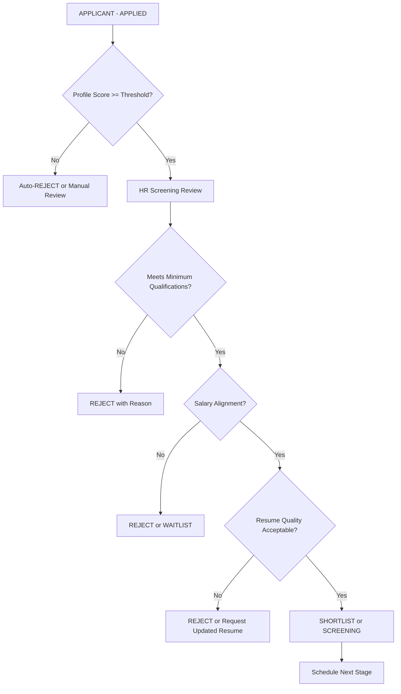

**Screening Process Steps**:

1. **Initial Triage** (Automated):
   - Filter by profile score threshold (configurable per job)
   - Check for duplicate applications
   - Validate required fields completeness

2. **Document Review** (Manual):
   - Review resume for experience relevance
   - Check education qualifications
   - Verify skills match job requirements
   - Assess cover letter quality and fit

3. **Qualification Check**:
   - Years of experience vs. job requirement
   - Education level vs. job requirement
   - Required skills presence
   - Industry experience relevance

4. **Salary Alignment**:
   - Compare expected salary with job range
   - Assess negotiation flexibility
   - Consider total compensation package

5. **Screening Decision**:
   - **SHORTLIST**: Pass screening, proceed to interview
   - **REJECT**: Does not meet requirements
   - **SCREENING**: Additional review needed
   - **WAITLIST**: Qualified but position filled/on hold

**Endpoint**: `POST /api/v1/hr/recruitment/applicants/{id}/status`

**Request**:

```json
{
  "status": "SCREENING",
  "notes": "Initial HR review in progress - checking qualifications and salary alignment"
}
```

**Process**:

1. Validates status transition (APPLIED → SCREENING)
2. Updates applicant status
3. Sets `screeningAt` timestamp
4. Records status history with notes
5. Updates job metrics
6. Triggers notification to hiring manager (if configured)

**Valid Transitions to SCREENING**:

- From: APPLIED

**Screening Notes Best Practices**:

- Document specific reasons for screening decisions
- Note which criteria were met/not met
- Record any concerns or red flags
- Include salary alignment assessment
- Note any follow-up actions needed

**Response**: Updated applicant with SCREENING status

**Screening Duration Metrics**:

- Average time to screen: 2-5 business days
- Target screening SLA: 10 business days from application
- Screening completion rate tracked per job

### Phase 4: Shortlisting (SHORTLISTED)

**Overview**: Shortlisting is the process of selecting qualified candidates from the screened pool to proceed to the interview stage. This is a critical decision point where HR and hiring managers collaborate to identify the most promising candidates.

**Who Performs Shortlisting**:

- HR Recruiters (initial shortlist)
- Hiring Managers (final approval)
- HR Managers (for senior/critical positions)

**Shortlisting Criteria**:

- **Qualification Match**: Meets or exceeds minimum requirements
- **Experience Relevance**: Direct industry or role experience
- **Skills Alignment**: Strong match with required and preferred skills
- **Cultural Fit Indicators**: Values, work style, company alignment
- **Career Progression**: Demonstrated growth and achievement
- **References/Portfolio**: Strong professional presence
- **Communication Quality**: Clear, professional communication
- **Availability**: Timeline alignment with hiring needs

**Shortlisting Workflow**:

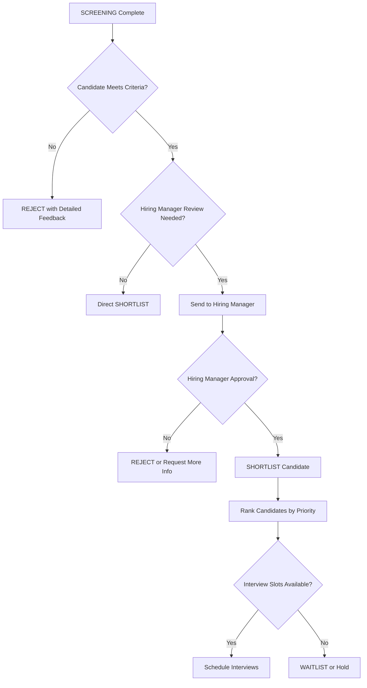

**Shortlisting Process Steps**:

1. **Candidate Evaluation**:
   - Compare against job requirements matrix
   - Assess experience depth and relevance
   - Evaluate skill proficiency level
   - Review portfolio/work samples
   - Check social media/professional profiles

2. **Comparative Analysis**:
   - Rank candidates against each other
   - Identify top performers
   - Note unique strengths of each candidate
   - Consider diversity and inclusion goals
   - Assess team fit potential

3. **Hiring Manager Review** (if required):
   - Present shortlist with rationale
   - Share candidate profiles and resumes
   - Discuss concerns or questions
   - Get approval for interview scheduling
   - Note any specific interview focus areas

4. **Shortlist Decision**:
   - **SHORTLIST**: Approved for interview
   - **WAITLIST**: Qualified but no immediate slot
   - **REJECT**: Not suitable for position
   - **SCREENING**: Needs additional review

5. **Prioritization**:
   - Rank shortlisted candidates by fit
   - Assign priority levels (High, Medium, Low)
   - Note interview scheduling preferences
   - Identify any scheduling constraints

**Endpoint**: `POST /api/v1/hr/recruitment/applicants/{id}/status`

**Request**:

```json
{
  "status": "SHORTLISTED",
  "notes": "Passed HR screening - 6 years experience, strong React/TypeScript skills, portfolio reviewed, salary within range. Hiring manager approved for technical interview."
}
```

**Process**:

1. Validates status transition (SCREENING → SHORTLISTED or APPLIED → SHORTLISTED)
2. Updates applicant status
3. Sets `shortlistedAt` timestamp
4. Records status history with detailed notes
5. Updates job metrics (shortlistedCount incremented)
6. Triggers notification to hiring manager (if configured)

**Valid Transitions to SHORTLISTED**:

- From: SCREENING, APPLIED

**Shortlisting Notes Best Practices**:

- Document specific strengths that led to shortlisting
- Note any concerns to address in interview
- Include hiring manager feedback
- Record ranking or priority level
- Note interview scheduling preferences

**Response**: Updated applicant with SHORTLISTED status

**Bulk Shortlisting**:

```http
POST /api/v1/hr/recruitment/applicants/bulk-status
```

**Use Cases for Bulk Shortlisting**:

- Batch processing after group screening session
- Multiple candidates meeting same criteria
- Rapid shortlisting for high-volume hiring
- Re-screening after job requirement changes

**Request**:

```json
{
  "applicantIds": ["uuid-1", "uuid-2", "uuid-3"],
  "status": "SHORTLISTED",
  "notes": "Batch shortlist after HR screening - all meet minimum qualifications, salary alignment confirmed, resumes reviewed"
}
```

**Response**:

```json
{
  "status": "SHORTLISTED",
  "requestedCount": 3,
  "updatedCount": 3,
  "applicants": [...]
}
```

**Bulk Update Constraints**:

- Only SHORTLISTED and REJECTED statuses allowed
- All applicants must exist
- All status transitions must be valid
- Atomic transaction (all or nothing)
- Individual validation for each applicant

**Bulk Rejection**:

```json
{
  "applicantIds": ["uuid-4", "uuid-5"],
  "status": "REJECTED",
  "notes": "Batch reject - insufficient experience, salary above range, missing required skills"
}
```

**Shortlisting Metrics**:

- Shortlist rate: (shortlisted / applications) × 100
- Average time to shortlist: 3-7 business days
- Target shortlist SLA: 10 business days from application
- Shortlist-to-interview conversion rate tracked per job

### Phase 5: Interview Scheduling (INTERVIEW)

**Overview**: Interview scheduling involves coordinating between shortlisted candidates, interviewers, and available time slots to arrange interview sessions. This phase includes determining interview types, rounds, participant assignments, and logistics.

**Who Schedules Interviews**:

- HR Recruiters (primary)
- HR Coordinators
- Hiring Managers (for direct scheduling)
- Interview Scheduling System (automated)

**Interview Types**:

- **HR_SCREENING**: Initial screening call with HR (30-45 min)
- **TECHNICAL**: Technical skills assessment (60-90 min)
- **BEHAVIORAL**: Behavioral/cultural fit interview (45-60 min)
- **PANEL**: Multiple interviewers (60-90 min)
- **FINAL**: Final interview with hiring manager (45-60 min)

**Interview Round Structure**:

- **Round 1**: HR Screening or Initial Technical
- **Round 2**: Deep Technical or Behavioral
- **Round 3**: Panel or Final Interview
- **Round 4+**: Additional rounds as needed (executive, presentation, etc.)

**Interview Scheduling Workflow**:

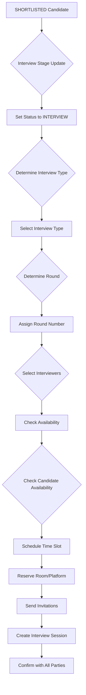

**Step 1: Move Applicant to Interview Stage**

**Endpoint**: `POST /api/v1/hr/recruitment/applicants/{id}/status`

**Request**:

```json
{
  "status": "INTERVIEW",
  "notes": "Shortlisted for technical interview - approved by hiring manager, scheduling Round 1 technical assessment"
}
```

**Process**:

1. Validates status transition (SHORTLISTED → INTERVIEW or SCREENING → INTERVIEW)
2. Updates applicant status
3. Sets `interviewAt` timestamp
4. Records status history with notes
5. Updates job metrics

**Valid Transitions to INTERVIEW**:

- From: SHORTLISTED, SCREENING

**Response**: Updated applicant with INTERVIEW status

**Step 2: Create Interview Session**

**Endpoint**: `POST /api/v1/hr/recruitment/interviews`

**Interview Scheduling Considerations**:

1. **Interview Type Selection**:
   - HR_SCREENING: For initial qualification check
   - TECHNICAL: For skills assessment
   - BEHAVIORAL: For soft skills evaluation
   - PANEL: For comprehensive evaluation
   - FINAL: For final decision with hiring manager

2. **Round Assignment**:
   - Round 1: Initial screening/technical
   - Round 2: Deep dive/behavioral
   - Round 3: Final/panel
   - Round 4+: Specialized rounds

3. **Interviewer Selection**:
   - HR for screening interviews
   - Technical leads for technical interviews
   - Hiring managers for behavioral/panel
   - Team members for cultural fit
   - Cross-functional interviewers for senior roles

4. **Availability Coordination**:
   - Check interviewer calendar availability
   - Confirm candidate availability
   - Avoid scheduling conflicts
   - Consider time zones for remote interviews

5. **Logistics Planning**:
   - Reserve meeting room (in-person)
   - Set up video conference link (remote)
   - Prepare interview materials
   - Send calendar invitations

**Request Example**:

```json
{
  "jobId": "uuid-job-id",
  "type": "TECHNICAL",
  "round": 1,
  "scheduledAt": "2026-05-15T10:00:00.000Z",
  "durationMinutes": 60,
  "location": "Meeting Room A",
  "meetingUrl": "https://zoom.us/j/123456789",
  "applicantIds": ["uuid-applicant-1", "uuid-applicant-2"],
  "interviewers": [
    {
      "interviewerId": "uuid-interviewer-1",
      "role": "Panelist"
    },
    {
      "interviewerId": "uuid-interviewer-2",
      "role": "Technical Lead"
    }
  ]
}
```

**Validations**:

- At least one applicant required
- At least one interviewer required
- All applicants must belong to the job
- All interviewers must be active users linked to employee records
- No duplicate active round for same applicants (conflict prevention)
- Scheduled time must be in the future
- Duration must be reasonable (15-180 minutes)

**Response**:

```json
{
  "id": "uuid-session-id",
  "jobId": "uuid-job-id",
  "type": "TECHNICAL",
  "round": 1,
  "status": "SCHEDULED",
  "scheduledAt": "2026-05-15T10:00:00.000Z",
  "durationMinutes": 60,
  "location": "Meeting Room A",
  "meetingUrl": "https://zoom.us/j/123456789",
  "participants": [
    {
      "id": "uuid-participant-1",
      "applicantId": "uuid-applicant-1",
      "attendanceStatus": "SCHEDULED",
      "applicant": {
        "firstName": "Abel",
        "lastName": "Tesfaye",
        "email": "abel.tesfaye@example.com",
        "status": "INTERVIEW"
      }
    }
  ],
  "interviewers": [
    {
      "id": "uuid-assignment-1",
      "interviewerId": "uuid-interviewer-1",
      "role": "Panelist",
      "interviewer": {
        "firstName": "John",
        "lastName": "Doe",
        "email": "john.doe@blih.com"
      }
    }
  ],
  "createdAt": "2026-05-06T12:00:00.000Z"
}
```

**Business Rules**:

- Interviewer deduplication (same interviewer can only have one role per session)
- Participant activity timestamp updated
- Job metrics updated (interviewsCount incremented)
- Session status defaults to SCHEDULED
- Conflict prevention for duplicate rounds

**Interview Scheduling Best Practices**:

- Schedule interviews 2-5 business days in advance
- Provide interview materials to interviewers beforehand
- Send confirmation to all participants
- Include interview agenda and focus areas
- Allow buffer time between interviews
- Consider candidate time zone for remote interviews
- Have backup interviewers available

**Scheduling Metrics**:

- Average scheduling lead time: 3-5 business days
- Interview confirmation rate: target 95%+
- No-show rate: target <10%
- Reschedule rate: target <15%

### Phase 6: Interview Execution

**Overview**: Interview execution is the actual conduct of the interview session, including managing attendance, handling reschedules, and tracking interview progress. This phase ensures interviews proceed smoothly and attendance is accurately recorded.

**Who Manages Interview Execution**:

- HR Recruiters (coordination)
- Interviewers (conducting interviews)
- HR Coordinators (logistics)
- Hiring Managers (oversight)

**Interview Execution Workflow**:

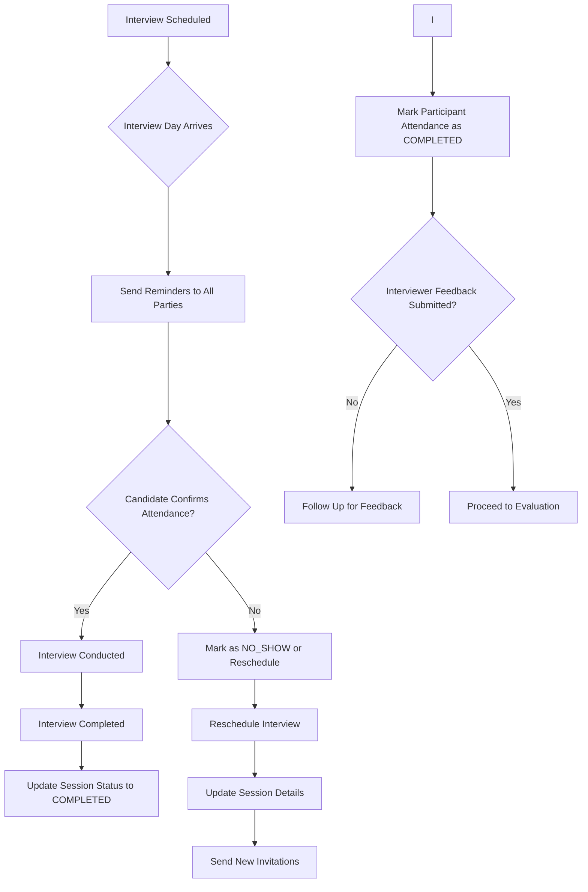

**Update Interview Session**

**Endpoint**: `PATCH /api/v1/hr/recruitment/interviews/{id}`

**Use Cases**:

1. **Reschedule Interview**:
   - Change scheduled date/time
   - Adjust duration
   - Update location
   - Change meeting URL

2. **Modify Participants**:
   - Add additional candidates (if no feedback submitted)
   - Remove candidates (if no feedback submitted)
   - Handle candidate cancellations

3. **Modify Interviewers**:
   - Add replacement interviewers (if no feedback submitted)
   - Remove interviewers (if no feedback submitted)
   - Update interviewer roles

4. **Change Interview Type**:
   - Switch from TECHNICAL to PANEL
   - Adjust interview format

5. **Update Session Status**:
   - Mark as COMPLETED when interview ends
   - Mark as CANCELLED if cancelled
   - Mark as NO_SHOW if candidate doesn't attend

**Request Example (Reschedule)**:

```json
{
  "scheduledAt": "2026-05-16T14:00:00.000Z",
  "durationMinutes": 75,
  "location": "Meeting Room B",
  "meetingUrl": "https://zoom.us/j/987654321"
}
```

**Request Example (Add Participant)**:

```json
{
  "applicantIds": ["uuid-applicant-1", "uuid-applicant-2", "uuid-applicant-3"]
}
```

**Request Example (Update Status)**:

```json
{
  "status": "COMPLETED"
}
```

**Validations**:

- Cannot remove participants with submitted feedback
- Cannot remove interviewers with submitted feedback
- Round change validates no duplicate active round
- Status transition validated (SCHEDULED → COMPLETED, SCHEDULED → CANCELLED, SCHEDULED → NO_SHOW)
- At least one participant required after removal
- At least one interviewer required after removal

**Response**: Updated interview session with new details

**Update Attendance**

**Endpoint**: `PATCH /api/v1/hr/recruitment/interviews/{id}/participants/{participantId}/attendance`

**Attendance Status Options**:

- **SCHEDULED**: Interview is scheduled (default)
- **ATTENDING**: Candidate confirmed attendance
- **COMPLETED**: Candidate attended and interview completed
- **NO_SHOW**: Candidate did not attend without prior notice
- **CANCELLED**: Interview cancelled (by candidate or company)

**Request**:

```json
{
  "attendanceStatus": "ATTENDING"
}
```

**Valid Transitions**:

- SCHEDULED → ATTENDING (confirmed attendance)
- ATTENDING → COMPLETED (candidate attended)
- SCHEDULED → COMPLETED (candidate attended)
- SCHEDULED → CANCELLED (cancelled beforehand)
- SCHEDULED → NO_SHOW (candidate missed without notice)
- CANCELLED → SCHEDULED (rescheduled)

**Response**: Updated interview session with new attendance status

**Attendance Tracking Best Practices**:

- Mark attendance immediately after interview
- Document reason for NO_SHOW in notes
- Record cancellation reasons
- Track no-show patterns for candidates
- Update attendance if rescheduled

**Interview Execution Best Practices**:

- Send reminders 24 hours before interview
- Confirm attendance on interview day
- Have backup interviewers available
- Prepare interview materials in advance
- Test video conference setup before interview
- Start interviews on time
- Keep interviews within scheduled duration
- Document any interview deviations

**Rescheduling Process**:

1. Identify reason for reschedule (candidate request, interviewer conflict, etc.)
2. Check availability for new time slot
3. Confirm with all parties
4. Update interview session details
5. Send new invitations
6. Cancel old calendar events
7. Document reschedule reason

**No-Show Handling**:

1. Mark attendance as NO_SHOW
2. Attempt to contact candidate
3. Determine if reschedule needed
4. Document no-show in candidate notes
5. Consider impact on candidacy
6. Update job metrics

**Execution Metrics**:

- On-time start rate: target 90%+
- Attendance rate: target 95%+
- No-show rate: target <10%
- Reschedule rate: target <15%
- Average interview duration variance: ±10%

### Phase 7: Interview Feedback

**Overview**: Interview feedback is the structured evaluation of candidate performance during interviews. This phase involves collecting detailed assessments from interviewers, aggregating scores, and making hiring recommendations based on the collective feedback.

**Who Provides Feedback**:

- Assigned interviewers (primary)
- Hiring managers (review and final decision)
- HR coordinators (aggregation and follow-up)

**Feedback Components**:

- **Overall Score**: Numerical rating (0-100) of candidate performance
- **Endorsement Level**: STRONG_YES, YES, UNCERTAIN, NO
- **Strengths**: Specific positive attributes demonstrated
- **Weaknesses**: Areas for improvement or concerns
- **Question Responses**: Detailed answers to structured questions with scores
- **Notes**: Qualitative assessment and recommendations

**Feedback Workflow**:

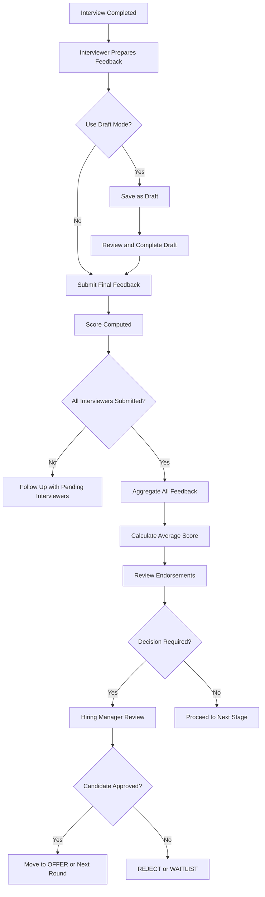

**Feedback Submission Process**:

1. **Interviewer Preparation**:
   - Review interview notes immediately after session
   - Recall specific examples and responses
   - Reference interview questions and candidate answers
   - Consider job requirements alignment

2. **Draft Feedback** (Optional):
   - Save initial thoughts as draft
   - Take time to reflect on performance
   - Consult with other interviewers if needed
   - Refine assessment before final submission

3. **Final Feedback Submission**:
   - Provide overall score (0-100)
   - Select endorsement level
   - List specific strengths (3-5 recommended)
   - List specific weaknesses (2-3 recommended)
   - Document question responses with scores
   - Add qualitative notes and recommendations

4. **Question Response Evaluation**:
   - Use question bank questions when available
   - Score each response (0 to maxScore)
   - Assign weight to each question (default 1)
   - Provide notes on response quality
   - System computes weighted average score

5. **Feedback Aggregation**:
   - Collect all interviewer feedback
   - Calculate average score across interviewers
   - Review endorsement consensus
   - Identify common strengths/weaknesses
   - Note any significant discrepancies

**Endpoint**: `POST /api/v1/hr/recruitment/interviews/{id}/participants/{participantId}/feedback`

**Request Example**:

```json
{
  "score": 85,
  "endorsement": "YES",
  "strengths": [
    "Strong problem-solving skills",
    "Clear communication",
    "Good technical depth",
    "Practical experience with React",
    "Collaborative team approach"
  ],
  "weaknesses": [
    "Limited system design experience",
    "Could improve on documentation practices",
    "Less experience with GraphQL"
  ],
  "questionResponses": [
    {
      "questionId": "uuid-question-1",
      "question": "Explain REST API principles",
      "category": "TECHNICAL",
      "type": "TEXT",
      "answer": "REST is an architectural style...",
      "score": 8,
      "maxScore": 10,
      "weight": 1,
      "notes": "Good understanding of core concepts"
    },
    {
      "question": "Rate system design knowledge (1-5)",
      "category": "TECHNICAL",
      "type": "RATING",
      "answer": 3,
      "score": 3,
      "maxScore": 5,
      "weight": 1.5,
      "notes": "Basic understanding, needs more depth"
    },
    {
      "question": "Describe a challenging bug you fixed",
      "category": "BEHAVIORAL",
      "type": "TEXT",
      "answer": "I encountered a memory leak...",
      "score": 9,
      "maxScore": 10,
      "weight": 1.2,
      "notes": "Excellent debugging approach"
    }
  ],
  "notes": "Strong candidate for next round. Technical skills are solid, cultural fit appears good. Recommend advancing to final round with hiring manager.",
  "isDraft": false
}
```

**Validations**:

- Only assigned interviewers can submit feedback
- Question bank questions must exist if questionId provided
- Score must be 0-100
- Question response scores must be >= 0 and <= maxScore
- maxScore required when score provided
- weight must be > 0
- question type must match answer type (TEXT, RATING, BOOLEAN, etc.)

**Score Computation from Question Responses**:

```typescript
function computeScoreFromQuestionResponses(items) {
  const scored = items.filter(
    (item) => item.score != null && item.maxScore != null && item.maxScore > 0,
  );
  if (scored.length === 0) return null;

  let weightedScore = 0;
  let totalWeight = 0;

  for (const item of scored) {
    const weight = item.weight ?? 1;
    weightedScore += (item.score / item.maxScore) * weight;
    totalWeight += weight;
  }

  if (totalWeight <= 0) return null;
  const score = (weightedScore / totalWeight) * 100;
  return Math.round(score * 100) / 100;
}
```

**Draft Mode**:

- When `isDraft: true`, feedback saved without `submittedAt` timestamp
- Draft feedback can be updated multiple times
- Final submission requires `isDraft: false`
- Draft feedback does not count toward completion metrics

**Response**:

```json
{
  "id": "uuid-feedback-id",
  "participantId": "uuid-participant-id",
  "assignmentId": "uuid-assignment-id",
  "interviewerId": "uuid-interviewer-1",
  "score": 85,
  "endorsement": "YES",
  "strengths": [...],
  "weaknesses": [...],
  "questionResponses": [...],
  "notes": "Strong candidate for next round",
  "isDraft": false,
  "submittedAt": "2026-05-15T11:30:00.000Z",
  "createdAt": "2026-05-15T11:00:00.000Z",
  "updatedAt": "2026-05-15T11:30:00.000Z"
}
```

**List Feedback**

**Endpoint**: `GET /api/v1/hr/recruitment/interviews/{id}/participants/{participantId}/feedback`

**Response**: Array of all feedback for the participant (ordered by updatedAt desc)

**Feedback Evaluation Criteria**:

**Score Ranges**:

- **90-100**: Exceptional candidate, strongly recommend
- **80-89**: Strong candidate, recommend proceed
- **70-79**: Good candidate, consider with reservations
- **60-69**: Marginal candidate, significant concerns
- **0-59**: Not suitable, do not recommend

**Endorsement Levels**:

- **STRONG_YES**: Exceptional fit, immediate hire
- **YES**: Good fit, recommend proceeding
- **UNCERTAIN**: Mixed signals, needs more review
- **NO**: Not suitable, do not proceed

**Feedback Best Practices**:

- Submit feedback within 24 hours of interview
- Be specific and evidence-based
- Focus on job-relevant criteria
- Avoid bias and subjective judgments
- Provide balanced assessment (strengths and weaknesses)
- Include examples from interview
- Consider cultural fit alongside skills
- Collaborate with other interviewers before finalizing

**Feedback Aggregation Process**:

1. **Collect All Feedback**:
   - Wait for all assigned interviewers to submit
   - Follow up with pending interviewers after 48 hours
   - Ensure all feedback is submitted (not draft)

2. **Calculate Metrics**:
   - Average score across all interviewers
   - Endorsement consensus (count each level)
   - Common themes in strengths/weaknesses
   - Score variance (identify outliers)

3. **Review Discrepancies**:
   - Discuss significant score differences (>20 points)
   - Understand different perspectives
   - Consider interviewer bias
   - Resolve conflicts through discussion

4. **Make Recommendation**:
   - Based on aggregated feedback
   - Consider job requirements alignment
   - Factor in urgency and candidate availability
   - Document rationale for decision

**Decision Matrix**:

| Average Score | Endorsement Consensus  | Recommendation              |
| ------------- | ---------------------- | --------------------------- |
| 85+           | All YES/STRONG_YES     | Proceed to offer/next round |
| 75-84         | Majority YES           | Consider with discussion    |
| 65-74         | Mixed YES/UNCERTAIN/NO | Additional review needed    |
| <65           | Majority NO/UNCERTAIN  | Reject candidate            |
| Any           | All NO                 | Reject candidate            |

**Feedback Metrics**:

- Feedback submission rate: target 100%
- Average time to submit: target <24 hours
- Feedback completeness: all sections filled
- Score variance: <15 points between interviewers
- Endorsement consistency: >80% agreement

### Phase 8: Post-Interview Decision Making

**Overview**: Post-interview decision making is the critical phase where hiring teams review aggregated interview feedback to determine whether to extend an offer, reject the candidate, or conduct additional interviews. This phase involves consensus building, offer preparation, and final hiring decisions.

**Who Makes Decisions**:

- Hiring Managers (primary decision authority)
- HR Recruiters (coordination and input)
- HR Managers (for senior/critical positions)
- Department Heads (for leadership roles)
- Cross-functional interviewers (input on technical/cultural fit)

**Decision Criteria**:

- **Overall Score**: Aggregated average score from all interviewers
- **Endorsement Consensus**: Agreement level among interviewers
- **Skills Alignment**: Match with required and preferred skills
- **Cultural Fit**: Alignment with company values and team dynamics
- **Experience Relevance**: Depth and relevance of past experience
- **Growth Potential**: Capacity for future growth and leadership
- **Compensation Alignment**: Salary expectations within budget
- **Availability**: Timeline alignment with hiring needs
- **Reference Checks**: Background verification results
- **Risk Assessment**: Potential concerns or red flags

**Decision Workflow**:

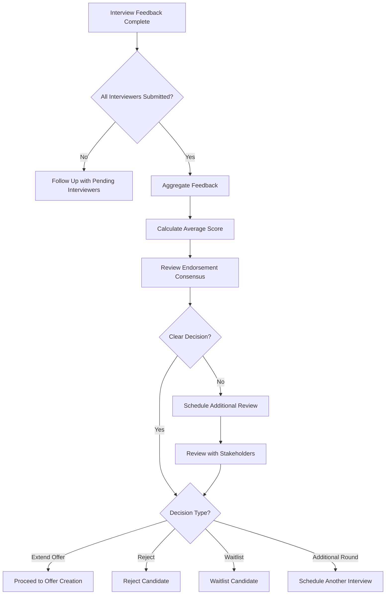

**Decision Process Steps**:

1. **Feedback Aggregation**:
   - Collect all interviewer feedback
   - Calculate average score across interviewers
   - Review endorsement levels and consensus
   - Identify common themes in strengths/weaknesses
   - Note any significant score discrepancies

2. **Consensus Building**:
   - Hold decision meeting with interviewers
   - Discuss candidate performance
   - Resolve scoring discrepancies
   - Address concerns or red flags
   - Build consensus on recommendation

3. **Risk Assessment**:
   - Evaluate potential hiring risks
   - Consider counter-offor scenarios
   - Assess cultural fit concerns
   - Review employment gaps or issues
   - Check reference feedback (if available)

4. **Decision Options**:
   - **Extend Offer**: Candidate approved for hire
   - **Reject**: Candidate not suitable for position
   - **Waitlist**: Qualified but position filled/budget constraints
   - **Additional Round**: Need more information (another interview)

5. **Decision Documentation**:
   - Record decision rationale
   - Document interview feedback summary
   - Note any conditions or contingencies
   - Store decision for audit trail

**Endpoint**: `POST /api/v1/hr/recruitment/applicants/{id}/status`

**Request (Extend Offer)**:

```json
{
  "status": "OFFER",
  "notes": "Approved for offer - strong technical interview, excellent cultural fit, salary expectations within range. Hiring manager approved."
}
```

**Request (Reject)**:

```json
{
  "status": "REJECTED",
  "notes": "Not selected - insufficient technical depth for senior role, concerns about system design experience."
}
```

**Request (Waitlist)**:

```json
{
  "status": "WAITLIST",
  "notes": "Qualified candidate but position filled. Will keep in consideration if offer declined or new position opens."
}
```

**Process**:

1. Validates status transition (INTERVIEW → OFFER/REJECTED/WAITLIST)
2. Updates applicant status
3. Sets corresponding timestamp (offerAt, rejectedAt, waitlistAt)
4. Records status history with decision notes
5. Updates job metrics
6. Triggers notification to hiring manager

**Valid Transitions from INTERVIEW**:

- To: OFFER, REJECTED, WAITLIST

**Decision Best Practices**:

- Make decisions within 48 hours of feedback completion
- Document decision rationale clearly
- Provide constructive feedback to rejected candidates
- Consider diversity and inclusion goals
- Review budget constraints before offer approval
- Assess team fit and dynamics
- Consider long-term growth potential

**Decision Metrics**:

- Time to decision: target 2-5 business days after feedback
- Offer acceptance rate: target 70-80%
- Decision consistency: similar candidates treated similarly
- Rejection feedback quality: constructive feedback provided

### Phase 9: Offer Creation and Extension

**Overview**: Offer creation and extension involves preparing a formal job offer, determining compensation package, and presenting it to the candidate. This phase includes drafting the offer details, obtaining approvals, and sending the offer to the candidate.

**Who Creates Offers**:

- HR Recruiters (primary)
- HR Managers (approval)
- Hiring Managers (input on compensation)
- Finance/Compensation Team (budget validation)

**Offer Components**:

- **Base Salary**: Monthly/annual compensation
- **Currency**: Payment currency (e.g., USD, ETB)
- **Start Date**: Expected start date
- **Pay Frequency**: MONTHLY, BI_WEEKLY, WEEKLY
- **Employment Type**: FULL_TIME, PART_TIME, CONTRACT, INTERNSHIP
- **Bonus**: Signing bonus or performance bonus
- **Equity**: Stock options or equity grants
- **Benefits**: Health insurance, retirement, etc.
- **Offer Letter**: Formal offer document URL
- **Expiration Date**: Offer validity period
- **Notes**: Additional terms or conditions

**Offer Status Workflow**:

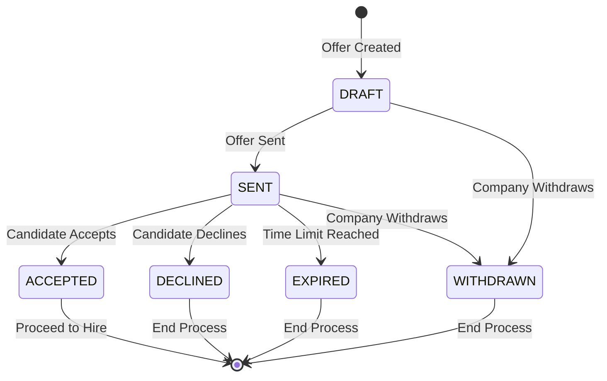

**Step 1: Create Draft Offer**

**Endpoint**: `POST /api/v1/hr/recruitment/offers`

**Request**:

```json
{
  "jobId": "uuid-job-id",
  "applicantId": "uuid-applicant-id",
  "salary": 145000,
  "currency": "USD",
  "startDate": "2026-06-01",
  "payFrequency": "MONTHLY",
  "employmentType": "FULL_TIME",
  "bonus": 5000,
  "equity": 0,
  "offerLetterUrl": "https://cdn.example.com/offer-letters/offer-123.pdf",
  "notes": "Offer prepared after final interview - includes signing bonus",
  "expiresAt": "2026-05-20T23:59:59.000Z"
}
```

**Validations**:

- Applicant must exist
- Applicant must belong to the job
- No existing offer for this job and applicant
- CreatedById required (authenticated user)

**Response**:

```json
{
  "id": "uuid-offer-id",
  "jobId": "uuid-job-id",
  "applicantId": "uuid-applicant-id",
  "createdById": "uuid-user-id",
  "status": "DRAFT",
  "salary": "145000.00",
  "currency": "USD",
  "startDate": "2026-06-01",
  "payFrequency": "MONTHLY",
  "employmentType": "FULL_TIME",
  "bonus": "5000.00",
  "equity": "0.00",
  "offerLetterUrl": "https://cdn.example.com/offer-letters/offer-123.pdf",
  "notes": "Offer prepared after final interview - includes signing bonus",
  "sentAt": null,
  "respondedAt": null,
  "expiresAt": "2026-05-20T23:59:59.000Z",
  "onboardingId": null,
  "employeeId": null,
  "userId": null,
  "createdAt": "2026-05-10T10:00:00.000Z",
  "updatedAt": "2026-05-10T10:00:00.000Z"
}
```

**Step 2: Update Draft Offer**

**Endpoint**: `PATCH /api/v1/hr/recruitment/offers/{id}`

**Use Cases**:

- Adjust salary based on negotiation
- Change start date
- Update bonus or equity
- Modify employment type
- Update expiration date

**Request**:

```json
{
  "salary": 150000,
  "bonus": 7500,
  "startDate": "2026-06-15"
}
```

**Validations**:

- Only DRAFT offers can be updated
- Offer must exist

**Response**: Updated offer with new values

**Step 3: Send Offer**

**Endpoint**: `POST /api/v1/hr/recruitment/offers/{id}/send`

**Request**:

```json
{
  "expiresAt": "2026-05-27T23:59:59.000Z"
}
```

**Validations**:

- Only DRAFT offers can be sent
- Applicant must be in INTERVIEW or WAITLIST status
- changedById required (authenticated user)

**Process**:

1. Updates offer status to SENT
2. Sets sentAt timestamp
3. Transitions applicant status to OFFER
4. Sets offerAt timestamp
5. Updates job metrics
6. Sends notification to candidate (future enhancement)

**Response**: Sent offer with status SENT

**Offer Creation Best Practices**:

- Research market compensation rates
- Consider internal equity and fairness
- Include clear terms and conditions
- Set reasonable expiration period (7-14 days)
- Provide detailed benefits information
- Include start date and onboarding information
- Document approval chain
- Keep offer professional and welcoming

**Offer Metrics**:

- Time to offer: target 3-5 business days after decision
- Offer acceptance rate: target 70-80%
- Average offer-to-hire time: target 7-14 days
- Offer withdrawal rate: target <5%

### Phase 10: Offer Negotiation

**Overview**: Offer negotiation occurs when candidates request changes to the offer terms before making their decision. This phase involves reviewing candidate requests, assessing feasibility, and potentially adjusting compensation or other terms.

**Who Handles Negotiation**:

- HR Recruiters (primary point of contact)
- Hiring Managers (approval for adjustments)
- HR Managers (for significant changes)
- Finance/Compensation Team (budget validation)

**Common Negotiation Points**:

- **Base Salary**: Higher salary request
- **Signing Bonus**: Additional upfront payment
- **Equity**: More stock options
- **Start Date**: Delayed or accelerated start
- **Benefits**: Additional benefits or perks
- **Work Arrangement**: Remote/hybrid work preferences
- **Title**: Higher job title request

**Negotiation Workflow**:

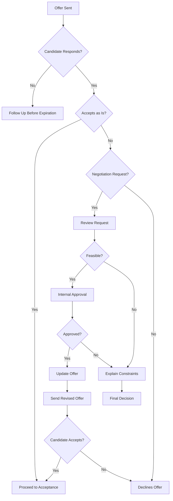

**Negotiation Process Steps**:

1. **Receive Request**:
   - Candidate contacts HR with negotiation points
   - Document specific requests clearly
   - Understand candidate's motivations

2. **Internal Review**:
   - Assess feasibility of requests
   - Check budget constraints
   - Review internal equity implications
   - Consult with hiring manager

3. **Decision Making**:
   - Approve full request
   - Approve partial request (counter-offer)
   - Decline request with explanation
   - Withdraw offer (if unreasonable)

4. **Counter-Offer**:
   - Update offer terms if approved
   - Send revised offer to candidate
   - Set new expiration date
   - Explain changes clearly

5. **Final Decision**:
   - Accept revised offer
   - Decline offer
   - Offer expires

**Update Offer for Negotiation**:

**Endpoint**: `PATCH /api/v1/hr/recruitment/offers/{id}`

**Request (Salary Negotiation)**:

````json
{
  "salary": 155000,
  "bonus": 10000,
  "notes": "Revised offer after negotiation - increased salary and signing bonus based on candidate experience and market rates"
}
``**Request (Start Date Negotiation)**:

```json
{
  "startDate": "2026-07-01",
  "notes": "Adjusted start date to accommodate candidate's notice period"
}
````

**Validations**:

- Only DRAFT offers can be updated
- SENT offers cannot be updated (must withdraw and create new)

**Negotiation Best Practices**:

- Respond to negotiation requests within 24-48 hours
- Be transparent about constraints
- Document all communications
- Keep negotiations professional and respectful
- Consider long-term relationship with candidate
- Balance fairness with budget constraints
- Get proper approvals before making commitments

**Negotiation Metrics**:

- Negotiation rate: % of offers that require negotiation
- Average negotiation rounds: target 1-2 rounds
- Negotiation success rate: % of negotiated offers accepted
- Time to resolve negotiation: target 3-5 business days

### Phase 11: Offer Acceptance/Rejection

**Overview**: Offer acceptance/rejection is the final decision point where candidates either accept the job offer, decline it, or let it expire. This phase triggers the hiring process or ends the recruitment cycle.

**Response Options**:

- **ACCEPTED**: Candidate accepts the offer
- **DECLINED**: Candidate rejects the offer
- **EXPIRED**: Offer expires without response
- **WITHDRAWN**: Company withdraws the offer

**Acceptance Workflow**:

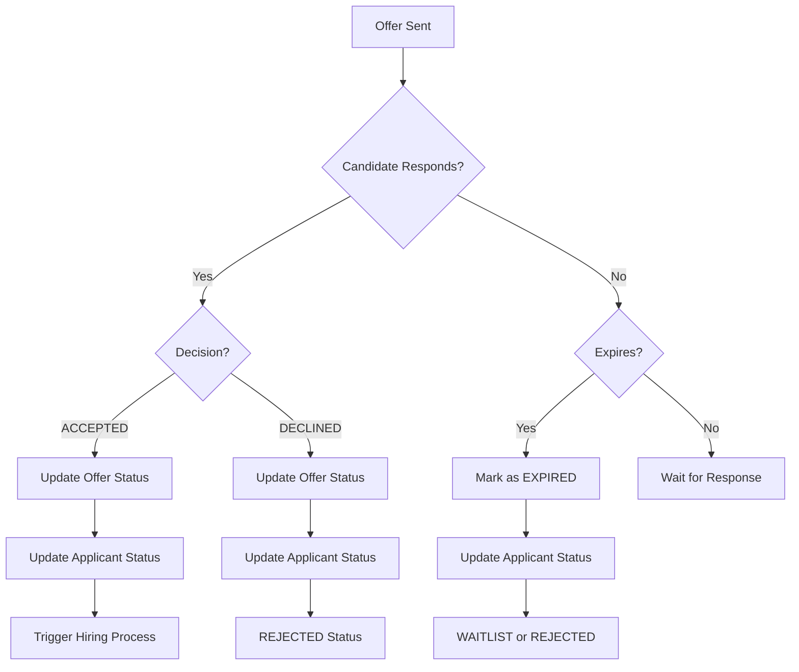

**Accept Offer**

**Endpoint**: `POST /api/v1/hr/recruitment/offers/{id}/respond`

**Request**:

```json
{
  "decision": "ACCEPTED"
}
```

**Validations**:

- Only SENT offers can be responded to
- changedById required (authenticated user)

**Process**:

1. Updates offer status to ACCEPTED
2. Sets respondedAt timestamp
3. Updates job metrics
4. Triggers hiring workflow

**Response**: Accepted offer with status ACCEPTED

**Decline Offer**

**Endpoint**: `POST /api/v1/hr/recruitment/offers/{id}/respond`

**Request**:

```json
{
  "decision": "DECLINED"
}
```

**Validations**:

- Only SENT offers can be responded to
- Applicant must be in OFFER status

**Process**:

1. Updates offer status to DECLINED
2. Sets respondedAt timestamp
3. Transitions applicant status to REJECTED
4. Updates job metrics
5. Records rejection reason

**Response**: Declined offer with status DECLINED

**Withdraw Offer**

**Endpoint**: `POST /api/v1/hr/recruitment/offers/{id}/withdraw`

**Request**:

```json
{
  "reason": "Position budget reallocated"
}
```

**Validations**:

- Only DRAFT or SENT offers can be withdrawn
- Offer must exist

**Process**:

1. Updates offer status to WITHDRAWN
2. Sets respondedAt timestamp (if SENT)
3. Records withdrawal reason
4. Updates applicant activity
5. Updates job metrics

**Response**: Withdrawn offer with status WITHDRAWN

**Offer Expiration Handling**:

- Offers expire automatically after expiresAt
- System can mark expired offers (future enhancement)
- Expired offers transition applicant to REJECTED or WAITLIST

**Acceptance/Rejection Best Practices**:

- Respond to acceptance promptly (within 24 hours)
- Send welcome package and onboarding information
- Document rejection reasons for future reference
- Maintain professional relationship with rejected candidates
- Consider waitlisting strong candidates for future roles
- Analyze rejection patterns for improvement

**Response Metrics**:

- Acceptance rate: target 70-80%
- Rejection rate: target 15-25%
- Expiration rate: target <5%
- Withdrawal rate: target <5%
- Average response time: target 3-5 business days

### Phase 12: Hiring Process (HIRED)

**Overview**: The hiring process converts an accepted applicant into an official employee. This phase involves creating user accounts, employee records, compensation records, and initiating the onboarding workflow.

**Who Handles Hiring**:

- HR Recruiters (coordination)
- HR Managers (approval)
- IT/Systems (user account creation)
- Finance (compensation setup)
- Onboarding Team (orientation planning)

**Hiring Components**:

- **User Account Creation**: Keycloak authentication account
- **Employee Record**: Official employee profile
- **Employment Record**: Position, manager, start date
- **Compensation Record**: Salary, pay frequency, benefits
- **Onboarding Setup**: Onboarding checklist and tasks
- **Welcome Notification**: Account setup instructions
- **System Access**: Required system permissions

**Hiring Workflow**:

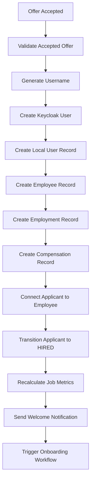

**Hiring Process Steps**:

1. **Validation**:
   - Verify offer exists and is ACCEPTED
   - Confirm applicant is eligible for hire
   - Check for duplicate user accounts
   - Validate required offer data

2. **User Provisioning**:
   - Generate unique username
   - Create Keycloak external user
   - Create local user record
   - Set initial password (via email)
   - Assign basic user roles

3. **Employee Creation**:
   - Create employee profile
   - Link to user account
   - Set employment lifecycle status to ONBOARDING
   - Store recruitment metadata

4. **Employment Setup**:
   - Create employment record
   - Assign position from job posting
   - Set employment type and start date
   - Assign hiring manager
   - Record change reason

5. **Compensation Setup**:
   - Create compensation record
   - Set base salary from offer
   - Set currency and pay frequency
   - Configure bonus eligibility
   - Set effective date

6. **Applicant Connection**:
   - Link applicant profile to employee
   - Transition applicant status to HIRED
   - Set hiredAt timestamp
   - Complete recruitment cycle

7. **Notifications**:
   - Send password setup email
   - Send welcome notification
   - Notify hiring manager
   - Notify onboarding team

**Endpoint**: `POST /api/v1/hr/recruitment/applicants/{id}/hire`

**Request**:

```json
{
  "isCompanyEmailPrimary": false,
  "companyEmail": null,
  "isCompanyPhonePrimary": false,
  "companyPhone": null
}
```

**Validations**:

- Applicant must exist
- Applicant must have accepted offer
- Only applicants with ACCEPTED offers can be hired
- Email and phone uniqueness validated

**Process**:

1. Fetches applicant with accepted offer
2. Determines primary email and phone
3. Generates unique username
4. Validates availability
5. Creates Keycloak user
6. Creates local user and employee records
7. Sets up employment and compensation
8. Links applicant to employee
9. Transitions applicant to HIRED
10. Sends welcome notification

**Response**:

```json
{
  "employeeId": "uuid-employee-id",
  "userId": "uuid-user-id",
  "applicantId": "uuid-applicant-id",
  "jobId": "uuid-job-id"
}
```

**Hiring Best Practices**:

- Complete hiring within 24-48 hours of offer acceptance
- Provide clear onboarding instructions
- Ensure all systems are ready before start date
- Coordinate with IT for equipment provisioning
- Schedule orientation sessions
- Assign onboarding buddy/mentor
- Prepare workspace and access cards
- Document all provisioning steps

**Hiring Metrics**:

- Time to hire: target 2-3 business days after acceptance
- Account creation success rate: target 100%
- Onboarding completion rate: target 95%+
- New hire satisfaction: target 80%+

---

## API Endpoints

### Applicant Management Endpoints

| Method | Path                                     | Description        | Permission       | Auth     |
| ------ | ---------------------------------------- | ------------------ | ---------------- | -------- |
| GET    | `/hr/recruitment/applicants`             | List applicants    | applicant:view   | Required |
| GET    | `/hr/recruitment/applicants/{id}`        | Get applicant      | applicant:view   | Required |
| PATCH  | `/hr/recruitment/applicants/{id}`        | Update applicant   | applicant:update | Required |
| POST   | `/hr/recruitment/applicants/{id}/status` | Update status      | applicant:update | Required |
| POST   | `/hr/recruitment/applicants/bulk-status` | Bulk status update | applicant:update | Required |
| POST   | `/hr/recruitment/applicants/{id}/hire`   | Hire applicant     | applicant:update | Required |

**Public Endpoints**:
| Method | Path | Description | Auth |
|--------|------|-------------|------|
| POST | `/hr/recruitment/jobs/{id}/apply` | Apply to job | None |

### Interview Management Endpoints

| Method | Path                                                                      | Description       | Permission                |
| ------ | ------------------------------------------------------------------------- | ----------------- | ------------------------- |
| POST   | `/hr/recruitment/interviews`                                              | Create interview  | interview:create          |
| GET    | `/hr/recruitment/interviews`                                              | List interviews   | interview:view            |
| GET    | `/hr/recruitment/interviews/{id}`                                         | Get interview     | interview:view            |
| PATCH  | `/hr/recruitment/interviews/{id}`                                         | Update interview  | interview:update          |
| PATCH  | `/hr/recruitment/interviews/{id}/participants/{participantId}/attendance` | Update attendance | interview:update          |
| POST   | `/hr/recruitment/interviews/{id}/participants/{participantId}/feedback`   | Submit feedback   | interview:submit_feedback |
| GET    | `/hr/recruitment/interviews/{id}/participants/{participantId}/feedback`   | List feedback     | interview:view            |

### Offer Management Endpoints

| Method | Path                                   | Description          | Permission     |
| ------ | -------------------------------------- | -------------------- | -------------- |
| POST   | `/hr/recruitment/offers`               | Create offer (draft) | offer:create   |
| GET    | `/hr/recruitment/offers`               | List offers          | offer:view     |
| GET    | `/hr/recruitment/offers/{id}`          | Get offer            | offer:view     |
| PATCH  | `/hr/recruitment/offers/{id}`          | Update draft offer   | offer:update   |
| POST   | `/hr/recruitment/offers/{id}/send`     | Send offer           | offer:send     |
| POST   | `/hr/recruitment/offers/{id}/respond`  | Respond to offer     | offer:respond  |
| POST   | `/hr/recruitment/offers/{id}/withdraw` | Withdraw offer       | offer:withdraw |

### Applicant Management Endpoints

| Method | Path                                     | Description        | Permission       | Auth     |
| ------ | ---------------------------------------- | ------------------ | ---------------- | -------- |
| GET    | `/hr/recruitment/applicants`             | List applicants    | applicant:view   | Required |
| GET    | `/hr/recruitment/applicants/{id}`        | Get applicant      | applicant:view   | Required |
| PATCH  | `/hr/recruitment/applicants/{id}`        | Update applicant   | applicant:update | Required |
| POST   | `/hr/recruitment/applicants/{id}/status` | Update status      | applicant:update | Required |
| POST   | `/hr/recruitment/applicants/bulk-status` | Bulk status update | applicant:update | Required |
| POST   | `/hr/recruitment/applicants/{id}/hire`   | Hire applicant     | applicant:update | Required |

**Public Endpoints**:
| Method | Path | Description | Auth |
|--------|------|-------------|------|
| POST | `/hr/recruitment/jobs/{id}/apply` | Apply to job | None |

### Interview Management Endpoints

| Method | Path                                                                      | Description       | Permission                |
| ------ | ------------------------------------------------------------------------- | ----------------- | ------------------------- |
| POST   | `/hr/recruitment/interviews`                                              | Create interview  | interview:create          |
| GET    | `/hr/recruitment/interviews`                                              | List interviews   | interview:view            |
| GET    | `/hr/recruitment/interviews/{id}`                                         | Get interview     | interview:view            |
| PATCH  | `/hr/recruitment/interviews/{id}`                                         | Update interview  | interview:update          |
| PATCH  | `/hr/recruitment/interviews/{id}/participants/{participantId}/attendance` | Update attendance | interview:update          |
| POST   | `/hr/recruitment/interviews/{id}/participants/{participantId}/feedback`   | Submit feedback   | interview:submit_feedback |
| GET    | `/hr/recruitment/interviews/{id}/participants/{participantId}/feedback`   | List feedback     | interview:view            |

### Query Parameters

**List Applicants**:

- `status`: Filter by applicant status
- `jobId`: Filter by job
- `email`: Filter by email (normalized)
- `search`: Search across firstName, lastName, email, phone, currentCompany, currentPosition

**List Interviews**:

- `jobId`: Filter by job
- `type`: Filter by interview type
- `status`: Filter by session status
- `round`: Filter by round number
- `applicantId`: Filter by applicant
- `interviewerId`: Filter by interviewer

---

## Business Logic

### Applicant Status Transitions

**Valid Transitions**:

```typescript
APPLIED → SCREENING → SHORTLISTED → INTERVIEW → OFFER → HIRED
                          ↓              ↓
                        REJECTED      WAITLIST
                          ↓
                    (from any active state)
                        WITHDRAWN
```

**Transition Validation**:

```typescript
assertApplicantTransition(currentStatus, nextStatus);
```

**Rules**:

- Only forward progression (except REJECTED/WITHDRAWN from active states)
- Cannot transition from terminal states (HIRED, REJECTED, WITHDRAWN)
- Bulk updates restricted to SHORTLISTED and REJECTED only

### Application Form Validation

**Field Configuration**:

- **Applicant Fields**: PHONE, LINKEDIN_URL, PORTFOLIO_URL, GITHUB_URL, EXPECTED_SALARY, COVER_LETTER
- **Sections**: EDUCATION, EXPERIENCE
- **Custom Fields**: Job-specific custom fields with types (TEXT, SELECT, CHECKBOX, etc.)

**Validation Logic**:

```typescript
assertRequiredFormFields({
  applicantFields: job.applicationForm.applicantFields,
  sections: job.applicationForm.sections,
  customFields: job.applicationForm.customFields,
  payload: applicantData,
});
```

**Checks**:

- Core fields always required: firstName, lastName, email, resumeUrl
- Enabled + required applicant fields must have values
- Enabled + required sections must have at least one entry
- Required custom fields must have values

### Interview Conflict Prevention

**Duplicate Round Check**:

```typescript
assertNoActiveDuplicateRound(prisma, {
  applicantIds,
  jobId,
  round,
  excludeSessionId,
});
```

**Rules**:

- Applicant cannot have active interview in same round
- Active = session not CANCELLED and participant not CANCELLED
- Allows rescheduling within same round (excludeSessionId)

### Interviewer Validation

**Active Employee Check**:

```typescript
assertInterviewersAreActiveEmployees(prisma, interviewerIds);
```

**Requirements**:

- User must have ACTIVE status
- User must be linked to employee record
- Prevents inactive/former employees from interviewing

### Job Metrics Recalculation

**Triggered On**:

- Applicant created/updated
- Applicant status changed
- Interview created/updated
- Participant attendance changed

**Metrics Updated**:

```typescript
recalculateJobMetrics(tx, jobId);
```

**Fields Recalculated**:

- applicationsCount
- shortlistedCount
- interviewsCount
- offersCount
- hiresCount

---

## State Transitions

### Applicant Status State Machine

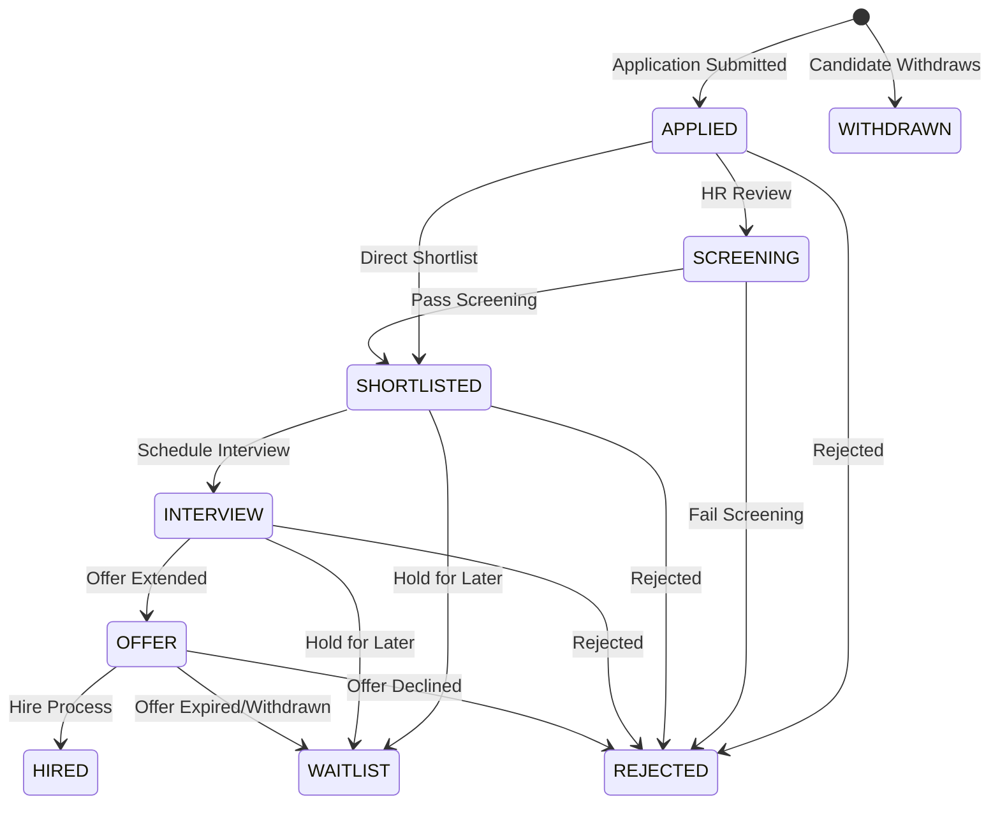

### Interview Session State Machine

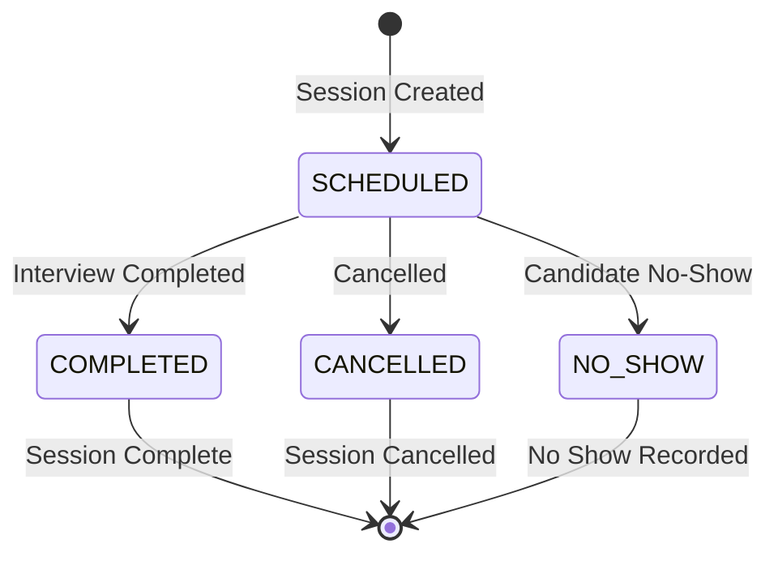

### Interview Attendance State Machine

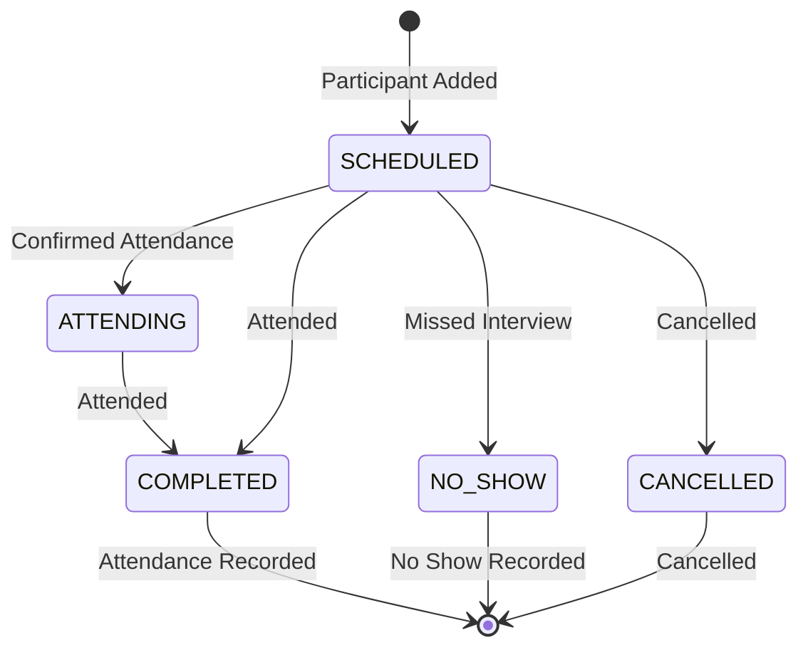

### Transition Rules

| From Status | To Status   | Trigger              | Conditions         |
| ----------- | ----------- | -------------------- | ------------------ |
| APPLIED     | SCREENING   | Manual HR review     | Job published      |
| APPLIED     | SHORTLISTED | Bulk action          | Job published      |
| SCREENING   | SHORTLISTED | HR approval          | Screening complete |
| SHORTLISTED | INTERVIEW   | Interview scheduled  | Session created    |
| INTERVIEW   | OFFER       | Offer extended       | Offer created/sent |
| OFFER       | HIRED       | Hire process         | Offer accepted     |
| OFFER       | REJECTED    | Offer declined       | Valid transition   |
| OFFER       | WAITLIST    | Offer expired        | Valid transition   |
| Any active  | REJECTED    | Rejection decision   | Valid transition   |
| Any active  | WITHDRAWN   | Candidate withdrawal | Valid transition   |

### Timestamp Tracking

| Timestamp        | Set When             | Purpose                     |
| ---------------- | -------------------- | --------------------------- |
| `appliedAt`      | Application created  | Track submission time       |
| `screeningAt`    | Status → SCREENING   | Track screening start       |
| `shortlistedAt`  | Status → SHORTLISTED | Track shortlist time        |
| `interviewAt`    | Status → INTERVIEW   | Track interview stage entry |
| `offerAt`        | Status → OFFER       | Track offer time            |
| `hiredAt`        | Status → HIRED       | Track hire completion       |
| `rejectedAt`     | Status → REJECTED    | Track rejection time        |
| `withdrawnAt`    | Status → WITHDRAWN   | Track withdrawal time       |
| `lastActivityAt` | Any update           | Track recent activity       |

---

## RBAC Permissions

### Applicant Permissions

| Permission         | Description                     | Typical Roles                  |
| ------------------ | ------------------------------- | ------------------------------ |
| `applicant:view`   | View applicants                 | HR, HR_MANAGER, HIRING_MANAGER |
| `applicant:update` | Update applicant details/status | HR, HR_MANAGER, HIRING_MANAGER |

### Interview Permissions

| Permission                  | Description               | Typical Roles                               |
| --------------------------- | ------------------------- | ------------------------------------------- |
| `interview:view`            | View interviews           | HR, HR_MANAGER, HIRING_MANAGER, INTERVIEWER |
| `interview:create`          | Create interview sessions | HR, HR_MANAGER, HIRING_MANAGER              |
| `interview:update`          | Update interview sessions | HR, HR_MANAGER, HIRING_MANAGER              |
| `interview:submit_feedback` | Submit interview feedback | Assigned interviewers only                  |

### Offer Permissions

| Permission       | Description               | Typical Roles                  |
| ---------------- | ------------------------- | ------------------------------ |
| `offer:view`     | View offers               | HR, HR_MANAGER, HIRING_MANAGER |
| `offer:create`   | Create draft offers       | HR, HR_MANAGER                 |
| `offer:update`   | Update draft offers       | HR, HR_MANAGER                 |
| `offer:send`     | Send offers to candidates | HR, HR_MANAGER                 |
| `offer:respond`  | Record candidate response | HR, HR_MANAGER                 |
| `offer:withdraw` | Withdraw offers           | HR, HR_MANAGER                 |

### Permission Enforcement

**Feedback Submission**:

- Only assigned interviewers can submit feedback
- Validated via `sessionId_interviewerId` unique constraint check
- Returns ForbiddenException if not assigned

**Status Updates**:

- Requires `applicant:update` permission
- ChangedById recorded in status history
- Audit trail maintained

---

## Integration Points

**Employee System**:

- Interviewer validation (active employee requirement)
- Hiring transition (applicant → employee conversion)

**User System**:

- Referral validation (referredById must exist)
- Interviewer user validation
- Creator tracking

**Notification System**:

- New applicant notification to job creator
- Interview scheduling notifications (future enhancement)

**File Storage System**:

- Resume URL storage (external CDN integration)
- Portfolio/LinkedIn links

---

## Error Handling

### Common Errors

**Applicant Errors**:

- `ConflictException`: Duplicate applicant (job + email)
- `BadRequestException`: Invalid status transition, missing required fields
- `NotFoundException`: Applicant not found, job not published
- `ForbiddenException`: Missing required permission

**Interview Errors**:

- `BadRequestException`: Invalid interview type, duplicate round, interviewer not active employee
- `ConflictException`: Duplicate active round for applicant
- `NotFoundException`: Interview/participant not found
- `ForbiddenException`: Not assigned interviewer (feedback submission)

### Validation Messages

**Application Validation**:

- "Applications are allowed only for published jobs"
- "Missing required application fields (coreFields: firstName, lastName; applicantFields: PHONE)"
- "Applicant already exists for this job and email"

**Interview Validation**:

- "At least one applicant is required"
- "At least one interviewer is required"
- "All interviewers must be active users linked to employee records"
- "At least one applicant already has an active interview in this round"
- "Only assigned interviewers can submit feedback"

**Status Transition Validation**:

- "Invalid applicant status transition from APPLIED to HIRED"
- "Only draft or rejected jobs can be updated"

---

## Implementation Status

### Implemented Features ✅

- **Applicant Management**: Full CRUD with status tracking
- **Application Form Validation**: Configurable per job
- **Bulk Status Updates**: Efficient batch operations
- **Interview Scheduling**: Multi-participant, multi-interviewer
- **Interview Feedback**: Structured with question responses
- **Profile Scoring**: Automated quality assessment
- **Status History**: Complete audit trail
- **Job Metrics**: Automatic recalculation

### Not Implemented ❌

- **CV Screening**: Database schema exists but no API layer
- **Automated Screening**: AI-based CV parsing and matching
- **Interview Question Bank**: Limited implementation
- **Calendar Integration**: Interview scheduling automation
- **Candidate Portal**: Self-service interview management
- **Analytics Dashboard**: Recruitment funnel metrics
- **Email Notifications**: Automated candidate communications

### Future Enhancements

1. **CV Screening API**:
   - Implement CvScreeningController
   - AI-powered resume parsing
   - Skills extraction and matching
   - Screening workflow automation

2. **Interview Question Bank**:
   - Expand question categories
   - Difficulty levels
   - Randomization
   - Pre-built question sets

3. **Calendar Integration**:
   - Outlook/Google Calendar sync
   - Automated reminders
   - Conflict detection
   - Room booking

4. **Candidate Portal**:
   - Application status tracking
   - Interview schedule view
   - Document upload
   - Feedback viewing

---

## Data Flow Diagram

```
┌─────────────────────────────────────────────────────────────────┐
│              RECRUITMENT FLOW: POSTING → HIRING                 │
├─────────────────────────────────────────────────────────────────┤
│                                                                  │
│  PUBLISHED JOB                                                   │
│       │                                                          │
│       ▼                                                          │
│  CANDIDATE APPLIES (Public API)                                 │
│       │                                                          │
│       ├─► Validation (form fields, duplicates)                  │
│       ├─► Profile score computation                             │
│       ├─► Applicant record created                              │
│       └─► Notification to creator                               │
│       │                                                          │
│       ▼                                                          │
│  APPLICANT (APPLIED)                                             │
│       │                                                          │
│       ├─► HR Review → SCREENING                                 │
│       ├─► Bulk shortlist → SHORTLISTED                           │
│       └─► Reject → REJECTED                                     │
│       │                                                          │
│       ▼                                                          │
│  SHORTLISTED                                                     │
│       │                                                          │
│       ├─► Schedule interview → INTERVIEW                         │
│       └─► Hold → WAITLIST                                       │
│       │                                                          │
│       ▼                                                          │
│  INTERVIEW SESSION CREATED                                       │
│       │                                                          │
│       ├─► Add participants (applicants)                          │
│       ├─► Add interviewers (employees)                          │
│       └─► Validate no duplicate rounds                           │
│       │                                                          │
│       ▼                                                          │
│  INTERVIEW EXECUTION                                             │
│       │                                                          │
│       ├─► Update attendance (COMPLETED/NO_SHOW/CANCELLED)       │
│       └─► Submit feedback (score, endorsement, Q&A)            │
│       │                                                          │
│       ▼                                                          │
│  FEEDBACK AGGREGATION                                           │
│       │                                                          │
│       ├─► Calculate average scores                              │
│       ├─► Review endorsements                                    │
│       └─► Decision: OFFER or REJECT                             │
│       │                                                          │
│       ▼                                                          │
│  OFFER CREATION (if approved)                                   │
│       │                                                          │
│       ├─► Create draft offer (salary, benefits, start date)     │
│       ├─► Update offer terms (negotiation)                      │
│       └─► Send offer (DRAFT → SENT)                             │
│       │                                                          │
│       ▼                                                          │
│  OFFER RESPONSE                                                  │
│       │                                                          │
│       ├─► ACCEPTED → Proceed to hiring                          │
│       ├─► DECLINED → Applicant rejected                          │
│       ├─► EXPIRED → Waitlist or reject                          │
│       └─► WITHDRAWN → End process                               │
│       │                                                          │
│       ▼                                                          │
│  HIRING PROCESS (if ACCEPTED)                                    │
│       │                                                          │
│       ├─► Validate accepted offer                                │
│       ├─► Create Keycloak user account                          │
│       ├─► Create employee record                                 │
│       ├─► Create employment record                              │
│       ├─► Create compensation record                             │
│       ├─► Link applicant to employee                             │
│       ├─► Transition applicant to HIRED                         │
│       └─► Send welcome notification                              │
│       │                                                          │
│       ▼                                                          │
│  ONBOARDING INITIATED                                           │
│                                                                  │
└─────────────────────────────────────────────────────────────────┘
```
