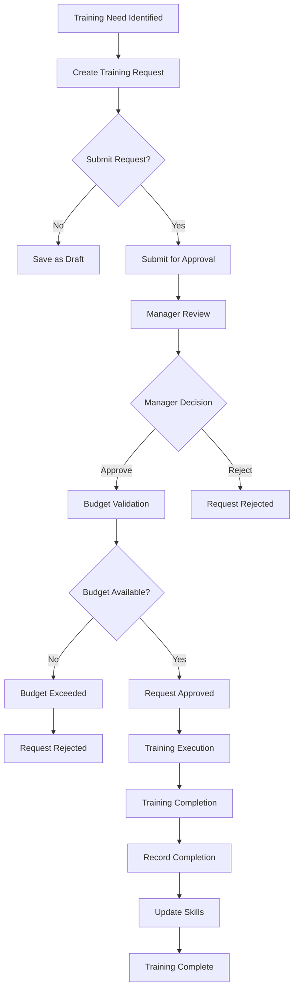
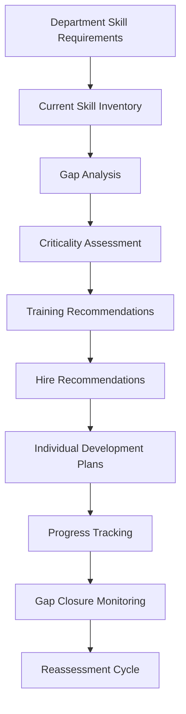
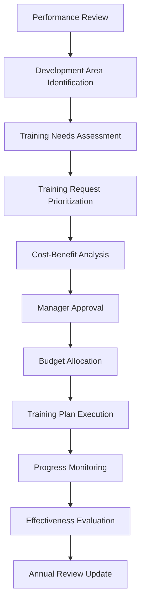
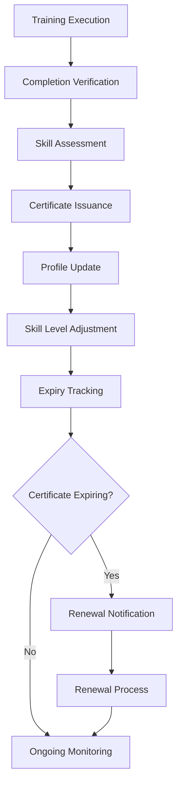

# Training & Skill Development System - Technical Documentation

## Executive Overview

This document provides comprehensive technical documentation for BLIH Training & Skill Development system, including all API endpoints, database models, TypeScript types, business logic workflows, and implementation gaps for enterprise HR requirements including Training & Skill Development, Training Feedback, Skill Gap Assessment, Training Completion & Certification, and more.

### System Status Summary

- **Current Implementation**: 70% complete
- **Database Schema**: 100% complete (7 models)
- **TypeScript Types**: 100% complete
- **API Endpoints**: 22 implemented, 25+ missing
- **Business Logic**: Core training workflows complete
- **Security**: RBAC permissions for implemented features

## 1. Database Architecture

### 1.1 Complete Database Models

#### Training Management Models

```sql
-- Skill Model
CREATE TABLE "skills" (
  "id" UUID NOT NULL DEFAULT gen_random_uuid(),
  "name" VARCHAR(255) NOT NULL,
  "category" VARCHAR(128),
  "description" TEXT,
  "created_at" TIMESTAMP(3) NOT NULL DEFAULT CURRENT_TIMESTAMP,
  "updated_at" TIMESTAMP(3) NOT NULL DEFAULT CURRENT_TIMESTAMP,
  CONSTRAINT "skills_pkey" PRIMARY KEY ("id"),
  CONSTRAINT "skills_name_key" UNIQUE ("name")
);

-- EmployeeSkill Model
CREATE TABLE "employee_skills" (
  "id" UUID NOT NULL DEFAULT gen_random_uuid(),
  "employee_id" UUID NOT NULL,
  "skill_id" UUID NOT NULL,
  "level" "SkillLevel" NOT NULL,
  "attested_at" TIMESTAMP(3),
  "source" "SkillSource" NOT NULL DEFAULT 'SELF',
  "created_at" TIMESTAMP(3) NOT NULL DEFAULT CURRENT_TIMESTAMP,
  "updated_at" TIMESTAMP(3) NOT NULL DEFAULT CURRENT_TIMESTAMP,
  CONSTRAINT "employee_skills_pkey" PRIMARY KEY ("id"),
  CONSTRAINT "employee_skills_employee_id_skill_id_key" UNIQUE ("employee_id", "skill_id")
);

-- TrainingBudget Model
CREATE TABLE "training_budgets" (
  "id" UUID NOT NULL DEFAULT gen_random_uuid(),
  "department_id" UUID NOT NULL,
  "year" INTEGER NOT NULL,
  "total_budget" DECIMAL(15,2) NOT NULL,
  "used_ytd" DECIMAL(15,2) NOT NULL DEFAULT 0,
  "per_person_amount" DECIMAL(15,2),
  "created_at" TIMESTAMP(3) NOT NULL DEFAULT CURRENT_TIMESTAMP,
  "updated_at" TIMESTAMP(3) NOT NULL DEFAULT CURRENT_TIMESTAMP,
  CONSTRAINT "training_budgets_pkey" PRIMARY KEY ("id"),
  CONSTRAINT "training_budgets_department_id_year_key" UNIQUE ("department_id", "year")
);

-- TrainingRequest Model
CREATE TABLE "training_requests" (
  "id" UUID NOT NULL DEFAULT gen_random_uuid(),
  "employee_id" UUID NOT NULL,
  "department_id" UUID NOT NULL,
  "training_type" "TrainingType" NOT NULL DEFAULT 'SKILL',
  "title" VARCHAR(512) NOT NULL,
  "provider" VARCHAR(256),
  "start_date" DATE,
  "end_date" DATE,
  "duration_hours" INTEGER,
  "justification" TEXT,
  "skill_gap_link_id" UUID,
  "cost" DECIMAL(15,2),
  "cost_payer" "CostPayer",
  "status" "TrainingRequestStatus" NOT NULL DEFAULT 'DRAFT',
  "submitted_at" TIMESTAMP(3),
  "approved_by_id" UUID,
  "approved_at" TIMESTAMP(3),
  "rejection_reason" TEXT,
  "created_at" TIMESTAMP(3) NOT NULL DEFAULT CURRENT_TIMESTAMP,
  "updated_at" TIMESTAMP(3) NOT NULL DEFAULT CURRENT_TIMESTAMP,
  CONSTRAINT "training_requests_pkey" PRIMARY KEY ("id")
);

-- TrainingCompletion Model
CREATE TABLE "training_completions" (
  "id" UUID NOT NULL DEFAULT gen_random_uuid(),
  "employee_id" UUID NOT NULL,
  "training_request_id" UUID,
  "title" VARCHAR(512) NOT NULL,
  "provider" VARCHAR(256),
  "start_date" DATE,
  "end_date" DATE,
  "completion_status" "CompletionStatus" NOT NULL,
  "score_or_grade" VARCHAR(64),
  "certificate_number" VARCHAR(128),
  "certificate_url" VARCHAR(1024),
  "expiry_date" DATE,
  "skills_acquired" JSONB,
  "attested_at" TIMESTAMP(3),
  "synced_to_profile" BOOLEAN NOT NULL DEFAULT false,
  "created_at" TIMESTAMP(3) NOT NULL DEFAULT CURRENT_TIMESTAMP,
  "updated_at" TIMESTAMP(3) NOT NULL DEFAULT CURRENT_TIMESTAMP,
  CONSTRAINT "training_completions_pkey" PRIMARY KEY ("id")
);

-- SkillGapAssessment Model
CREATE TABLE "skill_gap_assessments" (
  "id" UUID NOT NULL DEFAULT gen_random_uuid(),
  "department_id" UUID NOT NULL,
  "assessed_by_id" UUID NOT NULL,
  "assessed_at" TIMESTAMP(3) NOT NULL,
  "required_skills" JSONB NOT NULL,
  "current_state" JSONB NOT NULL,
  "critical_gaps_summary" TEXT,
  "training_recommendations" JSONB,
  "hire_recommendations" JSONB,
  "created_at" TIMESTAMP(3) NOT NULL DEFAULT CURRENT_TIMESTAMP,
  "updated_at" TIMESTAMP(3) NOT NULL DEFAULT CURRENT_TIMESTAMP,
  CONSTRAINT "skill_gap_assessments_pkey" PRIMARY KEY ("id")
);

-- TrainingNeedsAssessment Model
CREATE TABLE "training_needs_assessments" (
  "id" UUID NOT NULL DEFAULT gen_random_uuid(),
  "employee_id" UUID NOT NULL,
  "based_on_review_id" UUID,
  "period_year" INTEGER NOT NULL,
  "assessed_by_id" UUID NOT NULL,
  "development_areas" JSONB NOT NULL,
  "requested_trainings" JSONB NOT NULL,
  "skill_gap_summary" TEXT,
  "manager_notes" TEXT,
  "priority" VARCHAR(32),
  "status" "RequestWorkflowStatus" NOT NULL DEFAULT 'DRAFT',
  "submitted_at" TIMESTAMP(3),
  "reviewed_by_id" UUID,
  "reviewed_at" TIMESTAMP(3),
  "rejection_reason" TEXT,
  "created_at" TIMESTAMP(3) NOT NULL DEFAULT CURRENT_TIMESTAMP,
  "updated_at" TIMESTAMP(3) NOT NULL DEFAULT CURRENT_TIMESTAMP,
  CONSTRAINT "training_needs_assessments_pkey" PRIMARY KEY ("id")
);
```

### 1.2 Database Enums

```sql
-- Training Management Enums
CREATE TYPE "TrainingType" AS ENUM ('SKILL', 'COMPLIANCE', 'LEADERSHIP', 'OTHER');
CREATE TYPE "TrainingRequestStatus" AS ENUM ('DRAFT', 'PENDING', 'APPROVED', 'REJECTED', 'CANCELLED');
CREATE TYPE "CostPayer" AS ENUM ('COMPANY', 'SELF');
CREATE TYPE "CompletionStatus" AS ENUM ('COMPLETED', 'PARTIAL', 'DROPPED');
CREATE TYPE "SkillLevel" AS ENUM ('BEGINNER', 'INTERMEDIATE', 'ADVANCED', 'EXPERT');
CREATE TYPE "SkillSource" AS ENUM ('SELF', 'MANAGER', 'ASSESSMENT', 'TRAINING');
CREATE TYPE "RequestWorkflowStatus" AS ENUM ('DRAFT', 'PENDING', 'APPROVED', 'REJECTED', 'CANCELLED');
```

## 2. TypeScript Types & DTOs

### 2.1 Skill Management Types

```typescript
// skill.ts
export type SkillLevel = 'BEGINNER' | 'INTERMEDIATE' | 'ADVANCED' | 'EXPERT';

export interface SkillResponseDto {
  id: string;
  name: string;
  category: string | null;
  description: string | null;
  createdAt: string;
  updatedAt: string;
}

export interface CreateSkillDto {
  name: string;
  category?: string | null;
  description?: string | null;
}

export interface UpdateSkillDto {
  name?: string;
  category?: string | null;
  description?: string | null;
}

// employee-skill.ts
export type SkillSource = 'SELF' | 'MANAGER' | 'ASSESSMENT' | 'TRAINING';

export interface EmployeeSkillResponseDto {
  id: string;
  employeeId: string;
  skillId: string;
  skillName?: string;
  level: SkillLevel;
  attestedAt: string | null;
  source: SkillSource;
  createdAt: string;
  updatedAt: string;
}

export interface UpsertEmployeeSkillDto {
  skillId: string;
  level: SkillLevel;
  source?: SkillSource;
}

export interface UpsertEmployeeSkillsDto {
  skills: UpsertEmployeeSkillDto[];
}
```

### 2.2 Training Request Types

```typescript
// request.ts
export type TrainingRequestStatus =
  | 'DRAFT'
  | 'PENDING'
  | 'APPROVED'
  | 'REJECTED'
  | 'CANCELLED';
export type TrainingType = 'SKILL' | 'COMPLIANCE' | 'LEADERSHIP' | 'OTHER';
export type CostPayer = 'COMPANY' | 'SELF';

export interface TrainingRequestResponseDto {
  id: string;
  employeeId: string;
  departmentId: string;
  trainingType: TrainingType;
  title: string;
  provider: string | null;
  startDate: string | null;
  endDate: string | null;
  durationHours: number | null;
  justification: string | null;
  skillGapLinkId: string | null;
  cost: number | null;
  costPayer: CostPayer | null;
  status: TrainingRequestStatus;
  submittedAt: string | null;
  approvedById: string | null;
  approvedAt: string | null;
  rejectionReason: string | null;
  createdAt: string;
  updatedAt: string;
}

export interface CreateTrainingRequestDto {
  employeeId: string;
  departmentId: string;
  trainingType: TrainingType;
  title: string;
  provider?: string | null;
  startDate?: string | null;
  endDate?: string | null;
  durationHours?: number | null;
  justification?: string | null;
  skillGapLinkId?: string | null;
  cost?: number | null;
  costPayer?: CostPayer | null;
  submit?: boolean;
}

export interface ApproveTrainingRequestDto {
  approved: boolean;
  rejectionReason?: string | null;
}

// Training Needs Assessment Types
export interface TrainingNeedsAssessmentResponseDto {
  id: string;
  employeeId: string;
  basedOnReviewId: string | null;
  periodYear: number;
  assessedById: string;
  developmentAreas: Array<{
    area: string;
    priority?: 'HIGH' | 'MEDIUM' | 'LOW';
    notes?: string | null;
  }>;
  requestedTrainings: Array<{
    title: string;
    provider?: string | null;
    trainingType?: TrainingType | null;
    priority?: 'HIGH' | 'MEDIUM' | 'LOW';
    estimatedCost?: number | null;
  }>;
  skillGapSummary: string | null;
  managerNotes: string | null;
  priority: string | null;
  status: 'DRAFT' | 'PENDING' | 'APPROVED' | 'REJECTED' | 'CANCELLED';
  submittedAt: string | null;
  reviewedById: string | null;
  reviewedAt: string | null;
  rejectionReason: string | null;
  createdAt: string;
  updatedAt: string;
}

export interface CreateTrainingNeedsAssessmentDto {
  employeeId: string;
  basedOnReviewId?: string | null;
  periodYear: number;
  assessedById: string;
  developmentAreas: Array<{
    area: string;
    priority?: 'HIGH' | 'MEDIUM' | 'LOW';
    notes?: string | null;
  }>;
  requestedTrainings: Array<{
    title: string;
    provider?: string | null;
    trainingType?: TrainingType | null;
    priority?: 'HIGH' | 'MEDIUM' | 'LOW';
    estimatedCost?: number | null;
  }>;
  skillGapSummary?: string | null;
  priority?: string | null;
  submit?: boolean;
}

export interface UpdateTrainingNeedsAssessmentDto {
  basedOnReviewId?: string | null;
  developmentAreas?: Array<{
    area: string;
    priority?: 'HIGH' | 'MEDIUM' | 'LOW';
    notes?: string | null;
  }>;
  requestedTrainings?: Array<{
    title: string;
    provider?: string | null;
    trainingType?: TrainingType | null;
    priority?: 'HIGH' | 'MEDIUM' | 'LOW';
    estimatedCost?: number | null;
  }>;
  skillGapSummary?: string | null;
  priority?: string | null;
}

export interface ReviewTrainingNeedsAssessmentDto {
  approved: boolean;
  reviewedById: string;
  managerNotes?: string | null;
  rejectionReason?: string | null;
}
```

### 2.3 Training Completion Types

```typescript
// completion.ts
export type CompletionStatus = 'COMPLETED' | 'PARTIAL' | 'DROPPED';

export interface SkillsAcquiredItem {
  skillId: string;
  levelGain?: string;
}

export interface TrainingCompletionResponseDto {
  id: string;
  employeeId: string;
  trainingRequestId: string | null;
  title: string;
  provider: string | null;
  startDate: string | null;
  endDate: string | null;
  completionStatus: CompletionStatus;
  scoreOrGrade: string | null;
  certificateNumber: string | null;
  certificateUrl: string | null;
  expiryDate: string | null;
  skillsAcquired: SkillsAcquiredItem[] | null;
  attestedAt: string | null;
  syncedToProfile: boolean;
  createdAt: string;
  updatedAt: string;
}

export interface CreateTrainingCompletionDto {
  employeeId: string;
  trainingRequestId?: string | null;
  title: string;
  provider?: string | null;
  startDate?: string | null;
  endDate?: string | null;
  completionStatus: CompletionStatus;
  scoreOrGrade?: string | null;
  certificateNumber?: string | null;
  certificateUrl?: string | null;
  expiryDate?: string | null;
  skillsAcquired?: SkillsAcquiredItem[] | null;
  attestedAt?: string | null;
}

export interface UpdateTrainingCompletionDto {
  title?: string;
  provider?: string | null;
  endDate?: string | null;
  completionStatus?: CompletionStatus;
  scoreOrGrade?: string | null;
  certificateNumber?: string | null;
  certificateUrl?: string | null;
  expiryDate?: string | null;
  skillsAcquired?: SkillsAcquiredItem[] | null;
  attestedAt?: string | null;
  syncedToProfile?: boolean;
}
```

### 2.4 Skill Gap Assessment Types

```typescript
// skill-gap.ts
export interface RequiredSkillItem {
  skillId: string;
  requiredLevel: SkillLevel;
  criticality?: 'HIGH' | 'MEDIUM' | 'LOW';
}

export interface CurrentStateItem {
  employeeId: string;
  skillId: string;
  currentLevel: SkillLevel | null;
  gap: number;
}

export interface TrainingRecommendationItem {
  skillId: string;
  trainingTitle?: string;
  priority?: string;
}

export interface SkillGapAssessmentResponseDto {
  id: string;
  departmentId: string;
  assessedById: string;
  assessedAt: string;
  requiredSkills: RequiredSkillItem[];
  currentState: CurrentStateItem[];
  criticalGapsSummary: string | null;
  trainingRecommendations: TrainingRecommendationItem[] | null;
  hireRecommendations: unknown;
  createdAt: string;
  updatedAt: string;
}

export interface CreateSkillGapAssessmentDto {
  departmentId: string;
  assessedById: string;
  requiredSkills: RequiredSkillItem[];
  currentState?: CurrentStateItem[];
  criticalGapsSummary?: string | null;
  trainingRecommendations?: TrainingRecommendationItem[] | null;
  hireRecommendations?: unknown;
}

export interface IndividualSkillGapResponseDto {
  employeeId: string;
  targetPositionId?: string | null;
  gaps: Array<{
    skillId: string;
    skillName: string;
    currentLevel: SkillLevel | null;
    requiredLevel: SkillLevel;
    gap: number;
    priority: 'HIGH' | 'MEDIUM';
  }>;
  strengths: Array<{
    skillId: string;
    skillName: string;
    level: SkillLevel;
  }>;
  readinessScore: number;
  totalGaps: number;
  criticalGaps: number;
}
```

### 2.5 Budget Management Types

```typescript
// budget.ts
export interface TrainingBudgetResponseDto {
  id: string;
  departmentId: string;
  year: number;
  totalBudget: number;
  usedYtd: number;
  perPersonAmount: number | null;
  remaining: number;
  createdAt: string;
  updatedAt: string;
}

export interface CreateOrUpdateTrainingBudgetDto {
  departmentId: string;
  year: number;
  totalBudget?: number;
  perPersonAmount?: number | null;
}
```

## 3. API Endpoints Documentation

### 3.1 Implemented Training Management Endpoints (22 total)

#### Base Path: `/api/v1/hr/training`

| Method | Path                               | Description                      | Permissions                               |
| ------ | ---------------------------------- | -------------------------------- | ----------------------------------------- |
| GET    | `/skills`                          | List skills                      | `training:view`, `training:manage_skills` |
| POST   | `/skills`                          | Create skill                     | `training:manage_skills`                  |
| GET    | `/employees/:employeeId/skills`    | Get employee skills              | `training:view`                           |
| PATCH  | `/employees/:employeeId/skills`    | Upsert employee skills           | `training:view`, `training:manage_skills` |
| GET    | `/budget`                          | Get team training budget         | `training:view`, `training:manage_budget` |
| POST   | `/requests`                        | Create training request          | `training:create`                         |
| GET    | `/requests`                        | List training requests           | `training:view`                           |
| GET    | `/requests/:id`                    | Get training request             | `training:view`                           |
| POST   | `/requests/:id/approve`            | Approve training request         | `training:approve`                        |
| POST   | `/completions`                     | Record training completion       | `training:create`                         |
| GET    | `/completions`                     | List training completions        | `training:view`                           |
| GET    | `/completions/:id`                 | Get training completion          | `training:view`                           |
| PATCH  | `/completions/:id`                 | Update training completion       | `training:create`                         |
| POST   | `/skill-gap-assessments`           | Create skill gap assessment      | `training:skill_gap`                      |
| GET    | `/skill-gap-assessments`           | List skill gap assessments       | `training:skill_gap`, `training:view`     |
| GET    | `/skill-gap-assessments/:id`       | Get skill gap assessment         | `training:skill_gap`, `training:view`     |
| GET    | `/employees/:employeeId/skill-gap` | Get individual skill gap         | `training:skill_gap`, `training:view`     |
| POST   | `/needs-assessments`               | Create training needs assessment | `training:assess_needs`                   |
| GET    | `/needs-assessments`               | List training needs assessments  | `training:assess_needs`, `training:view`  |
| GET    | `/needs-assessments/:id`           | Get training needs assessment    | `training:assess_needs`, `training:view`  |
| PATCH  | `/needs-assessments/:id`           | Update training needs assessment | `training:assess_needs`                   |
| POST   | `/needs-assessments/:id/submit`    | Submit training needs assessment | `training:assess_needs`                   |
| POST   | `/needs-assessments/:id/review`    | Review training needs assessment | `training:approve`                        |

#### Request/Response Examples

**POST /api/v1/hr/training/requests**

```typescript
// Request
{
  "employeeId": "uuid",
  "departmentId": "uuid",
  "trainingType": "SKILL",
  "title": "Advanced JavaScript Programming",
  "provider": "Tech Academy",
  "startDate": "2026-04-01",
  "endDate": "2026-04-05",
  "durationHours": 40,
  "justification": "Need to improve frontend development skills",
  "cost": 2500.00,
  "costPayer": "COMPANY",
  "submit": true
}

// Response
{
  "id": "uuid",
  "employeeId": "uuid",
  "departmentId": "uuid",
  "trainingType": "SKILL",
  "title": "Advanced JavaScript Programming",
  "provider": "Tech Academy",
  "startDate": "2026-04-01",
  "endDate": "2026-04-05",
  "durationHours": 40,
  "justification": "Need to improve frontend development skills",
  "skillGapLinkId": null,
  "cost": 2500.00,
  "costPayer": "COMPANY",
  "status": "PENDING",
  "submittedAt": "2026-03-04T10:00:00Z",
  "approvedById": null,
  "approvedAt": null,
  "rejectionReason": null,
  "createdAt": "2026-03-04T10:00:00Z",
  "updatedAt": "2026-03-04T10:00:00Z"
}
```

**POST /api/v1/hr/training/completions**

```typescript
// Request
{
  "employeeId": "uuid",
  "trainingRequestId": "uuid",
  "title": "Advanced JavaScript Programming",
  "provider": "Tech Academy",
  "startDate": "2026-04-01",
  "endDate": "2026-04-05",
  "completionStatus": "COMPLETED",
  "scoreOrGrade": "A",
  "certificateNumber": "CERT-2026-12345",
  "certificateUrl": "https://certificates.example.com/12345",
  "skillsAcquired": [
    {
      "skillId": "uuid",
      "levelGain": "ADVANCED"
    }
  ],
  "attestedAt": "2026-04-06T10:00:00Z"
}

// Response
{
  "id": "uuid",
  "employeeId": "uuid",
  "trainingRequestId": "uuid",
  "title": "Advanced JavaScript Programming",
  "provider": "Tech Academy",
  "startDate": "2026-04-01",
  "endDate": "2026-04-05",
  "completionStatus": "COMPLETED",
  "scoreOrGrade": "A",
  "certificateNumber": "CERT-2026-12345",
  "certificateUrl": "https://certificates.example.com/12345",
  "expiryDate": null,
  "skillsAcquired": [
    {
      "skillId": "uuid",
      "levelGain": "ADVANCED"
    }
  ],
  "attestedAt": "2026-04-06T10:00:00Z",
  "syncedToProfile": false,
  "createdAt": "2026-04-06T10:00:00Z",
  "updatedAt": "2026-04-06T10:00:00Z"
}
```

### 3.2 Missing API Endpoints (25+ planned)

#### Training Feedback & Evaluation Endpoints

| Method | Path                          | Description              | Status     |
| ------ | ----------------------------- | ------------------------ | ---------- |
| GET    | `/feedback`                   | List training feedback   | ❌ Missing |
| POST   | `/feedback`                   | Create training feedback | ❌ Missing |
| GET    | `/feedback/:id`               | Get training feedback    | ❌ Missing |
| GET    | `/courses/:courseId/feedback` | Get course feedback      | ❌ Missing |
| POST   | `/courses/:courseId/feedback` | Submit course feedback   | ❌ Missing |

#### Learning Path & Curriculum Endpoints

| Method | Path                          | Description               | Status     |
| ------ | ----------------------------- | ------------------------- | ---------- |
| GET    | `/learning-paths`             | List learning paths       | ❌ Missing |
| POST   | `/learning-paths`             | Create learning path      | ❌ Missing |
| GET    | `/learning-paths/:id`         | Get learning path         | ❌ Missing |
| PATCH  | `/learning-paths/:id`         | Update learning path      | ❌ Missing |
| GET    | `/learning-paths/:id/courses` | Get learning path courses | ❌ Missing |
| POST   | `/learning-paths/:id/enroll`  | Enroll in learning path   | ❌ Missing |

#### Training Analytics & ROI Endpoints

| Method | Path                            | Description                        | Status     |
| ------ | ------------------------------- | ---------------------------------- | ---------- |
| GET    | `/analytics/roi`                | Get training ROI analytics         | ❌ Missing |
| GET    | `/analytics/completion-rates`   | Get completion rate analytics      | ❌ Missing |
| GET    | `/analytics/effectiveness`      | Get training effectiveness metrics | ❌ Missing |
| GET    | `/analytics/budget-utilization` | Get budget utilization analytics   | ❌ Missing |
| GET    | `/analytics/skill-improvement`  | Get skill improvement metrics      | ❌ Missing |

#### Certification Management Endpoints

| Method | Path                        | Description                 | Status     |
| ------ | --------------------------- | --------------------------- | ---------- |
| GET    | `/certifications`           | List certifications         | ❌ Missing |
| POST   | `/certifications`           | Create certification        | ❌ Missing |
| GET    | `/certifications/:id`       | Get certification           | ❌ Missing |
| PATCH  | `/certifications/:id`       | Update certification        | ❌ Missing |
| GET    | `/certifications/expiring`  | Get expiring certifications | ❌ Missing |
| POST   | `/certifications/:id/renew` | Renew certification         | ❌ Missing |

#### External Training Integration Endpoints

| Method | Path                             | Description                  | Status     |
| ------ | -------------------------------- | ---------------------------- | ---------- |
| GET    | `/external-providers`            | List external providers      | ❌ Missing |
| POST   | `/external-providers`            | Add external provider        | ❌ Missing |
| GET    | `/external-courses`              | Browse external courses      | ❌ Missing |
| POST   | `/external-courses/:id/enroll`   | Enroll in external course    | ❌ Missing |
| GET    | `/external-courses/:id/progress` | Get external course progress | ❌ Missing |

#### Training Compliance & Audit Endpoints

| Method | Path                                | Description                  | Status     |
| ------ | ----------------------------------- | ---------------------------- | ---------- |
| GET    | `/compliance/requirements`          | List compliance requirements | ❌ Missing |
| GET    | `/compliance/status`                | Get compliance status        | ❌ Missing |
| GET    | `/compliance/audit-trail`           | Get audit trail              | ❌ Missing |
| POST   | `/compliance/reports`               | Generate compliance report   | ❌ Missing |
| GET    | `/compliance/expiring-requirements` | Get expiring requirements    | ❌ Missing |

## 4. Business Logic Workflows

### 4.1 Training Request Workflow



### 4.2 Skill Gap Assessment Workflow



### 4.3 Training Needs Assessment Workflow



### 4.4 Training Completion & Certification Workflow



## 5. Security & Permissions

### 5.1 RBAC Permission Matrix

| Resource              | View | Create | Update | Approve | Manage | Assess | Skill Gap |
| --------------------- | ---- | ------ | ------ | ------- | ------ | ------ | --------- |
| Skills                | ✅   | ✅     | ✅     | ❌      | ✅     | ❌     | ❌        |
| Training Requests     | ✅   | ✅     | ❌     | ✅      | ❌     | ❌     | ❌        |
| Training Completions  | ✅   | ✅     | ✅     | ❌      | ❌     | ❌     | ❌        |
| Training Budget       | ✅   | ❌     | ❌     | ❌      | ✅     | ❌     | ❌        |
| Needs Assessments     | ✅   | ❌     | ✅     | ✅      | ❌     | ✅     | ❌        |
| Skill Gap Assessments | ✅   | ✅     | ❌     | ❌      | ❌     | ❌     | ✅        |

### 5.2 Current Permission Constants

```typescript
export const TrainingPermissions = {
  VIEW: 'training:view',
  CREATE: 'training:create',
  APPROVE: 'training:approve',
  MANAGE_SKILLS: 'training:manage_skills',
  MANAGE_BUDGET: 'training:manage_budget',
  SKILL_GAP: 'training:skill_gap',
  ASSESS_NEEDS: 'training:assess_needs',
  ALL: 'training:*',
} as const;
```

### 5.3 Missing Permission Constants

```typescript
// Required for missing functionality
export const TrainingFeedbackPermissions = {
  VIEW: 'training_feedback:view',
  CREATE: 'training_feedback:create',
  MANAGE: 'training_feedback:manage',
  ALL: 'training_feedback:*',
} as const;

export const LearningPathPermissions = {
  VIEW: 'learning_path:view',
  CREATE: 'learning_path:create',
  UPDATE: 'learning_path:update',
  MANAGE: 'learning_path:manage',
  ENROLL: 'learning_path:enroll',
  ALL: 'learning_path:*',
} as const;

export const TrainingAnalyticsPermissions = {
  VIEW: 'training_analytics:view',
  MANAGE: 'training_analytics:manage',
  ROI: 'training_analytics:roi',
  EFFECTIVENESS: 'training_analytics:effectiveness',
  ALL: 'training_analytics:*',
} as const;

export const CertificationPermissions = {
  VIEW: 'certification:view',
  CREATE: 'certification:create',
  UPDATE: 'certification:update',
  MANAGE: 'certification:manage',
  RENEW: 'certification:renew',
  ALL: 'certification:*',
} as const;

export const ExternalTrainingPermissions = {
  VIEW: 'external_training:view',
  CREATE: 'external_training:create',
  MANAGE: 'external_training:manage',
  ENROLL: 'external_training:enroll',
  ALL: 'external_training:*',
} as const;

export const TrainingCompliancePermissions = {
  VIEW: 'training_compliance:view',
  MANAGE: 'training_compliance:manage',
  AUDIT: 'training_compliance:audit',
  REPORT: 'training_compliance:report',
  ALL: 'training_compliance:*',
} as const;
```

## 6. Implementation Gap Analysis

### 6.1 Current Implementation Status

#### ✅ Completed Components (70%)

- **Training Management**: Complete request lifecycle, approvals, completions, certifications
- **Skills Management**: Complete skills catalog, employee skills, skill assessments
- **Budget Management**: Complete budget tracking, cost management, approval workflows
- **Skill Gap Assessment**: Complete individual and department gap analysis
- **Training Needs Assessment**: Complete development planning, training recommendations
- **Database Schema**: All 7 models with relationships and constraints
- **TypeScript Types**: Complete DTOs and interfaces
- **Security**: RBAC permissions for all implemented features

#### ❌ Missing Components (30%)

**Critical Missing APIs:**

1. **Training Feedback API** - No course evaluation or feedback system
2. **Learning Path API** - No structured learning journey management
3. **Training Analytics API** - No effectiveness metrics or ROI calculations
4. **Certification Management API** - No professional certification lifecycle
5. **External Training API** - No provider integration or course catalog
6. **Training Compliance API** - No regulatory compliance or audit features
7. **Mobile Learning API** - No mobile app support or offline learning
8. **Training Marketplace API** - No internal course marketplace

**Missing Business Logic:**

- Training effectiveness measurement and ROI calculation
- Learning path creation and progress tracking
- Professional certification expiry and renewal management
- External provider integration and course enrollment
- Training compliance monitoring and audit reporting
- Mobile learning support and offline synchronization
- Internal training marketplace and knowledge sharing

### 6.2 Enterprise Requirements Gap

**Training Management Essentials:**

- Training feedback and evaluation systems with satisfaction surveys
- Learning path and curriculum management with progress tracking
- Training analytics and ROI measurement with effectiveness metrics
- Professional certification management with expiry tracking
- External training provider integration with course catalogs
- Training compliance and audit reporting with regulatory requirements
- Mobile learning support with offline capabilities
- Internal training marketplace with peer-to-peer knowledge sharing

**Integration Requirements:**

- Learning Management System (LMS) integration for course delivery
- External training provider APIs for enrollment and tracking
- Performance management integration for training needs identification
- Finance system integration for budget management and reimbursement
- Compliance system integration for regulatory training requirements
- Mobile app integration for on-the-go learning
- Analytics platform integration for business intelligence

## 7. Implementation Roadmap

### Phase 1: Training Feedback & Analytics (4-6 weeks)

- Create training feedback and evaluation system
- Implement training effectiveness metrics and analytics
- Add ROI calculation and reporting capabilities
- Create manager and HR dashboards for training insights
- Integrate with performance management for effectiveness measurement

### Phase 2: Learning Paths & Certification (6-8 weeks)

- Create learning path creation and management system
- Implement professional certification lifecycle management
- Add expiry tracking and renewal workflows
- Create curriculum management and progress tracking
- Integrate with external certification bodies

### Phase 3: External Training Integration (4-6 weeks)

- Create external training provider integration
- Implement course catalog and enrollment management
- Add payment processing and reimbursement workflows
- Create third-party learning platform synchronization
- Implement vendor management and contract tracking

### Phase 4: Advanced Features (6-8 weeks)

- Create mobile learning app support and offline capabilities
- Implement training marketplace and knowledge sharing
- Add advanced compliance and audit features
- Create AI-powered learning recommendations
- Implement advanced analytics and business intelligence

## 8. Integration Points

### 8.1 Internal System Integrations

**Performance Management Integration:**

- Training needs identification from performance reviews
- Skill gap analysis integration with development planning
- Training effectiveness measurement based on performance improvement
- Career development integration with learning paths

**Employee Profile Integration:**

- Skill inventory synchronization with employee profiles
- Training history integration with career progression
- Certification tracking integration with professional development
- Learning path integration with career goals

**Budget Management Integration:**

- Training budget allocation and tracking
- Cost center management and approval workflows
- Finance system integration for payment processing
- Reimbursement workflow integration

**Compliance System Integration:**

- Regulatory training requirements tracking
- Compliance reporting and audit trail management
- Risk assessment integration with training needs
- Legal requirement integration with training planning

### 8.2 External System Integrations

**Learning Management Systems:**

- Course content delivery and tracking
- Progress synchronization and completion tracking
- Assessment and examination integration
- Certificate generation and distribution

**External Training Providers:**

- Course catalog integration and enrollment
- Progress tracking and completion reporting
- Payment processing and invoice management
- Quality assessment and provider evaluation

**Certification Bodies:**

- Professional certification tracking and verification
- Expiry monitoring and renewal management
- Continuing education credit tracking
- Industry standard compliance integration

**Analytics Platforms:**

- Training effectiveness and ROI analytics
- Business intelligence and reporting integration
- Learning analytics and predictive modeling
- Executive dashboard integration

## 9. Testing Strategy

### 9.1 Unit Testing

- Training request creation and approval logic validation
- Skill gap calculation and readiness scoring testing
- Budget validation and cost tracking accuracy
- Training completion and skill update workflows
- Certification expiry and renewal logic testing

### 9.2 Integration Testing

- End-to-end training request lifecycle testing
- Skill assessment and gap analysis integration
- Budget management and approval workflow testing
- External provider integration and synchronization
- Mobile app offline and online synchronization testing

### 9.3 Performance Testing

- Large training dataset query performance
- Concurrent training request processing
- Skill gap analysis calculation performance
- Analytics dashboard loading performance
- Mobile app performance and responsiveness testing

### 9.4 Security Testing

- Training data privacy and access control validation
- Budget approval and financial data security testing
- Certification verification and authenticity testing
- Audit trail completeness and accuracy validation
- External API integration security testing

## 10. Success Metrics

### 10.1 Operational Metrics

- **Training Request Processing**: <48 hours for approval
- **Training Completion Rates**: >85% overall completion
- **Skill Gap Closure Rate**: >70% identified gaps addressed
- **Budget Utilization**: >90% efficient budget usage
- **Certification Achievement**: >80% certification success rate
- **System Availability**: >99.5% uptime during business hours
- **Response Time**: <500ms average response time for all endpoints

### 10.2 Business Impact Metrics

- **Employee Skill Improvement**: Measured via pre/post assessments
- **Training ROI**: Cost vs. performance improvement ratio >3:1
- **Internal Mobility Rate**: >15% internal transfers annually
- **Compliance Training Completion**: 100% mandatory training
- **Employee Satisfaction**: >85% satisfaction with development opportunities
- **Time to Competency**: Reduced by 30% through targeted training

### 10.3 Technical Metrics

- **Code Coverage**: >90% test coverage for all modules
- **Bug Rate**: <5 critical bugs per release
- **Integration Success**: >95% successful external integrations
- **Data Accuracy**: >99% data integrity across all modules
- **Mobile App Performance**: >4.5 star user rating
- **Analytics Accuracy**: >95% accuracy in effectiveness measurements

---

## Conclusion

The BLIH Training & Skill Development system provides a strong foundation with 70% implementation complete. The database schema and core APIs for training management, skills, budget, gap assessment, and needs assessment are well-designed and functional. However, significant gaps exist in enterprise training features including feedback systems, learning paths, analytics, certification management, external integration, compliance, and mobile support.

The 4-phase implementation roadmap will transform the current system into a comprehensive enterprise training and skill development solution capable of handling complex business requirements, ensuring employee development, and providing valuable insights for organizational growth and talent management.

**Key Next Steps:**

1. Implement training feedback and evaluation system
2. Add learning path and certification management
3. Create external training provider integration
4. Develop advanced analytics and mobile learning features

This documentation serves as a definitive technical reference for developers, business stakeholders, and implementation teams working on Training & Skill Development system.
