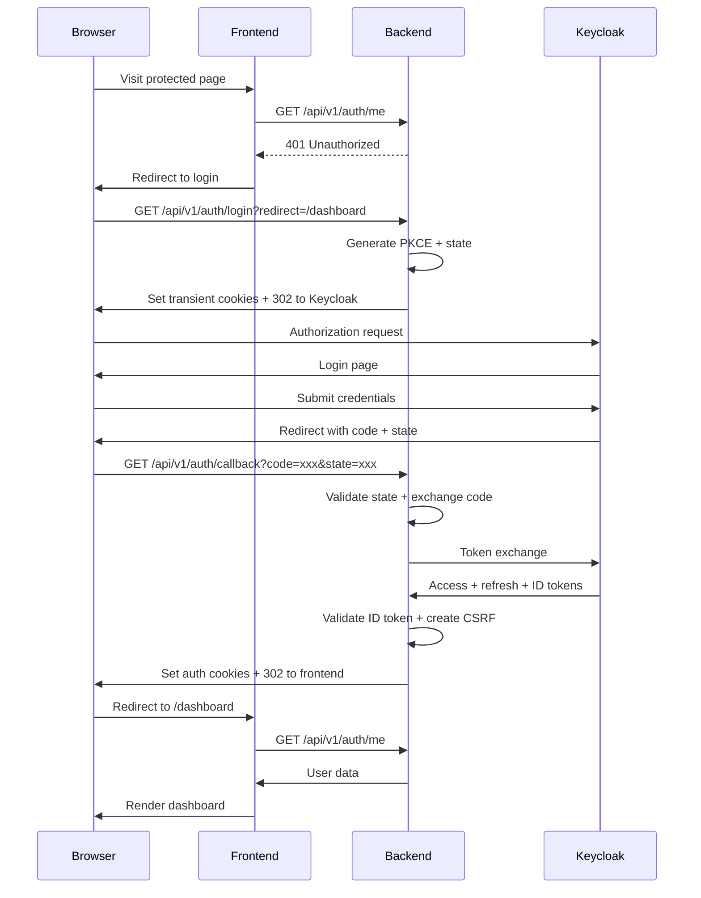
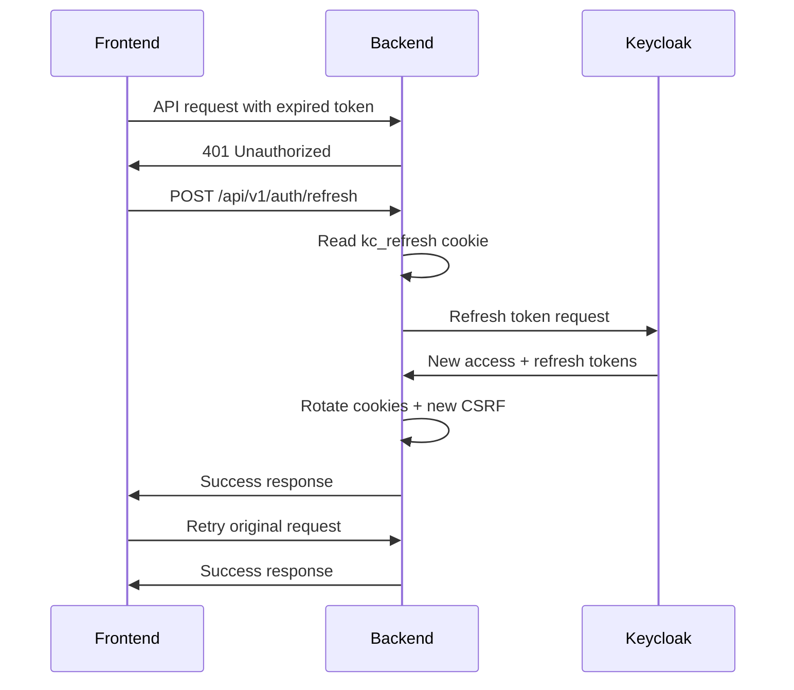

# BLIH System - Frontend-Backend Authentication Integration Documentation

## Table of Contents

1. [Overview](#overview)
2. [Authentication Architecture](#authentication-architecture)
3. [Backend API Endpoints](#backend-api-endpoints)
4. [Cookie Management](#cookie-management)
5. [Frontend Implementation Requirements](#frontend-implementation-requirements)
6. [Authentication Flow](#authentication-flow)
7. [Error Handling](#error-handling)
8. [Security Considerations](#security-considerations)
9. [Type Definitions](#type-definitions)
10. [Implementation Examples](#implementation-examples)

## Overview

This document provides comprehensive guidance for integrating the BLIH frontend (Next.js) with the backend authentication system (NestJS + Keycloak). The backend serves as the source of truth for all authentication and authorization logic.

## Authentication Architecture

### Components

- **Frontend**: Next.js 16 with React 19
- **Backend**: NestJS with TypeScript
- **Identity Provider**: Keycloak (OIDC)
- **Authentication Method**: Authorization Code Flow with PKCE

### Security Features

- HttpOnly cookies for token storage
- CSRF protection
- PKCE (Proof Key for Code Exchange)
- Token rotation
- Rate limiting
- MFA enforcement for privileged roles

## Backend API Endpoints

### Authentication Endpoints

#### 1. Initiate Login

```http
GET /api/v1/auth/login
```

**Query Parameters:**

- `redirect` (optional): Relative URL path after successful login (e.g., `/dashboard`)
- `prompt` (optional): OIDC prompt forwarded to Keycloak (e.g., `login`)

**Response:** 302 Redirect to Keycloak authorization endpoint

**Cookies Set:**

- `kc_state`: CSRF protection state
- `kc_verifier`: PKCE code verifier (if PKCE enabled)
- `kc_redirect`: Safe redirect path
- `kc_nonce`: Nonce for ID token validation (if enabled)

#### 2. Handle Callback

```http
GET /api/v1/auth/callback
```

**Query Parameters:**

- `code`: Authorization code from Keycloak
- `state`: State returned by Keycloak

**Response:** 302 Redirect to frontend with auth cookies set

**Cookies Set:**

- `kc_access`: HttpOnly access token
- `kc_refresh`: HttpOnly refresh token
- `kc_id`: HttpOnly ID token (if provided)
- `kc_csrf`: Readable CSRF token for form protection

#### 3. Get Current User

```http
GET /api/v1/auth/me
```

**Authentication:** Required (Bearer token or cookie)

**Response:**

```typescript
{
  id: string;
  keycloakId: string;
  username?: string;
  email: string;
  firstName?: string;
  lastName?: string;
  phone?: string;
  status?: string;
  departmentId?: string | null;
  sub: string;
  roles: string[];
  permissions: string[];
  scopes: string[];
  sessionId?: string;
  clientId?: string;
}
```

#### 4. Logout

```http
GET /api/v1/auth/logout
```

**Query Parameters:**

- `redirect` (optional): Relative URL path after logout

**Response:** 302 Redirect through Keycloak end-session

**Cookies Cleared:** All auth and transient cookies

#### 5. Refresh Token

```http
POST /api/v1/auth/refresh
```

**Body (Utility Mode):**

```typescript
{
  token?: string; // Refresh token (optional, uses cookie if not provided)
}
```

**Response:**

```typescript
{
  active: true;
  policyVersion: string;
  scopes: string[];
  roles: string[];
  permissions: string[];
  accessToken?: string; // Only in utility mode
  refreshToken?: string; // Only in utility mode
}
```

#### 6. Validate Token

```http
POST /api/v1/auth/validate
```

**Body:**

```typescript
{
  token: string; // Access token to validate
}
```

**Response:** Same as refresh endpoint but with validation metadata

#### 7. Introspect Token

```http
POST /api/v1/auth/introspect
```

**Body:**

```typescript
{
  token: string; // Token to introspect
}
```

**Response:** Token activity and metadata

#### 8. Exchange Token

```http
POST /api/v1/auth/exchange
```

**Body:**

```typescript
{
  token: string; // Existing token
  requestedSubject?: string; // Subject to impersonate
}
```

**Response:** New token pair with impersonation context

#### 9. Revoke Session

```http
POST /api/v1/auth/revoke-session
```

**Body:**

```typescript
{
  token: string;
  tokenTypeHint?: 'access_token' | 'refresh_token';
  reason?: string;
}
```

**Response:**

```typescript
{
  revoked: boolean;
  subject: string;
  sessionId?: string;
  tokenTypeHint: string;
  reason?: string;
}
```

## Cookie Management

### Cookie Names

- `kc_state`: Transient state for login flow
- `kc_verifier`: PKCE code verifier
- `kc_redirect`: Safe redirect path
- `kc_nonce`: Nonce for ID token validation
- `kc_access`: HttpOnly access token
- `kc_refresh`: HttpOnly refresh token
- `kc_id`: HttpOnly ID token
- `kc_csrf`: Readable CSRF token

### Cookie Configuration

```typescript
interface AuthCookieSettings {
  httpOnly: boolean; // Usually true for auth cookies
  secure: boolean; // True in production
  sameSite: 'lax' | 'strict' | 'none';
  domain?: string;
  path: string;
}
```

## Frontend Implementation Requirements

### 1. Authentication Context

Create a React context to manage authentication state:

```typescript
// src/contexts/AuthContext.tsx
interface AuthContextType {
  user: AuthMeResponse | null;
  isLoading: boolean;
  isAuthenticated: boolean;
  login: (redirectPath?: string) => void;
  logout: (redirectPath?: string) => void;
  refreshAuth: () => Promise<void>;
}

const AuthContext = createContext<AuthContextType | undefined>(undefined);
```

### 2. Authentication Provider

```typescript
// src/providers/AuthProvider.tsx
export const AuthProvider: React.FC<{ children: React.ReactNode }> = ({ children }) => {
  const [user, setUser] = useState<AuthMeResponse | null>(null);
  const [isLoading, setIsLoading] = useState(true);

  const checkAuth = useCallback(async () => {
    try {
      const response = await fetch('/api/v1/auth/me', {
        credentials: 'include',
      });

      if (response.ok) {
        const userData = await response.json();
        setUser(userData);
      } else {
        setUser(null);
      }
    } catch (error) {
      console.error('Auth check failed:', error);
      setUser(null);
    } finally {
      setIsLoading(false);
    }
  }, []);

  useEffect(() => {
    checkAuth();
  }, [checkAuth]);

  const login = useCallback((redirectPath?: string) => {
    const params = new URLSearchParams();
    if (redirectPath) {
      params.set('redirect', redirectPath);
    }
    window.location.href = `/api/v1/auth/login${params.toString() ? '?' + params.toString() : ''}`;
  }, []);

  const logout = useCallback((redirectPath?: string) => {
    const params = new URLSearchParams();
    if (redirectPath) {
      params.set('redirect', redirectPath);
    }
    window.location.href = `/api/v1/auth/logout${params.toString() ? '?' + params.toString() : ''}`;
  }, []);

  const refreshAuth = useCallback(async () => {
    try {
      await fetch('/api/v1/auth/refresh', {
        method: 'POST',
        credentials: 'include',
      });
      await checkAuth();
    } catch (error) {
      console.error('Token refresh failed:', error);
      setUser(null);
    }
  }, [checkAuth]);

  return (
    <AuthContext.Provider value={{
      user,
      isLoading,
      isAuthenticated: !!user,
      login,
      logout,
      refreshAuth,
    }}>
      {children}
    </AuthContext.Provider>
  );
};
```

### 3. Authentication Hook

```typescript
// src/hooks/useAuth.ts
export const useAuth = () => {
  const context = useContext(AuthContext);
  if (!context) {
    throw new Error('useAuth must be used within AuthProvider');
  }
  return context;
};
```

### 4. Protected Routes

```typescript
// src/components/ProtectedRoute.tsx
interface ProtectedRouteProps {
  children: React.ReactNode;
  requiredPermissions?: string[];
  requiredRoles?: string[];
  fallback?: React.ReactNode;
}

export const ProtectedRoute: React.FC<ProtectedRouteProps> = ({
  children,
  requiredPermissions = [],
  requiredRoles = [],
  fallback = <div>Access denied</div>,
}) => {
  const { user, isLoading, isAuthenticated } = useAuth();

  if (isLoading) {
    return <div>Loading...</div>;
  }

  if (!isAuthenticated) {
    return <div>Please log in</div>;
  }

  const hasPermission = requiredPermissions.every(permission =>
    user?.permissions.includes(permission)
  );

  const hasRole = requiredRoles.every(role =>
    user?.roles.includes(role)
  );

  if (!hasPermission || !hasRole) {
    return fallback;
  }

  return <>{children}</>;
};
```

### 5. API Client Configuration

```typescript
// src/lib/api.ts
class ApiClient {
  private baseURL: string;

  constructor(baseURL: string = '/api/v1') {
    this.baseURL = baseURL;
  }

  private async request<T>(
    endpoint: string,
    options: RequestInit = {},
  ): Promise<T> {
    const url = `${this.baseURL}${endpoint}`;

    const response = await fetch(url, {
      ...options,
      credentials: 'include',
      headers: {
        'Content-Type': 'application/json',
        ...options.headers,
      },
    });

    if (!response.ok) {
      if (response.status === 401) {
        // Token expired or invalid
        window.location.href = '/api/v1/auth/login';
        throw new Error('Authentication required');
      }
      throw new Error(`API error: ${response.status}`);
    }

    return response.json();
  }

  async get<T>(endpoint: string): Promise<T> {
    return this.request<T>(endpoint, { method: 'GET' });
  }

  async post<T>(endpoint: string, data?: any): Promise<T> {
    return this.request<T>(endpoint, {
      method: 'POST',
      body: data ? JSON.stringify(data) : undefined,
    });
  }

  async put<T>(endpoint: string, data?: any): Promise<T> {
    return this.request<T>(endpoint, {
      method: 'PUT',
      body: data ? JSON.stringify(data) : undefined,
    });
  }

  async delete<T>(endpoint: string): Promise<T> {
    return this.request<T>(endpoint, { method: 'DELETE' });
  }
}

export const apiClient = new ApiClient();
```

## Authentication Flow

### Complete Login Flow



### Token Refresh Flow



## Error Handling

### Authentication Errors

```typescript
// src/lib/auth-errors.ts
export class AuthError extends Error {
  constructor(
    message: string,
    public code: string,
    public statusCode?: number,
  ) {
    super(message);
    this.name = 'AuthError';
  }
}

export const handleAuthError = (error: unknown): AuthError => {
  if (error instanceof AuthError) {
    return error;
  }

  if (error instanceof Response) {
    switch (error.status) {
      case 401:
        return new AuthError('Authentication required', 'UNAUTHORIZED', 401);
      case 403:
        return new AuthError('Access denied', 'FORBIDDEN', 403);
      case 429:
        return new AuthError('Too many requests', 'RATE_LIMITED', 429);
      default:
        return new AuthError('Authentication error', 'UNKNOWN', error.status);
    }
  }

  return new AuthError('Unknown authentication error', 'UNKNOWN');
};
```

### Error Boundaries

```typescript
// src/components/AuthErrorBoundary.tsx
export class AuthErrorBoundary extends React.Component<
  { children: React.ReactNode },
  { hasError: boolean; error?: Error }
> {
  constructor(props: { children: React.ReactNode }) {
    super(props);
    this.state = { hasError: false };
  }

  static getDerivedStateFromError(error: Error) {
    return { hasError: true, error };
  }

  componentDidCatch(error: Error, errorInfo: React.ErrorInfo) {
    console.error('Auth error boundary caught:', error, errorInfo);
  }

  render() {
    if (this.state.hasError) {
      return (
        <div className="auth-error">
          <h2>Authentication Error</h2>
          <p>Something went wrong with authentication.</p>
          <button onClick={() => window.location.href = '/api/v1/auth/login'}>
            Try logging in again
          </button>
        </div>
      );
    }

    return this.props.children;
  }
}
```

## Security Considerations

### 1. CSRF Protection

- Use `kc_csrf` cookie for form submissions
- Validate CSRF token on state-changing operations
- Include CSRF token in headers or form data

### 2. Token Security

- Never expose access tokens in JavaScript (HttpOnly cookies)
- Use secure cookie flags in production
- Implement proper token rotation

### 3. Redirect Validation

- Only allow redirects to whitelisted paths
- Validate redirect URLs against allowed prefixes
- Use absolute URLs only for trusted domains

### 4. Session Management

- Implement proper logout flow
- Clear all cookies on logout
- Handle session expiration gracefully

## Type Definitions

### User Profile Types

```typescript
// src/types/auth.ts
export interface AuthMeResponse {
  id: string;
  keycloakId: string;
  username?: string;
  email: string;
  firstName?: string;
  lastName?: string;
  phone?: string;
  status?: string;
  departmentId?: string | null;
  sub: string;
  roles: string[];
  permissions: string[];
  scopes: string[];
  sessionId?: string;
  clientId?: string;
}

export interface AuthPrincipal {
  sub: string;
  email: string;
  username?: string;
  realm: string;
  policyVersion: string;
  roles: string[];
  permissions: string[];
  scopes: string[];
  sessionId?: string;
  clientId?: string;
  userId?: string;
  firstName?: string;
  lastName?: string;
  phone?: string;
  status?: string;
  departmentId?: string | null;
}
```

### API Request/Response Types

```typescript
// src/types/api.ts
export interface ValidateTokenRequest {
  token: string;
}

export interface RefreshTokenRequest {
  token?: string;
}

export interface ExchangeTokenRequest {
  token: string;
  requestedSubject?: string;
}

export interface RevokeSessionRequest {
  token: string;
  tokenTypeHint?: 'access_token' | 'refresh_token';
  reason?: string;
}

export interface TokenResponse {
  active: boolean;
  policyVersion: string;
  scopes: string[];
  roles: string[];
  permissions: string[];
  accessToken?: string;
  refreshToken?: string;
}

export interface RevokeSessionResponse {
  revoked: boolean;
  subject: string;
  sessionId?: string;
  tokenTypeHint: string;
  reason?: string;
}
```

## Implementation Examples

### Complete Login Page

```typescript
// src/app/login/page.tsx
'use client';

import { useEffect, useState } from 'react';
import { useAuth } from '@/hooks/useAuth';
import { AuthErrorBoundary } from '@/components/AuthErrorBoundary';
import { AuthCard } from '@/features/auth/components/auth-card';
import { AuthBackground } from '@/features/auth/components/auth-background';

export default function LoginPage() {
  const { isAuthenticated, login } = useAuth();
  const [isRedirecting, setIsRedirecting] = useState(false);

  useEffect(() => {
    if (isAuthenticated) {
      setIsRedirecting(true);
      window.location.href = '/dashboard';
    }
  }, [isAuthenticated]);

  const handleLogin = () => {
    setIsRedirecting(true);
    login('/dashboard');
  };

  if (isRedirecting) {
    return (
      <div className="flex items-center justify-center min-h-screen">
        <div className="text-center">
          <div className="animate-spin rounded-full h-8 w-8 border-b-2 border-blue-600 mx-auto"></div>
          <p className="mt-2 text-gray-600">Redirecting to login...</p>
        </div>
      </div>
    );
  }

  return (
    <AuthErrorBoundary>
      <AuthBackground>
        <div className="flex items-center justify-center min-h-screen">
          <AuthCard>
            <div className="text-center">
              <h1 className="text-2xl font-bold text-gray-900 mb-4">
                Welcome to BLIH System
              </h1>
              <p className="text-gray-600 mb-6">
                Please log in to access your dashboard
              </p>
              <button
                onClick={handleLogin}
                className="w-full bg-blue-600 text-white py-2 px-4 rounded-md hover:bg-blue-700 transition-colors"
              >
                Login with Keycloak
              </button>
            </div>
          </AuthCard>
        </div>
      </AuthBackground>
    </AuthErrorBoundary>
  );
}
```

### Dashboard with Auth Check

```typescript
// src/app/dashboard/page.tsx
'use client';

import { useAuth } from '@/hooks/useAuth';
import { ProtectedRoute } from '@/components/ProtectedRoute';
import { AuthErrorBoundary } from '@/components/AuthErrorBoundary';

export default function DashboardPage() {
  const { user, logout } = useAuth();

  return (
    <AuthErrorBoundary>
      <ProtectedRoute requiredPermissions={['dashboard:view']}>
        <div className="min-h-screen bg-gray-50">
          <header className="bg-white shadow">
            <div className="max-w-7xl mx-auto px-4 sm:px-6 lg:px-8">
              <div className="flex justify-between items-center py-6">
                <h1 className="text-3xl font-bold text-gray-900">
                  Dashboard
                </h1>
                <div className="flex items-center space-x-4">
                  <span className="text-sm text-gray-600">
                    Welcome, {user?.firstName || user?.email}
                  </span>
                  <button
                    onClick={() => logout('/login')}
                    className="bg-red-600 text-white py-1 px-3 rounded text-sm hover:bg-red-700"
                  >
                    Logout
                  </button>
                </div>
              </div>
            </div>
          </header>

          <main className="max-w-7xl mx-auto py-6 sm:px-6 lg:px-8">
            <div className="px-4 py-6 sm:px-0">
              <div className="border-4 border-dashed border-gray-200 rounded-lg h-96 flex items-center justify-center">
                <div className="text-center">
                  <h2 className="text-xl font-semibold text-gray-900 mb-2">
                    Welcome to your Dashboard
                  </h2>
                  <p className="text-gray-600 mb-4">
                    You are successfully authenticated
                  </p>
                  <div className="bg-gray-100 p-4 rounded-lg text-left">
                    <h3 className="font-semibold mb-2">User Information:</h3>
                    <p><strong>Name:</strong> {user?.firstName} {user?.lastName}</p>
                    <p><strong>Email:</strong> {user?.email}</p>
                    <p><strong>Roles:</strong> {user?.roles.join(', ')}</p>
                    <p><strong>Department:</strong> {user?.departmentId || 'Not assigned'}</p>
                  </div>
                </div>
              </div>
            </div>
          </main>
        </div>
      </ProtectedRoute>
    </AuthErrorBoundary>
  );
}
```

### API Usage Example

```typescript
// src/hooks/useApi.ts
import { useState, useEffect } from 'react';
import { apiClient } from '@/lib/api';
import { useAuth } from './useAuth';

export const useApi = <T>(endpoint: string, dependencies: any[] = []) => {
  const [data, setData] = useState<T | null>(null);
  const [loading, setLoading] = useState(true);
  const [error, setError] = useState<Error | null>(null);
  const { refreshAuth } = useAuth();

  useEffect(() => {
    const fetchData = async () => {
      try {
        setLoading(true);
        setError(null);
        const result = await apiClient.get<T>(endpoint);
        setData(result);
      } catch (err) {
        if (err instanceof Error && err.message.includes('401')) {
          // Try to refresh token and retry
          try {
            await refreshAuth();
            const result = await apiClient.get<T>(endpoint);
            setData(result);
          } catch (refreshErr) {
            setError(refreshErr as Error);
          }
        } else {
          setError(err as Error);
        }
      } finally {
        setLoading(false);
      }
    };

    fetchData();
  }, [endpoint, ...dependencies, refreshAuth]);

  return { data, loading, error };
};
```

## Environment Configuration

### Frontend Environment Variables

```bash
# .env.local
NEXT_PUBLIC_API_BASE_URL=http://localhost:3001/api/v1
NEXT_PUBLIC_APP_BASE_URL=http://localhost:3000

# Keycloak Configuration (Optional - for direct Keycloak integration)
NEXT_PUBLIC_KEYCLOAK_URL=http://localhost:8080
NEXT_PUBLIC_KEYCLOAK_REALM=blih-realm
NEXT_PUBLIC_KEYCLOAK_CLIENT_ID=blih-system-frontend

# Feature Flags
NEXT_PUBLIC_ENABLE_DIRECT_KEYCLOAK=false  # Set to true for direct Keycloak integration
NEXT_PUBLIC_ENABLE_IMPERSONATION=false     # Set to true for admin impersonation
```

### Keycloak Frontend Configuration

While the backend handles most Keycloak interactions, the frontend may need direct Keycloak configuration for:

#### 1. Direct Keycloak Integration (Optional)

```typescript
// src/lib/keycloak.ts
export interface KeycloakConfig {
  url: string;
  realm: string;
  clientId: string;
}

export const keycloakConfig: KeycloakConfig = {
  url: process.env.NEXT_PUBLIC_KEYCLOAK_URL || 'http://localhost:8080',
  realm: process.env.NEXT_PUBLIC_KEYCLOAK_REALM || 'blih-realm',
  clientId:
    process.env.NEXT_PUBLIC_KEYCLOAK_CLIENT_ID || 'blih-system-frontend',
};

// For direct Keycloak JavaScript adapter usage
export const keycloakInitOptions = {
  onLoad: 'check-sso' as const,
  silentCheckSsoRedirectUri: `${window.location.origin}/silent-check-sso.html`,
  pkceMethod: 'S256' as const,
  enableLogging: process.env.NODE_ENV === 'development',
  checkLoginIframe: false,
  responseMode: 'query' as const,
};
```

#### 2. Keycloak JavaScript Adapter Setup (Optional)

```typescript
// src/lib/keycloak-adapter.ts
import Keycloak from 'keycloak-js';
import { keycloakConfig, keycloakInitOptions } from './keycloak';

let keycloakInstance: Keycloak.KeycloakInstance | null = null;

export const getKeycloakInstance = (): Keycloak.KeycloakInstance => {
  if (!keycloakInstance) {
    keycloakInstance = new Keycloak(keycloakConfig);
  }
  return keycloakInstance;
};

export const initKeycloak = async (): Promise<boolean> => {
  try {
    const keycloak = getKeycloakInstance();
    const authenticated = await keycloak.init(keycloakInitOptions);
    return authenticated;
  } catch (error) {
    console.error('Keycloak initialization failed:', error);
    return false;
  }
};

export const loginWithKeycloak = async (redirectUri?: string) => {
  const keycloak = getKeycloakInstance();
  await keycloak.login({
    redirectUri:
      redirectUri || `${window.location.origin}/api/v1/auth/callback`,
  });
};

export const logoutFromKeycloak = async () => {
  const keycloak = getKeycloakInstance();
  await keycloak.logout({
    redirectUri: `${window.location.origin}/login`,
  });
};

export const refreshToken = async (): Promise<boolean> => {
  const keycloak = getKeycloakInstance();
  try {
    const refreshed = await keycloak.updateToken(70); // Refresh if token expires in 70 seconds
    return refreshed;
  } catch (error) {
    console.error('Token refresh failed:', error);
    return false;
  }
};

export const getKeycloakToken = (): string | undefined => {
  const keycloak = getKeycloakInstance();
  return keycloak.token;
};

export const getKeycloakParsedToken = () => {
  const Keycloak = getKeycloakInstance();
  return keycloak.tokenParsed;
};
```

#### 3. Silent Check SSO Page

```html
<!-- public/silent-check-sso.html -->
<html>
  <body>
    <script>
      if (parent) {
        parent.postMessage(
          {
            type: 'keycloak-silent-check-sso',
            error: 'silent_sso_failed',
          },
          window.location.origin,
        );
      }
    </script>
  </body>
</html>
```

### Backend Environment Variables (Reference)

```bash
# Keycloak Configuration
KEYCLOAK_ENABLED=true
KEYCLOAK_URL=http://localhost:8080
KEYCLOAK_REALM=blih-realm
KEYCLOAK_AUTH_CLIENT_ID=blih-system-frontend
KEYCLOAK_AUTH_CLIENT_SECRET=your-client-secret
KEYCLOAK_AUTH_REDIRECT_URI=http://localhost:3000/api/v1/auth/callback
KEYCLOAK_AUTH_SCOPES=openid profile email

# Frontend Configuration
AUTH_FRONTEND_BASE_URL=http://localhost:3000
AUTH_POST_LOGIN_REDIRECT_URI=/dashboard
AUTH_POST_LOGOUT_REDIRECT_URI=/login
AUTH_LOGIN_ERROR_REDIRECT_URI=/login?error=true

# Security Settings
AUTH_COOKIE_SECURE=false  # Set to true in production
AUTH_COOKIE_HTTP_ONLY=true
AUTH_COOKIE_SAME_SITE=lax
AUTH_COOKIE_PATH=/
AUTH_PKCE_ENABLED=true
AUTH_NONCE_ENABLED=false

# Rate Limiting
AUTH_LOGIN_RATE_LIMIT_MAX=5
AUTH_LOGIN_RATE_LIMIT_WINDOW_MS=900000  # 15 minutes
```

### Package Dependencies

#### Required for Direct Keycloak Integration (Optional)

```bash
npm install keycloak-js
# or
yarn add keycloak-js
# or
pnpm add keycloak-js
```

#### Type Definitions (if using TypeScript)

```bash
npm install --save-dev @types/keycloak-js
# or
yarn add --dev @types/keycloak-js
# or
pnpm add --dev @types/keycloak-js
```

### Integration Approaches

#### Approach 1: Backend-Only (Recommended)

The backend handles all Keycloak interactions. Frontend only needs to:

- Redirect to `/api/v1/auth/login` for login
- Handle redirects from `/api/v1/auth/callback`
- Use `/api/v1/auth/me` to get user data
- Redirect to `/api/v1/auth/logout` for logout

**Pros:**

- Simpler frontend implementation
- Better security (tokens never exposed to frontend JavaScript)
- Centralized authentication logic
- Easier to maintain and update

**Cons:**

- Requires full page redirects for login/logout
- Less control over authentication flow

#### Approach 2: Direct Keycloak Integration (Advanced)

Frontend uses Keycloak JavaScript adapter for:

- Silent SSO checks
- Token management
- Fine-grained control over authentication flow

**Pros:**

- Better user experience (no full page redirects)
- More control over authentication flow
- Can implement custom login screens
- Better for SPA-style applications

**Cons:**

- More complex implementation
- Security considerations (tokens in JavaScript memory)
- Additional dependencies
- More maintenance overhead

### Keycloak Client Configuration

#### Keycloak Admin Console Setup

1. **Create Frontend Client**
   - Client ID: `blih-system-frontend`
   - Client Protocol: `openid-connect`
   - Access Type: `confidential` (recommended) or `public`
   - Standard Flow Enabled: `ON`
   - Direct Access Grants Enabled: `OFF`
   - Service Accounts Enabled: `OFF`

2. **Valid Redirect URIs**

   ```
   http://localhost:3000/api/v1/auth/callback
   http://localhost:3000/*
   https://yourdomain.com/api/v1/auth/callback
   https://yourdomain.com/*
   ```

3. **Valid Post Logout Redirect URIs**

   ```
   http://localhost:3000/login
   http://localhost:3000/
   https://yourdomain.com/login
   https://yourdomain.com/
   ```

4. **Web Origins**

   ```
   http://localhost:3000
   https://yourdomain.com
   ```

5. **Client Scopes**
   - `openid` (required)
   - `profile` (recommended)
   - `email` (recommended)
   - Custom scopes for your application

## Testing

### Authentication Testing

```typescript
// src/__tests__/auth.test.tsx
import { render, screen, waitFor } from '@testing-library/react';
import { AuthProvider } from '@/providers/AuthProvider';
import { useAuth } from '@/hooks/useAuth';

// Mock fetch
global.fetch = jest.fn();

const TestComponent = () => {
  const { user, isAuthenticated, login, logout } = useAuth();

  return (
    <div>
      <div data-testid="authenticated">{isAuthenticated.toString()}</div>
      <div data-testid="user-email">{user?.email || 'no-user'}</div>
      <button onClick={() => login()}>Login</button>
      <button onClick={() => logout()}>Logout</button>
    </div>
  );
};

describe('Authentication', () => {
  beforeEach(() => {
    (fetch as jest.Mock).mockClear();
  });

  test('should check authentication on mount', async () => {
    (fetch as jest.Mock).mockResolvedValueOnce({
      ok: true,
      json: () => Promise.resolve({
        id: '1',
        email: 'test@example.com',
        roles: ['user'],
        permissions: ['dashboard:view'],
      }),
    });

    render(
      <AuthProvider>
        <TestComponent />
      </AuthProvider>
    );

    await waitFor(() => {
      expect(screen.getByTestId('authenticated')).toHaveTextContent('true');
      expect(screen.getByTestId('user-email')).toHaveTextContent('test@example.com');
    });
  });

  test('should handle unauthenticated state', async () => {
    (fetch as jest.Mock).mockResolvedValueOnce({
      ok: false,
      status: 401,
    });

    render(
      <AuthProvider>
        <TestComponent />
      </AuthProvider>
    );

    await waitFor(() => {
      expect(screen.getByTestId('authenticated')).toHaveTextContent('false');
      expect(screen.getByTestId('user-email')).toHaveTextContent('no-user');
    });
  });
});
```

## Deployment Considerations

### Production Checklist

1. **Security Headers**
   - Enable secure cookies (`AUTH_COOKIE_SECURE=true`)
   - Set proper CSP headers
   - Enable HSTS

2. **CORS Configuration**
   - Configure allowed origins
   - Include credentials in CORS
   - Set appropriate headers

3. **Domain Configuration**
   - Set `AUTH_COOKIE_DOMAIN` for cross-subdomain auth
   - Configure proper redirect URIs
   - Update Keycloak client settings

4. **Rate Limiting**
   - Configure appropriate limits
   - Monitor for abuse
   - Implement IP-based blocking if needed

5. **Monitoring**
   - Log authentication events
   - Monitor token refresh failures
   - Track login/logout patterns

---

This documentation provides a complete reference for implementing frontend authentication integration with the BLIH backend. The backend API serves as the source of truth, and the frontend should align with these specifications for seamless authentication and authorization.
