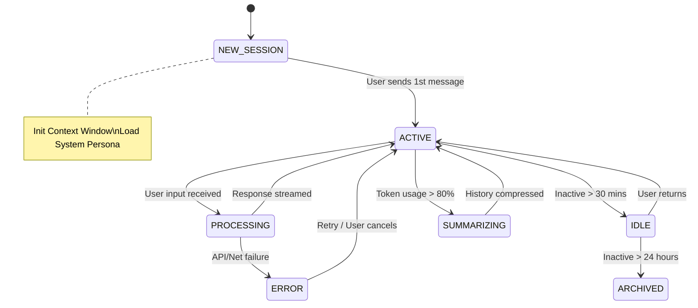
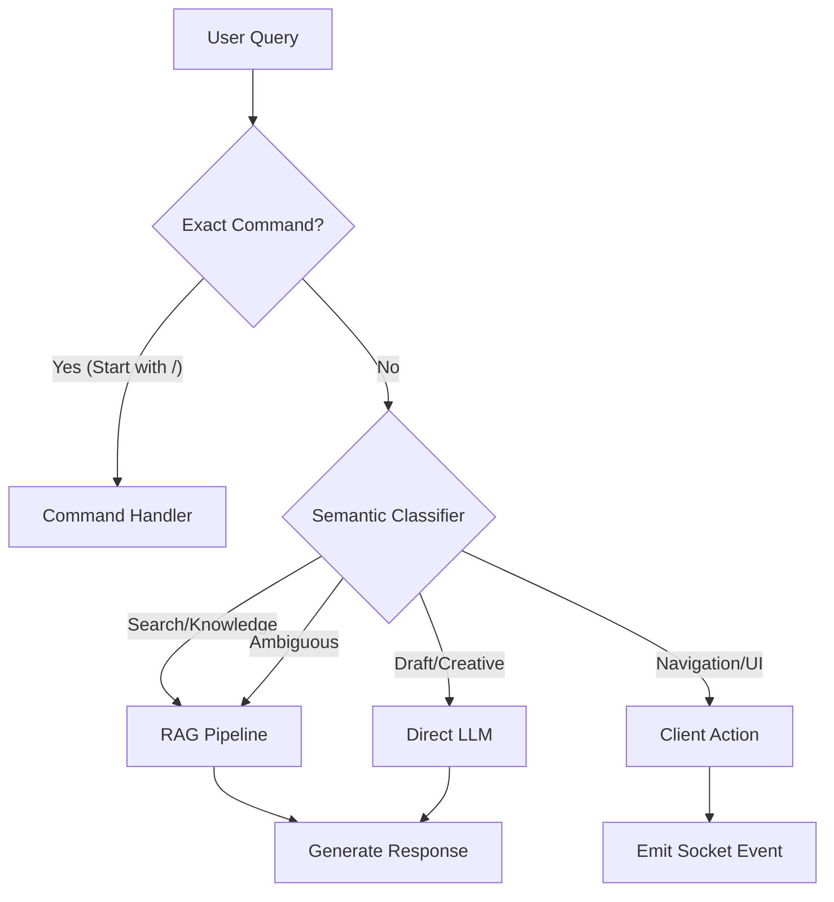

# AI Chatbot Logic Specification

**Module:** Brain (AI) / Chatbot  
**Component:** Chatbot Application Reference  
**Version:** 1.1  
**Last Updated:** February 2026

**Integration boundary:** The Chatbot is a domain module. It MUST NOT call HR, CRM, Finance, or Brain APIs directly. All cross-module communication is via the RabbitMQ exchange `blih.events` (publish/subscribe only; see [EVENT_CONTRACTS.md](../core/EVENT_CONTRACTS.md) and [ARCHITECTURE.md](../core/ARCHITECTURE.md)).

---

## Table of Contents

1. [Conversation State Machine](#1-conversation-state-machine)
2. [Context Window Management](#2-context-window-management)
3. [Intent Recognition & Routing](#3-intent-recognition--routing)
4. [Permission & Enforcement Logic](#4-permission--enforcement-logic)
5. [Citation Verification Algorithm](#5-citation-verification-algorithm)

---

## 1. Conversation State Machine

The Chatbot maintains a robust state machine for every user session to handle context retention, timeouts, and token limits.

### 1.1 Session States & Transitions



### 1.2 State Persistence Logic
- **Storage:** Redis (Hot State) + PostgreSQL (Cold Storage).
- **TTL Strategy:**
  - Active sessions cached in Redis (TTL: 1 hour).
  - On transition to `ARCHIVED`, flush full history to Postgres `chat_history` table and clear Redis.

---

## 2. Context Window Management

Managing the "Context Window" is critical for cost, latency, and accuracy. We use a **Priority-Based Sliding Window with Summarization**.

### 2.1 Token Budget Allocation (Total: 8192 Tokens)

| Component | Target Tokens | Priority | Description |
|-----------|---------------|----------|-------------|
| **System Prompt** | 500 | CRITICAL | Core persona, constraints, and current date. Never truncated. |
| **Response Reserve** | 1000 | HIGH | Guaranteed space for generation. |
| **RAG Context** | 4000 | HIGH | Retrieved document chunks. Truncated by relevance score. |
| **Chat History** | 2000 | MEDIUM | Recent Q&A pairs (approx 8-10 turns). |
| **User Query** | 500 | HIGH | The current input. |
| **Safety Buffer** | 192 | - | Floating buffer for tokenizer mismatch. |

### 2.2 Context Construction Algorithm

```python
def build_context(user_query, chat_history, retrieved_docs):
    """
    Constructs the final prompt payload respecting token limits.
    """
    MAX_CONTEXT = 8192
    RESERVED = 1500  # Response + Buffer
    
    # 1. Start with Immutable System Prompt
    prompt = [SYSTEM_PROMPT]
    current_tokens = count_tokens(SYSTEM_PROMPT)
    
    # 2. Add User Query (Critical)
    query_tokens = count_tokens(user_query)
    current_tokens += query_tokens
    
    # 3. Add RAG Context (Fill up to 4000)
    rag_limit = 4000
    rag_tokens = 0
    rag_text = ""
    
    for doc in retrieved_docs:
        chunk_cost = count_tokens(doc.content)
        if rag_tokens + chunk_cost > rag_limit:
            break
        rag_text += f"\n---\nSource [{doc.id}]: {doc.content}"
        rag_tokens += chunk_cost
        
    prompt.append(f"CONTEXT:\n{rag_text}")
    current_tokens += rag_tokens
    
    # 4. Fill Remaining Logic with History (Newest First)
    remaining_budget = MAX_CONTEXT - RESERVED - current_tokens
    history_text = []
    
    for msg in reversed(chat_history):
        msg_cost = count_tokens(msg.content)
        if remaining_budget - msg_cost < 0:
            break
        history_text.insert(0, f"{msg.role}: {msg.content}")
        remaining_budget -= msg_cost
        
    prompt.insert(1, "\n".join(history_text))
    
    # 5. Final Append
    prompt.append(f"User: {user_query}")
    
    return "\n".join(prompt)
```

---

## 3. Intent Recognition & Routing

Not all queries require the RAG pipeline. We use a **Semantic Router** to classify intents and optimize cost/latency.

### 3.1 Routing Logic



### 3.2 Classifier Implementation
- **Commands:** Regex check (`^/summarize`, `^/draft`).
- **Semantic:** Lightweight fast model (e.g., `sentence-transformers/all-MiniLM-L6-v2`) compares query embedding against "Anchor Embbeddings" for known intents.
  - **Anchor "Navigation":** "Go to settings", "Open dashboard", "Show me leads".
  - **Anchor "Creative":** "Write an email", "Draft a post", "Correct this grammar".

---

## 4. Permission & Enforcement Logic

Security is enforced **Post-Retrieval, Pre-Generation** to ensure the LLM never sees restricted data.

### 4.1 The Security Filter

```typescript
async function secureRetrieval(query: string, user: User): Promise<Chunk[]> {
    // 1. Fetch raw candidates from Vector DB (Top-50)
    const candidates = await vectorDB.search(query, k=50);
    
    // 2. Resolve User Permissions (RBAC)
    const userPermissions = await rbac.getPermissions(user.id);
    // e.g. ['VIEW_FINANCE', 'VIEW_HR', 'VIEW_PROJECTS']
    
    // 3. Filter Candidates
    const safeChunks = candidates.filter(chunk => {
        const docPolicy = chunk.metadata.access_policy; // e.g., 'VIEW_FINANCE'
        
        // Public docs or User has required permission
        if (docPolicy === 'PUBLIC') return true;
        return userPermissions.includes(docPolicy);
    });
    
    // 4. Fallback Check
    if (safeChunks.length === 0) {
        logSecurityEvent('ACCESS_DENIED_RETRIEVAL', user.id, query);
        return [];
    }
    
    // 5. Re-rank only the safe chunks
    return reRanker.rank(safeChunks, query).slice(0, 5);
}
```

---

## 5. Citation Verification Algorithm

To prevent hallucinations, we enforce strict citation rules.

### 5.1 Verification Logic

1. **Extraction:** Regex parse the generated answer for citation markers `[1]`, `[2]`.
2. **Validation:**
   - Check if Source ID `1` exists in the `Context` provided to the LLM.
   - **Strict Mode:** If a claim is made without a citation, inject warning: *(Citation Needed)*.
3. **Linkage:** Metadata from the retrieved chunk (Page #, Document Title) is attached to the final response object for the UI to render.

**Payload Structure:**
```json
{
  "message": "The remote work policy allows 3 days WFH [1].",
  "citations": {
    "1": {
      "doc_id": "policy_2026.pdf",
      "page": 12,
      "snippet": "Employees may work from home up to 3 days..."
    }
  }
}
```
