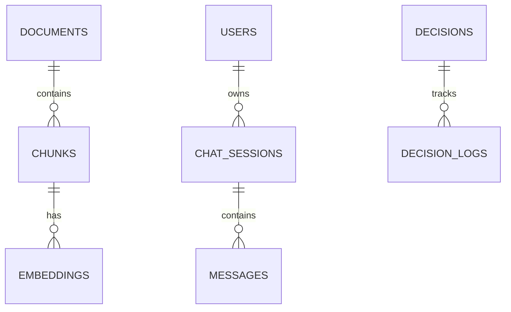
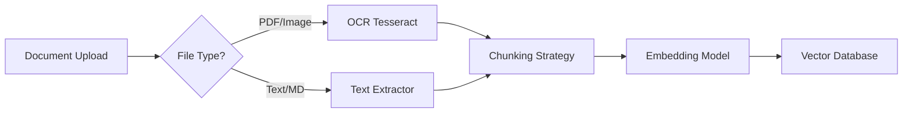

# Brain Module Logic & Database Schema

**Module:** AI & Knowledge Management  
**Version:** 1.0  
**Last Updated:** February 2026

---

## Table of Contents

1. [Business Logic Overview](#1-business-logic-overview)
2. [RAG Pipeline Logic](#2-rag-pipeline-logic)
3. [Vector Search Strategy](#3-vector-search-strategy)
4. [Prompt Engineering](#4-prompt-engineering)
5. [Database Schema](#5-database-schema)

---

## 1. Business Logic Overview

### 1.1 Core Concepts

- **Knowledge Graph:** Connections between documents, entities, and decisions.
- **Embeddings:** Vector representation of text for semantic search.
- **Context Window:** Managing token limits by selecting most relevant chunks.
- **Hybrid Search:** Combining Keyword (BM25) + Semantic (Cosine Similarity).

### 1.2 Entity Relationship Diagram



---

## 2. RAG Pipeline Logic

### 2.1 Ingestion Pipeline



**Chunking Logic:**
- **Strategy:** Sliding Window.
- **Chunk Size:** 512 tokens.
- **Overlap:** 50 tokens (to preserve context across boundaries).

```typescript
function chunkDocument(text: string): string[] {
    const tokens = tokenizer.encode(text);
    const chunks = [];
    
    for (let i = 0; i < tokens.length; i += (512 - 50)) {
        const chunkTokens = tokens.slice(i, i + 512);
        chunks.push(tokenizer.decode(chunkTokens));
    }
    return chunks;
}
```

### 2.2 Retrieval Logic

**Hybrid Search Algorithm:**
1. **Semantic Search:** Query Vector DB for Top-K (e.g., 20) results using Cosine Similarity.
2. **Keyword Search:** Query Elasticsearch/Postgres for Top-K results using BM25.
3. **Re-Ranking:** Use Cross-Encoder to score relevance of combined results.
4. **Context Window Fitting:** Select top N results that fit into LLM context limit (e.g., 4096 tokens).

---

## 3. Vector Search Strategy

### 3.1 Indexing

- **Collection:** One Qdrant collection per Company (Tenant Isolation).
- **Payload Indexing:** Index `document_id`, `created_at`, `tag` for filtering.

### 3.2 Embedding Model

- **Model:** `all-MiniLM-L6-v2` (384 dimensions).
- **Reason:** Fast inference, low storage cost, good performance for general English.

---

## 4. Prompt Engineering

### 4.1 System Prompts

**RAG Assistant:**
```text
You are BLIH Brain, an AI assistant for enterprise business intelligence.
1. Answer strictly based on the provided CONTEXT.
2. If the answer is not in the CONTEXT, state "I do not have enough information."
3. Cite sources using [Doc ID] format.
4. Maintain a professional tone.

CONTEXT:
{context_chunks}

USER QUERY:
{user_query}
```

**Decision Support:**
```text
Analyze the following business scenario and propose 3 strategic options.
Format output as:
- Option 1: [Description] (Pros/Cons)
- Option 2: [Description] (Pros/Cons)
- Recommendation: [Selected Option] because [Reasoning].

SCENARIO:
{scenario_description}
```

---

## 5. Database Schema

### 5.1 Documents (PostgreSQL)

```sql
CREATE TABLE documents (
    id VARCHAR(36) PRIMARY KEY,
    company_id VARCHAR(36) NOT NULL,
    
    title VARCHAR(255) NOT NULL,
    type VARCHAR(50), -- 'PDF', 'DOCX', 'MD'
    url VARCHAR(500), -- S3 path
    
    status ENUM('PROCESSING', 'INDEXED', 'FAILED') DEFAULT 'PROCESSING',
    token_count INT,
    
    uploaded_by VARCHAR(36),
    created_at TIMESTAMP DEFAULT CURRENT_TIMESTAMP,
    
    FOREIGN KEY (uploaded_by) REFERENCES users(id)
);

CREATE TABLE chunks (
    id VARCHAR(36) PRIMARY KEY,
    document_id VARCHAR(36) NOT NULL,
    index INT, -- Sequence number
    content TEXT,
    token_count INT,
    
    FOREIGN KEY (document_id) REFERENCES documents(id) ON DELETE CASCADE
);
```

### 5.2 Chat History (PostgreSQL)

```sql
CREATE TABLE chat_sessions (
    id VARCHAR(36) PRIMARY KEY,
    company_id VARCHAR(36) NOT NULL,
    user_id VARCHAR(36) NOT NULL,
    title VARCHAR(255),
    
    created_at TIMESTAMP DEFAULT CURRENT_TIMESTAMP,
    updated_at TIMESTAMP DEFAULT CURRENT_TIMESTAMP ON UPDATE CURRENT_TIMESTAMP,
    
    FOREIGN KEY (user_id) REFERENCES users(id)
);

CREATE TABLE messages (
    id VARCHAR(36) PRIMARY KEY,
    session_id VARCHAR(36) NOT NULL,
    role ENUM('user', 'assistant', 'system') NOT NULL,
    content TEXT NOT NULL,
    
    tokens_used INT,
    citations JSONB, -- Array of {doc_id, chunk_id}
    
    created_at TIMESTAMP DEFAULT CURRENT_TIMESTAMP,
    
    FOREIGN KEY (session_id) REFERENCES chat_sessions(id) ON DELETE CASCADE
);
```

### 5.3 Vector Schema (Qdrant Payload)

```json
{
  "id": "uuid",
  "vector": [0.012, -0.234, ...], // 384 dims
  "payload": {
    "document_id": "uuid",
    "chunk_id": "uuid",
    "content": "Text content of chunk...",
    "company_id": "uuid",
    "created_at": 1709234567
  }
}
```

---

**Related Documentation:**
- [BRAIN_API.md](file:///home/michot/project/BLIH-Business-Lifecycle-Integrated-Hub-/docs/api/BRAIN_API.md) - API Endpoints
- [BRAIN_INTEGRATION.md](file:///home/michot/project/BLIH-Business-Lifecycle-Integrated-Hub-/docs/integration/BRAIN_INTEGRATION.md) - External Service Config
- [BRAIN_SECURITY.md](file:///home/michot/project/BLIH-Business-Lifecycle-Integrated-Hub-/docs/security/BRAIN_SECURITY.md) - Security Guardrails
