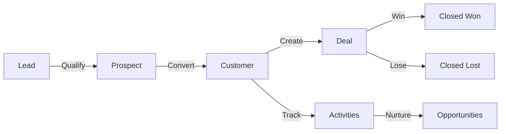
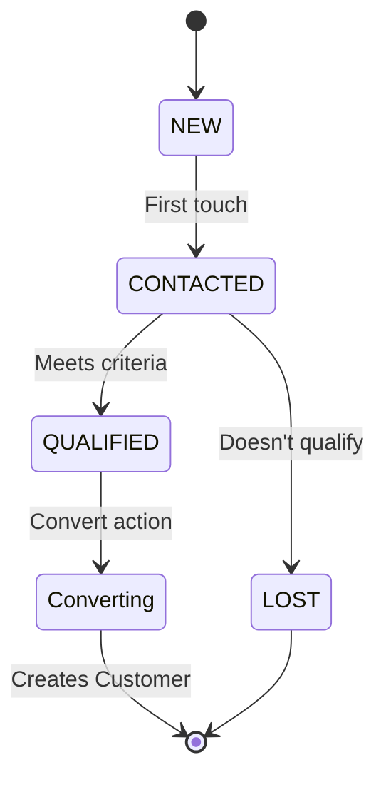
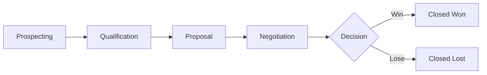
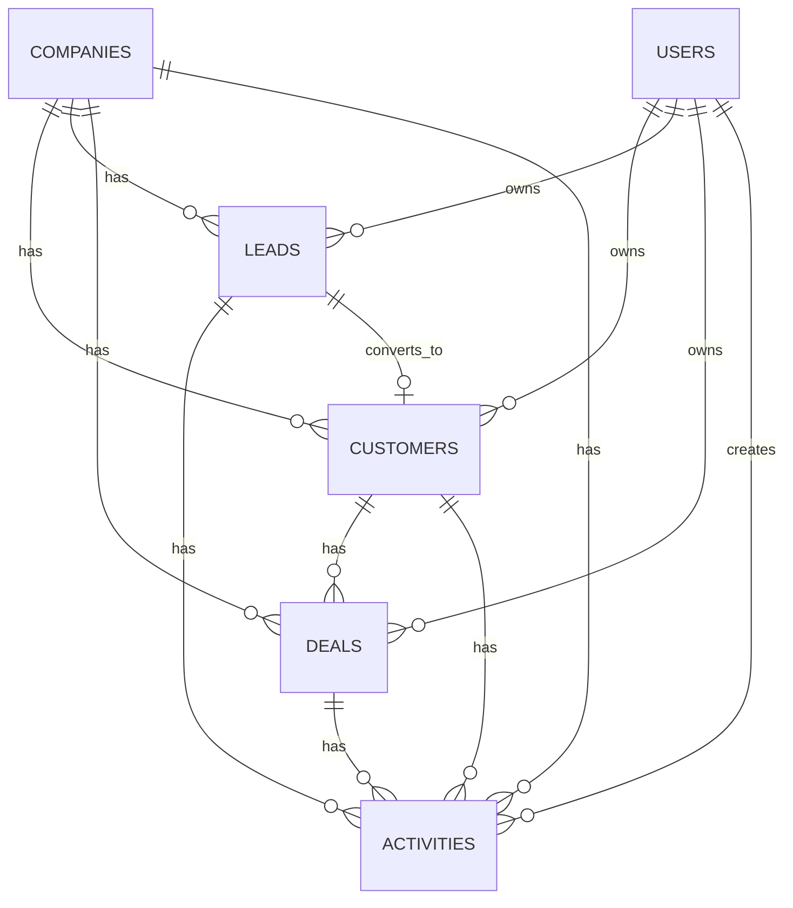

# CRM Module Logic & Database Schema

**Module:** Customer Relationship Management  
**Version:** 1.0  
**Last Updated:** February 2026

---

## Table of Contents

1. [Business Logic Overview](#1-business-logic-overview)
2. [Lead Management Workflow](#2-lead-management-workflow)
3. [Deal Pipeline Logic](#3-deal-pipeline-logic)
4. [Database Schema](#4-database-schema)
5. [Business Rules](#5-business-rules)

---

## 1. Business Logic Overview

### 1.1 CRM Data Flow



### 1.2 Core Entities

| Entity | Purpose | Lifecycle |
|--------|---------|-----------|
| **Lead** | Unqualified contact | NEW → CONTACTED → QUALIFIED/LOST |
| **Customer** | Qualified contact/account | LEAD → PROSPECT → CUSTOMER → INACTIVE |
| **Deal** | Sales opportunity | PROSPECTING → ... → CLOSED_WON/LOST |
| **Activity** | Customer interaction | SCHEDULED → COMPLETED/CANCELLED |
| **Contact** | Person within customer account | ACTIVE → INACTIVE |

---

## 2. Lead Management Workflow

### 2.1 Lead Lifecycle



### 2.2 Lead Scoring Logic

**Automated Lead Scoring:**
```typescript
interface LeadScoringRules {
  company_size: {
    '1-10': 10,
    '11-50': 20,
    '51-200': 30,
    '201-1000': 40,
    '1000+': 50
  };
  engagement: {
    website_visit: 5,
    form_submission: 15,
    email_open: 2,
    email_click: 5,
    demo_request: 50
  };
  title: {
    C_LEVEL: 50,
    VP_DIRECTOR: 40,
    MANAGER: 30,
    INDIVIDUAL: 10
  };
}

// Calculate lead score
function calculateLeadScore(lead: Lead): number {
  let score = 0;
  
  // Company size
  score += scoringRules.company_size[lead.company_size] || 0;
  
  // Engagement activities
  lead.activities.forEach(activity => {
    score += scoringRules.engagement[activity.type] || 0;
  });
  
  // Job title
  score += scoringRules.title[categorizeTitle(lead.title)] || 0;
  
  return Math.min(score, 100);  // Cap at 100
}
```

### 2.3 Lead Qualification Criteria

**BANT Framework:**
```typescript
interface QualificationCriteria {
  budget: {
    checked: boolean;
    min_budget: number;
    has_budget: boolean;
  };
  authority: {
    is_decision_maker: boolean;
    can_influence: boolean;
  };
  need: {
    has_clear_need: boolean;
    problem_identified: boolean;
  };
  timeline: {
    has_timeline: boolean;
    urgency: 'IMMEDIATE' | 'THIS_QUARTER' | 'THIS_YEAR' | 'FUTURE';
  };
}

// Auto-qualify if 3/4 BANT criteria met
function autoQualifyLead(lead: Lead): boolean {
  const criteria = lead.qualification_criteria;
  let score = 0;
  
  if (criteria.budget.has_budget) score++;
  if (criteria.authority.is_decision_maker) score++;
  if (criteria.need.has_clear_need) score++;
  if (criteria.timeline.urgency !== 'FUTURE') score++;
  
  return score >= 3;
}
```

### 2.4 Lead Conversion

**Convert Lead → Customer:**
```typescript
async function convertLead(leadId: string, userId: string): Promise<Customer> {
  const lead = await leadRepo.findOne({ id: leadId });
  
  // Business rule: Only QUALIFIED leads can convert
  if (lead.status !== 'QUALIFIED') {
    throw new BusinessRuleException('Only qualified leads can be converted');
  }
  
  // Create customer
  const customer = await customerRepo.save({
    firstName: lead.firstName,
    lastName: lead.lastName,
    email: lead.email,
    phone: lead.phone,
    company: lead.company,
    status: 'PROSPECT',
    source: `CONVERTED_FROM_LEAD_${leadId}`,
    owner_id: lead.owner_id,
    converted_from_lead_id: leadId,
    company_id: lead.company_id
  });
  
  // Copy custom fields
  customer.customFields = lead.customFields;
  
  // Copy activities
  await activityRepo.update(
    { lead_id: leadId },
    { customer_id: customer.id }
  );
  
  // Mark lead as converted
  lead.status = 'CONVERTED';
  lead.converted_to_customer_id = customer.id;
  lead.converted_at = new Date();
  lead.converted_by = userId;
  await leadRepo.save(lead);
  
  // Audit log
  await auditLog({
    action: 'LEAD_CONVERTED',
    lead_id: leadId,
    customer_id: customer.id,
    user_id: userId
  });
  
  return customer;
}
```

---

## 3. Deal Pipeline Logic

### 3.1 Deal Stages



**Stage Probability:**
| Stage | Default Probability | Required Actions |
|-------|-------------------|------------------|
| PROSPECTING | 10% | Initial contact |
| QUALIFICATION | 25% | BANT completed |
| PROPOSAL | 50% | Proposal sent |
| NEGOTIATION | 75% | Terms discussed |
| CLOSED_WON | 100% | Contract signed |
| CLOSED_LOST | 0% | Lost reason recorded |

### 3.2 Deal Progression Rules

**Stage Validation:**
```typescript
const stageValidation = {
  QUALIFICATION: {
    requiredFields: ['customer_id', 'value', 'expected_close_date'],
    requiredActivities: ['CALL', 'MEETING'],
    minActivityCount: 1
  },
  PROPOSAL: {
    requiredFields: ['proposal_sent_date'],
    requiredDocuments: ['proposal'],
    minActivityCount: 2
  },
  NEGOTIATION: {
    requiredActivities: ['MEETING'],
    requiredFields: ['decision_maker_engaged'],
    minActivityCount: 3
  }
};

async function validateStageProgression(
  deal: Deal,
  newStage: DealStage
): Promise<boolean> {
  const validation = stageValidation[newStage];
  if (!validation) return true;
  
  // Check required fields
  for (const field of validation.requiredFields || []) {
    if (!deal[field]) {
      throw new ValidationException(`${field} required for ${newStage}`);
    }
  }
  
  // Check activity count
  if (validation.minActivityCount) {
    const activityCount = await activityRepo.count({
      where: { deal_id: deal.id }
    });
    
    if (activityCount < validation.minActivityCount) {
      throw new ValidationException(
        `At least ${validation.minActivityCount} activities required`
      );
    }
  }
  
  return true;
}
```

### 3.3 Weighted Pipeline Calculation

```typescript
// Calculate weighted pipeline value
async function calculateWeightedPipeline(userId: string): Promise<number> {
  const deals = await dealRepo.find({
    where: {
      owner_id: userId,
      stage: Not(In(['CLOSED_WON', 'CLOSED_LOST']))
    }
  });
  
  const weighted = deals.reduce((sum, deal) => {
    return sum + (deal.value * deal.probability / 100);
  }, 0);
  
  return weighted;
}

// Example:
// Deal 1: $100,000 @ 25% (Qualification) = $25,000
// Deal 2: $50,000 @ 75% (Negotiation) = $37,500
// Weighted Pipeline = $62,500
```

---

## 4. Database Schema

### 4.1 Customers Table

```sql
CREATE TABLE customers (
  id VARCHAR(36) PRIMARY KEY,
  company_id VARCHAR(36) NOT NULL,
  
  -- Contact Info
  first_name VARCHAR(100) NOT NULL,
  last_name VARCHAR(100) NOT NULL,
  email VARCHAR(255) UNIQUE NOT NULL,
  phone VARCHAR(50),
  company VARCHAR(255),
  website VARCHAR(255),
  
  -- Address
  address_line1 VARCHAR(255),
  address_line2 VARCHAR(255),
  city VARCHAR(100),
  state VARCHAR(100),
  postal_code VARCHAR(20),
  country VARCHAR(2),  -- ISO 3166-1 alpha-2
  
  -- Status & Classification
  status ENUM('LEAD', 'PROSPECT', 'CUSTOMER', 'INACTIVE') NOT NULL,
  source VARCHAR(50),  -- 'WEBSITE', 'REFERRAL', 'MARKETING', etc.
  
  -- Ownership
  owner_id VARCHAR(36),
  
  -- Lead conversion tracking
  converted_from_lead_id VARCHAR(36),
  converted_at TIMESTAMP,
  converted_by VARCHAR(36),
  
  -- GDPR
  consent_marketing BOOLEAN DEFAULT FALSE,
  consent_date TIMESTAMP,
  data_retention_until TIMESTAMP,
  
  -- Custom fields (JSONB for flexibility)
  custom_fields JSONB,
  
  -- Timestamps
  created_at TIMESTAMP DEFAULT CURRENT_TIMESTAMP,
  updated_at TIMESTAMP DEFAULT CURRENT_TIMESTAMP ON UPDATE CURRENT_TIMESTAMP,
  deleted_at TIMESTAMP,  -- Soft delete
  
  -- Indexes
  INDEX idx_company_id (company_id),
  INDEX idx_email (email),
  INDEX idx_owner_id (owner_id),
  INDEX idx_status (status),
  INDEX idx_created_at (created_at),
  
  -- Foreign keys
  FOREIGN KEY (company_id) REFERENCES companies(id) ON DELETE CASCADE,
  FOREIGN KEY (owner_id) REFERENCES users(id) ON DELETE SET NULL
);
```

### 4.2 Leads Table

```sql
CREATE TABLE leads (
  id VARCHAR(36) PRIMARY KEY,
  company_id VARCHAR(36) NOT NULL,
  
  -- Contact Info
  first_name VARCHAR(100),
  last_name VARCHAR(100),
  email VARCHAR(255) NOT NULL,
  phone VARCHAR(50),
  company VARCHAR(255),
  title VARCHAR(100),
  
  -- Lead Details
  status ENUM('NEW', 'CONTACTED', 'QUALIFIED', 'LOST', 'CONVERTED') NOT NULL,
  source ENUM('WEBSITE', 'REFERRAL', 'MARKETING', 'COLD_CALL', 'SOCIAL_MEDIA'),
  score INT DEFAULT 0,  -- 0-100
  
  -- Qualification (BANT)
  budget_confirmed BOOLEAN DEFAULT FALSE,
  authority_confirmed BOOLEAN DEFAULT FALSE,
  need_confirmed BOOLEAN DEFAULT FALSE,
  timeline_confirmed BOOLEAN DEFAULT FALSE,
  
  -- Ownership
  owner_id VARCHAR(36),
  
  -- Conversion tracking
  converted_to_customer_id VARCHAR(36),
  converted_at TIMESTAMP,
  converted_by VARCHAR(36),
  
  -- Lost reason
  lost_reason VARCHAR(255),
  lost_at TIMESTAMP,
  
  -- Custom fields
  custom_fields JSONB,
  
  -- Timestamps
  created_at TIMESTAMP DEFAULT CURRENT_TIMESTAMP,
  updated_at TIMESTAMP DEFAULT CURRENT_TIMESTAMP ON UPDATE CURRENT_TIMESTAMP,
  
  INDEX idx_company_id (company_id),
  INDEX idx_email (email),
  INDEX idx_status (status),
  INDEX idx_score (score),
  INDEX idx_owner_id (owner_id),
  
  FOREIGN KEY (company_id) REFERENCES companies(id) ON DELETE CASCADE,
  FOREIGN KEY (owner_id) REFERENCES users(id) ON DELETE SET NULL,
  FOREIGN KEY (converted_to_customer_id) REFERENCES customers(id)
);
```

### 4.3 Deals Table

```sql
CREATE TABLE deals (
  id VARCHAR(36) PRIMARY KEY,
  company_id VARCHAR(36) NOT NULL,
  
  -- Deal Info
  title VARCHAR(255) NOT NULL,
  customer_id VARCHAR(36) NOT NULL,
  value DECIMAL(15, 2) NOT NULL,
  currency VARCHAR(3) DEFAULT 'USD',
  
  -- Pipeline
  stage ENUM(
    'PROSPECTING',
    'QUALIFICATION',
    'PROPOSAL',
    'NEGOTIATION',
    'CLOSED_WON',
    'CLOSED_LOST'
  ) NOT NULL,
  probability INT DEFAULT 0,  -- 0-100
  
  -- Dates
  expected_close_date DATE,
  actual_close_date DATE,
  
  -- Ownership
  owner_id VARCHAR(36),
  
  -- Closing details
  closed_status ENUM('WON', 'LOST'),
  actual_value DECIMAL(15, 2),
  lost_reason VARCHAR(255),
  
  -- Proposal tracking
  proposal_sent_date DATE,
  proposal_document_id VARCHAR(36),
  
  -- Notes
  description TEXT,
  notes TEXT,
  
  -- Custom fields
  custom_fields JSONB,
  
  -- Timestamps
  created_at TIMESTAMP DEFAULT CURRENT_TIMESTAMP,
  updated_at TIMESTAMP DEFAULT CURRENT_TIMESTAMP ON UPDATE CURRENT_TIMESTAMP,
  
  INDEX idx_company_id (company_id),
  INDEX idx_customer_id (customer_id),
  INDEX idx_stage (stage),
  INDEX idx_owner_id (owner_id),
  INDEX idx_expected_close_date (expected_close_date),
  
  FOREIGN KEY (company_id) REFERENCES companies(id) ON DELETE CASCADE,
  FOREIGN KEY (customer_id) REFERENCES customers(id) ON DELETE CASCADE,
  FOREIGN KEY (owner_id) REFERENCES users(id) ON DELETE SET NULL
);
```

### 4.4 Activities Table

```sql
CREATE TABLE activities (
  id VARCHAR(36) PRIMARY KEY,
  company_id VARCHAR(36) NOT NULL,
  
  -- Activity Type
  type ENUM('CALL', 'EMAIL', 'MEETING', 'NOTE', 'TASK') NOT NULL,
  subject VARCHAR(255) NOT NULL,
  description TEXT,
  
  -- Relationships
  customer_id VARCHAR(36),
  deal_id VARCHAR(36),
  lead_id VARCHAR(36),
  
  -- Scheduling
  scheduled_at TIMESTAMP,
  duration_minutes INT,
  status ENUM('SCHEDULED', 'COMPLETED', 'CANCELLED') DEFAULT 'SCHEDULED',
  
  -- Participants
  created_by VARCHAR(36),
  participants JSONB,  -- Array of user IDs
  
  -- Outcome
  outcome TEXT,
  completed_at TIMESTAMP,
  
  -- Timestamps
  created_at TIMESTAMP DEFAULT CURRENT_TIMESTAMP,
  updated_at TIMESTAMP DEFAULT CURRENT_TIMESTAMP ON UPDATE CURRENT_TIMESTAMP,
  
  INDEX idx_company_id (company_id),
  INDEX idx_customer_id (customer_id),
  INDEX idx_deal_id (deal_id),
  INDEX idx_type (type),
  INDEX idx_scheduled_at (scheduled_at),
  INDEX idx_created_by (created_by),
  
  FOREIGN KEY (company_id) REFERENCES companies(id) ON DELETE CASCADE,
  FOREIGN KEY (customer_id) REFERENCES customers(id) ON DELETE CASCADE,
  FOREIGN KEY (deal_id) REFERENCES deals(id) ON DELETE CASCADE,
  FOREIGN KEY (created_by) REFERENCES users(id) ON DELETE SET NULL
);
```

### 4.5 ERD Diagram



---

## 5. Business Rules

### 5.1 Data Validation Rules

**Email Uniqueness:**
- Customer emails must be unique within company
- Lead emails can duplicate (different qualification stages)
- On lead conversion, check for existing customer with same email

**Deal Value Rules:**
- Minimum deal value: $100
- Cannot create deal without customer
- Currency must match company default or be explicitly set

### 5.2 Automation Rules

**Auto-Assignment:**
```typescript
// Round-robin lead assignment
async function autoAssignLead(lead: Lead): Promise<void> {
  const salesReps = await userRepo.find({
    where: {
      company_id: lead.company_id,
      roles: ArrayContains(['SALES_REP']),
      status: 'ACTIVE'
    }
  });
  
  // Get last assigned rep
  const lastAssignment = await leadRepo.findOne({
    where: { company_id: lead.company_id },
    order: { created_at: 'DESC' }
  });
  
  const lastRepIndex = salesReps.findIndex(
    rep => rep.id === lastAssignment?.owner_id
  );
  
  const nextRepIndex = (lastRepIndex + 1) % salesReps.length;
  lead.owner_id = salesReps[nextRepIndex].id;
}
```

**Activity Reminders:**
- Scheduled activities trigger reminder 15 min before
- Overdue activities escalate to manager after 24 hours
- Completed activities auto-log to customer timeline

---

**Related Documentation:**
- [CRM_API.md](file:///home/michot/project/BLIH-Business-Lifecycle-Integrated-Hub-/docs/api/CRM_API.md) - API endpoints
- [CRM_SECURITY.md](file:///home/michot/project/BLIH-Business-Lifecycle-Integrated-Hub-/docs/security/CRM_SECURITY.md) - Security controls
- [MODULE_CRM.md](file:///home/michot/project/BLIH-Business-Lifecycle-Integrated-Hub-/docs/modules/MODULE_CRM.md) - Feature overview

**Last Updated:** February 2026
