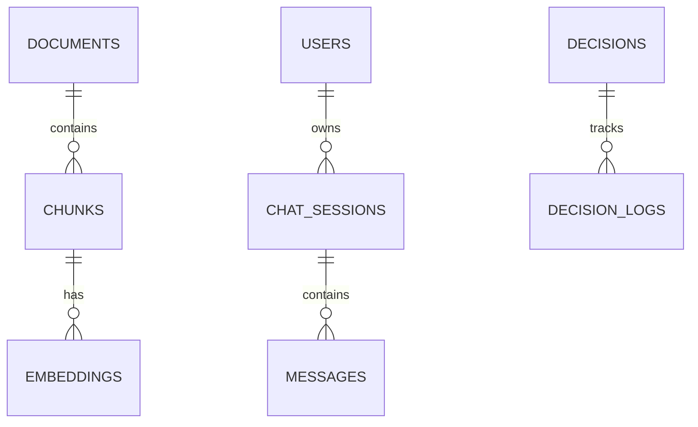

# BLIH Brain Module - Database Schema

**Module:** Brain (AI & Knowledge Management)
**Version:** 1.0
**Last Updated:** February 2026
**Status:** Production Ready

---

## 1. Overview

The Brain module manages the organization's knowledge base, RAG (Retrieval-Augmented Generation) pipeline, and AI chat interactions. It uses a hybrid storage approach:

- **Relational (PostgreSQL):** Usage logs, document metadata, chat history.
- **Vector (Qdrant):** Embeddings for semantic search.

### ER Diagram



---

## 2. Collections / Tables

### 2.1 Documents (`documents`)

Stores metadata for ingested knowledge base files.

```sql
CREATE TABLE documents (
    id VARCHAR(36) PRIMARY KEY,
    company_id VARCHAR(36) NOT NULL,

    -- Metadata
    title VARCHAR(255) NOT NULL,
    type VARCHAR(50), -- 'PDF', 'DOCX', 'MD', 'TXT'
    url VARCHAR(500), -- S3 path or internal storage URL

    -- Processing State
    status ENUM('PROCESSING', 'INDEXED', 'FAILED') DEFAULT 'PROCESSING',
    error_message TEXT,

    -- Stats
    token_count INT,
    chunk_count INT,

    -- Ownership
    uploaded_by VARCHAR(36),
    created_at TIMESTAMP DEFAULT CURRENT_TIMESTAMP,
    updated_at TIMESTAMP DEFAULT CURRENT_TIMESTAMP ON UPDATE CURRENT_TIMESTAMP,

    -- Indexes
    INDEX idx_company_id (company_id),
    INDEX idx_status (status),

    FOREIGN KEY (uploaded_by) REFERENCES users(id)
);
```

### 2.2 Document Chunks (`document_chunks`)

Text segments used for RAG, linked to vector embeddings.

```sql
CREATE TABLE document_chunks (
    id VARCHAR(36) PRIMARY KEY,
    document_id VARCHAR(36) NOT NULL,

    -- Positioning
    chunk_index INT, -- Sequence number (0, 1, 2...)

    -- Content
    content TEXT NOT NULL,
    token_count INT,

    -- Vector Reference (Optional if using separate Vector DB ID)
    vector_id VARCHAR(36),

    created_at TIMESTAMP DEFAULT CURRENT_TIMESTAMP,

    FOREIGN KEY (document_id) REFERENCES documents(id) ON DELETE CASCADE
);
```

### 2.3 Chat Sessions (`chat_sessions`)

Containers for AI conversation history.

```sql
CREATE TABLE chat_sessions (
    id VARCHAR(36) PRIMARY KEY,
    company_id VARCHAR(36) NOT NULL,
    user_id VARCHAR(36) NOT NULL,

    -- Details
    title VARCHAR(255), -- Auto-generated or user-set
    mode ENUM('GENERAL', 'SEARCH', 'ANALYSIS') DEFAULT 'GENERAL',

    -- Timestamps
    last_message_at TIMESTAMP,
    created_at TIMESTAMP DEFAULT CURRENT_TIMESTAMP,
    updated_at TIMESTAMP DEFAULT CURRENT_TIMESTAMP ON UPDATE CURRENT_TIMESTAMP,

    -- Indexes
    INDEX idx_user_updated (user_id, updated_at),

    FOREIGN KEY (user_id) REFERENCES users(id) ON DELETE CASCADE
);
```

### 2.4 Messages (`chat_messages`)

Individual exchanges within a chat session.

```sql
CREATE TABLE chat_messages (
    id VARCHAR(36) PRIMARY KEY,
    session_id VARCHAR(36) NOT NULL,

    -- Content
    role ENUM('user', 'assistant', 'system') NOT NULL,
    content TEXT NOT NULL,

    -- Metadata
    tokens_used INT,
    model_name VARCHAR(50), -- e.g., 'gpt-4', 'claude-3'

    -- RAG Context
    citations JSONB, -- Array of {doc_id, chunk_id, score}

    created_at TIMESTAMP DEFAULT CURRENT_TIMESTAMP,

    FOREIGN KEY (session_id) REFERENCES chat_sessions(id) ON DELETE CASCADE
);
```

### 2.5 Decision Logs (`decision_logs`)

Structured records of organizational decisions (Institutional Memory).

```sql
CREATE TABLE decision_logs (
    id VARCHAR(36) PRIMARY KEY,
    company_id VARCHAR(36) NOT NULL,

    -- Decision Details
    title VARCHAR(255) NOT NULL,
    context TEXT,
    decision TEXT NOT NULL,
    rationale TEXT,

    -- Metadata
    status ENUM('DRAFT', 'PUBLISHED', 'ARCHIVED') DEFAULT 'DRAFT',
    category VARCHAR(100),
    owner_id VARCHAR(36),

    date_made DATE,
    created_at TIMESTAMP DEFAULT CURRENT_TIMESTAMP,

    FOREIGN KEY (owner_id) REFERENCES users(id)
);
```

---

## 3. Vector Database Schema (Qdrant/Pinecone)

While not a SQL table, the structure of the vector payload is critical.

### Payload Structure

```json
{
  "id": "uuid",
  "vector": [0.012, -0.234, ...], // 384-1536 dimensions
  "payload": {
    "document_id": "uuid",
    "chunk_id": "uuid",
    "content": "Text content of chunk...",
    "source_url": "s3://bucket/file.pdf",
    "company_id": "uuid",
    "tags": ["hr", "policy", "2026"],
    "created_at": 1709234567
  }
}
```

---

## 4. Key Concepts

### 4.1 RAG Pipeline

1.  **Ingest:** Application reads file -> extracted text.
2.  **Chunk:** Text split into 512-token segments (sliding window).
3.  **Embed:** Chunks sent to Embedding Model -> Vector.
4.  **Store:** Vector + Payload saved to Qdrant.
5.  **Retrieve:** User query embedded -> Nearest Neighbor search in Qdrant.

### 4.2 Citation Logic

- When the AI uses a chunk to answer, it stores the `chunk_id` in the `citations` JSONB field.
- This allows the UI to render "Sources: [Employee Handbook, p.12]" links.

### 4.3 Data Isolation

- **Tenant Isolation:** All SQL queries must filter by `company_id`.
- **Vector Isolation:** Qdrant collections are namespaced by `company_id` (or use filter key).
