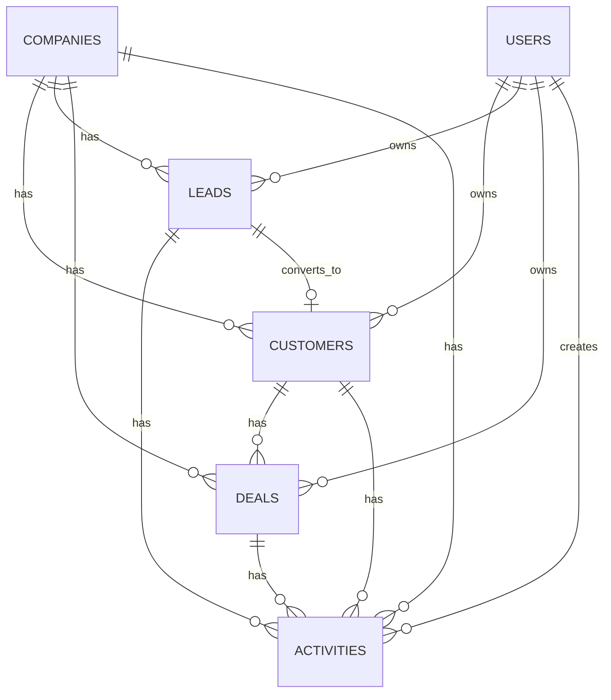

# BLIH CRM Module - Database Schema

**Module:** Customer Relationship Management
**Version:** 1.0
**Last Updated:** February 2026
**Status:** Production Ready

---

## 1. Overview

The CRM module database handles the lifecycle of customer relationships, from initial lead capture to deal closure and ongoing account management. It is designed to support:

- **Lead Identification:** Tracking unqualified potential contacts.
- **Customer Management:** Managing qualified accounts and contacts.
- **Sales Pipeline:** Tracking deals through various sales stages.
- **Activity Logging:** Recording all interactions (calls, emails, meetings).

### ER Diagram



---

## 2. Collections / Tables

### 2.1 Leads (`leads`)

Represents unqualified contacts or potential business opportunities.

```sql
CREATE TABLE leads (
  id VARCHAR(36) PRIMARY KEY,
  company_id VARCHAR(36) NOT NULL,

  -- Contact Info
  first_name VARCHAR(100),
  last_name VARCHAR(100),
  email VARCHAR(255) NOT NULL,
  phone VARCHAR(50),
  company VARCHAR(255),
  title VARCHAR(100),

  -- Lead Details
  status ENUM('NEW', 'CONTACTED', 'QUALIFIED', 'LOST', 'CONVERTED') NOT NULL,
  source ENUM('WEBSITE', 'REFERRAL', 'MARKETING', 'COLD_CALL', 'SOCIAL_MEDIA'),
  score INT DEFAULT 0,  -- 0-100

  -- Qualification (BANT)
  budget_confirmed BOOLEAN DEFAULT FALSE,
  authority_confirmed BOOLEAN DEFAULT FALSE,
  need_confirmed BOOLEAN DEFAULT FALSE,
  timeline_confirmed BOOLEAN DEFAULT FALSE,

  -- Ownership
  owner_id VARCHAR(36),

  -- Conversion tracking
  converted_to_customer_id VARCHAR(36),
  converted_at TIMESTAMP,
  converted_by VARCHAR(36),

  -- Lost reason
  lost_reason VARCHAR(255),
  lost_at TIMESTAMP,

  -- Custom fields
  custom_fields JSONB,

  -- Timestamps
  created_at TIMESTAMP DEFAULT CURRENT_TIMESTAMP,
  updated_at TIMESTAMP DEFAULT CURRENT_TIMESTAMP ON UPDATE CURRENT_TIMESTAMP,

  -- Indexes
  INDEX idx_company_id (company_id),
  INDEX idx_email (email),
  INDEX idx_status (status),
  INDEX idx_score (score),
  INDEX idx_owner_id (owner_id),

  -- Foreign Keys
  FOREIGN KEY (company_id) REFERENCES companies(id) ON DELETE CASCADE,
  FOREIGN KEY (owner_id) REFERENCES users(id) ON DELETE SET NULL,
  FOREIGN KEY (converted_to_customer_id) REFERENCES customers(id)
);
```

### 2.2 Customers (`customers`)

Represents qualified accounts and contacts (individuals or organizations).

```sql
CREATE TABLE customers (
  id VARCHAR(36) PRIMARY KEY,
  company_id VARCHAR(36) NOT NULL,

  -- Contact Info
  first_name VARCHAR(100) NOT NULL,
  last_name VARCHAR(100) NOT NULL,
  email VARCHAR(255) UNIQUE NOT NULL,
  phone VARCHAR(50),
  company VARCHAR(255),
  website VARCHAR(255),

  -- Address
  address_line1 VARCHAR(255),
  address_line2 VARCHAR(255),
  city VARCHAR(100),
  state VARCHAR(100),
  postal_code VARCHAR(20),
  country VARCHAR(2),  -- ISO 3166-1 alpha-2

  -- Status & Classification
  status ENUM('LEAD', 'PROSPECT', 'CUSTOMER', 'INACTIVE') NOT NULL,
  source VARCHAR(50),  -- 'WEBSITE', 'REFERRAL', 'MARKETING', etc.

  -- Ownership
  owner_id VARCHAR(36),

  -- Lead conversion tracking
  converted_from_lead_id VARCHAR(36),
  converted_at TIMESTAMP,
  converted_by VARCHAR(36),

  -- GDPR & Compliance
  consent_marketing BOOLEAN DEFAULT FALSE,
  consent_date TIMESTAMP,
  data_retention_until TIMESTAMP,

  -- Custom fields
  custom_fields JSONB,

  -- Timestamps
  created_at TIMESTAMP DEFAULT CURRENT_TIMESTAMP,
  updated_at TIMESTAMP DEFAULT CURRENT_TIMESTAMP ON UPDATE CURRENT_TIMESTAMP,
  deleted_at TIMESTAMP,  -- Soft delete

  -- Indexes
  INDEX idx_company_id (company_id),
  INDEX idx_email (email),
  INDEX idx_owner_id (owner_id),
  INDEX idx_status (status),
  INDEX idx_created_at (created_at),

  -- Foreign Keys
  FOREIGN KEY (company_id) REFERENCES companies(id) ON DELETE CASCADE,
  FOREIGN KEY (owner_id) REFERENCES users(id) ON DELETE SET NULL
);
```

### 2.3 Deals (`deals`)

Represents sales opportunities associated with a customer.

```sql
CREATE TABLE deals (
  id VARCHAR(36) PRIMARY KEY,
  company_id VARCHAR(36) NOT NULL,

  -- Deal Info
  title VARCHAR(255) NOT NULL,
  customer_id VARCHAR(36) NOT NULL,
  value DECIMAL(15, 2) NOT NULL,
  currency VARCHAR(3) DEFAULT 'USD',

  -- Pipeline
  stage ENUM(
    'PROSPECTING',
    'QUALIFICATION',
    'PROPOSAL',
    'NEGOTIATION',
    'CLOSED_WON',
    'CLOSED_LOST'
  ) NOT NULL,
  probability INT DEFAULT 0,  -- 0-100

  -- Dates
  expected_close_date DATE,
  actual_close_date DATE,

  -- Ownership
  owner_id VARCHAR(36),

  -- Closing details
  closed_status ENUM('WON', 'LOST'),
  actual_value DECIMAL(15, 2),
  lost_reason VARCHAR(255),

  -- Proposal tracking
  proposal_sent_date DATE,
  proposal_document_id VARCHAR(36),

  -- Notes
  description TEXT,
  notes TEXT,

  -- Custom fields
  custom_fields JSONB,

  -- Timestamps
  created_at TIMESTAMP DEFAULT CURRENT_TIMESTAMP,
  updated_at TIMESTAMP DEFAULT CURRENT_TIMESTAMP ON UPDATE CURRENT_TIMESTAMP,

  -- Indexes
  INDEX idx_company_id (company_id),
  INDEX idx_customer_id (customer_id),
  INDEX idx_stage (stage),
  INDEX idx_owner_id (owner_id),
  INDEX idx_expected_close_date (expected_close_date),

  -- Foreign Keys
  FOREIGN KEY (company_id) REFERENCES companies(id) ON DELETE CASCADE,
  FOREIGN KEY (customer_id) REFERENCES customers(id) ON DELETE CASCADE,
  FOREIGN KEY (owner_id) REFERENCES users(id) ON DELETE SET NULL
);
```

### 2.4 Activities (`activities`)

Records all interactions (Calls, Emails, Meetings, etc.) related to Leads, Customers, or Deals.

```sql
CREATE TABLE activities (
  id VARCHAR(36) PRIMARY KEY,
  company_id VARCHAR(36) NOT NULL,

  -- Activity Type
  type ENUM('CALL', 'EMAIL', 'MEETING', 'NOTE', 'TASK') NOT NULL,
  subject VARCHAR(255) NOT NULL,
  description TEXT,

  -- Relationships
  customer_id VARCHAR(36),
  deal_id VARCHAR(36),
  lead_id VARCHAR(36),

  -- Scheduling
  scheduled_at TIMESTAMP,
  duration_minutes INT,
  status ENUM('SCHEDULED', 'COMPLETED', 'CANCELLED') DEFAULT 'SCHEDULED',

  -- Participants
  created_by VARCHAR(36),
  participants JSONB,  -- Array of user IDs

  -- Outcome
  outcome TEXT,
  completed_at TIMESTAMP,

  -- Timestamps
  created_at TIMESTAMP DEFAULT CURRENT_TIMESTAMP,
  updated_at TIMESTAMP DEFAULT CURRENT_TIMESTAMP ON UPDATE CURRENT_TIMESTAMP,

  -- Indexes
  INDEX idx_company_id (company_id),
  INDEX idx_customer_id (customer_id),
  INDEX idx_deal_id (deal_id),
  INDEX idx_type (type),
  INDEX idx_scheduled_at (scheduled_at),
  INDEX idx_created_by (created_by),

  -- Foreign Keys
  FOREIGN KEY (company_id) REFERENCES companies(id) ON DELETE CASCADE,
  FOREIGN KEY (customer_id) REFERENCES customers(id) ON DELETE CASCADE,
  FOREIGN KEY (deal_id) REFERENCES deals(id) ON DELETE CASCADE,
  FOREIGN KEY (created_by) REFERENCES users(id) ON DELETE SET NULL
);
```

---

## 3. Relationships & Cardinality

| Entity A | Relationship | Entity B | Details                                            |
| -------- | ------------ | -------- | -------------------------------------------------- |
| Company  | 1:N          | Customer | One company has many customers.                    |
| Company  | 1:N          | Lead     | One company has many leads.                        |
| User     | 1:N          | Lead     | A user (sales rep) owns multiple leads.            |
| Customer | 1:N          | Deal     | A customer can have multiple deals (Sales Orders). |
| Lead     | 1:N          | Activity | A lead has many logged activities.                 |
| Customer | 1:N          | Activity | A customer has many logged activities.             |
| Deal     | 1:N          | Activity | A deal has many logged activities.                 |
| Lead     | 1:1          | Customer | A lead converts to exactly one customer.           |

---

## 4. Key Enums & Types

### 4.1 Deal Stages

- `PROSPECTING`: Initial contact made.
- `QUALIFICATION`: Needs assessment and budget confirmation (BANT).
- `PROPOSAL`: Quote or proposal sent.
- `NEGOTIATION`: Terms under review.
- `CLOSED_WON`: Deal finalized, contract signed.
- `CLOSED_LOST`: Deal lost.

### 4.2 Lead Status

- `NEW`: Just entered system.
- `CONTACTED`: Attempted or successful contact.
- `QUALIFIED`: Ready for conversion.
- `LOST`: Disqualified.
- `CONVERTED`: Promoted to Customer/Deal.

### 4.3 Activity Types

- `CALL`: Phone or video call.
- `EMAIL`: Email correspondence.
- `MEETING`: In-person or virtual meeting.
- `NOTE`: Internal note.
- `TASK`: Action item/reminder.
