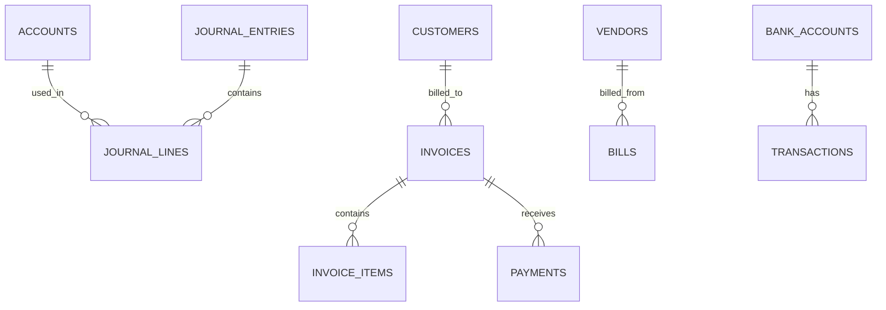

# BLIH Finance Module - Database Schema

**Module:** Finance & Accounting
**Version:** 1.0
**Last Updated:** February 2026
**Status:** Production Ready

---

## 1. Overview

The Finance module database implements a double-entry bookkeeping system to ensure financial accuracy, compliance, and reporting capability. It handles general ledger accounts, journal entries, invoices, and bank reconciliation.

### ER Diagram



---

## 2. Collections / Tables

### 2.1 Accounts (`accounts`)

Represents the Chart of Accounts (COA).

```sql
CREATE TABLE accounts (
    id VARCHAR(36) PRIMARY KEY,
    company_id VARCHAR(36) NOT NULL,
    
    -- Account Details
    code VARCHAR(20) NOT NULL,
    name VARCHAR(255) NOT NULL,
    description TEXT,
    
    -- Classification
    type ENUM('ASSET', 'LIABILITY', 'EQUITY', 'REVENUE', 'EXPENSE') NOT NULL,
    subtype VARCHAR(50), -- e.g., 'CURRENT_ASSET', 'LONG_TERM_LIABILITY'
    
    -- Currency
    currency VARCHAR(3) DEFAULT 'USD',
    
    -- Hierarchy
    parent_account_id VARCHAR(36),
    
    -- State
    is_system_account BOOLEAN DEFAULT FALSE, -- Cannot be deleted if true
    balance DECIMAL(19, 4) DEFAULT 0.0000, -- Cached balance
    
    -- Timestamps
    created_at TIMESTAMP DEFAULT CURRENT_TIMESTAMP,
    updated_at TIMESTAMP DEFAULT CURRENT_TIMESTAMP ON UPDATE CURRENT_TIMESTAMP,

    -- Constraints
    UNIQUE(company_id, code),
    FOREIGN KEY (parent_account_id) REFERENCES accounts(id)
);
```

### 2.2 Journal Entries (`journal_entries`)

The core record of financial transactions (General Ledger).

```sql
CREATE TABLE journal_entries (
    id VARCHAR(36) PRIMARY KEY,
    company_id VARCHAR(36) NOT NULL,
    
    -- Entry Details
    entry_number INT AUTO_INCREMENT, -- Sequential ID for humans
    date DATE NOT NULL,
    description TEXT,
    reference VARCHAR(255), -- External ref (Invoice #, Check #)
    
    -- Workflow
    status ENUM('DRAFT', 'POSTED', 'VOIDED') DEFAULT 'DRAFT',
    
    -- Audit
    created_by VARCHAR(36),
    posted_by VARCHAR(36),
    posted_at TIMESTAMP,
    created_at TIMESTAMP DEFAULT CURRENT_TIMESTAMP,
    
    INDEX idx_date (date),
    INDEX idx_company_status (company_id, status)
);
```

### 2.3 Journal Lines (`journal_lines`)

The individual debit/credit lines within a journal entry.

```sql
CREATE TABLE journal_lines (
    id VARCHAR(36) PRIMARY KEY,
    journal_entry_id VARCHAR(36) NOT NULL,
    account_id VARCHAR(36) NOT NULL,
    
    description VARCHAR(255),
    
    debit DECIMAL(19, 4) DEFAULT 0,
    credit DECIMAL(19, 4) DEFAULT 0,
    
    FOREIGN KEY (journal_entry_id) REFERENCES journal_entries(id) ON DELETE CASCADE,
    FOREIGN KEY (account_id) REFERENCES accounts(id)
);
```

### 2.4 Invoices (`invoices`)

Customer billing records (Accounts Receivable).

```sql
CREATE TABLE invoices (
    id VARCHAR(36) PRIMARY KEY,
    company_id VARCHAR(36) NOT NULL,
    customer_id VARCHAR(36) NOT NULL,
    
    -- Invoice Details
    invoice_number VARCHAR(50) NOT NULL,
    issue_date DATE NOT NULL,
    due_date DATE NOT NULL,
    
    -- Financials
    subtotal DECIMAL(19, 4),
    tax_total DECIMAL(19, 4),
    discount_total DECIMAL(19, 4),
    grand_total DECIMAL(19, 4),
    balance_due DECIMAL(19, 4),
    currency VARCHAR(3) DEFAULT 'USD',
    
    -- State
    status ENUM('DRAFT', 'SENT', 'PARTIALLY_PAID', 'PAID', 'VOID', 'OVERDUE') DEFAULT 'DRAFT',
    
    -- Content
    notes TEXT,
    terms TEXT,
    pdf_url VARCHAR(500),
    
    -- Timestamps
    created_at TIMESTAMP DEFAULT CURRENT_TIMESTAMP,
    updated_at TIMESTAMP DEFAULT CURRENT_TIMESTAMP ON UPDATE CURRENT_TIMESTAMP,

    UNIQUE(company_id, invoice_number)
);
```

### 2.5 Invoice Items (`invoice_items`)

Line items within an invoice.

```sql
CREATE TABLE invoice_items (
    id VARCHAR(36) PRIMARY KEY,
    invoice_id VARCHAR(36) NOT NULL,
    
    item_description VARCHAR(255),
    quantity DECIMAL(15, 4),
    unit_price DECIMAL(19, 4),
    amount DECIMAL(19, 4), -- quantity * unit_price
    tax_rate DECIMAL(5, 4), -- e.g., 0.15 for 15%
    
    FOREIGN KEY (invoice_id) REFERENCES invoices(id) ON DELETE CASCADE
);
```

---

## 3. Relationships & Cardinality

| Entity A | Relationship | Entity B | Details |
|----------|--------------|----------|---------|
| Account | 1:N | Journal Line | An account is referenced in many transactions. |
| Journal Entry | 1:N | Journal Line | An entry must have at least 2 lines (Debit/Credit). |
| Customer | 1:N | Invoice | A customer receives many invoices. |
| Invoice | 1:N | Invoice Item | An invoice contains multiple line items. |
| Invoice | 1:N | Payment | An invoice can be paid in multiple installments. |

---

## 4. Key Concepts & Enums

### 4.1 Account Types
- `ASSET`: Cash, Inventory, Equipment (Normal Balance: Debit)
- `LIABILITY`: Loans, Accounts Payable (Normal Balance: Credit)
- `EQUITY`: Retained Earnings, Capital (Normal Balance: Credit)
- `REVENUE`: Sales, Service Income (Normal Balance: Credit)
- `EXPENSE`: Rent, Salaries, Utilities (Normal Balance: Debit)

### 4.2 Journal Status
- `DRAFT`: Entry being created, not affecting balances.
- `POSTED`: Finalized entry, affects GL balances. Immutable.
- `VOIDED`: Cancelled entry, does not affect balances.

### 4.3 Invoice Status
- `DRAFT`: Created but not sent to customer.
- `SENT`: Issued to customer, awaiting payment.
- `PARTIALLY_PAID`: Portion of total received.
- `PAID`: Full amount received.
- `OVERDUE`: Past due date with remaining balance.
- `VOID`: Cancelled invoice.
