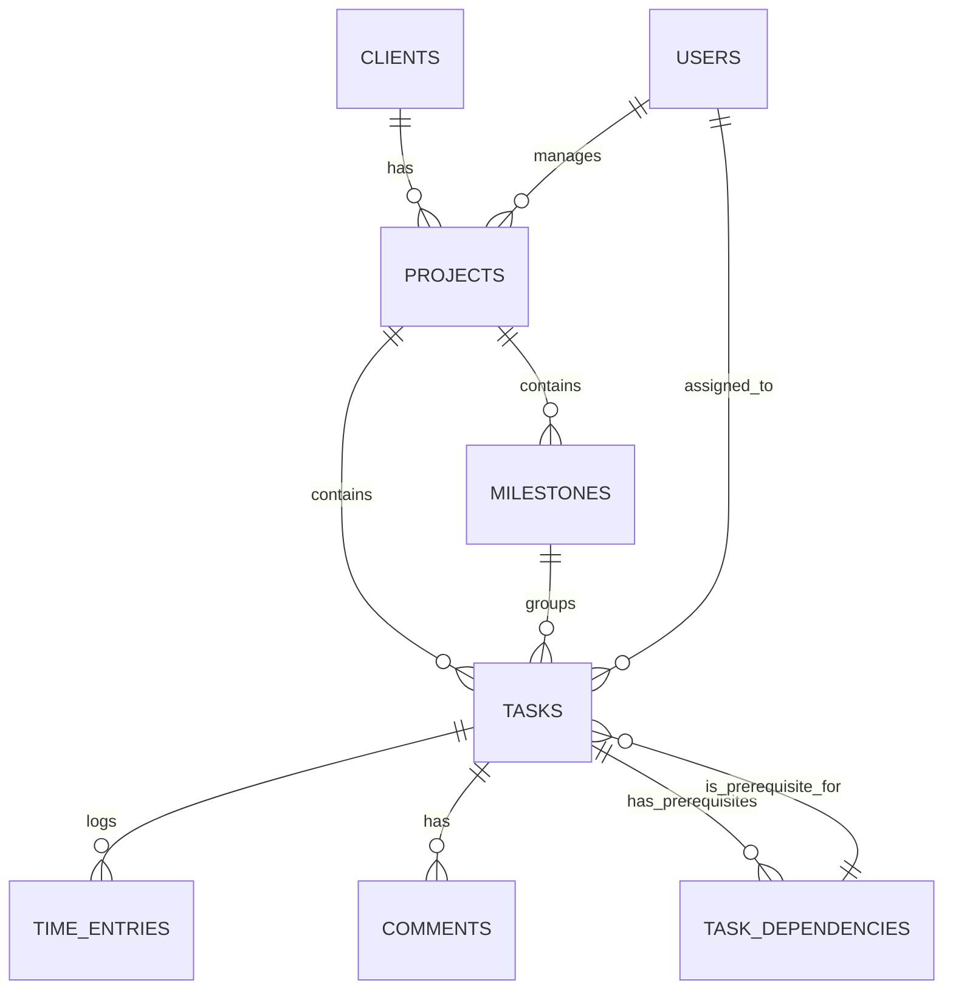

# BLIH Projects Module - Database Schema

**Module:** Project Management
**Version:** 1.0
**Last Updated:** February 2026
**Status:** Production Ready

---

## 1. Overview

The Projects module database manages the hierarchy of projects, milestones, tasks, and resource allocations. It supports:
- **Project Structure:** Projects > Milestones > Tasks > Subtasks.
- **Dependency Management:** Critical path and predecessor/successor tracking.
- **Resource Management:** Assignment of users to tasks and time tracking.
- **Financial Tracking:** Budget vs. Actual cost calculations.

### ER Diagram



---

## 2. Collections / Tables

### 2.1 Projects (`projects`)

The root entity for all work management.

```sql
CREATE TABLE projects (
    id VARCHAR(36) PRIMARY KEY,
    company_id VARCHAR(36) NOT NULL,
    client_id VARCHAR(36) NOT NULL,
    
    -- Basic Info
    name VARCHAR(255) NOT NULL,
    code VARCHAR(50), -- e.g., 'PRJ-2026-001'
    description TEXT,
    
    -- State
    status ENUM('PLANNING', 'ACTIVE', 'ON_HOLD', 'COMPLETED', 'CANCELLED', 'ARCHIVED') DEFAULT 'PLANNING',
    priority ENUM('LOW', 'MEDIUM', 'HIGH', 'URGENT') DEFAULT 'MEDIUM',
    
    -- Timeline
    start_date DATE,
    end_date DATE,
    actual_start_date DATE,
    actual_end_date DATE,
    
    -- Financials
    budget_type ENUM('FIXED', 'HOURLY', 'RETAINER'),
    budget_amount DECIMAL(19, 2),
    currency VARCHAR(3) DEFAULT 'USD',
    
    -- Ownership
    manager_id VARCHAR(36),
    
    -- Timestamps
    created_at TIMESTAMP DEFAULT CURRENT_TIMESTAMP,
    updated_at TIMESTAMP DEFAULT CURRENT_TIMESTAMP ON UPDATE CURRENT_TIMESTAMP,
    
    -- Indexes
    INDEX idx_company_id (company_id),
    INDEX idx_client_id (client_id),
    INDEX idx_status (status),
    INDEX idx_manager_id (manager_id),
    
    -- Foreign Keys
    FOREIGN KEY (client_id) REFERENCES clients(id),
    FOREIGN KEY (manager_id) REFERENCES users(id)
);
```

### 2.2 Tasks (`tasks`)

Actionable items within a project.

```sql
CREATE TABLE tasks (
    id VARCHAR(36) PRIMARY KEY,
    project_id VARCHAR(36) NOT NULL,
    milestone_id VARCHAR(36),
    
    -- Content
    title VARCHAR(255) NOT NULL,
    description TEXT,
    
    -- Workflow
    status ENUM('TODO', 'IN_PROGRESS', 'REVIEW', 'DONE', 'BLOCKED') DEFAULT 'TODO',
    priority ENUM('LOW', 'MEDIUM', 'HIGH', 'URGENT') DEFAULT 'MEDIUM',
    
    -- Assignment
    assigned_to VARCHAR(36),
    created_by VARCHAR(36),
    
    -- Estimation & Actuals
    estimated_hours DECIMAL(10, 2),
    actual_hours DECIMAL(10, 2) DEFAULT 0,
    
    -- Scheduling
    start_date DATE,
    due_date DATE,
    completed_at TIMESTAMP,
    
    -- Hierarchy
    parent_task_id VARCHAR(36), -- For subtasks in adjacency list
    
    -- Timestamps
    created_at TIMESTAMP DEFAULT CURRENT_TIMESTAMP,
    updated_at TIMESTAMP DEFAULT CURRENT_TIMESTAMP ON UPDATE CURRENT_TIMESTAMP,
    
    -- Indexes
    INDEX idx_project_id (project_id),
    INDEX idx_assigned_to (assigned_to),
    INDEX idx_status (status),
    INDEX idx_due_date (due_date),
    
    -- Foreign Keys
    FOREIGN KEY (project_id) REFERENCES projects(id) ON DELETE CASCADE,
    FOREIGN KEY (assigned_to) REFERENCES users(id)
);
```

### 2.3 Task Dependencies (`task_dependencies`)

Manages the relationship between tasks (Predecessors/Successors).

```sql
CREATE TABLE task_dependencies (
    id VARCHAR(36) PRIMARY KEY,
    task_id VARCHAR(36) NOT NULL, -- The dependent task (Successor)
    dependency_id VARCHAR(36) NOT NULL, -- The prerequisite task (Predecessor)
    type ENUM('FINISH_TO_START', 'START_TO_START', 'FINISH_TO_FINISH', 'START_TO_FINISH') DEFAULT 'FINISH_TO_START',
    lag_days INT DEFAULT 0, -- Delay between tasks
    
    UNIQUE(task_id, dependency_id),
    
    -- Foreign Keys
    FOREIGN KEY (task_id) REFERENCES tasks(id) ON DELETE CASCADE,
    FOREIGN KEY (dependency_id) REFERENCES tasks(id) ON DELETE CASCADE
);
```

### 2.4 Time Entries (`time_entries`)

Logs time spent by users on tasks.

```sql
CREATE TABLE time_entries (
    id VARCHAR(36) PRIMARY KEY,
    project_id VARCHAR(36) NOT NULL,
    task_id VARCHAR(36),
    user_id VARCHAR(36) NOT NULL,
    
    -- Entry Details
    date DATE NOT NULL,
    duration_hours DECIMAL(5, 2) NOT NULL,
    description TEXT,
    
    -- Billing
    billable BOOLEAN DEFAULT TRUE,
    billed BOOLEAN DEFAULT FALSE,
    invoice_id VARCHAR(36),
    
    -- Timestamps
    created_at TIMESTAMP DEFAULT CURRENT_TIMESTAMP,
    
    -- Indexes
    INDEX idx_project_id (project_id),
    INDEX idx_user_id (user_id),
    INDEX idx_date (date),
    
    -- Foreign Keys
    FOREIGN KEY (task_id) REFERENCES tasks(id) ON DELETE SET NULL,
    FOREIGN KEY (user_id) REFERENCES users(id)
);
```

### 2.5 Milestones (`milestones`)

Major checkpoints within a project.

```sql
CREATE TABLE milestones (
    id VARCHAR(36) PRIMARY KEY,
    project_id VARCHAR(36) NOT NULL,
    
    title VARCHAR(255) NOT NULL,
    due_date DATE,
    completed_at TIMESTAMP,
    status ENUM('PENDING', 'COMPLETED') DEFAULT 'PENDING',
    
    created_at TIMESTAMP DEFAULT CURRENT_TIMESTAMP,
    
    FOREIGN KEY (project_id) REFERENCES projects(id) ON DELETE CASCADE
);
```

---

## 3. Relationships & Cardinality

| Entity A | Relationship | Entity B | Details |
|----------|--------------|----------|---------|
| Client | 1:N | Project | A client can have multiple projects. |
| Project | 1:N | Task | A project contains many tasks. |
| Project | 1:N | Milestone | A project contains many milestones. |
| Milestone | 1:N | Task | A milestone groups multiple tasks. |
| Task | 1:N | Subtask | Self-referencing relationship (parent_task_id). |
| Task | M:N | Dependency | Tasks can range dependent on many others. |
| User | 1:N | Time Entry | Users log multiple time entries. |

---

## 4. Key enums

### 4.1 Project Status
- `PLANNING`: Initial setup, no work started.
- `ACTIVE`: Work is in progress.
- `ON_HOLD`: Temporarily paused.
- `COMPLETED`: All work done and approved.
- `CANCELLED`: Terminated before completion.
- `ARCHIVED`: Historical record.

### 4.2 Task Status
- `TODO`: Backlog item.
- `IN_PROGRESS`: Currently being worked on.
- `REVIEW`: Completed but waiting for approval/QA.
- `DONE`: Completed and approved.
- `BLOCKED`: Cannot proceed due to external factors.
