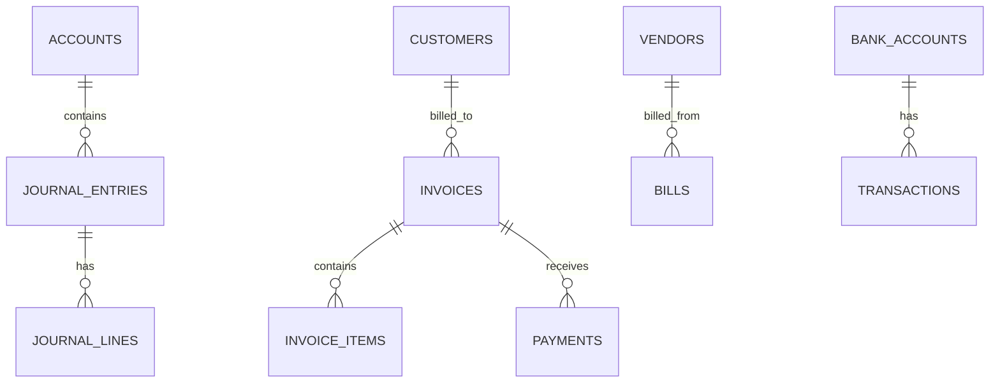
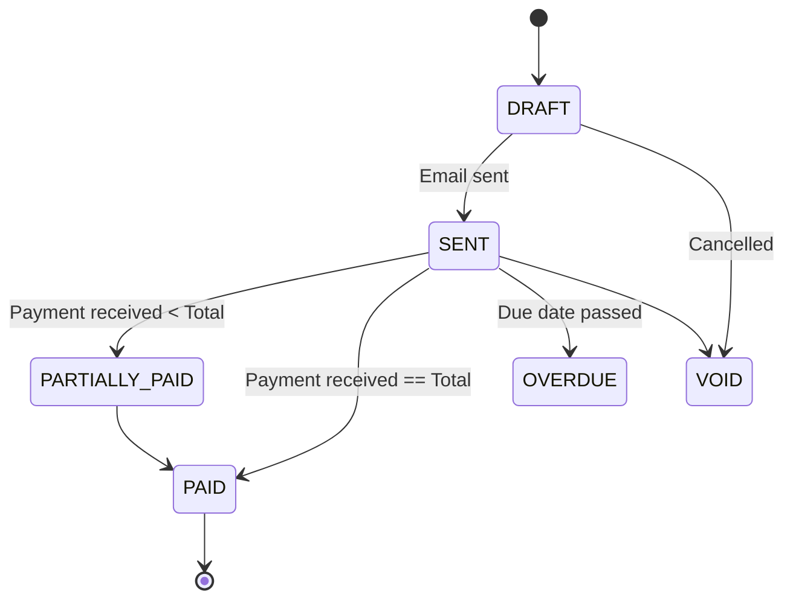

# Finance Module Logic & Database Schema

**Module:** Finance & Accounting  
**Version:** 1.0  
**Last Updated:** February 2026

---

## Table of Contents

1. [Business Logic Overview](#1-business-logic-overview)
2. [Double-Entry Bookkeeping](#2-double-entry-bookkeeping)
3. [Invoicing & Payments](#3-invoicing--payments)
4. [Database Schema](#4-database-schema)
5. [Automated Workflows](#5-automated-workflows)

---

## 1. Business Logic Overview

### 1.1 Core Principles

- **Double-Entry Accounting:** Every transaction must have equal debits and credits.
- **Immutability:** Posted journal entries cannot be edited or deleted; they must be reversed.
- **Multi-Currency:** System base currency is USD, but supports transaction entry in any currency with spot rates.
- **Period Management:** Fiscal periods can be locked to prevent back-dated entries.

### 1.2 Entity Relationship Diagram



---

## 2. Double-Entry Bookkeeping

### 2.1 Journal Entry Validation

**Logic:**

1. Sum of all `DEBIT` lines must equal sum of all `CREDIT` lines.
2. All accounts must belong to the same Company ID.
3. Transaction date must be within an open fiscal period.

```typescript
function validateJournalEntry(entry: JournalEntry): ValidationResult {
  const totalDebit = entry.lines
    .filter((l) => l.type === 'DEBIT')
    .reduce((sum, l) => sum + l.amount, 0);

  const totalCredit = entry.lines
    .filter((l) => l.type === 'CREDIT')
    .reduce((sum, l) => sum + l.amount, 0);

  if (Math.abs(totalDebit - totalCredit) > 0.005) {
    // Floating point tolerance
    return { valid: false, error: 'Debits must equal Credits' };
  }

  if (isPeriodClosed(entry.date)) {
    return { valid: false, error: 'Fiscal period is closed' };
  }

  return { valid: true };
}
```

### 2.2 Account Types & Normal Balance

| Account Type  | Normal Balance | Increase | Decrease |
| ------------- | -------------- | -------- | -------- |
| **Asset**     | Debit          | Debit    | Credit   |
| **Liability** | Credit         | Credit   | Debit    |
| **Equity**    | Credit         | Credit   | Debit    |
| **Revenue**   | Credit         | Credit   | Debit    |
| **Expense**   | Debit          | Debit    | Credit   |

---

## 3. Invoicing & Payments

### 3.1 Invoice Lifecycle



### 3.2 Payment Application Logic

When a payment is received, it must be applied to specific invoices or held as a credit on the customer account.

**Logic:**

1. Check if payment amount <= Invoice balance due.
2. Create Journal Entry:
   - **Debit:** Cash / Bank Account
   - **Credit:** Accounts Receivable
3. Update Invoice status.

```typescript
async function applyPayment(paymentId: string, invoiceIds: string[]) {
  const payment = await getPayment(paymentId);
  let remainingAmount = payment.amount;

  for (const invId of invoiceIds) {
    const invoice = await getInvoice(invId);
    const amountToPay = Math.min(remainingAmount, invoice.balanceDue);

    await updateInvoiceBalance(invId, amountToPay);
    remainingAmount -= amountToPay;

    if (remainingAmount <= 0) break;
  }

  // Unapplied amount sits in Unearned Revenue or Customer Credit
  if (remainingAmount > 0) {
    await createCustomerCredit(payment.customerId, remainingAmount);
  }
}
```

---

## 4. Database Schema

### 4.1 Accounts (Chart of Accounts)

```sql
CREATE TABLE accounts (
    id VARCHAR(36) PRIMARY KEY,
    company_id VARCHAR(36) NOT NULL,
    code VARCHAR(20) NOT NULL,
    name VARCHAR(255) NOT NULL,
    type ENUM('ASSET', 'LIABILITY', 'EQUITY', 'REVENUE', 'EXPENSE') NOT NULL,
    subtype VARCHAR(50), -- e.g., 'CURRENT_ASSET', 'LONG_TERM_LIABILITY'
    currency VARCHAR(3) DEFAULT 'USD',
    is_system_account BOOLEAN DEFAULT FALSE, -- Cannot be deleted if true
    parent_account_id VARCHAR(36),
    balance DECIMAL(19, 4) DEFAULT 0.0000, -- Cached balance

    created_at TIMESTAMP DEFAULT CURRENT_TIMESTAMP,
    updated_at TIMESTAMP DEFAULT CURRENT_TIMESTAMP ON UPDATE CURRENT_TIMESTAMP,

    FOREIGN KEY (parent_account_id) REFERENCES accounts(id),
    UNIQUE(company_id, code)
);
```

### 4.2 Journal Entries (General Ledger)

```sql
CREATE TABLE journal_entries (
    id VARCHAR(36) PRIMARY KEY,
    company_id VARCHAR(36) NOT NULL,
    entry_number INT AUTO_INCREMENT, -- Sequential ID for humans
    date DATE NOT NULL,
    description TEXT,
    reference VARCHAR(255), -- External ref (Invoice #, Check #)
    status ENUM('DRAFT', 'POSTED', 'VOIDED') DEFAULT 'DRAFT',

    created_by VARCHAR(36),
    posted_by VARCHAR(36),
    posted_at TIMESTAMP,

    created_at TIMESTAMP DEFAULT CURRENT_TIMESTAMP,

    INDEX idx_date (date),
    INDEX idx_company_status (company_id, status)
);

CREATE TABLE journal_lines (
    id VARCHAR(36) PRIMARY KEY,
    journal_entry_id VARCHAR(36) NOT NULL,
    account_id VARCHAR(36) NOT NULL,
    description VARCHAR(255),
    debit DECIMAL(19, 4) DEFAULT 0,
    credit DECIMAL(19, 4) DEFAULT 0,

    FOREIGN KEY (journal_entry_id) REFERENCES journal_entries(id) ON DELETE CASCADE,
    FOREIGN KEY (account_id) REFERENCES accounts(id)
);
```

### 4.3 Invoices

```sql
CREATE TABLE invoices (
    id VARCHAR(36) PRIMARY KEY,
    company_id VARCHAR(36) NOT NULL,
    customer_id VARCHAR(36) NOT NULL,
    invoice_number VARCHAR(50) NOT NULL,

    issue_date DATE NOT NULL,
    due_date DATE NOT NULL,

    subtotal DECIMAL(19, 4),
    tax_total DECIMAL(19, 4),
    discount_total DECIMAL(19, 4),
    grand_total DECIMAL(19, 4),
    balance_due DECIMAL(19, 4),

    currency VARCHAR(3) DEFAULT 'USD',
    status ENUM('DRAFT', 'SENT', 'PARTIALLY_PAID', 'PAID', 'VOID', 'OVERDUE') DEFAULT 'DRAFT',

    notes TEXT,
    terms TEXT,

    pdf_url VARCHAR(500),

    created_at TIMESTAMP DEFAULT CURRENT_TIMESTAMP,
    updated_at TIMESTAMP DEFAULT CURRENT_TIMESTAMP ON UPDATE CURRENT_TIMESTAMP,

    UNIQUE(company_id, invoice_number)
);

CREATE TABLE invoice_items (
    id VARCHAR(36) PRIMARY KEY,
    invoice_id VARCHAR(36) NOT NULL,
    item_description VARCHAR(255),
    quantity DECIMAL(15, 4),
    unit_price DECIMAL(19, 4),
    amount DECIMAL(19, 4), -- quantity * unit_price
    tax_rate DECIMAL(5, 4), -- e.g., 0.15 for 15%

    FOREIGN KEY (invoice_id) REFERENCES invoices(id) ON DELETE CASCADE
);
```

---

## 5. Automated Workflows

### 5.1 Reconciliation

**Process:**

1. Fetch transactions from Bank Feed (Plaid/Yodlee).
2. Match against recorded Ledger GL transactions.
   - Match Logic: Same Amount +/- 0.01 AND Date within +/- 3 days.
3. Flag unmatched transactions for manual review.

### 5.2 Revenue Recognition (Subscription)

For SaaS/Subscription models:

- When invoice is generated for Annual Plan:
  - **Debit:** Accounts Receivable
  - **Credit:** Deferred Revenue (Liability)
- End of Month Automator:
  - Identify all Deferred Revenue balances.
  - Calculate recognized portion (1/12th).
  - Create Journal Entry:
    - **Debit:** Deferred Revenue
    - **Credit:** Service Revenue

---

**Related Documentation:**

- [FINANCE_API.md](file:///home/michot/project/BLIH-Business-Lifecycle-Integrated-Hub-/docs/api/FINANCE_API.md) - API Endpoints
- [FINANCE_SECURITY.md](file:///home/michot/project/BLIH-Business-Lifecycle-Integrated-Hub-/docs/security/FINANCE_SECURITY.md) - SOX Compliance
