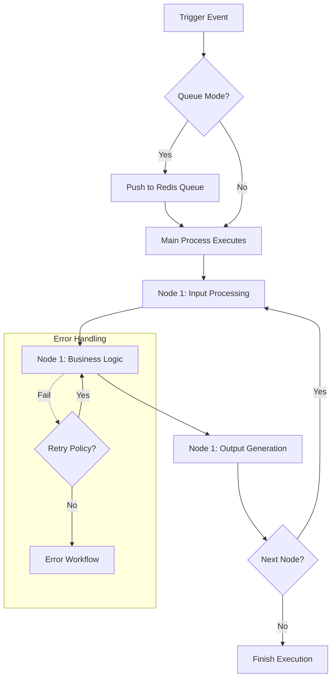

# n8n Automation Logic Specification

**Module:** Automation  
**Component:** Workflow Engine & Logic  
**Version:** 1.1  
**Last Updated:** February 2026

---

## Table of Contents

1. [Workflow Execution Model](#1-workflow-execution-model)
2. [Reliability & Retry Algorithms](#2-reliability--retry-algorithms)
3. [Rate Limiting (Token Bucket)](#3-rate-limiting-token-bucket)
4. [Deduplication & Idempotency](#4-deduplication--idempotency)
5. [Data Sanitization Pipeline](#5-data-sanitization-pipeline)

---

## 1. Workflow Execution Model

n8n processes data as streams of JSON objects. Understanding the execution lifecycle is key to building reliable pipelines.

### 1.1 Execution Flow



### 1.2 Data Propagation Logic

- **Nodes:** Functions $f(x)$ where $x$ is an array of items `[{json: {...}}, {json: {...}}]`.
- **Fan-Out:** If a node outputs 10 items, the _next_ node runs 10 times (or once with 10 items, depending on node type).
  - _HTTP Request Node:_ Runs 10 times (1 request per item).
  - _Code Node:_ Runs 1 time (receives all 10 items).

---

## 2. Reliability & Retry Algorithms

### 2.1 Exponential Backoff

For transient errors (HTTP 429, 502, 503), we employ a **Jittered Exponential Backoff** strategy to prevent thundering herd problems.

**Formula:**
$$ Delay = \min(Cap, Base \times 2^{Attempt}) + Random(0, 1000) $$

**Configuration:**

- **Base:** 1000ms
- **Cap:** 30,000ms
- **Max Attempts:** 5

**Pseudocode:**

```javascript
async function executeWithRetry(apiCall) {
  let attempt = 0;
  while (attempt < MAX_ATTEMPTS) {
    try {
      return await apiCall();
    } catch (error) {
      if (!isTransient(error)) throw error;

      attempt++;
      if (attempt >= MAX_ATTEMPTS) throw error;

      const backoff = Math.min(30000, 1000 * Math.pow(2, attempt));
      const jitter = Math.random() * 1000;
      await sleep(backoff + jitter);
    }
  }
}
```

---

## 3. Rate Limiting (Token Bucket)

To protect BLIH and external APIs, n8n workflows implement **Token Bucket** rate limiting.

### 3.1 Logic

- **Bucket Capacity ($C$):** Max burst (e.g., 50 requests).
- **Refill Rate ($R$):** Requests per second (e.g., 5 req/s).
- **Tokens ($T$):** Current available tokens.

**Algorithm:**

1. On Request:
   - Calculate refill: $T_{new} = \min(C, T_{old} + (Now - LastRefill) \times R)$.
   - If $T_{new} \ge 1$:
     - Decrement $T$.
     - Allow Request.
   - Else:
     - Wait Required: $(1 - T_{new}) / R$ seconds.
     - Sleep().

### 3.2 Workflow Implementation

Use the **Split In Batches** node combined with **Wait** node.

1. **Split Batch:** Size = 1.
2. **Request:** Perform API call.
3. **Wait:** Fixed delay (e.g., `200ms` for 5 req/s).
4. **Loop:** Return to Split Batch.

---

## 4. Deduplication & Idempotency

Prevents double-processing of webhooks (e.g., Stripe retries).

### 4.1 Redis-Based Deduplication

**Logic:**

1. Identify **Unique Key**: `event_id` or `hash(payload)`.
2. Check Redis set-if-not-exists (`SETNX`).
3. Set TTL (e.g., 24 hours).

**Pseudocode (n8n Function Node):**

```javascript
const eventId = items[0].json.body.id;
const key = `processed_event:${eventId}`;

// Check duplication
const exists = await redis.get(key);

if (exists) {
  // 🛑 Stop execution gracefully
  return [];
} else {
  // ✅ Mark as processed (TTL 86400s)
  await redis.set(key, '1', 'EX', 86400);
  return items;
}
```

---

## 5. Data Sanitization Pipeline

Ensures no PII leaks into external logs or 3rd party systems relative to GDPR.

### 5.1 Redaction Rules

| Field Type      | Regex Pattern                 | Replacement           |
| --------------- | ----------------------------- | --------------------- |
| **Email**       | `/(.{2})(.*)(@.*)/`           | `ab***@domain.com`    |
| **Credit Card** | `/\d{4}-\d{4}-\d{4}-(\d{4})/` | `****-****-****-1234` |
| **SSN/ID**      | `/\d{3}-\d{2}-\d{4}/`         | `***-**-****`         |

### 5.2 Implementation

Runs as a pre-processing **Code Node** before any output node (Slack, Email).

```javascript
/* Pre-Output Sanitizer */
for (const item of items) {
  const data = item.json;

  // Recursive redaction for nested objects
  traverseAndRedact(data);
}

return items;
```
