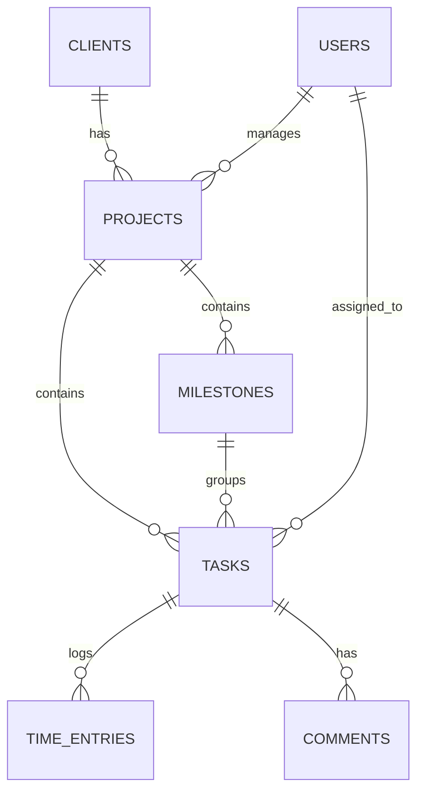
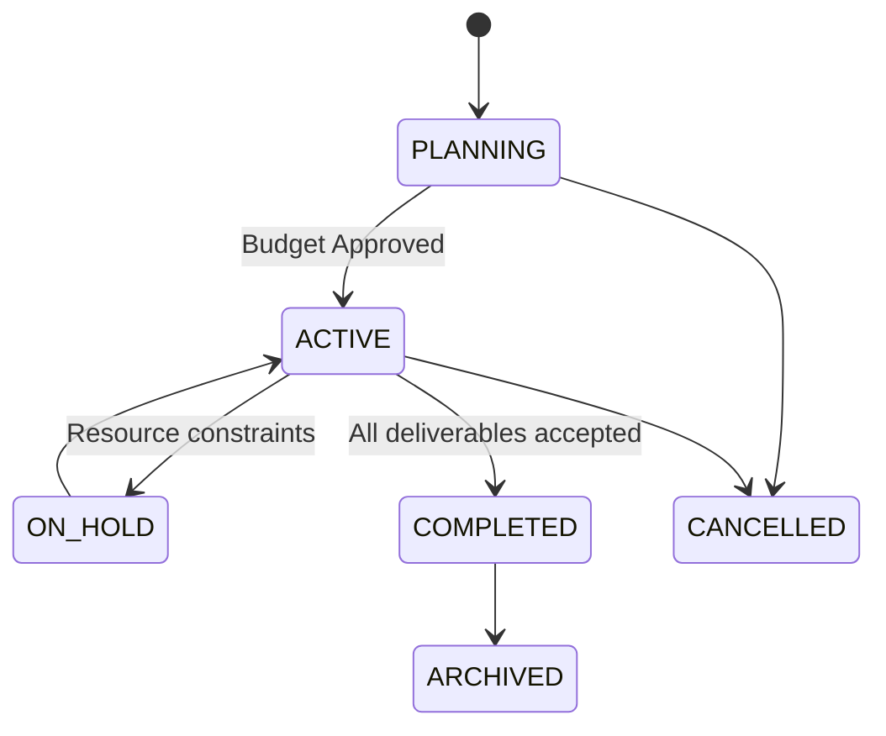

# Projects Module Logic & Database Schema

**Module:** Project Management  
**Version:** 1.0  
**Last Updated:** February 2026

---

## Table of Contents

1. [Business Logic Overview](#1-business-logic-overview)
2. [Project Lifecycle](#2-project-lifecycle)
3. [Task Management Logic](#3-task-management-logic)
4. [Resource & Cost Management](#4-resource--cost-management)
5. [Database Schema](#5-database-schema)

---

## 1. Business Logic Overview

### 1.1 Core Concepts

- **Hierarchy:** Client > Project > Milestone > Task > Subtask.
- **Dependencies:** Finish-to-Start (FS) enforcement prevents starting dependent tasks.
- **Critical Path:** Identification of task sequences that determine project duration.
- **Burndown:** Real-time calculation of remaining effort vs time.

### 1.2 Entity Relationship Diagram



---

## 2. Project Lifecycle

### 2.1 State Machine



### 2.2 Budget Tracking Logic

**Budget vs Actual Formulation:**

- **Planned Cost:** $\sum (Task.EstimatedHours \times User.HourlyRate)$
- **Actual Cost:** $\sum (TimeEntry.Duration \times User.HourlyRate)$ + Expenses
- **Variance:** Planned - Actual

Triggers:

- Alert Project Manager when Actual Cost > 80% of Budget.

---

## 3. Task Management Logic

### 3.1 Dependency Resolution

When a task status changes, the system checks for dependent tasks.

**Logic:**

1. Task B depends on Task A (FS).
2. If Task A is not `COMPLETED`, Task B status cannot be `IN_PROGRESS` or `DONE`.
3. When Task A completes -> Notify Task B assignee "Ready for work".

```typescript
async function checkDependencies(
  taskId: string,
): Promise<DependencyCheckResult> {
  const dependencies = await getUpstreamDependencies(taskId);
  const incomplete = dependencies.filter((t) => t.status !== 'DONE');

  if (incomplete.length > 0) {
    return {
      blocked: true,
      reason: `Waiting for: ${incomplete.map((t) => t.title).join(', ')}`,
    };
  }
  return { blocked: false };
}
```

### 3.2 Gantt Chart Calculation

**Earliest Start Time (EST) / Latest Finish Time (LFT):**

- Used to calculate float and identify critical path.
- **Critical Path:** Tasks with 0 float. Delaying these delays the project.

---

## 4. Resource & Cost Management

### 4.1 Utilization Calculation

**Capacity Planning:**

- User Capacity = 40 hours/week (standard).
- **Utilization %** = (Assigned Hours / Capacity) \* 100.
- Warning if Utilization > 100% for any given week.

### 4.2 Time Tracking

**Validation Rules:**

1. Cannot log time to future dates.
2. Cannot log time to `COMPLETED` projects (unless reopened).
3. Max 24 hours per day per user.

---

## 5. Database Schema

### 5.1 Projects

```sql
CREATE TABLE projects (
    id VARCHAR(36) PRIMARY KEY,
    company_id VARCHAR(36) NOT NULL,
    client_id VARCHAR(36) NOT NULL,

    name VARCHAR(255) NOT NULL,
    code VARCHAR(50) UNIQUE, -- e.g., 'PRJ-2026-001'
    description TEXT,

    status ENUM('PLANNING', 'ACTIVE', 'ON_HOLD', 'COMPLETED', 'CANCELLED', 'ARCHIVED') DEFAULT 'PLANNING',
    priority ENUM('LOW', 'MEDIUM', 'HIGH', 'URGENT') DEFAULT 'MEDIUM',

    start_date DATE,
    end_date DATE,
    actual_start_date DATE,
    actual_end_date DATE,

    budget_type ENUM('FIXED', 'HOURLY'),
    budget_amount DECIMAL(19, 2),
    currency VARCHAR(3) DEFAULT 'USD',

    manager_id VARCHAR(36),

    created_at TIMESTAMP DEFAULT CURRENT_TIMESTAMP,
    updated_at TIMESTAMP DEFAULT CURRENT_TIMESTAMP ON UPDATE CURRENT_TIMESTAMP,

    FOREIGN KEY (client_id) REFERENCES clients(id),
    FOREIGN KEY (manager_id) REFERENCES users(id)
);
```

### 5.2 Tasks

```sql
CREATE TABLE tasks (
    id VARCHAR(36) PRIMARY KEY,
    project_id VARCHAR(36) NOT NULL,
    milestone_id VARCHAR(36),

    title VARCHAR(255) NOT NULL,
    description TEXT,

    status ENUM('TODO', 'IN_PROGRESS', 'REVIEW', 'DONE', 'BLOCKED') DEFAULT 'TODO',
    priority ENUM('LOW', 'MEDIUM', 'HIGH', 'URGENT') DEFAULT 'MEDIUM',

    assigned_to VARCHAR(36),
    created_by VARCHAR(36),

    estimated_hours DECIMAL(10, 2),
    actual_hours DECIMAL(10, 2) DEFAULT 0,

    start_date DATE,
    due_date DATE,

    parent_task_id VARCHAR(36), -- Subtasks

    created_at TIMESTAMP DEFAULT CURRENT_TIMESTAMP,
    updated_at TIMESTAMP DEFAULT CURRENT_TIMESTAMP ON UPDATE CURRENT_TIMESTAMP,

    FOREIGN KEY (project_id) REFERENCES projects(id) ON DELETE CASCADE,
    FOREIGN KEY (assigned_to) REFERENCES users(id)
);
```

### 5.3 Task Dependencies

```sql
CREATE TABLE task_dependencies (
    id VARCHAR(36) PRIMARY KEY,
    task_id VARCHAR(36) NOT NULL, -- The dependent task
    dependency_id VARCHAR(36) NOT NULL, -- The prerequisite task
    type ENUM('FINISH_TO_START', 'START_TO_START', 'FINISH_TO_FINISH') DEFAULT 'FINISH_TO_START',
    lag_days INT DEFAULT 0,

    UNIQUE(task_id, dependency_id),
    FOREIGN KEY (task_id) REFERENCES tasks(id) ON DELETE CASCADE,
    FOREIGN KEY (dependency_id) REFERENCES tasks(id) ON DELETE CASCADE
);
```

### 5.4 Time Entries

```sql
CREATE TABLE time_entries (
    id VARCHAR(36) PRIMARY KEY,
    project_id VARCHAR(36) NOT NULL,
    task_id VARCHAR(36),
    user_id VARCHAR(36) NOT NULL,

    date DATE NOT NULL,
    duration_hours DECIMAL(5, 2) NOT NULL,
    description TEXT,

    billable BOOLEAN DEFAULT TRUE,
    billed BOOLEAN DEFAULT FALSE,
    invoice_id VARCHAR(36),

    created_at TIMESTAMP DEFAULT CURRENT_TIMESTAMP,

    FOREIGN KEY (task_id) REFERENCES tasks(id) ON DELETE SET NULL,
    FOREIGN KEY (user_id) REFERENCES users(id)
);
```

---

**Related Documentation:**

- [PROJECTS_API.md](file:///home/michot/project/BLIH-Business-Lifecycle-Integrated-Hub-/docs/api/PROJECTS_API.md) - API Endpoints
- [PROJECTS_SECURITY.md](file:///home/michot/project/BLIH-Business-Lifecycle-Integrated-Hub-/docs/security/PROJECTS_SECURITY.md) - Security & Permissions
